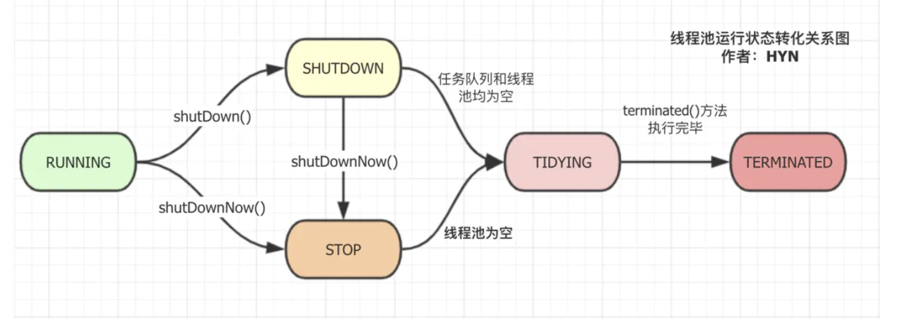

[TOC]

# ExecutorService

**ExecutorService** 接口提供了三个方法用于手动关闭线程池，分别是`shutdown()`,`shutdownNow()`和`awaitTermination()`。

# **ThreadPoolExecutor**

**ThreadPoolExecutor** 是 **ExecutorService** 的实现类。

## 线程池运行状态（**runState**）

**runState** 一共有以下5种取值:

- RUNNING：接收新的任务并对任务队列里的任务进行处理。
- SHUTDOWN：不再接收新的任务，但是会对任务队列中的任务进行处理。
- STOP：不接收新任务，也不再对任务队列中的任务进行处理，并中断正在处理的任务。
- TIDYING：所有任务都已终止，线程数为0，在转向`TIDYING`状态的过程中，线程会执行`terminated()`钩子方法，钩子方法是指在本类中是空方法，而在子类中进行具体实现的方法。
- TERMINATED：`terminated()`方法执行结束后会进入这一状态，表示线程池已关闭。

线程池运行状态存储在AtomicInteger类型的变量ctl的最高三位中，因此各种状态所对应的整型变量的二进制格式除了最高三位，其余都是0 。这些状态变量从小到大的顺序是`RUNNING`<`SHUTDOWN`<`STOP`<`TIDYING`<`TERMINATED`,**这些状态的转化只能从小到大，不能从大到小。**

```java
// RUNNING: 十进制:-536870912  二进制:11100000000000000000000000000000
private static final int RUNNING    = -1 << COUNT_BITS; 
// SHUTDOWN: 十进制:0  二进制:0
private static final int SHUTDOWN   =  0 << COUNT_BITS;
// STOP: 十进制:536870912  二进制:00100000000000000000000000000000
private static final int STOP       =  1 << COUNT_BITS;
// TIDYING: 十进制:1073741824  二进制:01000000000000000000000000000000
private static final int TIDYING    =  2 << COUNT_BITS;
// TERMINATED: 十进制:1610612736  二进制:01100000000000000000000000000000
private static final int TERMINATED =  3 << COUNT_BITS;

// COUNT_BITS: 29
private static final int COUNT_BITS = Integer.SIZE - 3;
```



### AtomicInteger 变量及相关操作(Ctl)

 **ctl** 还存储了另一个线程池的重要信息，那就是**线程数量** (workerCount)。线程池的运行状态一共有5种，所以 **ctl** 的高三位足以表示所有的线程池运行状态 (23 = 8 > 5)。

```java
// 使用一个AtomicInteger类型的变量ctl同时控制线程池运行状态和线程数量，初始运行状态
// 为RUNNING，线程数为0
private final AtomicInteger ctl = new AtomicInteger(ctlOf(RUNNING, 0));
// CAPACITY: 十进制: 536870911 二进制: 00011111111111111111111111111111
private static final int CAPACITY   = (1 << COUNT_BITS) - 1;
// 获取线程池当前状态，CAPACITY取反后高三位都是1，低29位都是0，再和c进行按位与运算，即可获得runState变量
private static int runStateOf(int c)     { return c & ~CAPACITY; }
// CAPACITY高三位都是0，低29位都是0，和c进行按位与运算即可获得workerCount变量
private static int workerCountOf(int c)  { return c & CAPACITY; }
// 初始化ctl变量，runState和workerCount进行按位或运算即可将这两个变量存储在一个变量中
private static int ctlOf(int rs, int wc) { return rs | wc; }
```

判断当前线程池运行状态的操作：

```java
// 判断线程池当前运行状态是否小于给定值
private static boolean runStateLessThan(int c, int s) {
    return c < s;
}
// 判断线程池当前运行状态是否大于等于给定值
private static boolean runStateAtLeast(int c, int s) {
    return c >= s;
}
// 判断线程池是否处于RUNNING状态
private static boolean isRunning(int c) {
    return c < SHUTDOWN;
}
```

### shutdown() 

> 开始有序关闭线程池，与此同时，已提交的任务将继续执行，但不再接收新的任务，如果线程池已关闭，此方法调用不会产生额外影响。此方法不会等待已提交的任务执行完毕(说此方法不会等任务执行完毕的意思是这个方法不会阻塞)，要等待已提交任务执行完毕可以使用 awaitTermination() 方法。

```java
public void shutdown() {
    final ReentrantLock mainLock = this.mainLock;
    // 上锁，确保同一时间只能有一个线程执行此操作
    mainLock.lock();
    try {
        // 检查方法调用方是否用权限关闭线程池以及中断工作线程
        checkShutdownAccess();
        // 将线程池运行状态设置为SHUTDOWN
        advanceRunState(SHUTDOWN);
        // 中断所有空闲线程
        interruptIdleWorkers();
        // 此方法在ThreadPoolExecutor中是空实现，具体实现在其子类ScheduledThreadPoolExecutor
        // 中，用于取消延时任务。
        onShutdown(); // hook for ScheduledThreadPoolExecutor
    } finally {
        mainLock.unlock();
    }
    // 尝试将线程池置为TERMINATED状态
    tryTerminate();
}
```

#### advanceRunState() 

通过 CAS 自旋操作 (也就是死循环)将线程池运行状态设置为目标值，如果已经大于等于目标值，则不作任何操作

```java
private void advanceRunState(int targetState) {
    // 程序循环执行，直到将运行状态设为目标值
    for (;;) {
        // 获取AtomicInteger变量中的整数值
        int c = ctl.get();
        // if条件的前半部分是判断当前运行状态是否大于等于目标值
        if (runStateAtLeast(c, targetState)) ||
            // 后半部分利用CAS操作将运行状态设置为目标值，成功的话会返回true，失败则返回false
            ctl.compareAndSet(c, ctlOf(targetState, workerCountOf(c))))
            break;
     }
 }
```

#### InterruptIdleWorkers()

中断所有的空闲线程。

```java
// 下面第二个方法的重载，将参数设为false，也就是中断所有空闲线程
private void interruptIdleWorkers() {
    interruptIdleWorkers(false);
}
// 中断空闲线程，如果参数为false，中断所有空闲线程，如果为true，则只中断一个空闲线程
private void interruptIdleWorkers(boolean onlyOne) {
    final ReentrantLock mainLock = this.mainLock;
    mainLock.lock();
    try {
        for (Worker w : workers) {
            Thread t = w.thread;
            // 如果线程还未中断且处于空闲状态，将其中断。
            // w.tryLock() 方法调用了tryAcquire(int)方法 (继承自AQS)，尝试以独占的方式获取资源，
            // 成功则返回true，表示线程处于空闲状态；失败会返回false，表示线程处于工作状态。
            if (!t.isInterrupted() && w.tryLock()) {
                try {
                    t.interrupt();
                } catch (SecurityException ignore) {
                } finally {
                    w.unlock();
                }
            }
            // 如果为true，表示只中断一个空闲线程，并退出循环，这一情况只会用在tryTerminate()方法中
            if (onlyOne)
                break;
        }
    } finally {
        mainLock.unlock();
    }
}
```

#### tryTerminate()

满足下列条件之一时，尝试将线程池运行状态设置为 **TERMINATED**：

1. 线程池处于 **SHUTDOWN** 状态，线程数为0且任务队列为空；
2. 线程池处于 **STOP** 状态且线程数为0。

如果线程池除了线程数不为0，其他条件都已经满足关闭的要求，则会尝试中断一个空闲线程，以确保关闭线程池的信号继续传递下去。在进行任何可能导致线程池关闭条件 (即上述任一条件) 成立的操作后都必须调用此方法，比如在减少线程数量或从任务队列中取出任务时。

```java
final void tryTerminate() {
  // 依然是CAS自旋操作
    for (;;) {
      // 获取ctl中的整型值
        int c = ctl.get();
        // 如果是以下几种情况之一的，对应第一个if判断的几种状况，直接return，不错任何操作
        // 1.线程池处于RUNNING状态
        // 2.线程池处于TIDYING状态或TERMINATED状态
        // 3.线程池处于SHUTDOWN状态但是任务队列不为空
        if (isRunning(c) ||
            runStateAtLeast(c, TIDYING) ||
            (runStateOf(c) == SHUTDOWN && ! workQueue.isEmpty()))
            return;
      // 经过上一个if判断的过滤，当前线程池除了线程数不为0，其他条件都已经满足关闭的要求
        // 所以进行下一个if判断，如果线程数不为0，则中断一个空闲线程并返回
        if (workerCountOf(c) != 0) {
            interruptIdleWorkers(ONLY_ONE);
            return;
        }
               // 方法进行到这里说明线程池所有条件都已经满足关闭的要求，下面的操作就是将线程池状态
        // 置为TERMINATED
        final ReentrantLock mainLock = this.mainLock;
        mainLock.lock();
        try {
            // 将线程池状态置为TIDYING
            if (ctl.compareAndSet(c, ctlOf(TIDYING, 0))) {
                try {
                    // 本类中是空方法，子类有具体实现，用于进行关闭线程池的前置操作
                    terminated();
                } finally {
                    // 将线程池置为TERMINATED状态，且线程数为0
                    ctl.set(ctlOf(TERMINATED, 0));
                    // 唤醒其他正在等待的线程
                    termination.signalAll();
                }
                return;
            }
        } finally {
            mainLock.unlock();
        }
      // else retry on failed CAS，失败的话会继续循环执行CAS操作
    }
}
```

### shutdownNow() 

尝试终止所有正在执行的任务，并停止处理等待队列中的的任务，最后将所有未执行的任务列表的形式返回，此方法会将任务队列中的任务移除并以列表形式返回。此方法不会等待正在执行的任务执行完毕，要等待任务执行完毕可以使用`awaitTermination()`方法。此方法会尽最大努力终止正在执行的任务，除此之外不做其他保证，因为此方法底层实现是通过 **Thread** 类的`interrupt()`方法终止任务的，所以`interrupt()`未能终止的任务可能无法结束。

```java
public List<Runnable> shutdownNow() {
    List<Runnable> tasks;
    final ReentrantLock mainLock = this.mainLock;
    mainLock.lock();
    try {
        // 检查方法调用方是否用权限关闭线程池以及中断工作线程
        checkShutdownAccess();
        // 将线程池运行状态置为STOP
        advanceRunState(STOP);
        // 中断所有线程，包括正在运行的线程
        interruptWorkers();
        // 将未执行的任务移入列表中
        tasks = drainQueue();
    } finally {
        mainLock.unlock();
    }
    // 尝试将线程池置为TERMINATED状态
    tryTerminate();
    return tasks;
}
```

#### InterruptWorkers() 

中断所有的线程，不管线程是否正在运行。

```java
private void interruptWorkers() {
    final ReentrantLock mainLock = this.mainLock;
    mainLock.lock();
    try {
        // 中断所有线程
        for (Worker w : workers)
            // 调用内部类Worker自身方法中断线程
            w.interruptIfStarted();
    } finally {
        mainLock.unlock();
    }
}
```

#### drainQueue() 

此方法将任务队列中剩余的任务转移到新的列表中并返回。一般情况下借助 **BlockingQueue** 的`drainTo()`方法即可，但是某些类型的任务队列的`poll()`和`drainTo()`方法在移除元素的过程中可能会出现失败的情况，比如 **DelayQueue** 以及其他一些队列。在这种情况下，就需要一个一个地转移元素了。

```java
private List<Runnable> drainQueue() {
    BlockingQueue<Runnable> q = workQueue;
    ArrayList<Runnable> taskList = new ArrayList<Runnable>();
    // 调用BlockingQueue的drainTo()方法转移元素
    q.drainTo(taskList);
    if (!q.isEmpty()) {
        // 一个一个地转移元素
        for (Runnable r : q.toArray(new Runnable[0])) {
            if (q.remove(r))
                taskList.add(r);
        }
    }
    return taskList;
}
```

### awaitTermination() 

```java
public boolean awaitTermination(long timeout, TimeUnit unit)
    throws InterruptedException {
    // 将超时时间转化为纳秒单位
    long nanos = unit.toNanos(timeout);
    final ReentrantLock mainLock = this.mainLock;
    mainLock.lock();
    try {
        for (;;) {
            // 如果线程池已经是TERMINATED状态，返回true
            if (runStateAtLeast(ctl.get(), TERMINATED))
                return true;
            // 超时但是线程池未关闭，返回false
            if (nanos <= 0)
                return false;
            // 实现阻塞效果
            nanos = termination.awaitNanos(nanos);
        }
    } finally {
        mainLock.unlock();
    }
}
```

#### termination

```java
private final ReentrantLock mainLock = new ReentrantLock();
private final Condition termination = mainLock.newCondition();
```

## 线程池是如何复用的

### execute()

```java
public void execute(Runnable command) {
        if (command == null)
            throw new NullPointerException();
        int c = ctl.get();
        if (workerCountOf(c) < corePoolSize) {
            if (addWorker(command, true))
                return;
            c = ctl.get();
        }
        if (isRunning(c) && workQueue.offer(command)) {
            int recheck = ctl.get();
            if (! isRunning(recheck) && remove(command))
                reject(command);
            else if (workerCountOf(recheck) == 0)
                addWorker(null, false);
        }
  //队列满了core为false
        else if (!addWorker(command, false))
            reject(command);
    }
```

### addWorker(Runnable firstTask, boolean core)

```java
private boolean addWorker(Runnable firstTask, boolean core) {
                //创建worker
        retry:
        for (;;) {
            int c = ctl.get();
            int rs = runStateOf(c);

            // Check if queue empty only if necessary.
            if (rs >= SHUTDOWN &&
                ! (rs == SHUTDOWN &&
                   firstTask == null &&
                   ! workQueue.isEmpty()))
                return false;

            for (;;) {
                int wc = workerCountOf(c);
                if (wc >= CAPACITY ||
                    wc >= (core ? corePoolSize : maximumPoolSize))
                    return false;
                if (compareAndIncrementWorkerCount(c))
                    break retry;
                c = ctl.get();  // Re-read ctl
                if (runStateOf(c) != rs)
                    continue retry;
                // else CAS failed due to workerCount change; retry inner loop
            }
        }
                //启动worker
        boolean workerStarted = false;
        boolean workerAdded = false;
        Worker w = null;
        try {
            w = new Worker(firstTask);
            final Thread t = w.thread;
            if (t != null) {
            //ThreadExecutor的全局锁，在创建\销毁worker工作池的时候，才会用到
                final ReentrantLock mainLock = this.mainLock;
                mainLock.lock();
                try {
                    // Recheck while holding lock.
                    // Back out on ThreadFactory failure or if
                    // shut down before lock acquired.
                    int rs = runStateOf(ctl.get());

                    if (rs < SHUTDOWN ||
                        (rs == SHUTDOWN && firstTask == null)) {
                        if (t.isAlive()) // precheck that t is startable
                            throw new IllegalThreadStateException();
                        workers.add(w);
                        int s = workers.size();
                        if (s > largestPoolSize)
                            largestPoolSize = s;
                        workerAdded = true;
                    }
                } finally {
                    mainLock.unlock();
                }
                if (workerAdded) {
                    t.start();
                    workerStarted = true;
                }
            }
        } finally {
            if (! workerStarted)
                addWorkerFailed(w);
        }
        return workerStarted;
    }
```

### Worker.run()

```java
public void run() {
            runWorker(this);
}
final void runWorker(Worker w) {
        Thread wt = Thread.currentThread();
        Runnable task = w.firstTask;
        w.firstTask = null;
        w.unlock(); // allow interrupts
        boolean completedAbruptly = true;
        try {
            while (task != null || (task = getTask()) != null) {
                w.lock();
                // If pool is stopping, ensure thread is interrupted;
                // if not, ensure thread is not interrupted.  This
                // requires a recheck in second case to deal with
                // shutdownNow race while clearing interrupt
                if ((runStateAtLeast(ctl.get(), STOP) ||
                     (Thread.interrupted() &&
                      runStateAtLeast(ctl.get(), STOP))) &&
                    !wt.isInterrupted())
                    wt.interrupt();
                try {
                    beforeExecute(wt, task);
                    Throwable thrown = null;
                    try {
                        task.run();
                    } catch (RuntimeException x) {
                        thrown = x; throw x;
                    } catch (Error x) {
                        thrown = x; throw x;
                    } catch (Throwable x) {
                        thrown = x; throw new Error(x);
                    } finally {
                        afterExecute(task, thrown);
                    }
                } finally {
                    task = null;
                    w.completedTasks++;
                    w.unlock();
                }
            }
            completedAbruptly = false;
        } finally {
            processWorkerExit(w, completedAbruptly);
        }
    }
```

### getTask()

```java
private Runnable getTask() {
        boolean timedOut = false; // Did the last poll() time out?

        for (;;) {
            int c = ctl.get();
            int rs = runStateOf(c);

            // Check if queue empty only if necessary.
            if (rs >= SHUTDOWN && (rs >= STOP || workQueue.isEmpty())) {
                decrementWorkerCount();
                return null;
            }

            int wc = workerCountOf(c);

            // Are workers subject to culling?
            boolean timed = allowCoreThreadTimeOut || wc > corePoolSize;

            if ((wc > maximumPoolSize || (timed && timedOut))
                && (wc > 1 || workQueue.isEmpty())) {
                if (compareAndDecrementWorkerCount(c))
                    return null;
                continue;
            }

            try {
                Runnable r = timed ?
                    workQueue.poll(keepAliveTime, TimeUnit.NANOSECONDS) :
                    workQueue.take();
                if (r != null)
                    return r;
                timedOut = true;
            } catch (InterruptedException retry) {
                timedOut = false;
            }
        }
    }
```