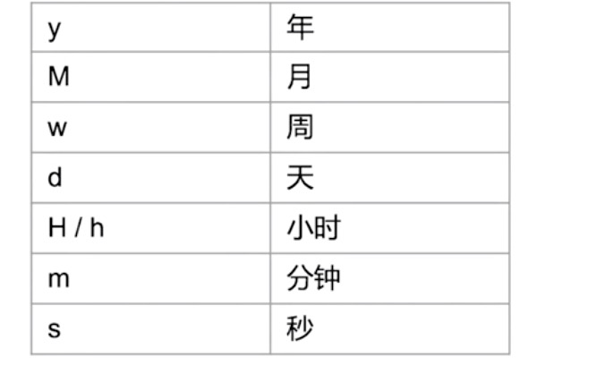
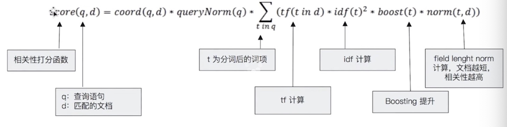
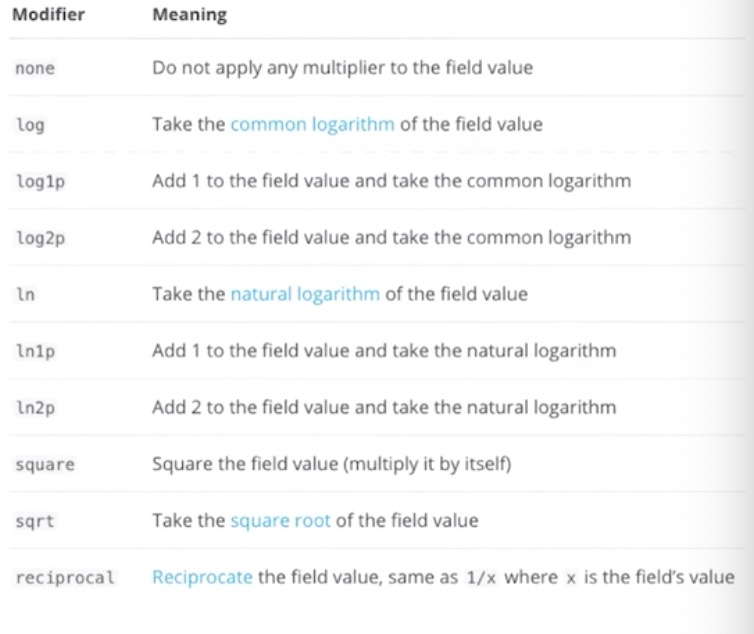

[TOC]

# 基于词项和基于全文的搜索

## term 分词

```java
//原始数据经过分词索引-->iphone,故大写的搜索不到，换成“iphone”即可
POST /products/_search
{
  "query": {
    "term": {
      "desc": {
        "value":"iPhone"
      }
    }
  }
}
//keyword不会经过分词处理
POST /products/_search
{
  "query": {
    "term": {
      "desc.keyword": {
        "value":"iPhone"
      }
    }
  }
}
```

## keyword 分词

```java
//XHDK-A-1293-#fJ3被分词成多个，productID term是查不到的，需要使用keyword
POST /products/_search
{
  "query": {
    "term": {
      "productID.keyword": {
        "value": "XHDK-A-1293-#fJ3"//  "value": "xhdk-a-1293-#fJj3"
      }
    }
  }
}
```

## position_increment_gap

```java
PUT groups
{
  "mappings": {
    "properties": {
      "names":{
        "type": "text",
        "position_increment_gap": 100
      }
    }
  }
}

//在分析John Water的时候,产生了如下信息:Position 1: john;Position 2: Water
//在分析Water Smith的时候， 产生了：Position 3: Water;Position 4: smith
//Elasticsearch对以上数组分析生成了与分析单个字符串 John Water Water Smith 一样几乎完全相同的语汇单元。 我们的查询示例寻找相邻的Water和Water，而且这两个词条确实存在，并且它们俩正好相邻， 所以这个查询匹配了。
POST groups/_doc
{
  "names": [ "John Water", "Water Smith"]
}
//Water 和 Water 之间的距离为100,为了匹配这个文档你必须添加值为100的slop 。
POST groups/_search
{
  "query": {
    "match_phrase": {
      "names": {
        "query": "Water Water",
        "slop": 100
      }
    }
  }
}
```

##  constant_score

```java
// 相关性得分由一个浮点数进行表示，并在搜索结果中通过 _score 参数返回， 默认排序是 _score 降序。
//这里没有一个有意义的分数：因为使用的是filter （过滤），这表明我们只希望获取的文档，并没有试图确定这些文档的相关性,实际上文档将按照随机顺序返回，并且每个文档都会评为零分。
POST /products/_search
{
  "explain": true,
  "query": {
   "bool": {
      "filter": {
        "term": {
          "productID.keyword": "XHDK-A-1293-#fJ3"
        }
      }

    }
  }
}
//如果评分为零造成了困扰，可以使用 constant_score 查询进行替代,这将让所有文档应用一个恒定分数（默认为 1 ）。它将执行与前述查询相同的查询，并且所有的文档将像之前一样随机返回，这些文档只是有了一个分数而不是零分。
POST /products/_search
{
  "explain": true,
  "query": {
    "constant_score": {
      "filter": {
        "term": {
          "productID.keyword": "XHDK-A-1293-#fJ3"
        }
      }

    }
  }
}
```

# 结构化搜索

日期，数字，布尔类型是结构化数据

## 数字类型 

```java

#数字类型 Term
POST products/_search
{
  "profile": "true",
  "explain": true,
  "query": {
    "term": {
      "price": 30
    }
  }
}

#数字类型 terms
POST products/_search
{
  "profile": "true",
  "explain": true,
  "query": {
    "constant_score": {
      "filter": {
        "terms": {
          "price": [
            "20",
            "30"
          ]
        }
      }
    }
  }
}

#数字 Range 查询
GET products/_search
{
    "query" : {
        "constant_score" : {
            "filter" : {
                "range" : {
                    "price" : {
                        "gte" : 20,
                        "lte"  : 30
                    }
                }
            }
        }
    }
}

```

## 日期



```java
# 日期 range
POST products/_search
{
    "query" : {
        "constant_score" : {
            "filter" : {
                "range" : {
                    "date" : {
                      "gte" : "now-1y"
                    }
                }
            }
        }
    }
}
```

## exist

```java
#exists查询
POST products/_search
{
  "query": {
    "constant_score": {
      "filter": {
        "exists": {
          "field": "date"
        }
      }
    }
  }
}
```

## 多值字段

**处理多值字段，term 查询是包含，而不是等于。**

```java
POST movies/_search
{
  "query": {
    "constant_score": {
      "filter": {
        "term": {
          "genre.keyword": "Comedy"
        }
      }
    }
  }
}
```

可增加一个字段用于genre计数，再在组合bool query查询出了

# 相关性以及相关性算分

**ES 5之前默认的相关性算法是TF-IDF，现在采用BM25。**

## 词频 TF

### Term Frequency

- 检索词在一篇文章中出现的频率

- 度量一条查询和结果文档的相关性的简单方法：将搜索中每一个词的TF做简单相加

### Stop Word

不应该考虑TF

## 逆文档频率 IDF

### DF

- 检索词在所有文档中出现的频率

### Inverse Document Frequency

- log（全部文档数/检索词出现过的文档总数）

## TF-IDF

- TF求和变成了加权求和

```java
TF(a)*IDF(a)+TF(b)*IDF(b)+TF(c)*IDF(c)
```

### Lucene中的TF-IDF评分公式



## BM 25

和经典TF-IDF相比，当TF无限增加时，BM 25算分回趋于一个数值

### 定制similarity


```java
PUT /my_index2
{
  "settings": {
    "similarity":{
      "custom_similarity":{
        "type":"BM25",
        "b":0,
        "k1":2
      }
    }
  }
}
```

K默认1.2，数值越小饱和度越高

b默认0.75（0-1），0代表禁止normalization

### Boosting Relevance

```java
POST testscore/_search
{
    "query": {
        "boosting" : {
            "positive" : {
                "term" : {
                    "content" : "elasticsearch"
                }
            },
            "negative" : {
                 "term" : {
                     "content" : "like"
                }
            },
            "negative_boost" : 0.2
        }
    }
}
```

Boosting用于控制相关度的

- 可用于索引，字段，查询子条件
- boost > 1时，打分的相关度相对提升
- 1> boost > 0时，打分的权重相对降低

# 条件组合查询

## 复合查询 bool Query

包含4个字句

- must ：必须匹配，贡献算分
- should： 选择性匹配，贡献算分
- must_not： filter context，必须不匹配，不贡献算分
- Filter： filter context，必须匹配，不贡献算分

```java

POST /products/_search
{
  "query": {
    "bool": {
      "must": {
        "term": {
          "price": "30"
        }
      },
    "should": [
      {
        "bool": {
          "must_not": [
            {
              "term": {
                "avaliable": "false"
              }
            }
          ]
        }
      }
    ],
     "minimum_should_match": 1
    }
  }
}
```

### 查询条件的结构对算分的影响

```java
//同一层级下具有相同的权重
POST /animals/_search
{
  "query": {
    "bool": {
      "should": [
        { "term": { "text": "brown" }},
        { "term": { "text": "red" }},
        { "term": { "text": "quick"   }},
        { "term": { "text": "dog"   }}
      ]
    }
  }
}

POST /animals/_search
{
  "query": {
    "bool": {
      "should": [
        { "term": { "text": "quick" }},
        { "term": { "text": "dog"   }},
        {
          //这一个子查询对算分的贡献相加才等于上一级
          "bool":{
            "should":[
              { "term": { "text": "brown" }},
              { "term": { "text": "red" }}
            ]
          }
        }
      ]
    }
  }
}
```

### boost

```java

POST news/_search
{
  "query": {
    "bool": {
      "should": [
        {
         "match":{
          "content":{
            "query":"apple",
            "boost":2
          }
        }
        },
        {
          "match":{
          "content":{
            "query":"pie",
            "boost":0.1
          }
        }
        }
      ]
    }
  }
}
```


##  boosting Query

```java
POST news/_search
{
  "query": {
    "boosting": {
      "positive": {
        "match": {
          "content": "apple"
        }
      },
      "negative": {
        "match": {
          "content": "pie"
        }
      },
      "negative_boost": 0.5
    }
  }
}
```

# 单字符串多字段查询：Dis Max Query

```java
PUT /blogs/_doc/1
{
    "title": "Quick brown rabbits",
    "body":  "Brown rabbits are commonly seen."
}

PUT /blogs/_doc/2
{
    "title": "Keeping pets healthy",
    "body":  "My quick brown fox eats rabbits on a regular basis."
}
POST /blogs/_search
{
    "query": {
        "bool": {
            "should": [
                { "match": { "title": "Brown fox" }},
                { "match": { "body":  "Brown fox" }}
            ]
        }
    }
}
```

doc1的评分更高，但是doc2匹配度更高，算分过程如下：

1. 查询should语句中的两个查询
2. 加和两个查询的评分
3. 乘以匹配语句的总数
4. 除以所有语句的总数

但是有时候我们希望获取到单个最佳匹配的doc

## Disjuction Max Query

将任何与任意查询匹配的文档作为结果返回，采用字段上最匹配的评分返回

```java
POST blogs/_search
{
    "query": {
        "dis_max": {
            "queries": [
                { "match": { "title": "Quick pets" }},
                { "match": { "body":  "Quick pets" }}
            ]
        }
    }
}
```

### tie_breaker

以上结果score得分一样，但很明显doc2相关性更高

```java
POST blogs/_search
{
    "query": {
        "dis_max": {
            "queries": [
                { "match": { "title": "Quick pets" }},
                { "match": { "body":  "Quick pets" }}
            ],
            "tie_breaker": 0.2
        }
    }
}
```

算分过程如下：

1. 获取最佳匹配语句的评分
2. 将其他语句的评分与tie_breaker相乘
3. 将以上评分求和并规范化

# 单字符串多字段查询：Multi Match

## 最佳字段 Best Fields

当字段相互竞争又相互关联，评分来自最匹配字段

```java
POST blogs/_search
{
  "explain": true, 
  "query": {
    "multi_match": {
      "type": "best_fields",
      "query": "Quick pets",
      "fields": ["title","body"],
      "tie_breaker": 0.2,
      "minimum_should_match": "20%"
    }
  }
}
```

## 多数字段 Most Fields

对多字段评分进行累加算分。

处理英文内容时，常见处理方法：

1. 在主字段（English Analyzer）抽取词干，加入同义词，以匹配更多文档。
2. 相同的文本加入子字段（Standard Analyzer），以提供更精确的匹配。

```java
PUT /titles
{
  "mappings": {
    "properties": {
      "title": {
        "type": "text",
        "analyzer": "english",
        "fields": {"std": {"type": "text","analyzer": "standard"}}
      }
    }
  }
}

GET /titles/_search
{
   "query": {
        "multi_match": {
            "query":  "barking dogs",
            "type":   "most_fields",
            "fields": [ "title^10", "title.std" ]
        }
    }
}
```

**不支持使用operator**

## 混合字段 Cross Fields

需要在多个字段中确认信息，如地址

```java
GET /titles/_search
{
   "query": {
        "multi_match": {
            "query":  "Poland Street W1V",
            "type":   "cross_fields",
          //表示这些词都得出现在这些字段中
            "operator":   "and",
            "fields": [ "street^10", "city", "country", "postcode" ]
        }
    }
}
```

- 不支持使用operator
- 跟“copy to”相比，可以对单个字段提升权重

# Search Template

解耦程序和DSL

```java
POST _scripts/tmdb
{
  "script": {
    "lang": "mustache",
    "source": {
      "_source": [
        "title","overview"
      ],
      "size": 20,
      "query": {
        "multi_match": {
          "query": "{{q}}",
          "fields": ["title","overview"]
        }
      }
    }
  }
}

POST tmdb/_search/template
{
    "id":"tmdb",
    "params": {
        "q": "basketball with cartoon aliens"
    }
}
```

# Index Alias

实现零停机运维

```java
POST _aliases
{
  "actions": [
    {
      "add": {
        "index": "movies-2019",
        "alias": "movies-latest"
      }
    }
  ]
}
```

**可以对不同的索引起相同的别名,alias可以指定多个index，但是只能指定一个index用于写入数据.**

```java
  {
        "type": "illegal_argument_exception",
        "reason": "no write index is defined for alias [movies-latest]. The write index may be explicitly disabled using is_write_index=false or the alias points to multiple indices without one being designated as a write index"
      }
```

# 综合排序：Function Score Query 优化算分

有时候使用相关度进行算分不能解决问题

## Function Score Query

提供了集中默认计算分值的函数

### Weight

为每一个文档设置一个简单而不被规范化的权重

```java
POST /blogs/_search
{
  "query": {
    "function_score": {
      "query": {
        "multi_match": {
          "query":    "popularity",
          "fields": [ "title", "content" ]
        }
      },
       "weight":100
    }
  }
}
```

### Field Value Factor

使用该值来修改函数，列如将一个字段作为算分的参考因素

```java
POST /blogs/_search
{
  "query": {
    "function_score": {
      "query": {
        "multi_match": {
          "query":    "popularity",
          "fields": [ "title", "content" ]
        }
      },
      "field_value_factor": {
        "field": "votes"
      }
    }
  }
}
```

- **新的算分=老的算分*votes**

#### Modifier

平滑曲线

```java
POST /blogs/_search
{
  "query": {
    "function_score": {
      "query": {
        "multi_match": {
          "query":    "popularity",
          "fields": [ "title", "content" ]
        }
      },
      "field_value_factor": {
        "field": "votes",
        "modifier": "log1p"
      }
    }
  }
}
```

- **新的算分=老的算分*log(1+votes)**



#### factor

- **新的算分=老的算分*log(1+ factor * votes)**

### Random Score

随机即算分结果

```java
POST /blogs/_search
{
  "query": {
    "function_score": {
      "random_score": {
        "seed": 911119
      }
    }
  }
}
```

**Seed相同，结果一致**

### 衰减函数

以某个字段的值为标准，越接近某个值得分越高

- 原点（`origin`）：该字段最理想的值，这个值可以得到满分（1.0）
- 偏移量（`offset`）：与原点相差在偏移量之内的值也可以得到满分
- 衰减规模（`scale`）：当值超出了原点到偏移量这段范围，它所得的分数就开始进行衰减了，衰减规模决定了这个分数衰减速度的快慢
- 衰减值（`decay`）：该字段可以被接受的值（默认为 0.5），相当于一个分界点，具体的效果与衰减的模式有关

```java
POST /blogs/_search
{
  "query": {
    "function_score": {
      "query": {
        "multi_match": {
          "query":    "popularity",
          "fields": [ "title", "content" ]
        }
      },
      "gauss": {
        "votes": {
          "origin": 100,
          "offset": 100
        }
      }
    }
  }
}
```

衰减函数还可以指定三种不同的模式：线性函数（linear）、以 e 为底的指数函数（Exp）和高斯函数（gauss），它们拥有不同的衰减曲线：


### Script Score

使用脚本来控制得分

## Boost Mode

- Multily

  算分和函数值的乘积

- Sum

  算分和函数值的和

- Min/Max

  算分和函数值 最小/最大值

- Replace

  函数值取代算分

```java

POST /blogs/_search
{
  "query": {
    "function_score": {
      "query": {
        "multi_match": {
          "query":    "popularity",
          "fields": [ "title", "content" ]
        }
      },
      "field_value_factor": {
        "field": "votes",
        "modifier": "log1p" ,
        "factor": 0.1
      },
      "boost_mode": "sum",
      "max_boost": 3
    }
  }
}
```

## Max Mode

将算分控制在一个最大值

# 跨集群搜索 Cross Cluster Search

单集群水平扩展，节点数不能无限增加，集群的meta信息过多会导致更新压力变大，单个master会成为性能瓶颈。

ES 5.3引入了跨集群搜索功能：

- 允许任何节点扮演federated节点，以轻量的形式将搜索请求进行代理
- 不需要以client node的形式加入其他集群

对每一个集群设置：

```java
PUT /_cluster/settings
{
  "persistent": {
    "cluster": {
      "remote": {
        "cluster0": {
          "seeds": [
            "127.0.0.1:9300"
          ],
          "transport.ping_schedule": "30s"
        },
        "cluster1": {
          "seeds": [
            "127.0.0.1:9301"
          ],
          "transport.compress": true,
          "skip_unavailable": true
        },
        "cluster2": {
          "seeds": [
            "127.0.0.1:9302"
          ]
        }
      }
    }
  }
}
```

```java
//users代表自己的集群
GET /users,cluster1:users,cluster2:users/_search
{
  "query": {
    "range": {
      "age": {
        "gte": 20,
        "lte": 40
      }
    }
  }
}
//其他集群失去响应时跳过这一步继续搜索
PUT _cluster/settings
{
  "persistent": {
  "cluster.remote.cluster_two.skip.unavaliable":true
  }
}
```

