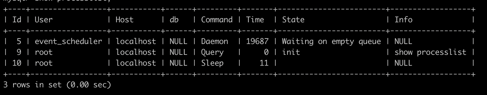
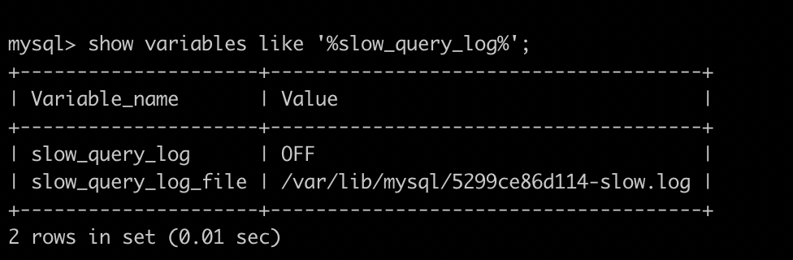

[TOC]

# MYSQL结构图


# 连接器

连接器负责跟客户端建立连接、获取权限、维持和管理连接。

- 如果用户名或密码不对，会收到一个"Access denied for user"的错误，然后客户端程序结束执行。
- 如果用户名密码认证通过，连接器会到权限表里面查出你拥有的权限。之后，这个连接里面的权限判断逻辑，都将依赖于此时读到的权限。

这就意味着，一个用户成功建立连接后，即使你用管理员账号对这个用户的权限做了修改，也不会影响已经存在连接的权限。修改完成后，只有再新建的连接才会使用新的权限设置。

如果你没有后续的动作，这个连接就处于空闲状态，你可以在 show processlist 命令中看到它，其中的 Command 列显示为“Sleep”的这一行，就表示现在系统里面有一个空闲连接。



客户端如果太长时间没动静，连接器就会自动将它断开。这个时间是由参数 **wait_timeout** 控制的，默认值是 8 小时。


## 长&短连接

长连接是指连接成功后，如果客户端持续有请求，则一直使用同一个连接。短连接则是指每次执行完很少的几次查询就断开连接，下次查询再重新建立一个。

一般来说要尽量减少建立连接的动作，也就是尽量使用长连接。有些时候 MySQL 占用内存涨得特别快，**这是因为 MySQL 在执行过程中临时使用的内存是管理在连接对象里面的。**这些资源会在连接断开的时候才释放。所以如果长连接累积下来，可能导致内存占用太大，被系统强行杀掉（OOM），从现象看就是 MySQL 异常重启了。

如何解决？

1. 定期断开长连接。使用一段时间，或者程序里面判断执行过一个占用内存的大查询后，断开连接，之后要查询再重连。
2. 如果用的是 MySQL 5.7 或更新版本，可以在每次执行一个比较大的操作后，通过执行 mysql_reset_connection 来重新初始化连接资源。这个过程不需要重连和重新做权限验证，但是会将连接恢复到刚刚创建完时的状态。

# 查询缓存

MySQL 拿到一个查询请求后，会先到查询缓存看看，之前是不是执行过这条语句。之前执行过的语句及其结果可能会以 key-value 对的形式，被直接缓存在内存中。**key 是查询的语句，value 是查询的结果**。如果你的查询能够直接在这个缓存中找到 key，那么这个 value 就会被直接返回给客户端。

## 缓存映射

缓存会在内存中开辟一块内存(query_cache_size)来维护缓存数据,其中有大概40K的空间是用来维护缓存的**元数据的**,例如空间内存,**数据表和查询结果的映射**，**SQL和查询结果的映射**等.

打开查询缓存对读和写操作都会带来额外的消耗, MySQL 提供了这种“按需使用”的方式，可以将参数 query_cache_type 设置成 DEMAND，这样对于默认的 SQL 语句都不使用查询缓存。而对于你确定要使用查询缓存的语句，可以用 SQL_CACHE 显式指定，像下面这个语句一样：

```java
mysql> select SQL_CACHE * from T where ID=10；
```

MySQL 8.0 版本直接将查询缓存的整块功能删掉了，也就是说 8.0 开始彻底没有这个功能了。

# 分析器

- 如果没有命中查询缓存，就要开始真正执行语句了。首先，MySQL 需要知道你要做什么，因此需要对 SQL 语句做解析。
- 会在分析阶段判断语句是否正确，表是否存在，列是否存在等.

## 词法分析

分析器先会做“词法分析”。你输入的是由多个字符串和空格组成的一条 SQL 语句，MySQL 需要识别出里面的字符串分别是什么，代表什么。

MySQL 从你输入的"select"这个关键字识别出来，这是一个查询语句。它也要把字符串“T”识别成“表名 T”，把字符串“ID”识别成“列 ID”。

## 语法分析

根据词法分析的结果，语法分析器会根据语法规则，判断你输入的这个 SQL 语句是否满足 MySQL 语法。

## 优化器

优化器是在表里面有多个索引的时候，决定使用哪个索引；或者在一个语句有多表关联（join）的时候，决定各个表的连接顺序。比如你执行下面这样的语句，这个语句是执行两个表的 join：

```java
mysql> select * from t1 join t2 using(ID)  where t1.c=10 and t2.d=20;
```

- 可以先从表 t1 里面取出 c=10 的记录的 ID 值，再根据 ID 值关联到表 t2，再判断 t2 里面 d 的值是否等于 20。
- 也可以先从表 t2 里面取出 d=20 的记录的 ID 值，再根据 ID 值关联到 t1，再判断 t1 里面 c 的值是否等于 10。

这两种执行方法的逻辑结果是一样的，但是执行的效率会有不同，而优化器的作用就是决定选择使用哪一个方案。

# 执行器

开始执行的时候，要先判断一下你对这个表 T 有没有执行查询的权限，如果没有，就会返回没有权限的错误。

**在工程实现上，如果命中查询缓存，会在查询缓存返回结果的时候，做权限验证。查询也会在优化器之前调用 precheck 验证权限。**

如果有权限，就打开表继续执行。打开表的时候，执行器就会根据表的引擎定义，去使用这个引擎提供的接口。

```java
mysql> select * from T where ID=10;
```

比如这个例子中的表 T 中，ID 字段没有索引，那么执行器的执行流程是这样的：

1. 调用 InnoDB 引擎接口取这个表的第一行，判断 ID 值是不是 10，如果不是则跳过，如果是则将这行存在结果集中；
2. 调用引擎接口取“下一行”，重复相同的判断逻辑，直到取到这个表的最后一行。
3. 执行器将上述遍历过程中所有满足条件的行组成的记录集作为结果集返回给客户端。

对于有索引的表，执行的逻辑也差不多。第一次调用的是“取满足条件的第一行”这个接口，之后循环取“满足条件的下一行”这个接口，这些接口都是引擎中已经定义好的。

## 慢查询日志

你会在数据库的慢查询日志中看到一个 rows_examined 的字段，表示这个语句执行过程中扫描了多少行。这个值就是在执行器每次调用引擎获取数据行的时候累加的。



在有些场景下，执行器调用一次，在引擎内部则扫描了多行，因此引擎扫描行数跟 rows_examined 并不是完全相同的。