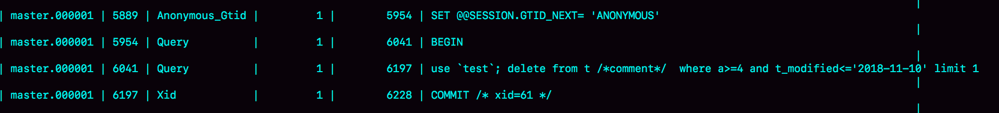
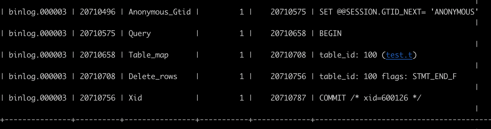
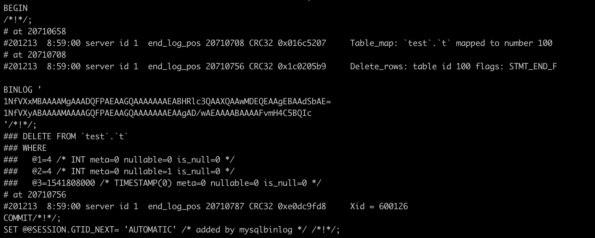

[TOC]

# MySQL 主备的基本原理

基本的主备切换流程：


- 在状态 1 中，客户端的读写都直接访问节点 A，而节点 B 是 A 的备库，只是将 A 的更新都同步过来，到本地执行。这样可以保持节点 B 和 A 的数据是相同的。
- 当需要切换的时候，就切成状态 2。这时候客户端读写访问的都是节点 B，而节点 A 是 B 的备库。

建议你把节点 B（也就是备库）设置成只读（readonly）模式。这样做，有以下几个考虑：

1. 有时候一些运营类的查询语句会被放到备库上去查，设置为只读可以防止误操作。
2. 防止切换逻辑有 bug，比如切换过程中出现双写，造成主备不一致。
3. 可以用 readonly 状态，来判断节点的角色。

**把备库设置成只读了，还怎么跟主库保持同步更新呢？**

因为 readonly 设置对超级 (super) 权限用户是无效的，而用于同步更新的线程，就拥有超级权限。

所以用来主从复制的账户，一定要有super权限。

**节点 A 到 B 这条线的内部流程是什么样的：**


备库 B 跟主库 A 之间维持了一个长连接。

**主库 A 内部有一个线程，专门用于服务备库 B 的这个长连接。**

一个事务日志同步的完整过程是这样的：

1. 在备库 B 上通过 change master 命令，设置主库 A 的 IP、端口、用户名、密码，以及要从哪个位置开始请求 binlog，这个位置包含文件名和日志偏移量。
2. 在备库 B 上执行 start slave 命令，这时候**备库会启动两个线程，就是图中的 io_thread 和 sql_thread**。**其中 io_thread 负责与主库建立连接。**
3. 主库 A 校验完用户名、密码后，开始按照备库 B 传过来的位置，从本地读取 binlog，发给 B。
4. 备库 B 拿到 binlog 后，写到本地文件，称为中转日志（relay log）。
5. sql_thread 读取中转日志，解析出日志里的命令，并执行。

# binlog 的三种格式对比

```java
CREATE TABLE `t` ( 
  `id` int(11) NOT NULL, 
  `a` int(11) DEFAULT NULL,
  `t_modified` timestamp NOT NULL DEFAULT CURRENT_TIMESTAMP, 
  PRIMARY KEY (`id`), 
  KEY `a` (`a`), 
  KEY `t_modified`(`t_modified`)
) ENGINE=InnoDB;

insert into t values(1,1,'2018-11-13');
insert into t values(2,2,'2018-11-12');
insert into t values(3,3,'2018-11-11');
insert into t values(4,4,'2018-11-10');
insert into t values(5,5,'2018-11-09');
```

要在表中删除一行数据的话，我们来看看这个 delete 语句的 binlog 是怎么记录的：

```java
mysql> delete from t where a>=4 and t_modified<='2018-11-10' limit 1;
```

## statement

**当 binlog_format=statement 时，binlog 里面记录的就是 SQL 语句的原文。**你可以用

```java
mysql> show binlog events in 'binlog.000001';
```

命令看 binlog 中的内容。



- 第一行 SET @@SESSION.GTID_NEXT='ANONYMOUS’可以先忽略。

- 第二行是一个 BEGIN，跟第四行的 commit 对应，表示中间是一个事务。

- 第三行就是真实执行的语句了。可以看到，在真实执行的 delete 命令之前，还有一个“use ‘test’”命令。

  这条命令不是我们主动执行的，而是 MySQL 根据当前要操作的表所在的数据库，自行添加的。

  **这样做可以保证日志传到备库去执行的时候，不论当前的工作线程在哪个库里，都能够正确地更新到 test 库的表 t。**

  use 'test’命令之后的 delete 语句就是SQL 原文了。

- 最后一行是一个 COMMIT。你可以看到里面写着 xid=61。


运行这条 delete 命令产生了一个 warning，原因是**当前 binlog 设置的是 statement 格式，并且语句中有 limit，所以这个命令可能是 unsafe 的。**

这是因为 delete 带 limit，很可能会出现主备数据不一致的情况。比如上面这个例子：

1. 如果 delete 语句使用的是索引 a，那么会根据索引 a 找到第一个满足条件的行，也就是说删除的是 a=4 这一行。
2. 但如果使用的是索引 t_modified，那么删除的就是 t_modified='2018-11-09’也就是 a=5 这一行。

由于 statement 格式下，记录到 binlog 里的是语句原文，因此可能会出现这样一种情况：

- 在主库执行这条 SQL 语句的时候，用的是索引 a。
- 而在备库执行这条 SQL 语句的时候，却使用了索引 t_modified。因此，MySQL 认为这样写是有风险的。

**如果把 binlog 的格式改为 binlog_format=‘row’， 是不是就没有这个问题了呢？**

## row



row 格式的 binlog 里没有了 SQL 语句的原文，而是替换成了两个 event：Table_map 和 Delete_rows。

- Table_map event，用于说明接下来要操作的表是 test 库的表 t。
- Delete_rows event，用于定义删除的行为。

需要借助 mysqlbinlog 工具，用下面这个命令解析和查看 binlog 中的内容。

因为图 中的信息显示，这个事务的 binlog 是从 20710496 这个位置开始的，所以可以用 start-position 参数来指定从这个位置的日志开始解析。

```java
mysqlbinlog -vv /var/lib/mysql/binlog.000003 --start-position=20710496;
```



- server id 1，表示这个事务是在 server_id=1 的这个库上执行的。

- 每个 event 都有 CRC32 的值，这是因为把参数 binlog_checksum 设置成了 CRC32。

- Table_map event显示了接下来要打开的表，map 到数字 100。

  现在这条 SQL 语句只操作了一张表，如果要操作多张表呢？

  **每个表都有一个对应的 Table_map event、都会 map 到一个单独的数字，用于区分对不同表的操作。**

- 在 mysqlbinlog 的命令中，使用了 -vv 参数是为了把内容都解析出来，所以从结果里面可以看到各个字段的值（比如，@1=4、 @2=4 这些值，字段值）。

- binlog_row_image 的默认配置是 FULL，因此 Delete_event 里面，包含了删掉的行的所有字段的值。

  如果把 binlog_row_image 设置为 MINIMAL，则只会记录必要的信息，在这个例子里，就是只会记录 id=4 这个信息。

- 最后的 Xid event，用于表示事务被正确地提交了。

可以看到，**当 binlog_format 使用 row 格式的时候，binlog 里面记录了真实删除行的主键 id，这样 binlog 传到备库去的时候，就肯定会删除 id=4 的行，不会有主备删除不同行的问题。**

## mixed

为什么会有 mixed 这种 binlog 格式的存在场景？

- 因为有些 statement 格式的 binlog 可能会导致主备不一致，所以要使用 row 格式。

- 但 row 格式的缺点是，很占空间。

  比如用一个 delete 语句删掉 10 万行数据，用 statement 的话就是一个 SQL 语句被记录到 binlog 中，占用几十个字节的空间。

  但如果用 row 格式的 binlog，就要把这 10 万条记录都写到 binlog 中。

  这样做，不仅会占用更大的空间，同时写 binlog 也要耗费 IO 资源，影响执行速度。

所以，MySQL 就取了个折中方案，也就是有了 mixed 格式的 binlog。

mixed 格式的意思是，**MySQL 自己会判断这条 SQL 语句是否可能引起主备不一致，如果有可能，就用 row 格式，否则就用 statement 格式。**

**现在越来越多的场景要求把 MySQL 的 binlog 格式设置成 row。这么做的理由有很多，举一个可以直接看出来的好处：恢复数据。**

- 即使执行的是 delete 语句，row 格式的 binlog 也会把被删掉的行的整行信息保存起来。

  所以，如果在执行完一条 delete 语句以后，发现删错数据了，可以直接把 binlog 中记录的 delete 语句转成 insert，把被错删的数据插入回去就可以恢复了。

- 如果执行错了 insert 语句那就更直接了。row 格式下，insert 语句的 binlog 里会记录所有的字段信息，这些信息可以用来精确定位刚刚被插入的那一行。

  这时，直接把 insert 语句转成 delete 语句，删除掉这被误插入的一行数据就可以了。

- update 语句的话，**binlog 里面会记录修改前整行的数据和修改后的整行数据。**所以，如果误执行了 update 语句的话，只需要把这个 event 前后的两行信息对调一下，再去数据库里面执行，就能恢复这个更新操作了。

MariaDB 的Flashback工具就是基于上面介绍的原理来回滚数据的。

mixed 格式下这条 SQL 语句：

```java
mysql> insert into t values(10,10, now());
```

MySQL 用的居然是 statement 格式。如果这个 binlog 过了 1 分钟才传给备库的话，那主备的数据不就不一致了吗？

再用 mysqlbinlog 工具来看原来 binlog 在记录 event 的时候，多记了一条命令：SET TIMESTAMP=1546103491。

它用 SET TIMESTAMP 命令约定了接下来的 now() 函数的返回时间。

因此，不论这个 binlog 是 1 分钟之后被备库执行，还是 3 天后用来恢复这个库的备份，这个 insert 语句插入的行，值都是固定的。

也就是说，通过这条 SET TIMESTAMP 命令，MySQL 就确保了主备数据的一致性。

# 循环复制问题

双 M 结构：


业务逻辑在节点 A 上更新了一条语句，然后再把生成的 binlog 发给节点 B，节点 B 执行完这条更新语句后也会生成 binlog。

**（建议把参数 log_slave_updates 设置为 on，表示备库执行 relay log 后生成 binlog）。**

那么，如果节点 A 同时是节点 B 的备库，相当于又把节点 B 新生成的 binlog 拿过来执行了一次，然后节点 A 和 B 间，会不断地循环执行这个更新语句，也就是循环复制了。这个要怎么解决呢？

MySQL 在 binlog 中记录了这个命令第一次执行时所在实例的 server id。因此，我们可以用下面的逻辑，来解决两个节点间的循环复制的问题：

1. 规定两个库的 server id 必须不同，如果相同，则它们之间不能设定为主备关系。
2. 一个备库接到 binlog 并在重放的过程中，生成与原 binlog 的 server id 相同的新的 binlog。
3. 每个库在收到从自己的主库发过来的日志后，先判断 server id，如果跟自己的相同，表示这个日志是自己生成的，就直接丢弃这个日志。

如果设置了双 M 结构，日志的执行流就会变成这样：

1. 从节点 A 更新的事务，binlog 里面记的都是 A 的 server id。
2. 传到节点 B 执行一次以后，节点 B 生成的 binlog 的 server id 也是 A 的 server id。
3. 再传回给节点 A，A 判断到这个 server id 与自己的相同，就不会再处理这个日志。所以，死循环在这里就断掉了。

# 提问

**什么情况下双 M 结构会出现循环复制？**

- 一种场景是，在一个主库更新事务后，用命令 set global server_id=x 修改了 server_id。等日志再传回来的时候，发现 server_id 跟自己的 server_id 不同，就只能执行了。
- 另一种场景是，有三个节点的时候，trx1 是在节点 B 执行的，因此 binlog 上的 server_id 就是 B，binlog 传给节点 A，然后 A 和 A’搭建了双 M 结构，就会出现循环复制。


这种三节点复制的场景，做数据库迁移的时候会出现。如果出现了循环复制，可以在 A 或者 A’上，执行如下命令：

```java
stop slave；
CHANGE MASTER TO IGNORE_SERVER_IDS=(server_id_of_B);
start slave;
//过一段时间后，再执行下面的命令把这个值改回来。
stop slave；
CHANGE MASTER TO IGNORE_SERVER_IDS=();
start slave;
```

