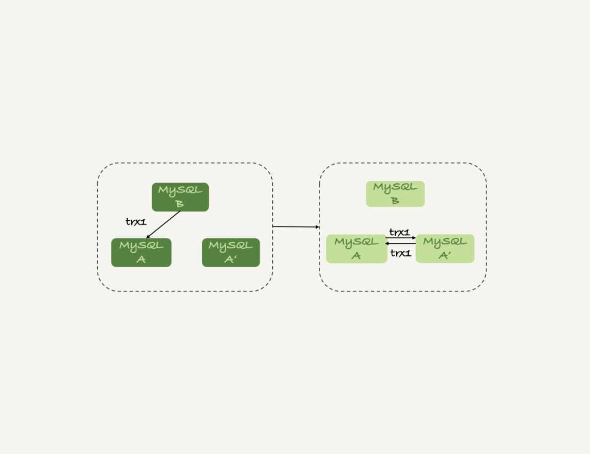

[TOC]

双 M 结构的主备切换流程图：



# 主备延迟

主备切换可能是一个主动运维动作，比如软件升级、主库所在机器按计划下线等，也可能是被动操作，比如主库所在机器掉电。

与数据同步有关的时间点主要包括以下三个：

1. 主库 A 执行完成一个事务，写入 binlog，我们把这个时刻记为 T1。
2. 之后传给备库 B，我们把备库 B 接收完这个 binlog 的时刻记为 T2。
3. 备库 B 执行完成这个事务，我们把这个时刻记为 T3。

主备延迟，就是同一个事务，在备库执行完成的时间和主库执行完成的时间之间的差值，也就是 T3-T1。

## show slave status

在备库上执行 show slave status 命令，它的返回结果里面会显示 seconds_behind_master，用于表示当前备库延迟了多少秒。

seconds_behind_master 的计算方法是这样的：

1. 每个事务的 binlog 里面都有一个时间字段，用于记录主库上写入的时间。
2. 备库取出当前正在执行的事务的时间字段的值，计算它与当前系统时间的差值，得到 seconds_behind_master。

seconds_behind_master 这个参数计算的就是 T3-T1。

**如果主备库机器的系统时间设置不一致，会不会导致主备延迟的值不准？**

不会的。因为，备库连接到主库的时候，会通过执行 SELECT UNIX_TIMESTAMP() 函数来获得当前主库的系统时间。

如果这时候发现主库的系统时间与自己不一致，备库在执行 seconds_behind_master 计算的时候会自动扣掉这个差值。

在网络正常的时候，日志从主库传给备库所需的时间是很短的，即 T2-T1 的值是非常小的。

也就是说，网络正常情况下，主备延迟的主要来源是备库接收完 binlog 和执行完这个事务之间的时间差。

所以说，**主备延迟最直接的表现是，备库消费中转日志（relay log）的速度，比主库生产 binlog 的速度要慢。**

# 主备延迟的来源

- 有些部署条件下，备库所在机器的性能要比主库所在的机器性能差。

- 备库的压力大。

  解决方法：

  - 一主多从。除了备库外，可以多接几个从库，让这些从库来分担读的压力。
  - 通过 binlog 输出到外部系统，比如 Hadoop 这类系统，让外部系统提供统计类查询的能力。

- 大事务。

  - 因为主库上必须等事务执行完成才会写入 binlog，再传给备库。所以，如果一个主库上的语句执行 10 分钟，那这个事务很可能就会导致从库延迟 10 分钟。

# 可靠性优先策略

在双 M 结构下，从状态 1 到状态 2 切换的详细过程是这样的：

1. 判断备库 B 现在的 seconds_behind_master，如果小于某个值（比如 5 秒）继续下一步，否则持续重试这一步。
2. 把主库 A 改成只读状态，即把 readonly 设置为 true。
3. 判断备库 B 的 seconds_behind_master 的值，直到这个值变成 0 为止。
4. 把备库 B 改成可读写状态，也就是把 readonly 设置为 false。
5. 把业务请求切到备库 B。

这个切换流程中是有不可用时间的。

# 可用性优先策略

如果我强行把步骤 4、5 调整到最开始执行，也就是说不等主备数据同步，直接把连接切到备库 B，并且让备库 B 可以读写，那么系统几乎就没有不可用时间了。

这个切换流程的代价，就是可能出现数据不一致的情况。

```java
mysql> CREATE TABLE `t` (
  `id` int(11) unsigned NOT NULL AUTO_INCREMENT,
  `c` int(11) unsigned DEFAULT NULL,
  PRIMARY KEY (`id`)
) ENGINE=InnoDB;

insert into t(c) values(1),(2),(3);
```

这个表定义了一个自增主键 id，初始化数据后，主库和备库上都是 3 行数据。接下来，业务人员要继续在表 t 上执行两条插入语句的命令，依次是：

```java
insert into t(c) values(4);
insert into t(c) values(5);
```

假设，现在主库上其他的数据表有大量的更新，导致主备延迟达到 5 秒。

在插入一条 c=4 的语句后，发起了主备切换。

可用性优先策略，且 binlog_format=mixed 时的切换流程和数据结果：


1. 步骤 2 中，主库 A 执行完 insert 语句，插入了一行数据（4,4），之后开始进行主备切换。
2. 步骤 3 中，由于主备之间有 5 秒的延迟，所以备库 B 还没来得及应用“插入 c=4”这个中转日志，就开始接收客户端“插入 c=5”的命令。
3. 步骤 4 中，备库 B 插入了一行数据（4,5），并且把这个 binlog 发给主库 A。
4. 步骤 5 中，备库 B 执行“插入 c=4”这个中转日志，插入了一行数据（5,4）。而直接在备库 B 执行的“插入 c=5”这个语句，传到主库 A，就插入了一行新数据（5,5）。

最后的结果就是，主库 A 和备库 B 上出现了两行不一致的数据。可以看到，这个数据不一致，是由可用性优先流程导致的。

**用可用性优先策略，但设置 binlog_format=row，情况又会怎样呢？**

因为 row 格式在记录 binlog 的时候，会记录新插入的行的所有字段值，所以最后只会有一行不一致。

**而且，两边的主备同步的应用线程会报错 duplicate key error 并停止。也就是说，这种情况下，备库 B 的 (5,4) 和主库 A 的 (5,5) 这两行数据，都不会被对方执行：**


1. 使用 row 格式的 binlog 时，数据不一致的问题更容易被发现。

   而使用 mixed 或者 statement 格式的 binlog 时，数据很可能悄悄地就不一致了。如果你过了很久才发现数据不一致的问题，很可能这时的数据不一致已经不可查，或者连带造成了更多的数据逻辑不一致。

2. 主备切换的可用性优先策略会导致数据不一致。因此，大多数情况下，都建议你使用可靠性优先策略。毕竟对数据服务来说的话，数据的可靠性一般还是要优于可用性的。

# 提问

一般现在的数据库运维系统都有备库延迟监控，其实就是在备库上执行 show slave status，采集 seconds_behind_master 的值。

假设，现在你看到你维护的一个备库，它的延迟监控的图像类似图 6，是一个 45°斜向上的线段，你觉得可能是什么原因导致呢？你又会怎么去确认这个原因呢？


- 一种是大事务（包括大表 DDL、一个事务操作很多行）。

- 还有一种情况比较隐蔽，就是备库起了一个长事务，比如

  ```java
  begin; 
  select * from t limit 1;
  ```

  这时候主库对表 t 做了一个加字段操作，即使这个表很小，这个 DDL 在备库应用的时候也会被堵住，也不能看到这个现象。

  