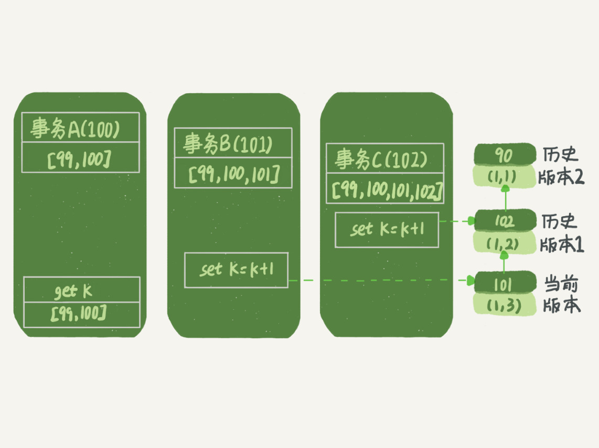

[TOC]

# 隔离性

ACID（Atomicity、Consistency、Isolation、Durability，即原子性、一致性、隔离性、持久性）。

当数据库上有多个事务同时执行的时候，就可能出现脏读（dirty read）、不可重复读（non-repeatable read）、幻读（phantom read）的问题，为了解决这些问题，就有了“隔离级别”的概念。

# 隔离级别

SQL 标准的事务隔离级别包括：

1. 读未提交（read uncommitted）

   一个事务还没提交时，它做的变更就能被别的事务看到。

2. 读提交（read committed）

   一个事务提交之后，它做的变更才会被其他事务看到。

3. 可重复读（repeatable read）

   一个事务执行过程中看到的数据，总是跟这个事务在启动时看到的数据是一致的。

4. 串行化（serializable)

   顾名思义是对于同一行记录，“写”会加“写锁”，“读”会加“读锁”。当出现读写锁冲突的时候，后访问的事务必须等前一个事务执行完成，才能继续执行。

# 事务隔离的实现

在 MySQL 中，实际上每条记录在更新的时候都会同时记录一条回滚操作。记录上的最新值，通过回滚操作，都可以得到前一个状态的值。

假设一个值从 1 被按顺序改成了 2、3、4，在回滚日志里面就会有类似下面的记录。


当前值是 4，但是在查询这条记录的时候，不同时刻启动的事务会有不同的 read-view。

如图中看到的，在视图 A、B、C 里面，这一个记录的值分别是 1、2、4，同一条记录在系统中可以存在多个版本，就是数据库的多版本并发控制（MVCC）。

对于 read-view A，要得到 1，就必须将当前值依次执行图中所有的回滚操作得到。同时你会发现，即使现在有另外一个事务正在将 4 改成 5，这个事务跟 read-view A、B、C 对应的事务是不会冲突的。

## MVCC

InnoDB 里面每个事务有一个唯一的事务 ID，叫作 transaction id。它是在事务开始的时候向 InnoDB 的事务系统申请的，是按申请顺序严格递增的。

而每行数据也都是有多个版本的。每次事务更新数据的时候，都会生成一个新的数据版本，并且把 transaction id 赋值给这个数据版本的事务 ID，记为 row trx_id。同时，旧的数据版本要保留，并且在新的数据版本中，能够有信息可以直接拿到它。

就是一个记录被多个事务连续更新后的状态：


**实际上这三个虚线箭头，就是 undo log。**

而 V1、V2、V3 并不是物理上真实存在的，而是每次需要的时候根据当前版本和 undo log 计算出来的。比如，需要 V2 的时候，就是通过 V4 依次执行 U3、U2 算出来。

### ReadView

**InnoDB 为每个事务构造了一个数组，用来保存这个事务启动瞬间，当前正在“活跃”的所有事务 ID。“活跃”指的就是，启动了但还没提交。**

- 数组里面事务 ID 的最小值记为低水位。
- 当前系统里面已经创建过的事务 ID 的最大值加 1 记为高水位。

数组里面事务 ID 的最小值记为低水位，当前系统里面已经创建过的事务 ID 的最大值加 1 记为高水位。

**获取视图数组和高水位是在事务系统的锁保护下做的，可以认为是原子操作，期间不能创建事务。**


1. 如果落在绿色部分，表示这个版本是已提交的事务或者是当前事务自己生成的，这个数据是可见的。
2. 如果落在红色部分，表示这个版本是由将来启动的事务生成的，是肯定不可见的。
3. 如果落在黄色部分，那就包括两种情况：
   - 若 row trx_id 在数组中，表示这个版本是由还没提交的事务生成的，不可见。
   - 若 row trx_id 不在数组中，表示这个版本是已经提交了的事务生成的，可见。

假设：

1. 事务 A 开始前，系统里面只有一个活跃事务 ID 是 99。
2. 事务 A、B、C 的版本号分别是 100、101、102，且当前系统里只有这四个事务。
3. 三个事务开始前，(1,1）这一行数据的 row trx_id 是 90。

**这样，事务 A 的视图数组就是[99,100], 事务 B 的视图数组是[99,100,101], 事务 C 的视图数组是[99,100,101,102]。**



事务 A 读数据，它的视图数组是[99,100]。当然了，读数据都是从当前版本读起的。所以，事务 A 查询语句的读数据流程是这样的：

1. 找到 (1,3) 的时候，判断出 row trx_id=101，比高水位大，处于红色区域，不可见。
2. 接着，找到上一个历史版本，一看 row trx_id=102，比高水位大，处于红色区域，不可见。
3. 再往前找，终于找到了（1,1)，它的 row trx_id=90，比低水位小，处于绿色区域，可见。

#### 更新逻辑，当前读

更新数据的时候，就不能再在历史版本上更新了，否则事务 C 的更新就丢失了。因此，事务 B 此时的 set k=k+1 是在（1,2）的基础上进行的操作。

- **更新数据都是先读后写的，而这个读，只能读当前的值，称为“当前读”（current read）。**
- **除了 update 语句外，select 语句如果加锁，也是当前读。**

所以，如果把事务 A 的查询语句 select * from t where id=1 修改一下，加上 lock in share mode 或 for update，也都可以读到版本号是 101 的数据，返回的 k 的值是 3。

下面这两个 select 语句，就是分别加了读锁（S 锁，共享锁）和写锁（X 锁，排他锁）：

```java
mysql> select k from t where id=1 lock in share mode;mysql> select k from t where id=1 for update;
```

因为select 语句需要先获取锁，只能等事务B提交释放锁后才能执行。所以就看到了B提交的数据了。

### 事务的可重复读的能力是怎么实现的？

而读提交的逻辑和可重复读的逻辑类似，它们最主要的区别是：

1. 在可重复读隔离级别下，只需要在事务开始的时候创建一致性视图，之后事务里的其他查询都共用这个一致性视图。
2. 在读提交隔离级别下，每一个语句执行前都会重新算出一个新的视图。

**“start transaction with consistent snapshot; ”的意思是从这个语句开始，创建一个持续整个事务的一致性快照。所以，在读提交隔离级别下，这个用法就没意义了，等效于普通的 start transaction。**

# 回滚日志什么时候删除呢

在不需要的时候才删除。也就是说，系统会判断，当没有事务再需要用到这些回滚日志时，回滚日志会被删除。什么时候才不需要了呢？就是**当系统里没有比这个回滚日志更早的 read-view 的时候。**

1. 所有数据行上DATA_TRX_ID小于up_trx_id的记录，说明修改该行的事务在当前事务开启之前都已经提交完成，所以对当前事务来说，都是可见的。
2. 而对于DATA_TRX_ID大于low_trx_id的记录，说明修改该行记录的事务在当前事务之后，所以对于当前事务来说是不可见的。

**注意:**

1. ReadView是与SQL绑定的，而并不是事务，所以即使在同一个事务中，每次SQL启动时**构造的ReadView**的up_trx_id和low_trx_id也都是不一样的
2. 至于DATA_TRX_ID大于low_trx_id本身出现也只有当多个SQL并发的时候，在一个SQL构造完ReadView之后，另外一个SQL修改了数据后又进行了提交，对于这种情况，数据其实是不可见的。

**至于位于（up_trx_id, low_trx_id）中间的事务是否可见，这个需要根据不同的事务隔离级别来确定：**

1. 对于RC的事务隔离级别来说，对于事务执行过程中，已经提交的事务的数据，对当前事务是可见的，也就是说上述图中，当前事务运行过程中，trx1~4中任意一个事务提交，对当前事务来说都是可见的；
2. 而对于RR隔离级别来说，事务启动时，已经开始的事务链表中的事务的所有修改都是不可见的，所以在RR级别下，low_trx_id基本保持与up_trx_id相同的值即可。

# 事务的启动时机

1. begin/start transaction 命令并不是一个事务的起点，在执行到它们之后的第一个操作 InnoDB 表的语句，事务才真正启动。

   **对于这种启动方式，一致性视图是在执行第一个快照读语句时创建的。**

2. 如果你想要马上启动一个事务，可以使用 **start transaction with consistent snapshot** 这个命令。

   **对于这种启动方式，一致性视图是在执行 start transaction with consistent snapshot 时创建的。**

## 长事务

长事务意味着系统里面会存在很老的事务视图。由于这些事务随时可能访问数据库里面的任何数据，所以这个事务提交之前，数据库里面它可能用到的回滚记录都必须保留，这就会导致大量占用存储空间。

> 比如，在某个时刻（今天上午9:00）开启了一个事务A（对于可重复读隔离级别，此时一个视图read-view A也创建了），这是一个很长的事务……
>
> 事务A在今天上午9:20的时候，查询了一个记录R1的一个字段f1的值为1……
>
> 今天上午9:25的时候，一个事务B（随之而来的read-view B）也被开启了，它更新了R1.f1的值为2（同时也创建了一个由2到1的回滚日志），这是一个短事务，事务随后就被commit了。
>
> 今天上午9:30的时候，一个事务C（随之而来的read-view C）也被开启了，它更新了R1.f1的值为3（同时也创建了一个由3到2的回滚日志），这是一个短事务，事务随后就被commit了。
>
> ……
>
> 到了下午3:00了，长事务A还没有commit，为了保证事务在执行期间看到的数据在前后必须是一致的，那些老的事务视图、回滚日志就必须存在了，这就占用了大量的存储空间。
>
> 源于此，我们应该尽量不要使用长事务。

# 事务的启动方式

1. 显式启动事务语句， begin 或 start transaction。配套的提交语句是 commit，回滚语句是 rollback。
2. set autocommit=0，这个命令会将这个线程的自动提交关掉。意味着如果你只执行一个 select 语句，这个事务就启动了，而且并不会自动提交。这个事务持续存在直到你主动执行 commit 或 rollback 语句，或者断开连接。

如果执行 commit 则提交事务。如果执行 **commit work and chain，则是提交事务并自动启动下一个事务**，这样也省去了再次执行 begin 语句的开销。同时带来的好处是从程序开发的角度明确地知道每个语句是否处于事务中。

## 长事务监控

可以在 information_schema 库的 innodb_trx 这个表中查询长事务，比如下面这个语句，用于查找持续时间超过 60s 的事务。

```java
select * from information_schema.innodb_trx where TIME_TO_SEC(timediff(now(),trx_started))>60
```

监控 information_schema.Innodb_trx 表，设置长事务阈值，超过就报警 / 或者 kill；