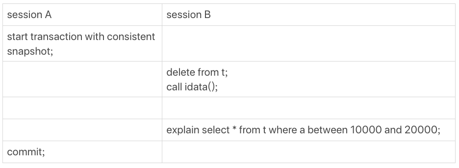

[TOC]

# MYSQL索引错选


```java
CREATE TABLE `t` (
  `id` int(11) auto_increment,
  `a` int(11) DEFAULT NULL,
  `b` int(11) DEFAULT NULL,
  PRIMARY KEY (`id`),
  KEY `a` (`a`),
  KEY `b` (`b`)
) ENGINE=InnoDB；
```

往表 t 中插入 10 万行记录，取值按整数递增，即：(1,1,1)，(2,2,2)，(3,3,3) 直到 (100000,100000,100000)。

用存储过程来插入数据的:

```java
delimiter ;;
create procedure idata()
begin
  declare i int;
  set i=1;
  START TRANSACTION;
  while(i<=100000)do
    insert into t (`a`,`b`) values(i, i);
    set i=i+1;
  end while;
  commit;
end;;
delimiter ;
call idata();
```

接下来，分析一条 SQL 语句：

```java
mysql> select * from t where a between 10000 and 20000;
```


再做如下作:



这时候，session B 的查询语句 select * from t where a between 10000 and 20000 就不会再选择索引 a 了。

可以通过慢查询日志（slow log）来查看一下具体的执行情况。

为了说明优化器选择的结果是否正确，增加了一个对照，即：使用 force index(a) 来让优化器强制使用索引 a：

```java
//将慢查询日志的阈值设置为 0
set long_query_time=0;
select * from t where a between 10000 and 20000; /*Q1*/
select * from t force index(a) where a between 10000 and 20000;/*Q2*/
```

Q1 扫描了 10 万行，显然是走了全表扫描，执行时间是 40 毫秒。

Q2 扫描了 10001 行，执行了 21 毫秒。也就是说，在没有使用 force index 的时候，MySQL 用错了索引，导致了更长的执行时间。

# 优化器的逻辑

优化器选择索引的目的，是找到一个最优的执行方案，并用最小的代价去执行语句。

**扫描行数是影响执行代价的因素之一**。**扫描的行数越少，意味着访问磁盘数据的次数越少，消耗的 CPU 资源越少。**

扫描行数并不是唯一的判断标准，优化器还会结合**是否使用临时表、是否排序等因素进行综合判断。**

这个简单的查询语句并没有涉及到临时表和排序，所以 MySQL 选错索引肯定是在判断扫描行数的时候出问题了。

## 扫描行数是怎么判断的？

#### 区分度 & 基数

MySQL 在真正开始执行语句之前，并不能精确地知道满足这个条件的记录有多少条，而只能根据统计信息来估算记录数。

这个统计信息就是索引的**“区分度”**。

显然，一个索引上不同的值越多，这个索引的区分度就越好。

而一个索引上不同的值的个数，我们称之为“**基数**”（cardinality）。也就是说，**这个基数越大，索引的区分度越好。**

可以使用 show index 方法，看到一个索引的基数。虽然这个表的每一行的三个字段值都是一样的，但是在统计信息中，这三个索引的基数值并不同，而且其实都不准确:


#### 采样统计

**MySQL 是怎样得到索引的基数的呢**？

MySQL 使用的是采样统计的方法。

**为什么要采样统计呢？**

- 因为把整张表取出来一行行统计，虽然可以得到精确的结果，但是代价太高了，所以只能选择“采样统计”。

- 采样统计的时候，InnoDB 默认会选择 N 个数据页，统计这些页面上的不同值，得到一个平均值，然后乘以这个索引的页面数，就得到了这个索引的基数。

而数据表是会持续更新的，索引统计信息也不会固定不变。所以，**当变更的数据行数超过 1/M 的时候，会自动触发重新做一次索引统计。**

#### innodb_stats_persistent

- 设置为 on 的时候，表示统计信息会持久化存储。这时，默认的 N 是 20，M 是 10。
- 设置为 off 的时候，表示统计信息只存储在内存中。这时，默认的 N 是 8，M 是 16。

# 预计扫描行数

Session B中的查询：


为什么优化器为什么放着扫描 37000 行的执行计划不用，却选择了扫描行数是 100000 的执行计划呢？

这是因为，如果使用索引 a，**每次从索引 a 上拿到一个值，都要回到主键索引上查出整行数据，这个代价优化器也要算进去的。而如果选择扫描 10 万行，是直接在主键索引上扫描的，没有额外的代价。**

## analyze table

既然是统计信息不对，那就修正。

**analyze table t 命令，可以用来重新统计索引信息。**

**所以实践中，如果你发现 explain 的结果预估的 rows 值跟实际情况差距比较大，可以采用这个方法来处理。**

# 索引选择异常和处理

```java
mysql> select * from t where (a between 1 and 1000)  and (b between 50000 and 100000) order by b limit 1;
```

- 如果使用索引 a 进行查询，那么就是扫描索引 a 的前 1000 个值，然后取到对应的 id，再到主键索引上去查出每一行，然后根据字段 b 来过滤。显然这样需要扫描 1000 行。
- 如果使用索引 b 进行查询，那么就是扫描索引 b 的最后 50001 个值，与上面的执行过程相同，也是需要回到主键索引上取值再判断，所以需要扫描 50001 行。如果使用索引 a 的话，执行速度明显会快很多。


这次优化器选择了索引 b，而 rows 字段显示需要扫描的行数是 50198。从这个结果中，可以得到两个结论：

1. 扫描行数的估计值依然不准确。
2. 这个例子里 MySQL 又选错了索引。

解决方法：

- 采用 force index 强行选择一个索引。
- 可以考虑修改语句，引导 MySQL 使用我们期望的索引。比如，在这个例子里，显然把“order by b limit 1” 改成 “order by b,a limit 1” ，语义的逻辑是相同的。
- 在有些场景下，我们可以新建一个更合适的索引，来提供给优化器做选择，或删掉误用的索引。


# 为什么经过这个操作序列，explain 的结果就不对了？

delete 语句删掉了所有的数据，然后再通过 call idata() 插入了 10 万行数据，看上去是覆盖了原来的 10 万行。

但是，session A 开启了事务并没有提交，所以之前插入的 10 万行数据是不能删除的（undo log不能删，逻辑上还在）。这样，之前的数据每一行数据都有两个版本，旧版本是 delete 之前的数据，新版本是标记为 deleted 的数据。

这样，索引 a 上的数据其实就有两份。

那没有使用 force index 的语句，使用 explain 命令看到的扫描行数为什么还是 100000 左右？

**不过这个是主键，主键是直接按照表的行数来估计的。而表的行数，优化器直接用的是 show table status 的值。**