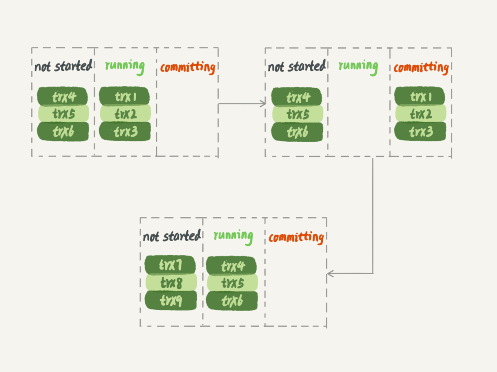

[TOC]

在官方的 5.6 版本之前，MySQL 只支持单线程复制，由此在主库并发高、TPS 高时就会出现严重的主备延迟问题。

所有的多线程复制机制，都是要把只有一个线程的 sql_thread，拆成多个线程，也就是都符合下面的这个模型：

coordinator 就是原来的 sql_thread, 不过现在它不再直接更新数据了，**只负责读取中转日志和分发事务**。

真正更新日志的，变成了 worker 线程。而 work 线程的个数，就是由参数 **slave_parallel_workers** 决定的。

把这个值设置为 8~16 之间最好（32 核物理机的情况），毕竟备库还有可能要提供读查询，不能把 CPU 都吃光了。

**事务能不能按照轮询的方式分发给各个 worker，也就是第一个事务分给 worker_1，第二个事务发给 worker_2 呢？**

其实是不行的。

因为，事务被分发给 worker 以后，不同的 worker 就独立执行了。

**但是，由于 CPU 的调度策略，很可能第二个事务最终比第一个事务先执行。而如果这时候刚好这两个事务更新的是同一行，也就意味着，同一行上的两个事务，在主库和备库上的执行顺序相反，会导致主备不一致的问题。**

# MySQL 5.5 版本的并行复制策略

官方 MySQL 5.5 版本是不支持并行复制的。

但是，老师服务的业务出现了严重的主备延迟，原因就是备库只有单线程复制。然后，老师就先后写了两个版本的并行策略。

## 按表分发策略

表分发事务的基本思路是，如果两个事务更新不同的表，它们就可以并行。

因为数据是存储在表里的，所以按表分发，可以保证两个 worker 不会更新同一行。当然，如果有跨表的事务，还是要把两张表放在一起考虑的。

- 每个 worker 线程对应一个 hash 表，用于保存当前正在这个 worker 的“执行队列”里的事务所涉及的表。
- hash 表的 key 是“库名. 表名”，value 是一个数字，表示队列中有多少个事务修改这个表。
- 在有事务分配给 worker 时，事务里面涉及的表会被加到对应的 hash 表中。worker 执行完成后，这个表会被从 hash 表中去掉。

假设在图中的情况下，coordinator 从中转日志中读入一个新事务 T，这个事务修改的行涉及到表 t1 和 t3：

1. 由于事务 T 中涉及修改表 t1，而 worker_1 队列中有事务在修改表 t1，事务 T 和队列中的某个事务要修改同一个表的数据，这种情况我们说事务 T 和 worker_1 是冲突的。
2. 按照这个逻辑，顺序判断事务 T 和每个 worker 队列的冲突关系，会发现事务 T 跟 worker_2 也冲突。
3. 事务 T 跟多于一个 worker 冲突，coordinator 线程就进入等待。
4. 每个 worker 继续执行，同时修改 hash_table。假设 hash_table_2 里面涉及到修改表 t3 的事务先执行完成，就会从 hash_table_2 中把 db1.t3 这一项去掉。
5. 这样 coordinator 会发现跟事务 T 冲突的 worker 只有 worker_1 了，因此就把它分配给 worker_1。
6. coordinator 继续读下一个中转日志，继续分配事务。

每个事务在分发的时候，跟所有 worker 的冲突关系包括以下三种情况：

1. 如果跟所有 worker 都不冲突，coordinator 线程就会把这个事务分配给最空闲的 woker。
2. 如果跟多于一个 worker 冲突，coordinator 线程就进入等待状态，直到和这个事务存在冲突关系的 worker 只剩下 1 个。
3. 如果只跟一个 worker 冲突，coordinator 线程就会把这个事务分配给这个存在冲突关系的 worker。

这个按表分发的方案，在多个表负载均匀的场景里应用效果很好。

**但是，如果碰到热点表，比如所有的更新事务都会涉及到某一个表的时候，所有事务都会被分配到同一个 worker 中，就变成单线程复制了。**

## 按行分发策略

要解决热点表的并行复制问题，就需要一个按行并行复制的方案。

按行复制的核心思路是：如果两个事务没有更新相同的行，它们在备库上可以并行执行。

**显然，这个模式要求 binlog 格式必须是 row。**

按行复制和按表复制的数据结构差不多，也是为每个 worker，分配一个 hash 表。

只是要实现按行分发，这时候的 key，就必须是**“库名 + 表名 + 唯一键的名 + 唯一键的值”。**

相比于按表并行分发策略，按行并行策略在决定线程分发的时候，需要消耗更多的计算资源。

1. 要能够从 binlog 里面解析出表名、主键值和唯一索引的值。也就是说，主库的 binlog 格式必须是 row。
2. 表必须有主键。
3. 不能有外键。表上如果有外键，级联更新的行不会记录在 binlog 中，这样冲突检测就不准确。

按行分发的策略有两个问题：

1. 耗费内存。比如一个语句要删除 100 万行数据，这时候 hash 表就要记录 100 万个项。
2. 耗费 CPU。解析 binlog，然后计算 hash 值，对于大事务，这个成本还是很高的。

在实现这个策略的时候会设置一个阈值，单个事务如果超过设置的行数阈值（比如，如果单个事务更新的行数超过 10 万行），就暂时退化为单线程模式，退化过程的逻辑大概是这样的：

1. coordinator 暂时先 hold 住这个事务。
2. 等待所有 worker 都执行完成，变成空队列。
3. coordinator 直接执行这个事务。
4. 恢复并行模式。

# MySQL 5.6 版本的并行复制策略

官方 MySQL5.6 版本，支持了并行复制，只是支持的粒度是按库并行。

**用于决定分发策略的 hash 表里，key 就是数据库名。**

相比于按表和按行分发，这个策略有两个优势：

1. 构造 hash 值的时候很快，只需要库名；而且一个实例上 DB 数也不会很多，不会出现需要构造 100 万个项这种情况。
2. 不要求 binlog 的格式。因为 statement 格式的 binlog 也可以很容易拿到库名。

**如果你的主库上的表都放在同一个 DB 里面，这个策略就没有效果了。**

**或者如果不同 DB 的热点不同，比如一个是业务逻辑库，一个是系统配置库，那也起不到并行的效果。**

# MariaDB 的并行复制策略

而 MariaDB 的并行复制策略利用了组提交 (group commit)这个特性：

1. 能够在同一组里提交的事务，一定不会修改同一行。
2. 主库上可以并行执行的事务，备库上也一定是可以并行执行的。

在实现上，MariaDB 是这么做的：

1. 在一组里面一起提交的事务，有一个相同的 commit_id，下一组就是 commit_id+1。
2. commit_id 直接写到 binlog 里面。
3. 传到备库应用的时候，相同 commit_id 的事务分发到多个 worker 执行。
4. **这一组全部执行完成后，coordinator 再去取下一批。**

但是，这个策略有一个问题，它并没有实现“真正的模拟主库并发度”这个目标。

在主库上，一组事务在 commit 的时候，下一组事务是同时处于“执行中”状态的：

而按照 MariaDB 的并行复制策略，备库上的执行效果如图 6 所示：

**在备库上执行的时候，要等第一组事务完全执行完成后，第二组事务才能开始执行，这样系统的吞吐量就不够。**

**这个方案很容易被大事务拖后腿。**

假设 trx2 是一个超大事务，那么在备库应用的时候，trx1 和 trx3 执行完成后，就只能等 trx2 完全执行完成，下一组才能开始执行。这段时间，只有一个 worker 线程在工作，是对资源的浪费。

# MySQL 5.7 的并行复制策略

在 MariaDB 并行复制实现之后，官方的 MySQL5.7 版本也提供了类似的功能，**由参数 slave-parallel-type 来控制并行复制策略：**

1. 配置为 DATABASE，表示使用 MySQL 5.6 版本的按库并行策略。
2. 配置为 LOGICAL_CLOCK，表示的就是类似 MariaDB 的策略。不过，MySQL 5.7 这个策略，针对并行度做了优化。

**同时处于“执行状态”的所有事务，是不是可以并行？**

不能。

因为，这里面可能有由于锁冲突而处于锁等待状态的事务。如果这些事务在备库上被分配到不同的 worker，就会出现备库跟主库不一致的情况。

**其实，不用等到 commit 阶段，只要能够到达 redo log prepare 阶段，就表示事务已经通过锁冲突的检验了。**

因此，MySQL 5.7 并行复制策略的思想是：

1. 同时处于 prepare 状态的事务，在备库执行时是可以并行的。
2. 处于 prepare 状态的事务，与处于 commit 状态的事务之间，在备库执行时也是可以并行的。

**这两个参数是用于故意拉长 binlog 从 write 到 fsync 的时间，以此减少 binlog 的写盘次数。**

**在 MySQL 5.7 的并行复制策略里，它们可以用来制造更多的“同时处于 prepare 阶段的事务”。这样就增加了备库复制的并行度。**

也就是说，这两个参数，既可以“故意”让主库提交得慢些，又可以让备库执行得快些。

在 MySQL 5.7 处理备库延迟的时候，可以考虑调整这两个参数值，来达到提升备库复制并发度的目的。

# MySQL 5.7.22 的并行复制策略

MySQL 5.7.22 版本里，MySQL 增加了一个新的并行复制策略，基于 WRITESET 的并行复制。

相应地，新增了一个参数 **binlog-transaction-dependency-tracking**，用来控制是否启用这个新策略。这个参数的可选值有以下三种：

1. COMMIT_ORDER，表示的就是前面介绍的，根据同时进入 prepare 和 commit 来判断是否可以并行的策略。
2. WRITESET，表示的是对于事务涉及更新的每一行，计算出这一行的 hash 值，组成集合 writeset。如果两个事务没有操作相同的行，也就是说它们的 writeset 没有交集，就可以并行。
3. WRITESET_SESSION，是在 WRITESET 的基础上多了一个约束，即在主库上同一个线程先后执行的两个事务，在备库执行的时候，要保证相同的先后顺序。

- 当然为了唯一标识，这个 hash 值是通过“库名 + 表名 + 索引名 + 值”计算出来的。
- 如果一个表上除了有主键索引外，还有其他唯一索引，那么对于每个唯一索引，insert 语句对应的 writeset 就要多增加一个 hash 值。

这跟前面介绍的基于 MySQL 5.5 版本的按行分发的策略是差不多的。不过，MySQL 官方的这个实现还是有很大的优势：

1. writeset 是在主库生成后直接写入到 binlog 里面的，这样在备库执行的时候，不需要解析 binlog 内容（event 里的行数据），节省了很多计算量。
2. 不需要把整个事务的 binlog 都扫一遍才能决定分发到哪个 worker，更省内存。
3. 由于备库的分发策略不依赖于 binlog 内容，所以 binlog 是 statement 格式也是可以的。

**对于“表上没主键”和“外键约束”的场景，WRITESET 策略也是没法并行的，也会暂时退化为单线程模型。**