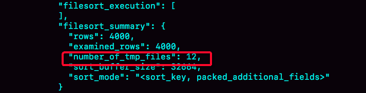

[TOC]

# 全字段排序

```java
CREATE TABLE `t` (
  `id` int(11) NOT NULL,
  `city` varchar(16) NOT NULL,
  `name` varchar(16) NOT NULL,
  `age` int(11) NOT NULL,
  `addr` varchar(128) DEFAULT NULL,
  PRIMARY KEY (`id`),
  KEY `city` (`city`)
) ENGINE=InnoDB;
```

SQL 语句可以这么写：

```java
select city,name,age from t where city='杭州' order by name limit 1000 ;
```


Extra 这个字段中的“Using filesort”表示的就是需要排序，**MySQL 会给每个线程分配一块内存用于排序，称为 sort_buffer。**

这个语句执行流程如下所示 ：

1. 初始化 sort_buffer，确定放入 name、city、age 这三个字段。
2. 从索引 city 找到第一个满足 city='杭州’条件的主键 id。
3. 到主键 id 索引取出整行，取 name、city、age 三个字段的值，存入 sort_buffer 中。
4. 从索引 city 取下一个记录的主键 id。
5. 重复步骤 3、4 直到 city 的值不满足查询条件为止。
6. 对 sort_buffer 中的数据按照字段 name 做**快速排序。**
7. 按照排序结果取前 1000 行返回给客户端。

“按 name 排序”这个动作，**可能在内存中完成，也可能需要使用外部排序，这取决于排序所需的内存和参数 sort_buffer_size。**

通过查看 OPTIMIZER_TRACE 的结果来确认的，你可以从 number_of_tmp_files 中看到是否使用了临时文件。



**number_of_tmp_files 表示的是，排序过程中使用的临时文件数。**

**为什么需要 12 个文件？**

内存放不下时，就需要使用外部排序，**外部排序一般使用归并排序算法。**可以这么简单理解，MySQL 将需要排序的数据分成 12 份，每一份单独排序后存在这些临时文件中。然后把这 12 个有序文件再合并成一个有序的大文件。

- examined_rows=4000，表示参与排序的行数是 4000 行。
- sort_mode 里面的 packed_additional_fields 的意思是，排序过程对字符串做了“紧凑”处理。即使 name 字段的定义是 varchar(16)，在排序过程中还是要按照实际长度来分配空间的。

# rowid 排序

```java
SET max_length_for_sort_data = 16;
```

**max_length_for_sort_data，是 MySQL 中专门控制用于排序的行数据的长度的一个参数。**

**它的意思是，如果单行的长度超过这个值，MySQL 就认为单行太大，要换一个算法。**

city、name、age 这三个字段的定义总长度是 36，把 max_length_for_sort_data 设置为 16，再来看看计算过程有什么改变。

新的算法放入 sort_buffer 的字段，只有要排序的列（即 name 字段）和主键 id。但这时，排序的结果就因为少了 city 和 age 字段的值，不能直接返回了，整个执行流程就变成如下所示的样子：

1. 初始化 sort_buffer，确定放入两个字段，即 name 和 id。
2. 从索引 city 找到第一个满足 city='杭州’条件的主键 id。
3. 到主键 id 索引取出整行，取 name、id 这两个字段，存入 sort_buffer 中。
4. 从索引 city 取下一个记录的主键 id。
5. 重复步骤 3、4 直到不满足 city='杭州’条件为止。
6. 对 sort_buffer 中的数据按照字段 name 进行排序。
7. 遍历排序结果，取前 1000 行，并按照 id 的值回到原表中取出 city、name 和 age 三个字段返回给客户端。

**rowid 排序多访问了一次表 t 的主键索引。由于语句是 limit 1000，因此会多读 1000 行。**

- sort_mode 变成了 ，表示参与排序的只有 name 和 id 这两个字段。
- number_of_tmp_files 变成 10 了，是因为这时候参与排序的行数虽然仍然是 4000 行，但是每一行都变小了，因此需要排序的总数据量就变小了，需要的临时文件也相应地变少了。

# 全字段排序 VS rowid 排序

- 如果 MySQL 实在是担心排序内存太小，会影响排序效率，才会采用 rowid 排序算法，这样排序过程中一次可以排序更多行，但是需要再回到原表去取数据。
- 如果 MySQL 认为内存足够大，会优先选择全字段排序，把需要的字段都放到 sort_buffer 中，这样排序后就会直接从内存里面返回查询结果了，不用再回到原表去取数据。

对于 InnoDB 表来说，rowid 排序会要求回表多造成磁盘读，因此不会被优先选择。

# 提问

假设你的表里面已经有了 city_name(city, name) 这个联合索引，然后你要查杭州和苏州两个城市中所有的市民的姓名，并且按名字排序，显示前 100 条记录。如果 SQL 查询语句是这么写的 ：

```java
mysql> select * from t where city in ('杭州',"苏州") order by name limit 100;
```

**这个语句执行的时候会有排序过程吗，为什么？**

虽然有 (city,name) 联合索引，对于单个 city 内部，name 是递增的。但是由于这条 SQL 语句不是要单独地查一个 city 的值，而是同时查了"杭州"和" 苏州 "两个城市，因此所有满足条件的 name 就不是递增的了。也就是说，这条 SQL 语句需要排序。

**如果业务端代码由你来开发，需要实现一个在数据库端不需要排序的方案，你会怎么实现呢？**

1. 执行 select * from t where city=“杭州” order by name limit 100; 这个语句是不需要排序的，客户端用一个长度为 100 的内存数组 A 保存结果。
2. 执行 select * from t where city=“苏州” order by name limit 100; 用相同的方法，假设结果被存进了内存数组 B。
3. 现在 A 和 B 是两个有序数组，然后你可以用归并排序的思想，得到 name 最小的前 100 值，就是我们需要的结果了。