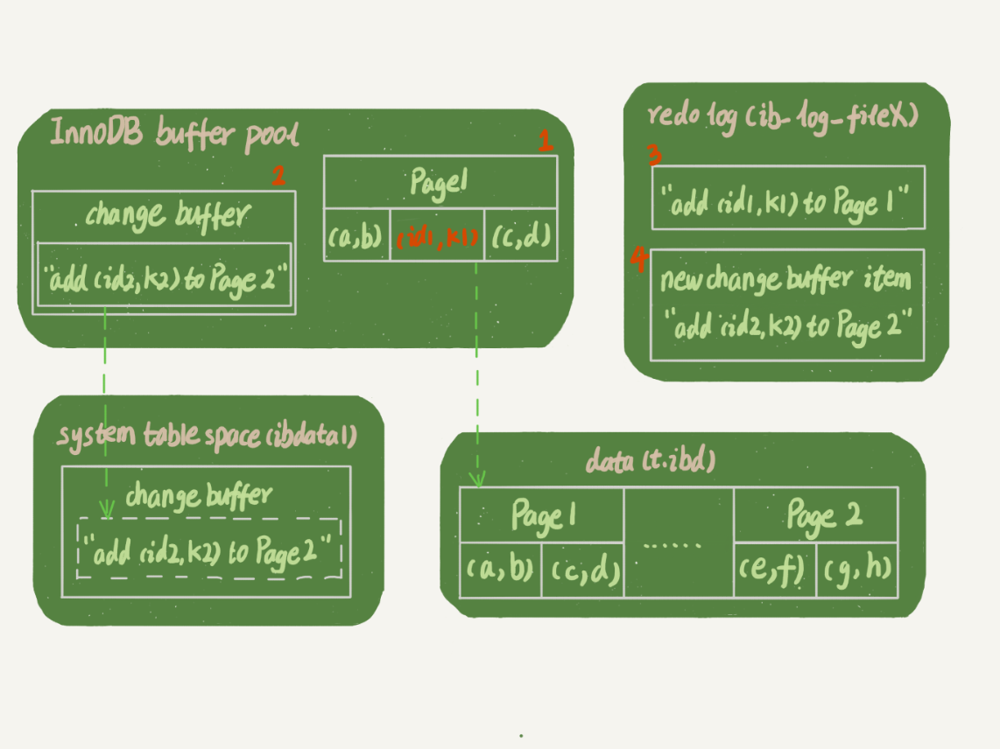

[TOC]

# 查询过程

**select id from T where k=5**


这个查询语句在索引树上查找的过程：

1. 先是通过 B+ 树从树根开始，按层搜索到叶子节点，也就是数据页。
2. **然后可以认为数据页内部通过二分法来定位记录。**

## 普通索引和唯一索引的查询

- 对于普通索引来说，查找到满足条件的第一个记录 (5,500) 后，需要查找下一个记录，直到碰到第一个不满足 k=5 条件的记录。
- 对于唯一索引来说，由于索引定义了唯一性，查找到第一个满足条件的记录后，就会停止继续检索。

**InnoDB 的数据是按数据页为单位来读写的。**也就是说，当需要读一条记录的时候，并不是将这个记录本身从磁盘读出来，而是以页为单位，将其整体读入内存。**在 InnoDB 中，每个数据页的大小默认是 16KB。**

所以说，当找到 k=5 的记录的时候，它所在的数据页就都在内存里了。

那么，对于普通索引来说，要多做的那一次“查找和判断下一条记录”的操作，就只需要一次指针寻找和一次计算。

所以这个不同带来的性能差距是微乎其微的。

# 更新过程

## change buffer

当需要更新一个数据页时：

1. 如果数据页在内存中就直接更新，而如果这个数据页还没有在内存中的话，在不影响数据一致性的前提下，**InnoDB 会将这些更新操作缓存在 change buffer 中，这样就不需要从磁盘中读入这个数据页了。**
2. 在下次查询需要访问这个数据页的时候，**将数据页读入内存，然后执行 change buffer 中与这个页有关的操作**。通过这种方式就能保证这个数据逻辑的正确性。

虽然名字叫作 change buffer，**实际上它是可以持久化的数据**。也就是说，**change buffer 在内存中有拷贝，也会被写入到磁盘上。**

change buffer可以看成也是一个数据页，需要**被持久化到 系统表空间（ibdata1，MYSQL用来储存文件的数据）**。

### merge

将 change buffer 中的操作应用到原数据页，得到最新结果的过程称为 merge：

1. **访问这个数据页会触发 merge 。**
2. **系统有后台线程会定期 merge。**
3. **在数据库正常关闭（shutdown）的过程中，也会执行 merge 操作。**

将更新操作先记录在 change buffer，**减少读磁盘，语句的执行速度会得到明显的提升。**

而且，数据读入内存是需要占用 buffer pool 的，所以这种方式**还能够避免占用内存，提高内存利用率。**

## 什么条件下可以使用 change buffer 呢？

### 唯一索引

对于唯一索引来说，所有的更新操作都要先判断这个操作是否违反唯一性约束。

比如，要插入 (4,400) 这个记录，就要先判断现在表中是否已经存在 k=4 的记录，**而这必须要将数据页读入内存才能判断。**

**如果都已经读入到内存了，那直接更新内存会更快，就没必要使用 change buffer 了。**

**唯一索引的更新就不能使用 change buffer，实际上也只有普通索引可以使用。**

### 普通索引

#### innodb_change_buffer_max_size

change buffer 用的是 buffer pool 里的内存，因此不能无限增大。

change buffer 的大小，可以通过参数 innodb_change_buffer_max_size 来动态设置。这个参数设置为 50 的时候，表示 change buffer 的大小最多只能占用 buffer pool 的 50%。

## 插入一个新记录

**如果要在这张表中插入一个新记录 (4,400) 的话，InnoDB 的处理流程：**

1. 如果这个记录要更新的目标页在内存中：
   - **对于唯一索引来说，找到 3 和 5 之间的位置，判断到没有冲突，插入这个值，语句执行结束。**
   - **对于普通索引来说，找到 3 和 5 之间的位置，插入这个值，语句执行结束。**
2. 如果这个记录要更新的目标页不在内存中：
   - **对于唯一索引来说，需要将数据页读入内存，判断到没有冲突，插入这个值，语句执行结束。**
   - **对于普通索引来说，则是将更新记录在 change buffer，语句执行就结束了。**

**将数据从磁盘读入内存涉及随机 IO 的访问，是数据库里面成本最高的操作之一。change buffer 因为减少了随机磁盘访问，所以对更新性能的提升是会很明显的。**

>  innodb 普通索引修改成唯一索引产生的 生产事故, 写多读少使用 changebuffer 可以加快执行速度(减少数据页磁盘 io); 但是,如果业务模型是 写后立马会做查询, 则会触发 changebuff 立即 merge 到磁盘, 这样 的场景磁盘 io 次数不会减少,反而会增加 changebuffer 的维护代价。

# change buffer 的使用场景

**普通索引的所有场景，使用 change buffer 都可以起到加速作用吗？**

因为 merge 的时候是真正进行数据更新的时刻，而 change buffer 的主要目的就是将记录的变更动作缓存下来，所以在一个数据页做 merge 之前，change buffer 记录的变更越多（也就是这个页面上要更新的次数越多），收益就越大。

- **因此，对于写多读少的业务来说，页面在写完以后马上被访问到的概率比较小，此时 change buffer 的使用效果最好。这种业务模型常见的就是账单类、日志类的系统。**
- 反过来，假设一个业务的更新模式是**写入之后马上会做查询**，那么即使满足了条件，将更新**先记录在 change buffer，但之后由于马上要访问这个数据页，会立即触发 merge 过程。这样随机访问 IO 的次数不会减少，反而增加了 change buffer 的维护代价。**所以，对于这种业务模式来说，change buffer 反而起到了副作用。

如果所有的更新后面，都马上伴随着对这个记录的查询，那么应该关闭 change buffer。而在其他情况下，change buffer 都能提升更新性能。

# change buffer 和 redo log

```java
mysql> insert into t(id,k) values(id1,k1),(id2,k2);
```

假设当前 k 索引树的状态，查找到位置后，k1 所在的数据页在内存 (InnoDB buffer pool) 中，k2 所在的数据页不在内存中。如图所示是带 change buffer 的更新状态图:



它涉及了四个部分：

1. 内存。
2. redo log（ib_log_fileX）。
3.  数据表空间（t.ibd）。
4. 系统表空间（ibdata1）。

这条更新语句做了如下的操作（按照图中的数字顺序）：

1. Page 1 在内存中，直接更新内存。
2. Page 2 没有在内存中，就在内存的 change buffer 区域，记录下“我要往 Page 2 插入一行”这个信息。
3. 将上述两个动作记入 redo log 中。

**现在要执行 select * from t where k in (k1, k2)：**

如果读语句发生在更新语句后不久，内存中的数据都还在，那么此时的这两个读操作就与系统表空间（ibdata1）和 redo log（ib_log_fileX）无关了。


1. 读 Page 1 的时候，直接从内存返回。

   **WAL 之后如果读数据，是不是一定要读盘，是不是一定要从 redo log 里面把数据更新以后才可以返回？**

   其实是不用的。虽然磁盘上还是之前的数据，但是这里直接从内存返回结果，结果是正确的。

2. 要读 Page 2 的时候，需要把 Page 2 从磁盘读入内存中，然后应用 change buffer 里面的操作日志，生成一个正确的版本并返回结果。**磁盘中的数据可能是旧版本，读入内存后要执行change_buffer来保证数据最新有效，注意到change_buffer并没有修改磁盘数据而是内存数据。磁盘数据的修改是通过redo_log实现最终落地的。**

**redo log 主要节省的是随机写磁盘的 IO 消耗（转成顺序写），而 change buffer 主要节省的则是随机读磁盘的 IO 消耗。**

# 数据丢失

**change buffer 一开始是写内存的，那么如果这个时候机器掉电重启，会不会导致 change buffer 丢失呢？change buffer 丢失再从磁盘读入数据可就没有了 merge 过程，就等于是数据丢失了。会不会出现这种情况呢？**

不会丢失，虽然是只更新内存，但是在事务提交的时候，我们把 change buffer 的操作也记录到 redo log 里了，所以崩溃恢复的时候，change buffer 也能找回来。

## merge

merge 的执行流程是这样的：

1. 从磁盘读入数据页到内存（老版本的数据页）。
2. 从 change buffer 里找出这个数据页的 change buffer 记录 (可能有多个），依次应用，得到新版数据页。
3. 写 redo log。这个 redo log 包含了数据的变更和 change buffer 的变更