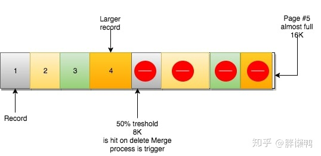

[TOC]

# 索引的常见模型

## 哈希表

哈希的思路很简单，把值放在数组里，用一个哈希函数把 key 换算成一个确定的位置，然后把 value 放在数组的这个位置。不可避免地，多个 key 值经过哈希函数的换算，会出现同一个值的情况。处理这种情况的一种方法是，拉出一个链表。

所以，哈希表这种结构适用于**只有等值查询的场景，**比如 Memcached 及其他一些 NoSQL 引擎。

**在哈希表上只能做单个key的查找，不适宜做范围查找。**

## 有序数组

根据身份证号查名字的例子，假设身份证号没有重复，这个数组就是按照身份证号递增的顺序保存的。

这时候如果你要查 ID_card_n2 对应的名字，用二分法就可以快速得到，这个时间复杂度是 O(log(N))。

这个索引结构支持范围查询。你要查身份证号在[ID_card_X, ID_card_Y]区间的 User，可以先用二分法找到 ID_card_X（如果不存在 ID_card_X，就找到大于 ID_card_X 的第一个 User），然后向右遍历，直到查到第一个大于 ID_card_Y 的身份证号，退出循环。

**但是，在需要更新数据的时候就麻烦了，你往中间插入一个记录就必须得挪动后面所有的记录，成本太高。所以，有序数组索引只适用于静态存储引擎，**

## 搜索树

二叉搜索树的特点是：父节点左子树所有结点的值小于父节点的值，右子树所有结点的值大于父节点的值。这样如果你要查 ID_card_n2 的话，按照图中的搜索顺序就是按照 UserA -> UserC -> UserF -> User2 这个路径得到。这个时间复杂度是 O(log(N))。

当然为了维持 O(log(N)) 的查询复杂度，就需要保持这棵树是平衡二叉树。为了做这个保证，更新的时间复杂度也是 O(log(N))。

树可以有二叉，也可以有多叉。多叉树就是每个节点有多个儿子，儿子之间的大小保证从左到右递增。二叉树是搜索效率最高的，但是实际上大多数的数据库存储却并不使用二叉树。其原因是，索引不止存在内存中，还要写到磁盘上。

可以想象一下一棵 100 万节点的平衡二叉树，树高 20。一次查询可能需要访问 20 个数据块。在机械硬盘时代，从磁盘随机读一个数据块需要 10 ms 左右的寻址时间。

也就是说，对于一个 100 万行的表，如果使用二叉树来存储，单独访问一个行可能需要 20 个 10 ms 的时间，这个查询可真够慢的。为了让一个查询尽量少地读磁盘，就必须让查询过程访问尽量少的数据块。

那么，我们就不应该使用二叉树，而是要使用“N 叉”树。这里，“N 叉”树中的“N”取决于数据块的大小。

# InnoDB 的索引模型

每一个索引在 InnoDB 里面对应一棵 B+ 树。

根据叶子节点的内容，索引类型分为主键索引和非主键索引。


- 主键索引的叶子节点存的是整行数据。在 InnoDB 里，主键索引也被称为聚簇索引（clustered index）。即主键查询方式，则只需要搜索 ID 这棵 B+ 树；
- 非主键索引的叶子节点内容是主键的值。在 InnoDB 里，非主键索引也被称为二级索引（secondary index）。即普通索引查询方式，则需要先搜索 k 索引树，得到 ID 的值为 500，再到 ID 索引树搜索一次。这个过程称为回表。

# 索引结构

## 文件表（File-Table）结构

创建了一个`windmills`库（schema）和`wmills`表。在文件目录（通常是`/var/lib/mysql/`）你会看到以下内容：

```text
data/
  windmills/
      wmills.ibd
      wmills.frm
```

MySQL 5.6版本开始`innodb_file_per_table`参数默认设置为1。该配置下你的每一个表都会单独作为一个文件存储（如果有分区也可能有多个文件）。

目录下要注意的是这个叫`wmills.ibd`的文件。**这个文件由多个段（segments）组成，每个段和一个索引相关。**

文件的结构是不会随着数据行的删除而变化的，但段则会跟着构成它的更小一级单位——区的变化而变化。区仅存在于段内，并且每个区都是固定的1MB大小（页体积默认的情况下）。页则是区的下一级构成单位，默认体积为16KB。

按这样算，**一个区可以容纳最多64个页**，一个页可以容纳2-N个行。行的数量取决于它的大小，由你的表结构定义。InnoDB要求页至少要有两个行，因此可以算出行的大小最多为8000 bytes。


## 根，分支与叶子


所有的B树都有着一个入口，也就是根节点，在上图中#3就是根节点。根节点（页）包含了如索引ID、INodes数量等信息。INode页包含了关于页本身的信息、值的范围等。最后还有叶子节点，也就是我们数据实际所在的位置。在示例中，我们可以看到叶子节点#5有57行记录，共7524 bytes。在这行信息后是具体的记录，可以看到数据行内容。

这里想引出的概念是当你使用InnoDB管理表和行，InnoDB会将他们会以分支、页和记录的形式组织起来。**InnoDB不是按行的来操作的，它可操作的最小粒度是页，页加载进内存后才会通过扫描页来获取行/记录(页里面是有序的，使用二分法查找)。**

## 页的内部原理

除了性能外，页分裂操作还影响数据页的利用率。原本放在一个页的数据，现在分到两个页中，整体空间利用率降低大约 50%。当然有分裂就有合并。当相邻两个页由于删除了数据，利用率很低之后，会将数据页做合并。合并的过程，可以认为是分裂过程的逆过程。

- 自增主键的插入数据模式，正符合了我们前面提到的递增插入的场景。每次插入一条新记录，都是追加操作，都不涉及到挪动其他记录，也不会触发叶子节点的分裂。
- 而有业务逻辑的字段做主键，则往往不容易保证有序插入，这样写数据成本相对较高。

页可以空或者填充满（100%），**行记录会按照主键顺序来排列**。例如在使用`AUTO_INCREMENT`时，你会有顺序的ID 1、2、3、4等。


页还有另一个重要的属性：`MERGE_THRESHOLD`。该参数的默认值是50%页的大小，它在InnoDB的合并操作中扮演了很重要的角色。

当你插入数据时，如果数据（大小）能够放的进页中的话，那他们是按顺序将页填满的。若当前页满，则下一行记录会被插入下一页（NEXT）中。

根据B树的特性，它可以自顶向下遍历，但也可以在各叶子节点水平遍历。因为每个叶子节点都有着一个指向包含下一条（顺序）记录的页的指针。

## 页合并

当你删了一行记录时，实际上记录并没有被物理删除，记录被标记（flaged）为删除并且它的空间变得允许被其他记录声明使用。



当页中删除的记录达到`MERGE_THRESHOLD`（默认页体积的50%），InnoDB会开始寻找最靠近的页（前或后）看看是否可以将两个页合并以优化空间使用。

## 页分裂

页可能填充至100%，在页填满了之后，下一页会继续接管新的记录。但如果有下面这种情况呢？

页#10没有足够空间去容纳新（或更新）的记录。


根据“下一页”的逻辑，记录应该由页#11负责。然而页#11也同样满了，数据也不可能不按顺序地插入。怎么办？


**InnoDB的做法是（简化版）：**

1. 创建新页
2. 判断当前页（页#10）可以从哪里进行分裂（记录行层面）
3. 移动记录行
4. 重新定义页之间的关系

页#11保持原样，只有页之间的关系发生了改变：

- 页#10相邻的前一页为页#9，后一页为页#12
- 页#12相邻的前一页为页#10，后一页为页#11
- 页#11相邻的前一页为页#12，后一页为页#13

（译注：页#13可能本来就有，这里意思为页#10与页#11之间插入了页#12）

**这样B树水平方向的一致性仍然满足，因为满足原定的顺序排列逻辑。然而从物理存储上讲页是乱序的，而且大概率会落到不同的区。**

**页分裂会发生在插入或更新，并且造成页的错位（dislocation，落入不同的区）**

- 一旦创建分裂的页，将原先顺序恢复的办法就是新分裂出来的页因为低于合并阈值（merge threshold）被删掉。这时候InnoDB用页合并将数据合并回来。
- 就是用`OPTIMIZE`重新整理表。这可能是个很重量级和耗时的过程，但可能是唯一将大量分布在不同区的页理顺的方法。

**在合并和分裂的过程，InnoDB会在索引树上加写锁**。在操作频繁的系统中这可能会是个隐患。它可能会导致索引的锁争用。如果表中没有合并和分裂（也就是写操作）的操作，称为“乐观”更新，只需要使用读锁。

# 索引维护

B+ 树为了维护索引有序性，在插入新值的时候需要做必要的维护。以上面这个图为例，如果插入新的行 ID 值为 700，则只需要在 R5 的记录后面插入一个新记录。如果新插入的 ID 值为 400，就相对麻烦了，需要逻辑上挪动后面的数据，空出位置。

而更糟的情况是，如果 R5 所在的数据页已经满了，根据 B+ 树的算法，这时候需要申请一个新的数据页，然后挪动部分数据过去。这个过程称为页分裂。在这种情况下，性能自然会受影响。

除了性能外，页分裂操作还影响数据页的利用率。原本放在一个页的数据，现在分到两个页中，整体空间利用率降低大约 50%。

## 自增主键的插入

**也就是说，自增主键的插入数据模式，正符合了我们前面提到的递增插入的场景。每次插入一条新记录，都是追加操作，都不涉及到挪动其他记录，也不会触发叶子节点的分裂。**而有业务逻辑的字段做主键，则往往不容易保证有序插入，这样写数据成本相对较高。

## 存储空间

**除了考虑性能外，我们还可以从存储空间的角度来看。假设你的表中确实有一个唯一字段，比如字符串类型的身份证号，那应该用身份证号做主键，还是用自增字段做主键呢？**

由于每个非主键索引的叶子节点上都是主键的值。如果用身份证号做主键，那么每个二级索引的叶子节点占用约 20 个字节，而如果用整型做主键，则只要 4 个字节，如果是长整型（bigint）则是 8 个字节。**显然，主键长度越小，普通索引的叶子节点就越小，普通索引占用的空间也就越小。所以，从性能和存储空间方面考量，自增主键往往是更合理的选择。**

## 业务字段直接做主键

有没有什么场景适合用业务字段直接做主键的呢？还是有的。比如，有些业务的场景需求是这样的：

只有一个索引；该索引必须是唯一索引。你一定看出来了，这就是典型的 KV 场景。由于没有其他索引，所以也就**不用考虑其他索引的叶子节点大小的问题。**这时候我们就要优先考虑上一段提到的“**尽量使用主键查询**”原则，直接将这个索引设置为主键，**可以避免每次查询需要搜索两棵树。**

# select * from T where k between 3 and 5

```java
mysql> create table T (
ID int primary key,
k int NOT NULL DEFAULT 0, 
s varchar(16) NOT NULL DEFAULT '',
index k(k))
engine=InnoDB;

insert into T values(100,1, 'aa'),(200,2,'bb'),(300,3,'cc'),(500,5,'ee'),(600,6,'ff'),(700,7,'gg');
```

.png)

这条 SQL 查询语句的执行流程：

1. 在 k 索引树上找到 k=3 的记录，取得 ID = 300；
2. 再到 ID 索引树查到 ID=300 对应的 R3；
3. 在 k 索引树取下一个值 k=5，取得 ID=500；
4. 再回到 ID 索引树查到 ID=500 对应的 R4；
5. 在 k 索引树取下一个值 k=6，不满足条件，循环结束。

在这个过程中，这个查询过程读了 k 索引树的 3 条记录（步骤 1、3 和 5，通过一次查找找到开始位置之后，继续往后遍历即可。回表次数二者一致），回表了两次（步骤 2 和 4）。在这个例子中，由于查询结果所需要的数据只在主键索引上有，所以不得不回表。那么，有没有可能经过索引优化，避免回表过程呢？

# 覆盖索引

如果执行的语句是 select ID from T where k between 3 and 5，这时只需要查 ID 的值，而 ID 的值已经在 k 索引树上了，因此可以直接提供查询结果，不需要回表。也就是说，在这个查询里面，索引 k 已经“覆盖了”我们的查询需求，我们称为覆盖索引。

**由于覆盖索引可以减少树的搜索次数，显著提升查询性能，所以使用覆盖索引是一个常用的性能优化手段。**

在引擎内部使用覆盖索引在索引 k 上其实读了三个记录，R3~R5（对应的索引 k 上的记录项），但是对于 MySQL 的 Server 层来说，它就是找引擎拿到了两条记录，因此 MySQL 认为扫描行数是 2。

## 在一个市民信息表上，是否有必要将身份证号和名字建立联合索引？

如果现在有一个高频请求，要根据市民的身份证号查询他的姓名，这个联合索引就有意义了。它可以在这个高频请求上用到覆盖索引，不再需要回表查整行记录，减少语句的执行时间。

# 最左前缀原则


只要满足最左前缀，就可以利用索引来加速检索。这个最左前缀可以是联合索引的最左 N 个字段，也可以是字符串索引的最左 M 个字符。

# 索引下推

我们还是以市民表的联合索引（name, age）为例。如果现在有一个需求：检索出表中“名字第一个字是张，而且年龄是 10 岁的所有男孩”。那么，SQL 语句是这么写的：

```java
mysql> select * from tuser where name like '张%' and age=10 and ismale=1;
```

在 MySQL 5.6 之前，只能从 ID3 开始一个个回表。到主键索引上找出数据行，再对比字段值。

而 MySQL 5.6 引入的索引下推优化（index condition pushdown)， 可以在索引遍历过程中，对索引中包含的字段先做判断，直接过滤掉不满足条件的记录，减少回表次数。InnoDB 在 (name,age) 索引内部就判断了 age 是否等于 10，对于不等于 10 的记录，直接判断并跳过。在我们的这个例子中，只需要对 ID4、ID5 这两条记录回表取数据判断，就只需要回表 2 次

# 疑问

```java
CREATE TABLE `geek` (
  `a` int(11) NOT NULL,
  `b` int(11) NOT NULL,
  `c` int(11) NOT NULL,
  `d` int(11) NOT NULL,
  PRIMARY KEY (`a`,`b`),
  KEY `c` (`c`),
  KEY `ca` (`c`,`a`),
  KEY `cb` (`c`,`b`)
) ENGINE=InnoDB;

//为什么要创建“ca”“cb”这两个索引？同事告诉他，是因为他们的业务里面有这样的两种语句：
select * from geek where c=N order by a limit 1;
select * from geek where c=N order by b limit 1;
```

为了这两个查询模式，这两个索引是否都是必须的？为什么呢？																				

主键 a，b 的聚簇索引组织顺序相当于 order by a,b ，也就是先按 a 排序，再按 b 排序，c 无序。

索引 ca 的组织是先按 c 排序，再按 a 排序，同时记录主键

所以，结论是 ca 可以去掉，cb 需要保留。