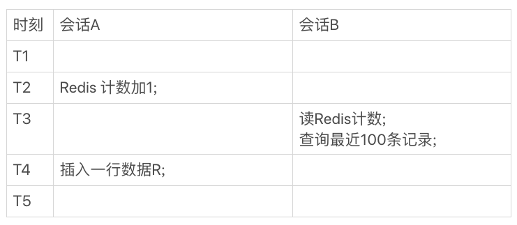
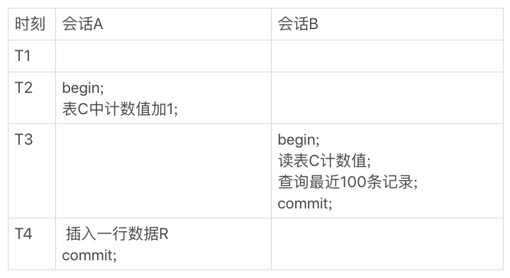

[TOC]

# count(*) 的实现方式

- MyISAM 引擎把一个表的总行数存在了磁盘上，因此执行 count(*) 的时候会直接返回这个数，效率很高。讨论的是没有过滤条件的 count(*)，如果加了 where 条件的话，MyISAM 表也是不能返回得这么快的。
- 而 InnoDB 引擎执行 count(*) 的时候，需要把数据一行一行地从引擎里面读出来，然后累积计数。

**那为什么 InnoDB 不跟 MyISAM 一样，也把数字存起来呢？**

这是因为即使是在同一个时刻的多个查询，由于多版本并发控制（MVCC）的原因，InnoDB 表“应该返回多少行”也是不确定的。

普通索引树比主键索引树小很多。对于 count(*) 这样的操作，遍历哪个索引树得到的结果逻辑上都是一样的。因此，MySQL 优化器会找到最小的那棵树来遍历。**在保证逻辑正确的前提下，尽量减少扫描的数据量**，是数据库系统设计的通用法则之一。

# show table status

show table status 这个命令的输出结果里面也有一个 TABLE_ROWS 用于显示这个表当前有多少行。

索引统计的值是通过采样来估算的。实际上，TABLE_ROWS 就是从这个采样估算得来的，因此它也很不准。官方文档说误差可能达到 40% 到 50%。所以，**show table status 命令显示的行数也不能直接使用。**

- MyISAM 表虽然 count(*) 很快，但是不支持事务。*
- *show table status 命令虽然返回很快，但是不准确。*
- InnoDB 表直接 count(*) 会遍历全表，虽然结果准确，但会导致性能问题。

只能自己计数。

# 用缓存系统保存计数

Redis 的数据不能永久地留在内存里，所以得找一个地方把这个值定期地持久化存储起来。

如果刚刚在数据表中插入了一行，Redis 中保存的值也加了 1，然后 Redis 异常重启了，重启后要从存储 redis 数据的地方把这个值读回来，而刚刚加 1 的这个计数操作却丢失了。

解决办法：

Redis 异常重启以后，到数据库里面单独执行一次 count(*) 获取真实的行数，再把这个值写回到 Redis 里就可以了。异常重启毕竟不是经常出现的情况，这一次全表扫描的成本，还是可以接受的。

将计数保存在缓存系统中的方式，还不只是丢失更新的问题。即使 Redis 正常工作，这个值还是逻辑上不精确的。

设想一下有这么一个页面，要显示操作记录的总数，同时还要显示最近操作的 100 条记录。那么，这个页面的逻辑就需要先到 Redis 里面取出计数，再到数据表里面取数据记录。

1. 一种是，查到的 100 行结果里面有最新插入记录，而 Redis 的计数里还没加 1。
2. 另一种是，查到的 100 行结果里没有最新插入的记录，而 Redis 的计数里已经加了 1。

在 T3 时刻会话 B 来查询的时候，会显示出新插入的 R 这个记录，但是 Redis 的计数还没加 1。这时候，就会出现数据不一致。

在 T3 时刻查询的时候，Redis 计数加了 1 了，但还查不到新插入的 R 这一行，也是数据不一致的情况。

# 在数据库保存计数

把这个计数直接放到数据库里单独的一张计数表 C 中，又会怎么样呢？

首先，这解决了崩溃丢失的问题，InnoDB 是支持崩溃恢复不丢数据的。

会话 B 看到的结果里， 查计数值和“最近 100 条记录”看到的结果，逻辑上就是一致的。

# 不同的 count 用法

count(*)、count(主键 id) 和 count(1) 都表示返回满足条件的结果集的总行数。

而 count(字段），则表示返回满足条件的数据行里面，参数“字段”不为 NULL 的总个数。

## count(主键 id)

InnoDB 引擎会遍历整张表，把每一行的 id 值都取出来，返回给 server 层。server 层拿到 id 后，判断是不可能为空的，就按行累加。

## count(1)

InnoDB 引擎遍历整张表，但不取值。server 层对于返回的每一行，放一个数字“1”进去，判断是不可能为空的，按行累加。

单看这两个用法的差别的话，你能对比出来，count(1) 执行得要比 count(主键 id) 快。因为从引擎返回 id 会涉及到解析数据行，以及拷贝字段值的操作。

## count(字段)

1. 如果这个“字段”是定义为 not null 的话，一行行地从记录里面读出这个字段，判断不能为 null，按行累加。
2. 如果这个“字段”定义允许为 null，那么执行的时候，判断到有可能是 null，还要把值取出来再判断一下，不是 null 才累加。

## count(*)

并不会把全部字段取出来，而是专门做了优化，不取值。count(*) 肯定不是 null，按行累加。

按照效率排序的话，count(字段)<count(主键 id)<count(1)≈count(*)，所以我建议你，尽量使用 count(\*)。

# 提问

由于事务可以保证中间结果不被别的事务读到，因此修改计数值和插入新记录的顺序是不影响逻辑结果的。但是，从并发系统性能的角度考虑，你觉得在这个事务序列里，应该先插入操作记录，还是应该先更新计数表呢？

应该先插入操作记录，再更新计数表。

因为更新计数表涉及到行锁的竞争，先插入再更新**能最大程度地减少了事务之间的锁等待，提升了并发度。**