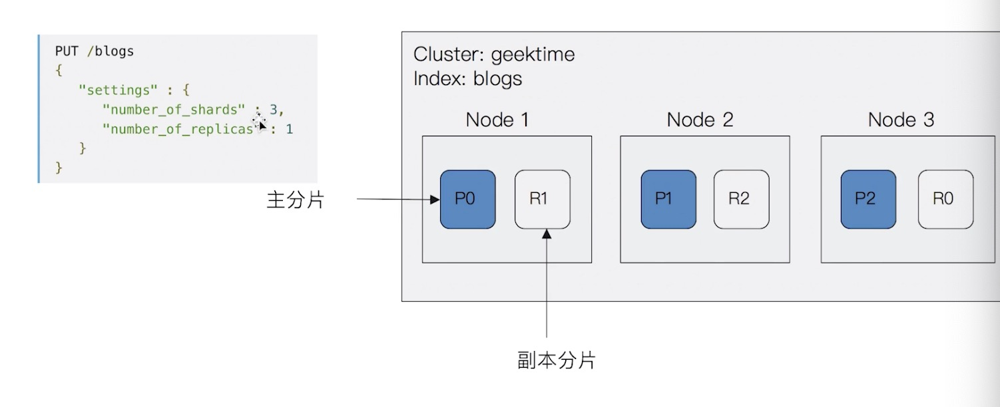
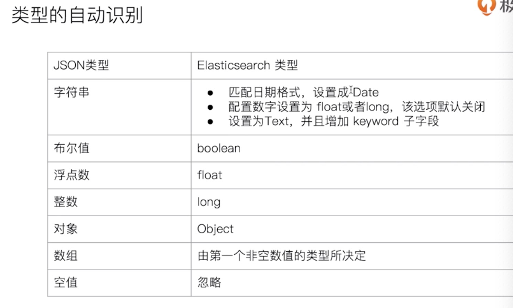
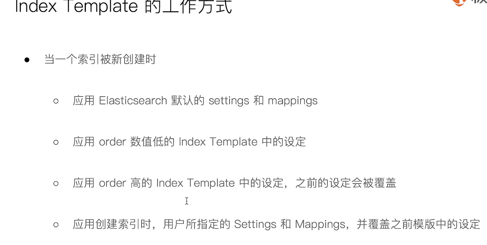

[TOC]

# 基本配置与使用

## ES基本使用

- ./bin/elasticsearch 启动
- ./bin/elasticsearch-plugin list 插件列表
- ./bin/elasticsearch-plugin install analysis-icu 安装国际分词器
- http://localhost:9200/_cat/plugins 查看成功安装在集群上的插件

### 以集群的方式运行

./elasticsearch -E node.name=node0 -E cluster.name=xbb -E path.data=node0_data -d

./elasticsearch -E node.name=node1 -E cluster.name=xbb -E path.data=node1_data -d

./elasticsearch -E node.name=node2 -E cluster.name=xbb -E path.data=node2_data -d

./elasticsearch -E node.name=node3 -E cluster.name=xbb -E path.data=node3_data -d

> http://localhost:9200/_cat/nodes:
>
> ```
> 127.0.0.1 56 99 11 2.53   dilmrt - node2
> 127.0.0.1 35 99 11 2.53   dilmrt - node3
> 127.0.0.1 10 99 11 2.53   dilmrt * node0
> 127.0.0.1 52 99 11 2.53   dilmrt - node1
> ```

> http://localhost:9200/_cat/plugins
>
> ```
> node2 analysis-icu 7.8.1
> node3 analysis-icu 7.8.1
> node0 analysis-icu 7.8.1
> node1 analysis-icu 7.8.1
> ```

## kibana基本使用

- dashboard

- dev tools 

  > 可执行ES API
  >
  > 例如 GET /_cat/plugins

## cerebro基本使用

查看ES集群状态等

## logstash基本使用

./logstash -f logstash.conf

# 基本概念

## 文档

- ES是面向文档的，文档是所有可搜索数据的最小单位。

  > 如日志文件的日志项

- 文档会被序列化成JSON格式保存在ES中

  > JSON是由字段组成，每个字段都有对应的类型。
  >
  > 字符串，数值，布尔，日期，二进制，范围类型

- 每个文档都有Unique ID

  > 可自己指定或ES自动生成

### 文档元数据

用于标注文档的相关信息

```java
{
  "_index":"xbb",//文档索引名
  "_type":"_doc",//文档类型名
  "_id":"1",//文档唯一ID
  "_score":14.56789,//相关性打分，本次查询的具体算分
  "_source":{
    ...  //文档原始JSON数据
  }，
  "_all":{
    ...  //整合所有的数据在此，已被废弃
  }
  "_version":"1,//文档版本信息，并发读写时可解决文档冲突问题
}
```

## 索引

Index - 索引是文档的容器，是一类文档的结合。

- Mapping定义文档字段的类型
- Setting定义不同的数据分布，指定用多少的分片，数据是怎样分布的。

### 抽象与类比

| DB     | ES       |
| ------ | -------- |
| TABLE  | Index    |
| Row    | Document |
| Column | Field    |
| Schema | Mapping  |
| SQL    | DSL3     |

## 节点

- 每个节点启动后默认是一个mater eligible节点

  >  可以设置node.master:false禁止

- 当一个节点启动时它会把自己选举成为master节点

- 每个节点都保存了集群的状态信息，只要Master节点才能修改集群的状态信息

  >- 所有的节点信息
  >- 所有的索引和其相关的Mapping和Setting信息
  >- 分片的路由信息

### 主要节点类型

- Data Node

  可以保存数据的节点，负责保存分片数据

- Coordinating Node

  负责接收客户端的请求并分发给其他节点，最终将结果汇总在一起。每个节点都默认起到了Coordinating Node的指责

## 分片

- 主分片用来解决数据水平扩展的问题，通过主分片可以将数据分布在集群内所有节点上。
  1. 一个分片是一个运行的Lucene实例
  2. 主分片数在索引创建时指定，后续不允许修改，除非reindex
- 副本，用于解决高可用问题，是主分片的拷贝
  1. 副本分片数可以动态调整



### 查看集群健康状态

GET _cluster/health

- GREEN 主分片与副本都正常分配
- YELLOW 主分片正常分配，有副本分配未能正常分配
- RED 有主分片未能正常分配

## CRUD 

```java
//通过index方式创建，自动生成ID
POST users/_doc
{
  "user":"Mike",
  "post_date" : "2020-08-06T12:17:00",
  "message" : "just practise"
}
//通过create方式创建，指定Id,如果id已经存在，报错
PUT users/_doc/1?op_type=create
{
    "user" : "Jack",
    "post_date" : "2019-05-15T14:12:12",
    "message" : "trying out Elasticsearch"
}
//同上，通过create方式创建，指定Id,如果id已经存在，报错
PUT users/_create/1
{
    "user" : "Jack",
    "post_date" : "2019-05-15T14:12:12",
    "message" : "trying out Elasticsearch"
}
//通过ID获取文档
GET users/_doc/1
//删除原来的文档，添加新的
PUT users/_doc/1
{
    "user" : "Jack"
}
//在原文档上增加字段
POST users/_update/1
{
  "doc":{
    "post_date" : "2019-05-15T14:12:12",
    "message" : "trying out Elasticsearch"
  }
}
//通过ID删除文档
DELETE users/_doc/1
//批量操作文档  
POST _bulk
{"index":{"_index":"test", "_id":1}}
{"filed1":"value1"}
{"delete":{"_index":"test", "_id":2}}
{"create":{"_index":"test2","_id":3}}
{"field1":"value1"}
{"update":{"_index":"test2","_id":3}}
{"doc":{"field3":"value3"}}
//批量通过ID获取文档  
GET /_mget
{
  "docs":[
    {
      "_index":"test",
    "_id":1
    },
    {
      "_index":"test2",
    "_id":3
    }
    ]
}
//批量通过ID获取test下的文档 
GET /test/_mget
{
  "docs":[
    {
    "_id":1
    },
    {
    "_id":3
    }
    ]
}
//批量通过ID获取文档，并查看知道field的原数据
GET /_mget
{
  "docs":[
    {
       "_index" : "test",
        "_id" : "1",
        "_source" : false
    },
    {
       "_index" : "test2",
        "_id" : "3",
        "_source" : ["field1", "field3"]
    },
    {
      "_index":"test2",
      "_id":"3",
      "_source":{
        "include":["user"],
        "exclude":["user.location"]
      }
    }
  ]
}
//mget 是通过文档ID列表得到文档信息，msearch 是根据查询条件，搜索到相应文档。
POST movies/_msearch
{}
{"query":{"match_all":{}}, "size":10}
{"index" : "movies"}
{"query" : {"match_all" : {}},"size":2}
```

## 倒排索引

- 单词词典

  记录所有文档的单词，记录单词到倒排列表的关系，数量庞大，可通过B+数和哈希拉链发法实现

- 倒排列表(posting list)

  记录了单词对应的文档结合，由倒排索引项（posting）组成：

  - 文档ID
  - 词频 单词出现的次数，用于相关性打分
  - 位置 在文档中分词的位置，用于搜索
  - 偏移 记录单词的开始结束为位置，用于高亮显示

| 文档ID | 文档内容   |
| ------ | ---------- |
| 1      | xbb spiko  |
| 2      | xbb lalala |
| 3      | kkk xbb    |

**xbb**:

| 文档ID | TF   | Position | Offset |
| ------ | ---- | -------- | ------ |
| 1      | 1    | 0        | <0,4>  |
| 2      | 1    | 0        | <0,4>  |
| 3      | 1    | 1        | <4,8>  |

​                                                                      **posting list**

ES的Json文档的每个字段都有自己的倒排索引，可以在mapping指定某些字段不做索引

## Analysis和Analyzer

Analysis即分词过程

### Analyzer（分词器）的组成

- character filter 针对原始文本处理，如去除html
- tokenizer 按照规则切分单词
- token filter 对切分的单词进行加工，小写，删除停用词(stopwords 如in,the等)，增加同义词

### 常用分词器 

- standard analyzer

  > tokenizer 
  >
  > - standard 按词切分 
  >
  > token filter
  >
  > - standard 
  > - lower case 小写处理
  > - stop(默认关闭)

- simple analyzer

  > tokenizer 
  >
  > - lower case 按照非字母切分（非字母的会被去除），小写处理 

- whitespace analyzer

  > tokenizer 
  >
  > - whitespace 按照空格切分

- stop analyzer

  > tokenizer 
  >
  > - lower case 按照非字母切分（非字母的会被去除），小写处理 
  >
  > token filter
  >
  > - stop 相比simple analyzer多了stop filter，会去掉the,a等修饰词

- keyword analyzer

  > tokenizer 
  >
  > - keyword 不分词

- pattern analyzer

  > tokenizer 
  >
  > - Pattern 通过正则表达式进行分词，默认是\W+，非字母的符号进行分词
  >
  > token filter
  >
  > - lowercase 
  > - stop(默认关闭)

- language analyzers 各语言的分词器如 English analyzer

### api

> Get _analyze
> {
>    "analyzer": "icu_analyzer ",
>   "text": "熊爸爸是个大美人"
> }

# search API

- URI模式

  ```java
  //q指定查询字符串
  GET movies/_search?q=title:Bulworth 
  
  GET mov*/_search?q=title:Bulworth
    
  //对集群上所有索引进行查询
  GET _all/_search?q=title:Bulworth  GET /_search?q=title:Bulworth 
  ```

- Request Body模式 （DSL语句）

  ```java
  POST movies/_search
  {
    "query": {"match_all": {}},
    "size": 1
  }
  ```

  ## 衡量相关性

  - Precision（查准率）---尽可能返回较少的无关文档
  - Recall（查全率）---尽可能返回较多的相关文档
  - Ranking ---是否能根据相关度排序

  

  Precision = True Positive /  (True Positive +  False Positive)

  Recall = True Positive /  (True Positive +  True Negatives)

## URI Search

- GET /movies/_search?q=2012&df=title&sort=year:desc&from=0&size=10&timeout=1s

  > q指定查询语句，使用query String syntax
  >
  > df查询字段 不指定时会对所有字段进行查询
  >
  > sort排序
  >
  >  from size 进行分页
  >
  > profile可以查看查询是如何执行的

- GET /movies/_search?q=2012&df=title

  > "type" : "TermQuery"
  >
  >  "description" : "title:2012"

- GET /movies/_search?q=2012

  >  "type" : "DisjunctionMaxQuery",
  > "description" : "(title.keyword:2012 | id.keyword:2012 | year:[2012 TO 2012] | genre:2012 | @version:2012 | @version.keyword:2012 | id:2012 | genre.keyword:2012 | title:2012)"
  >
  > **每一个children query就是相应的TermQuery**

- GET /movies/_search?q=title:Beautiful Mind

  >  "type" : "BooleanQuery",
  >  "description" : """title:beautiful (title.keyword:Mind | id.keyword:Mind | MatchNoDocsQuery("failed [year] query, caused by number_format_exception:[For input string: "Mind"]") | genre:mind | @version:mind | @version.keyword:Mind | id:mind | genre.keyword:Mind | title:mind)""",

- GET /movies/_search?q=title:"Beautiful Mind"

  >  "type" : "PhraseQuery",
  > "description" : """title:"beautiful mind"""",

- GET /movies/_search?q=title:(Beautiful Mind)

  同 GET /movies/_search?q=title:(+Beautiful +Mind)

  >   "type" : "BooleanQuery"
  >
  >   "description" : "title:beautiful title:mind",

- GET /movies/_search?q=title:(Beautiful AND Mind)

  **AND等一定要大写**

  >  "type" : "BooleanQuery",
  > "description" : "+title:beautiful +title:mind",

- GET /movies/_search?q=title:(Beautiful NOT Mind)

  同 GET /movies/_search?q=title:(Beautiful -Mind)

  **分组：+must   -must not** 

  > "type" : "BooleanQuery",
  > "description" : "title:beautiful -title:mind",

- GET /movies/_search?q=title:(Beautiful %2BMind)

  > "type" : "BooleanQuery",
  >  "description" : "title:beautiful +title:mind",

- GET /movies/_search?q=title:beautiful AND year:[2002 TO 2018%7D

  > "type" : "BooleanQuery",
  >  "description" : "+title:beautiful +year:[2002 TO 2017]",

- GET /movies/_search?q=title:b*

  > "type" : "MultiTermQueryConstantScoreWrapper",
  > "description" : "title:b*",

- GET /movies/_search?q=title:beautifua~1

  >"type" : "BoostQuery",
  >"description" : "(title:beautiful)^0.8888889",

- GET /movies/_search?q=title:"Lord the Rings"~1

  >  "type" : "PhraseQuery",
  >   "description" : """title:"lord the rings"~1""",

## Request Body Search

### Match

- #ignore_unavailable=true，可以忽略尝试访问不存在的索引“404_idx”导致的报错

  #查询movies分页
  POST /movies,404_idx/_search?ignore_unavailable=true
  {
    "profile": true,
  	"query": {
  		"match_all": {}
  	}
  }

  默认从0开始，返回10条结果

  > "type" : "MatchAllDocsQuery",
  >   "description" : "*:*",

- POST /kibana_sample_data_ecommerce/_search
  {
    "from":10,
    "size":20,
    "query":{
      "match_all": {}
    }
  }

- #对日期排序

  POST movies/_search
  {
     "profile": true,
    "sort":[{"year":"desc"}],
    "query":{
      "match_all": {}
    }

  }

- #source filtering
  POST movies/__search
  {
    "_source":["year"],
    "query":{
      "match_all": {}
    }
  }

  可使用通配符"_source":["year","titl*"],

- #脚本字段 拼接
  GET movies/_search
  {
    "script_fields": {
      "lalala": {
        "script": {
          "lang": "painless",
          "source": "doc['year'].value+'hello'"
        }
      }
    },
    "query": {
      "match_all": {}
    }
  }

- POST movies/_search
  {
    "profile": true,
    "query": {
      "match": {
        "title": "last christmas"
      }
    }
  }

  >   "type" : "BooleanQuery",
  > "description" : "title:last title:christmas",

- POST movies/_search
  {
    "profile": true,
    "query": {
      "match": {
        "title": {
          "query": "last christmas",
          "operator": "and"
        }
      }
    }
  }

  >  "type" : "BooleanQuery",
  >  "description" : "+title:last +title:christmas",

### Match Phrase

- POST movies/_search
  {
    "query": {
      "match_phrase": {
        "title": {
          "query": "Nightmare Street",
          "slop": 2
        }
      }
    }
  }

  slop代表中间可以有其他的字符进入

### Query String 

和URI Search类似

- POST movies/_search
  {
    "query": {
      "query_string": {
        "default_field": "title",
        "query": "Six Days Seven NOT Nights"
      }
    }
  }

- POST movies/_search
  {
    "query": {
      "query_string": {
        "fields": ["title","genre"], 
        "query": "Six Days Seven NOT Nights"
      }
    }
  }

  指定多个field

### Simple Query String 

1. 类似Query String ，但是会忽略错误语法
2. 不支持NOT AND OR，会被当作字符串处理，默认是OR，需指定operator
3. 支持+ - |

- POST movies/_search
  {
    "profile": "true", 
    "query": {
      "simple_query_string": {
        "query": "Six AND Days AND  Nights ",
        "fields": ["title"]
      }
    }
  }

  >  "type" : "BooleanQuery",
  >  "description" : "title:nights title:days title:six (title:and)^2
  >
  > 由于Simple Query 默认的operator是 Or，且不支持NOT AND OR，需要转换成如下：

  POST movies/_search
  {
    "query": {
      "simple_query_string": {
        "query": "Six Days Nights ",
        "fields": ["title"],
        "default_operator": "AND"
      }
    }
  }

  >  "type" : "BooleanQuery",
  >  "description" : "+title:six +title:days +title:nights",
  
- GET /movies/_search
  {
  	"profile":true,
  	"query":{
  		"simple_query_string":{
  			"query":"Beautiful +mind",
  			"fields":["title"]
  		}
  	}
  }

  > "type" : "BooleanQuery",
  >     "description" : "title:beautiful title:mind",

# Mapping

## Dynamic Mapping

- 在写入文档时，如果索引不存在会自动创建索引
- ES会自动根据文档信息推算字段类型



```java
//get mapping_test/_mapping 
"mappings" : {
      "properties" : {
        "firstName" : {
          "type" : "text",
          "fields" : {
            "keyword" : {
              "type" : "keyword",
              "ignore_above" : 256
            }
          }
        },
        "lastName" : {
          "type" : "text",
          "fields" : {
            "keyword" : {
              "type" : "keyword",
              "ignore_above" : 256
            }
          }
        },
        "loginDate" : {
          "type" : "date"
        }
      }
    }
  }
```

### 更改Mapping类型

- 新增字段

  1. Dynamic为true时，Mapping同时被更新（文档依旧被写入ES，新字段也被索引进去）

  2. Dynamic为false时，Mapping不会被更新，新增字段的数据无法被索引，但是信息会出现在_source中（新文档被写入ES，新字段未被索引进去）

     > PUT dynamic_mapping_test/_mapping
     > {
     >   "dynamic":false
     > }
     >
     > PUT dynamic_mapping_test/_doc/11
     > {
     >   "anotherField1":"someValue"
     > }
     >
     > //搜索不到
     >
     > get dynamic_mapping_test/_search?q=anotherField1:(someValue)

  3. Dynamic为strict时，文档写入失败（新文档未被写入ES，因此新字段更不能被索引进去）

     > PUT dynamic_mapping_test/_mapping
     > {
     >   "dynamic": "strict"
     > }
     >
     > //添加报错
     >
     > PUT dynamic_mapping_test/_doc/12
     > {
     >   "lastField":"value"
     > }

- 更新字段

  - 不可修改字段定义（倒排索引生成后不可修改，除非reindex）

## 显式Mapping设置

### 设置 index 为 false
```java
PUT users
{
    "mappings" : {
      "properties" : {
        "firstName" : {
          "type" : "text"
        },
        "lastName" : {
          "type" : "text"
        },
        "mobile" : {
          "type" : "text",
          "index": false
        }
      }
    }
}
//报错，未索引
POST /users/_search
{
  "query": {
    "match": {
      "mobile":"12345678"
    }
  }
}
```

### 设定Null_value

一切文本类型的字符串可以定义成 “text”或“keyword”两种类型。区别在于，text类型会使用默认分词器分词，当然你也可以为他指定特定的分词器。如果定义成keyword类型，那么默认就不会对其进行分词。

```java
//只有keyword类型才能设定Null_value
PUT users
{
    "mappings" : {
      "properties" : {
        "firstName" : {
          "type" : "text"
        },
        "lastName" : {
          "type" : "text"
        },
        "mobile" : {
          "type" : "keyword",
          "null_value": "NULL"
        }

      }
    }
}

PUT users/_doc/1
{
  "firstName":"Ruan",
  "lastName": "Yiming",
  "mobile": null
}
GET users/_search
{
  "query": {
    "match": {
      "mobile":"NULL"
    }
  }
}
```

### 设置 Copy to

```java
PUT users
{
  "mappings": {
    "properties": {
      "firstName":{
        "type": "text",
        "copy_to": "fullName"
      },
      "lastName":{
        "type": "text",
        "copy_to": "fullName"
      }
    }
  }
}

PUT users/_doc/1
{
  "firstName":"Ruan",
  "lastName": "Yiming"
}

GET users/_search?q=fullName:(Ruan Yiming)
//虽然_source中不显示，Mapping中有，应该是“数组”
 "fullName" : {
          "type" : "text",
          "fields" : {
            "keyword" : {
              "type" : "keyword",
              "ignore_above" : 256
            }
          }
        }
```

### 数组类型

``` java
PUT users/_doc/1
{
  "name":"twobirds",
  "interests":["reading","music"]
}
GET users/_mapping
//类型为text
 "interests" : {
          "type" : "text",
          "fields" : {
            "keyword" : {
              "type" : "keyword",
              "ignore_above" : 256
            }
          }
        },
```

# 多字段

```java
  "firstName" : {
          "type" : "text",
    //多字段定义，text类型默认有KeyWord
          "fields" : {
            "keyword" : {
              "type" : "keyword",
              "ignore_above" : 256
            }
          }
        }
```

## Exact Value && Full Text

### Exact Value

精确值，如数字，日期，具体的字符串（如“Apple Store”）

- ES 的 keyword

###  Full Text

全文本

- ES 的 text

**Exact Value不需要被分词**

# 自定义分词

### Character Filter

对文本进行处理，例如增加删除替换文本，会影响Tokenizer的position和offset信息

- Html strip

  去除Html标签

- Mapping

  字符串替换

  ```java
  POST _analyze
  {
    "tokenizer": "standard",
    "char_filter": [
        {
          "type" : "mapping",
          "mappings" : [ "- => ."]
        }
      ],
     "text": "123-456, I-test! test-990 650-555-1234"
  }
  ```

- Pattern replace

  正则匹配替换

  ```java
  GET _analyze
  {
    "tokenizer": "standard",
    "char_filter": [
        {
          "type" : "pattern_replace",
          "pattern" : "http://(.*)",
          "replacement" : "$1"
        }
      ],
      "text" : "http://www.elastic.co"
  }
  
  GET _analyze
  {
    "tokenizer": "standard",
    "char_filter": [
        {
          "type" : "pattern_replace",
          "pattern" : "h.*a"
        }
      ],
      "text" : "http://www.elastic.co"
  }
  //res:
  {
    "tokens" : [
      {
        "token" : "stic.co",
        "start_offset" : 14,
        "end_offset" : 21,
        "type" : "<ALPHANUM>",
        "position" : 0
      }
    ]
  }
  ```

### Tokenizer

按规则分词

### Token Filter

将Tokenizer生成的单词进行增删改

- Lowercase

- stop

- synonym

  添加近义词

```java
//"stop","lowercase位置互换才可去除”In“
GET _analyze
{
  "tokenizer": "whitespace",
  "filter": ["stop","lowercase"],
  "text": ["The gilrs In China are playing this game!"]
}
```

# Dynamic Template和Index Template

## Index Template

设定Mappings和Settings

- 可以设置多个模板，最终被merge在一起
- 按照order的值控制merge的过程



```java
PUT _template/template_default
{
  "index_patterns": ["*"],
  "order" : 0,
  "version": 1,
  "settings": {
    "number_of_shards": 1,
    "number_of_replicas":1
  }
}

PUT /_template/template_test
{
    "index_patterns" : ["test*"],
    "order" : 1,
    "settings" : {
    	"number_of_shards": 1,
        "number_of_replicas" : 2
    },
    "mappings" : {
    	"date_detection": false,
    	"numeric_detection": true
    }
}


```


## Dynamic Template

```java
//两个模版互换位置结果会不一样，前面的优先级高一点
//放入is*的字符串值不为“true”这种的话会抛错
PUT my_index
{
  "mappings": {
    "dynamic_templates": [
            {
        "strings_as_boolean": {
          "match_mapping_type":   "string",
          "match":"is*",
          "mapping": {
            "type": "boolean"
          }
        }
      },
      {
        "strings_as_keywords": {
          "match_mapping_type":   "string",
          "mapping": {
            "type": "keyword"
          }
        }
      }
    ]
  }
}
PUT my_index
{
  "mappings": {
    "dynamic_templates": [
      {
        "full_name": {
          "path_match":   "name.*",
          "path_unmatch": "*.middle",
          "mapping": {
            "type":       "text",
            "copy_to":    "full_name"
          }
        }
      }
    ]
  }
}
```

# 聚合分析

- Bucket Aggregation

  一些满足特定条件的文档的集合（桶）

- Metric Aggregation

  一些数学运算来进行统计分析，如最大值最小值

- Pipeline Aggregation

  对其他聚合结果的二次聚合

- Matrix Aggregation

  对多个字段操作并提供一个结果矩阵

 ## Bucket

**类似SQL的group by**

目前ES提供的Bucket类型如：**Term&Range**

```java
GET movies/_search
{
  "size": 0, 
  "aggs": {
    "year": {
      "terms": {
        "field": "year"
      }
    }
  }
}

"buckets" : [
        {
          "key" : 0,
          "doc_count" : 1078
        },
        {
          "key" : 2015,
          "doc_count" : 274
        }
  ......
  //嵌套
  GET kibana_sample_data_flights/_search
{
	"size": 0,
	"aggs":{
		"flight_dest":{
			"terms":{
				"field":"DestCountry"
			},
			"aggs":{
				"stats_price":{
					"stats":{
						"field":"AvgTicketPrice"
					}
				},
				"wather":{
				  "terms": {
				    "field": "DestWeather",
				    "size": 5
				  }
				}

			}
		}
	}
}

  
```

## Metric

基于数据集计算结果 

- 大部分Metric输出一个值：min/max/sum/avg/cardinality
- 部分输出多个数值：stats(统计数值，输出min/max/avg)等

```java
GET kibana_sample_data_flights/_search
{
	"size": 0,
	"aggs":{
		"flight_dest":{
			"terms":{
				"field":"DestCountry"
			},
			"aggs":{
				"avg_price":{
					"avg":{
						"field":"AvgTicketPrice"
					}
				},
				"max_price":{
					"max":{
						"field":"AvgTicketPrice"
					}
				},
				"min_price":{
					"min":{
						"field":"AvgTicketPrice"
					}
				}
			}
		}
	}
}

 
```

# Test

1. ES支持PUT写入文档，并自动生成文档ID

   错，POST才可自动生成ID