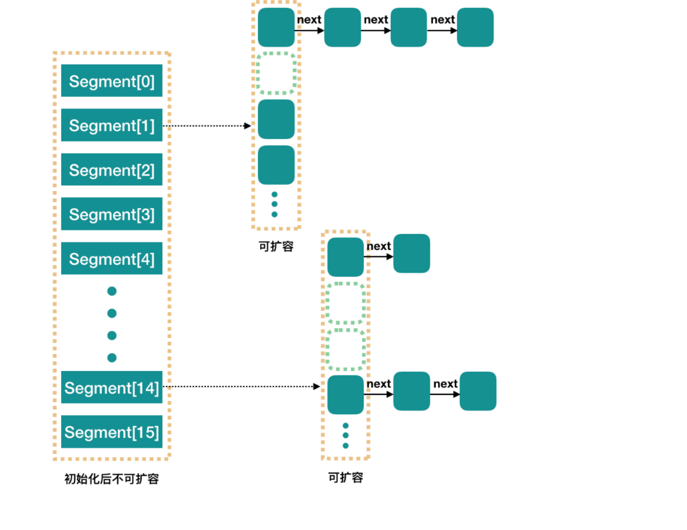
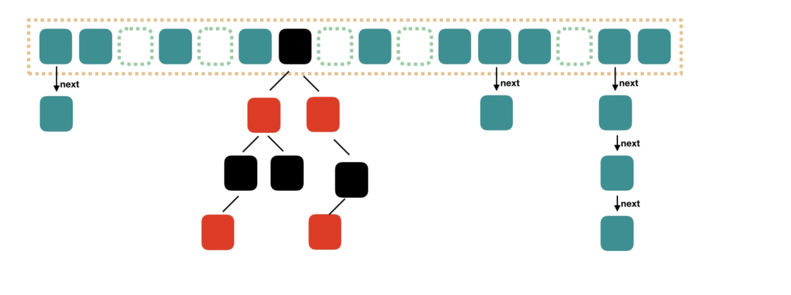

[TOC]

# jdk7

在一个实例中使用多个锁控制hashtable中不同的分段部分。在这里使用的是segment，每一个segment其实就是一个独立的小的hashtable，并且因为它继承了reentrantlock，所以每一个分段都已经拥有了锁。

结构性修改方法(比如put)会在确定分段后只锁住某一个segment，而不影响剩余段的操作。不过有一些方法存在跨段操作，比如size/containsValue等。这些方法就要**按顺序**锁住整个表来进行操作。




整个结构是一个segment数组，segment数组的大小决定了ConcurrentHashMap的并发度，默认是16。

java7的ConcurrentHashMap实现上，使用了所谓分段锁的方法，而所谓分段锁就是将记录分段存储，不同段的访问互相不影响，某个线程想要访问某一个段的时候就需要对该段上锁，而其他线程不能访问在有其他线程加锁的段，这和对整体加锁的方法相比是一种伟大的进步。

# jdk8

没有继续沿用 1.7 segment 分段锁。而是采用了 CAS + synchronized 关键字实现。整个数组的结构上在取消了 segment 之后，又和 hashMap 有了一些相似度。



## 哈希桶Table初始化

首先来看一下table是如何初始化的，初始化table的工作将发生在进行put操作时，如果发现table还没有被初始化，那么就会调用方法initTable来进行table的初始化，下面展示了初始化table的具体流程代码：

```java
private final Node<K,V>[] initTable() {
    Node<K,V>[] tab; int sc;
    while ((tab = table) == null || tab.length == 0) {
        if ((sc = sizeCtl) < 0)
            Thread.yield(); // lost initialization race; just spin
        else if (U.compareAndSwapInt(this, SIZECTL, sc, -1)) {
            try {
                if ((tab = table) == null || tab.length == 0) {
                    int n = (sc > 0) ? sc : DEFAULT_CAPACITY;
                    @SuppressWarnings("unchecked")
                    Node<K,V>[] nt = (Node<K,V>[])new Node<?,?>[n];
                    table = tab = nt;
                    sc = n - (n >>> 2);
                }
            } finally {
                sizeCtl = sc;
            }
            break;
        }
    }
    return tab;
}
```
- sizeCtl是一个用于同步多个线程的共享变量，**如果它的当前值为负数，则说明table正在被某个线程初始化或者扩容。**
- 所以，如果某个线程想要初始化table或者对table扩容，需要去竞争sizeCtl这个共享变量，获得变量的线程才有许可去进行接下来的操作，**没能获得的线程将会一直自旋来尝试获得这个共享变量，所以获得sizeCtl这个变量的线程在完成工作之后需要设置回来，使得其他的线程可以走出自旋进行接下来的操作**。

1. 当线程发现sizeCtl小于0的时候，他就会让出CPU时间，而稍后再进行尝试，当发现sizeCtl不再小于0的时候，就会通过调用方法compareAndSwapInt来讲sizeCtl共享变量变为-1，以告诉其他试图获得sizeCtl变量的线程，目前正在由本线程在享用该变量。
2. 而其他的线程在发现sizeCtl小于0的时候就会理解这种交流，他们会让出cpu时间，等待下次调度再来尝试获取sizeCtl来进行自己的工作。
3. 在完成初始化table的任务之后，线程需要将sizeCtl设置成可以使得其他线程获得变量的状态。
4. 这其中还有一个地方需要注意，**就是在某个线程通过U.compareAndSwapInt方法设置了sizeCtl之前和之后进行了两次check**，来检测table是否被初始化过了，这种检测是必须的，因为在并发环境下，可能前一个线程正在初始化table但是还没有成功初始化，也就是table依然还为null，而有一个线程发现table为null他就会进行竞争sizeCtl以进行table初始化，但是当前线程在完成初始化之后，那个试图初始化table的线程获得了sizeCtl，但是此时table已经被初始化了，所以，如果没有再次判断的话，可能会将之后进行put操作的线程的更新覆盖掉，这是极为不安全的行为。

## ConcurrentHashMap查询记录方法详解

在ConcurrentHashMap中查询一条记录首先需要知道这条记录存储的table的位置（可以成为卡槽，每个卡槽中都会有一个链表或者一棵红黑树），该位置上可能为null，如果为null，说明想要查询的记录还不存在于ConcurrentHashMap中，否则，就在该位置上的链表或者红黑树中查找记录，下面来详细分析一下ConcurrentHashMap的get方法的实现细节：

```java

    public V get(Object key) {
        Node<K,V>[] tab; Node<K,V> e, p; int n, eh; K ek;
        int h = spread(key.hashCode());
        if ((tab = table) != null && (n = tab.length) > 0 &&
            (e = tabAt(tab, (n - 1) & h)) != null) {
            if ((eh = e.hash) == h) {
                if ((ek = e.key) == key || (ek != null && key.equals(ek)))
                    return e.val;
            }
            else if (eh < 0)
                return (p = e.find(h, key)) != null ? p.val : null;
            while ((e = e.next) != null) {
                if (e.hash == h &&
                    ((ek = e.key) == key || (ek != null && key.equals(ek))))
                    return e.val;
            }
        }
        return null;
    }


```

1. 计算出记录的key的hashCode，然后通过使用(hashCode & (length - 1))的计算方法来获得该记录在table中的index。
2. 然后判断该位置上是否为null，如果为null，则返回null。
3. 否则，如果该位置上的第一个元素（链表头节点或者红黑树的根节点）与我们先要查找的记录匹配，则直接返回这个节点的值。
4. 否则，如果该节点的hashCode小于0，则说明该位置上是一颗红黑树。
5. 如果是红黑树，则通过调用Node的find方法来查找到节点，**而这个Node的find方法在子类中被重写，所以会直接调用子类的find方法来进行查找**。
6. 还有一种情况是table的index位置上为一条链表，那么就通过链表的查找方法来进行记录查找。

**至于为什么hashCode值小于0就代表是一颗红黑树而不是链表了，这就要看下面的代码了：**

```java

    static final int TREEBIN   = -2; // hash for roots of trees
    
    
        TreeBin(TreeNode<K,V> b) {
            super(TREEBIN, null, null, null);
            
             ......   
        }    


```

而TREEBIN的值为-2，也就是小于0成立，根据他的说明，TREEBIN想要代表的是一颗红黑树的根节点，所以在判断到table的某个位置上的第一个节点的hashCode值小于0的时候，就可以判断为该位置上是一棵红黑树。

**ConcurrentHashMap是一种线程安全的HashMap，但是我们没有发现在get方法的过程中使用任何与锁等效的组件来做线程同步，为什么呢？**

对于读来说，允许多个线程一起读是很正常的，而且在Node的实现上，ConcurrentHashMap做了一些手脚：

```java

    static class Node<K,V> implements Map.Entry<K,V> {
        final int hash;
        final K key;
        volatile V val;
        volatile Node<K,V> next;
   
        ....
   }
    transient volatile Node<K,V>[] table;
    
```

**我们发现table数组是被volatile关键字修饰的，这就代表我们不需要担心table数组的线程可见性问题，也就没有必要再加锁来实现并发了。**

## ConcurrentHashMap插入记录方法详解

在进行put操作的时候，我们可能会发现**table数组还没有初始化的情况，或者发现table中容纳的记录数量超过了阈值的情况，前者我们需要进行table的初始化，而后者需要我们对table进行扩容操作。**

初始化table的过程我们在上文中已经进行了分析，下面只分析table的扩容操作。

首先来考虑put一个记录需要的过程:

1. 第一，我们需要计算这个记录的key的hashCode，并且根据hashCode来计算它在table数组中应该存储的index，然后将他存放到对应位置里面的链表或者红黑树中去。
2. 并且在某些情况下要进行**链表转换红黑树的操作，以及table扩容操作等。**
3. 还有一件重要的事情就是**变更table的size。**

```java

    public V put(K key, V value) {
        return putVal(key, value, false);
    }
    
 /** Implementation for put and putIfAbsent */
    final V putVal(K key, V value, boolean onlyIfAbsent) {
        if (key == null || value == null) throw new NullPointerException();
        int hash = spread(key.hashCode());
        int binCount = 0;
        for (Node<K,V>[] tab = table;;) {
            Node<K,V> f; int n, i, fh;
            if (tab == null || (n = tab.length) == 0)
                tab = initTable();
            else if ((f = tabAt(tab, i = (n - 1) & hash)) == null) {
                if (casTabAt(tab, i, null,
                             new Node<K,V>(hash, key, value, null)))
                    break;                   // no lock when adding to empty bin
            }
            else if ((fh = f.hash) == MOVED)
                tab = helpTransfer(tab, f);
            else {
                V oldVal = null;
                synchronized (f) {
                    if (tabAt(tab, i) == f) {
                        if (fh >= 0) {
                            binCount = 1;
                            for (Node<K,V> e = f;; ++binCount) {
                                K ek;
                                if (e.hash == hash &&
                                    ((ek = e.key) == key ||
                                     (ek != null && key.equals(ek)))) {
                                    oldVal = e.val;
                                    if (!onlyIfAbsent)
                                        e.val = value;
                                    break;
                                }
                                Node<K,V> pred = e;
                                if ((e = e.next) == null) {
                                    pred.next = new Node<K,V>(hash, key,
                                                              value, null);
                                    break;
                                }
                            }
                        }
                        else if (f instanceof TreeBin) {
                            Node<K,V> p;
                            binCount = 2;
                            if ((p = ((TreeBin<K,V>)f).putTreeVal(hash, key,
                                                           value)) != null) {
                                oldVal = p.val;
                                if (!onlyIfAbsent)
                                    p.val = value;
                            }
                        }
                    }
                }
                if (binCount != 0) {
                    if (binCount >= TREEIFY_THRESHOLD)
                        treeifyBin(tab, i);
                    if (oldVal != null)
                        return oldVal;
                    break;
                }
            }
        }
        addCount(1L, binCount);
        return null;
    }    


```

1. 首先，计算记录的key的hashCode，然后计算table的index位置，然后获取该index的值。**如果table为空则进行初始化。**
2. 如果该位置还为null，说明该位置上还没有记录，则通过**调用casTabAt方法来讲该新的记录插入到table的index位置上去。**
3. 否则，**通过synchronized关键字对table的index位置加锁**，需要注意的是，当前线程只会锁住table的index位置，其他位置上没有锁住，所以此时其他线程可以安全的获得其他的table位置来进行操作。这也就提高了ConcurrentHashMap的并发度。
4. 然后判断table的index位置上的第一个节点的hashCode值，这个节点要么是链表的头节点，要么是红黑树的根节点。
   - 如果hashCode值小于0，那么就是一颗红黑树，至于为什么是这样，上文中已经提到。
   - 如果不小于0，那么就还是一条链表，如果是一条链表，那么就寻找是否已经有记录的key和当前想要插入的记录是一致的，如果一致，那么这次put的效果就是replace，否则，将该记录添加到链表中去。
   - 如果是一颗红黑树，那么就通过调用putTreeVal方法来进行插入操作。
5. **在插入操作完成之后，需要判断本次操作是否是更新操作。**
   - 如果是更新操作，则不会造成size的变化，否则，如果本次put操作时一次添加操作，那么就需要进行更新size的操作。
   - 而size的更新涉及到并发环境，所以较为复杂，并且table的扩容操作也会在更新size的时候发生如果在更新size之后。
   - **发现table中的记录数量达到了阈值，就需要进行扩容操作**，这也是较为复杂的一步。

还有一点需要说明的是，ConcurrentHashMap和HashMap的区别还有一点，**就是HashMap允许一个key和value为null，而ConcurrentHashMap则不允许key和value为null**，如果发现key或者value为null，则会抛出NPE，这一点需要特别注意。

而这也说明，**在ConcurrentHashMap中可以通过使用get操作来测试是否具有某个记录，因为只要get方法返回null，就说明table中必然不存在一个记录和当前查询的匹配，而在HashMap中，get操作返回null有可能是我们查询的记录的value就是null，所以不能使用get方法来测试某个记录是否存在于table中。**

## ConcurrentHashMap记录数量更新

上面分析put操作的时候提到，在完成一次put操作之后，需要更新table中的记录数量，**并且在更新之后如果发现超出了阈值，那么就需要进行table扩容操作**，下面来具体分析一下这一过程的前后文。更新记录数量的操作通过调用方法addCount来完成，下面是该方法的细节：

```java
// 从 putVal 传入的参数是 1， binCount，binCount 默认是0，只有 hash 冲突了才会大于 1.且他的大小是链表的长度（如果不是红黑数结构的话）。
private final void addCount(long x, int check) {
    CounterCell[] as; long b, s;
    // 如果计数盒子不是空 或者
    // 如果修改 baseCount 失败
    if ((as = counterCells) != null ||
        !U.compareAndSwapLong(this, BASECOUNT, b = baseCount, s = b + x)) {
        CounterCell a; long v; int m;
        boolean uncontended = true;
        // 如果计数盒子是空（尚未出现并发）
        // 如果随机取余一个数组位置为空 或者
        // 修改这个槽位的变量失败（出现并发了）
        // 执行 fullAddCount 方法。并结束
        if (as == null || (m = as.length - 1) < 0 ||
            (a = as[ThreadLocalRandom.getProbe() & m]) == null ||
            !(uncontended =
              U.compareAndSwapLong(a, CELLVALUE, v = a.value, v + x))) {
            fullAddCount(x, uncontended);
            return;
        }
        if (check <= 1)
            return;
        s = sumCount();
    }
    // 如果需要检查,检查是否需要扩容，在 putVal 方法调用时，默认就是要检查的。
    if (check >= 0) {
        Node<K,V>[] tab, nt; int n, sc;
        // 如果map.size() 大于 sizeCtl（达到扩容阈值需要扩容） 且
        // table 不是空；且 table 的长度小于 1 << 30。（可以扩容）
        while (s >= (long)(sc = sizeCtl) && (tab = table) != null &&
               (n = tab.length) < MAXIMUM_CAPACITY) {
            // 根据 length 得到一个标识
            int rs = resizeStamp(n);
            // 如果正在扩容
            if (sc < 0) {
                // 如果 sc 的低 16 位不等于 标识符（校验异常 sizeCtl 变化了）
                // 如果 sc == 标识符 + 1 （扩容结束了，不再有线程进行扩容）（默认第一个线程设置 sc ==rs 左移 16 位 + 2，当第一个线程结束扩容了，就会将 sc 减一。这个时候，sc 就等于 rs + 1）
                // 如果 sc == 标识符 + 65535（帮助线程数已经达到最大）
                // 如果 nextTable == null（结束扩容了）
                // 如果 transferIndex <= 0 (转移状态变化了)
                // 结束循环 
                if ((sc >>> RESIZE_STAMP_SHIFT) != rs || sc == rs + 1 ||
                    sc == rs + MAX_RESIZERS || (nt = nextTable) == null ||
                    transferIndex <= 0)
                    break;
                // 如果可以帮助扩容，那么将 sc 加 1. 表示多了一个线程在帮助扩容
                if (U.compareAndSwapInt(this, SIZECTL, sc, sc + 1))
                    // 扩容
                    transfer(tab, nt);
            }
            // 如果不在扩容，将 sc 更新：标识符左移 16 位 然后 + 2. 也就是变成一个负数。高 16 位是标识符，低 16 位初始是 2.
            else if (U.compareAndSwapInt(this, SIZECTL, sc,
                                         (rs << RESIZE_STAMP_SHIFT) + 2))
                // 更新 sizeCtl 为负数后，开始扩容。
                transfer(tab, null);
            s = sumCount();
        }
    }
}
```

### baseCount

```java
 private transient volatile long baseCount;
```

1. 一个 volatile 的变量，在 addCount 方法中会使用它，而 addCount 方法在 put 结束后会调用。在 addCount 方法中，会对这个变量做 CAS 加法。
2. 但是如果并发导致 CAS 失败了就使用 counterCells。
3. 如果 U.compareAndSwapLong(a, CELLVALUE, v = a.value, v + x)失败，在 fullAddCount 方法中，会继续死循环操作，直到成功。
4. 如果赋值失败，或者满足上面的条件，则调用 fullAddCount 方法重新死循环插入。

### CounterCell

```java
@sun.misc.Contended 
static final class CounterCell {
    volatile long value;
    CounterCell(long x) { value = x; }
}

```

1. 判断计数盒子属性是否是空，如果是空，就尝试修改 baseCount 变量，对该变量进行加 X。
2. 如果计数盒子不是空，或者修改 baseCount 变量失败了，则放弃对 baseCount 进行操作。
3. 如果计数盒子是 null 或者计数盒子的 length 是 0，或者随机取一个位置取于数组长度是 null，那么就对刚刚的元素进行 CAS 赋值。
4. 这里如果操作 baseCount 失败了（或者计数盒子不是 Null），且对计数盒子赋值成功，那么就检查 check 变量，如果该变量小于等于 1. 直接结束。否则，计算一下 count 变量。
5. 如果 check 大于等于 0 ，说明需要对是否扩容进行检查。
6. 如果 map 的 size 大于 sizeCtl（扩容阈值），且 table 的长度小于 1 << 30，那么就进行扩容。
7. 根据 length 得到一个标识符，然后，判断 sizeCtl 状态，如果小于 0 ，说明要么在初始化，要么在扩容。
8. 如果正在扩容，那么就校验一下数据是否变化了（具体可以看上面代码的注释）。如果检验数据不通过，break。
9. 如果校验数据通过了，那么将 sizeCtl 加一，表示多了一个线程帮助扩容。然后进行扩容。
10. 如果没有在扩容，但是需要扩容。那么就将 sizeCtl 更新，赋值为标识符左移 16 位 —— 一个负数。然后加 2。 表示，已经有一个线程开始扩容了。然后进行扩容。然后再次更新 count，看看是否还需要扩容。

## ConcurrentHashMap移除记录操作

```java

    public V remove(Object key) {
        return replaceNode(key, null, null);
    }

 final V replaceNode(Object key, V value, Object cv) {
        int hash = spread(key.hashCode());
        for (Node<K,V>[] tab = table;;) {
            Node<K,V> f; int n, i, fh;
            if (tab == null || (n = tab.length) == 0 ||
                (f = tabAt(tab, i = (n - 1) & hash)) == null)
                break;
            else if ((fh = f.hash) == MOVED)
                tab = helpTransfer(tab, f);
            else {
                V oldVal = null;
                boolean validated = false;
                synchronized (f) {
                    if (tabAt(tab, i) == f) {
                        if (fh >= 0) {
                            validated = true;
                            for (Node<K,V> e = f, pred = null;;) {
                                K ek;
                                if (e.hash == hash &&
                                    ((ek = e.key) == key ||
                                     (ek != null && key.equals(ek)))) {
                                    V ev = e.val;
                                    if (cv == null || cv == ev ||
                                        (ev != null && cv.equals(ev))) {
                                        oldVal = ev;
                                        if (value != null)
                                            e.val = value;
                                        else if (pred != null)
                                            pred.next = e.next;
                                        else
                                            setTabAt(tab, i, e.next);
                                    }
                                    break;
                                }
                                pred = e;
                                if ((e = e.next) == null)
                                    break;
                            }
                        }
                        else if (f instanceof TreeBin) {
                            validated = true;
                            TreeBin<K,V> t = (TreeBin<K,V>)f;
                            TreeNode<K,V> r, p;
                            if ((r = t.root) != null &&
                                (p = r.findTreeNode(hash, key, null)) != null) {
                                V pv = p.val;
                                if (cv == null || cv == pv ||
                                    (pv != null && cv.equals(pv))) {
                                    oldVal = pv;
                                    if (value != null)
                                        p.val = value;
                                    else if (t.removeTreeNode(p))
                                        setTabAt(tab, i, untreeify(t.first));
                                }
                            }
                        }
                    }
                }
                if (validated) {
                    if (oldVal != null) {
                        if (value == null)
                            addCount(-1L, -1);
                        return oldVal;
                    }
                    break;
                }
            }
        }
        return null;
    }
    

```

1. 删除操作属于写类型的操作，所以在进行删除的时候需要对table中的index位置加锁，ConcurrentHashMap使用synchronized关键字将table中的index位置锁住，然后进行删除。remove方法调用了replaceNode方法来进行实际的操作。
2. 而删除操作的步骤首先依然是计算记录的hashCode，然后根据hashCode来计算table中的index值。
3. 然后根据table中的index位置上是一条链表还是一棵红黑树来使用不同的方法来删除这个记录。
4. 删除记录的操作需要进行记录数量的更新（调用addCount方法进行）。

## ConcurrentHashMap的size方法详解

```java

    public int size() {
        long n = sumCount();
        return ((n < 0L) ? 0 :
                (n > (long)Integer.MAX_VALUE) ? Integer.MAX_VALUE :
                (int)n);
    }


    final long sumCount() {
        CounterCell[] as = counterCells; CounterCell a;
        long sum = baseCount;
        if (as != null) {
            for (int i = 0; i < as.length; ++i) {
                if ((a = as[i]) != null)
                    sum += a.value;
            }
        }
        return sum;
    }
    

```

> 在 JDK1.7 中:
>
> - 第一种方案他会使用不加锁的模式去尝试多次计算 ConcurrentHashMap 的 size，最多三次，比较前后两次计算的结果，结果一致就认为当前没有元素加入，计算的结果是准确的。
> -  第二种方案是如果第一种方案不符合，他就会给每个 Segment 加上锁，然后计算 ConcurrentHashMap 的 size 返回。