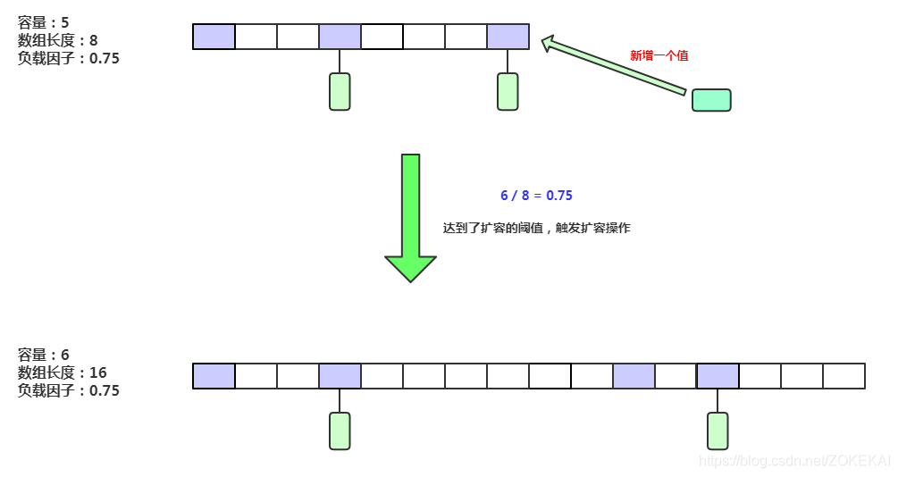

[TOC]

# sizeCtl 属性在各个阶段的作用

## 新建而未初始化时

```java
int cap = ((initialCapacity >= (MAXIMUM_CAPACITY >>> 1)) ? MAXIMUM_CAPACITY : tableSizeFor(initialCapacity + (initialCapacity >>> 1) + 1));
this.sizeCtl = cap;
```

**作用：**sizeCtl 用于记录初始容量大小，仅用于记录集合在实际创建时应该使用的大小的作用 。

## 初始化过程中

```java
U.compareAndSwapInt(this, SIZECTL, sc, -1)
```

**作用：**将 sizeCtl 值设置为 -1 表示集合正在初始化中，其他线程发现该值为 -1 时会让出CPU资源以便初始化操作尽快完成 。

## 初始化完成后

```java
Node<K,V>[] nt = (Node<K,V>[])new Node<?,?>[n];

table = tab = nt;

sc = n - (n >>> 2);

sizeCtl = sc;
```

**作用：**sizeCtl 用于记录当前集合的负载容量值，也就是触发集合扩容的极限值 。

## 正在扩容时

```java
//第一条扩容线程设置的某个特定基数

U.compareAndSwapInt(this, SIZECTL, sc, (rs << RESIZE_STAMP_SHIFT) + 2)

//后续线程加入扩容大军时每次加 1

U.compareAndSwapInt(this, SIZECTL, sc, sc + 1)

//线程扩容完毕退出扩容操作时每次减 1

U.compareAndSwapInt(this, SIZECTL, sc = sizeCtl, sc - 1)
```

**作用：**sizeCtl 用于记录当前扩容的并发线程数情况，此时 sizeCtl 的值为：((rs << RESIZE_STAMP_SHIFT) + 2) + (正在扩容的线程数) ，并且该状态下 sizeCtl < 0 

# 扩容过程图解



1. 元素个数达到扩容阈值。
2. 调用 putAll 方法，但目前容量不足以存放所有元素时。
3. 某条链表长度达到8，但数组长度却小于64时。

## CPU核数与迁移任务hash桶数量分配的关系


## 单线程下线程的任务分配与迁移操作


## 多线程如何分配任务？


## 普通链表如何迁移？


### 什么是 lastRun 节点？


## 红黑树如何迁移？


## hash桶迁移中以及迁移后如何处理存取请求？


## 多线程迁移任务完成后的操作

