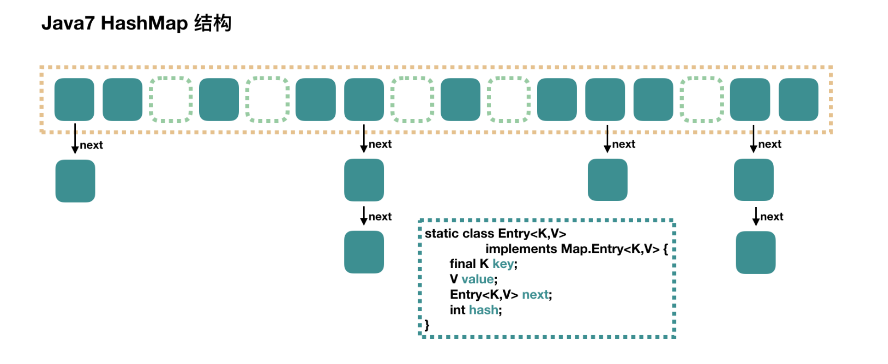
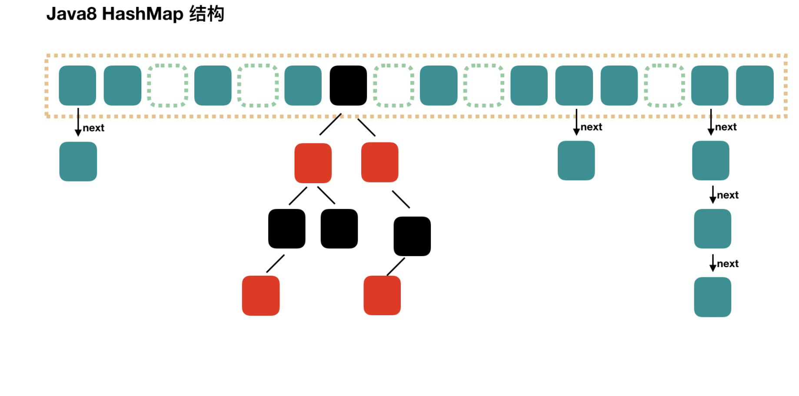

[TOC]

# HashMap（数组 + 链表 + 红黑树)

-  HashMap 最多只允许一条记录的键为 null，允许多条记录的值为 null。
- HashMap 非线程安全，即任一时刻可以有多个线程同时写 HashMap，可能会导致数据的不一致。如果需要满足线程安全，可以用 Collections 的 synchronizedMap 方法使HashMap 具有线程安全的能力，或者使用 ConcurrentHashMap。

## 1.7



## 1.8

当链表中的元素超过了 8 个以后，会将链表转换为红黑树。



## HashMap基本元素

```java
public class HashMap<K,V> extends AbstractMap<K,V> implements Map<K,V>, Cloneable, Serializable {

    //默认初始容量为16，这里这个数组的容量必须为2的n次幂。
    static final int DEFAULT_INITIAL_CAPACITY = 1 << 4; // aka 16

    //最大容量为2的30次方
    static final int MAXIMUM_CAPACITY = 1 << 30;

    //默认加载因子
    static final float DEFAULT_LOAD_FACTOR = 0.75f;

    //以Node<K,V>为元素的数组，也就是上图HashMap的纵向的长链数组，起长度必须为2的n次幂
    transient Node<K,V>[] table;

    //已经储存的Node<key,value>的数量，包括数组中的和链表中的
    transient int size;

    //扩容的临界值，或者所能容纳的key-value对的极限。当size>threshold的时候就会扩容
    int threshold;

    //加载因子
    final float loadFactor;
    ......
```

## DEFAULT_INITIAL_CAPACITY 和 MAXIMUM_CAPACITY

通过无参的构造函数new一个hashMap的时候，系统就会帮我们指定你HashMap的默认大小为DEFAULT_INITIAL_CAPACITY也就是16，可以自己制定初始容量的大小，只不过要注意必须是**2n且小于MAXIMUM_CAPACITY(2的30次方)**。

## DEFAULT_LOAD_FACTOR 和 loadFactor

loadFactor是这个数组填满程度的最大比比例。可以根据有参的HashMap构造函数来指定初始负载容量的大小，如果不指定，默认的负载因子为0.75。

## size 和 threshold

- size表示当前HashMap中已经储存的Node<key,value>的数量，包括**数组和链表**中的的Node<key,value>。

- threshold表示扩容的临界值，如果size大于这个值，就需要进行扩容。

### 1.7

在jdk1.7及以前，**threshold = length \* Load factor**。

### 1.8

threshold的计算算法得到了进一步改进，成了这个：

```java
//该方法是求一个整数最近的2的幂次方（大于）
static final int tableSizeFor(int cap) {
        int n = cap - 1;
        n |= n >>> 1;
        n |= n >>> 2;
        n |= n >>> 4;
        n |= n >>> 8;
        n |= n >>> 16;
        return (n < 0) ? 1 : (n >= MAXIMUM_CAPACITY) ? MAXIMUM_CAPACITY : n + 1;
    }
```

- 先来分析有关n位操作部分：先来假设n的二进制为01xxx...xxx。接着

- 对n右移1位：001xx...xxx，再位或：011xx...xxx

  对n右移2为：00011...xxx，再位或：01111...xxx

  此时前面已经有四个1了，再右移4位且位或可得8个1,同理，有8个1，右移8位肯定会让后八位也为1。综上可得，该算法让最高位的1后面的位全变为1。最后再让结果n+1，即得到了2的整数次幂的值了。

- 让cap-1再赋值给n的目的是另找到的目标值大于或**等于**原值。例如二进制1000，十进制数值为8。如果不对它减1而直接操作，将得到答案10000，即16。显然不是结果。减1后二进制为111，再进行操作则会得到原来的数值1000，即8。

## Node<K,V>[] table

```java
static class Node<K,V> implements Map.Entry<K,V> {
  final int hash;     //每个储存元素key的哈希值
  final K key;        //key
  V value;            //value
  Node<K,V> next;     //链表下一个node
  Node(int hash, K key, V value, Node<K,V> next) {
    this.hash = hash;
    ......
  }
  public final K getKey()        { return key; }
  public final V getValue()      { return value; }
  public final String toString() { return key + "=" + value; }
  public final int hashCode() { ...... }
  public final V setValue(V newValue) { ...... }
  public final boolean equals(Object o) { ....... }
}
```

## 构造器

```java
 public HashMap(int initialCapacity, float loadFactor) {
   if (initialCapacity < 0)
     throw new IllegalArgumentException("Illegal initial capacity: " + initialCapacity);
   if (initialCapacity > MAXIMUM_CAPACITY)
     initialCapacity = MAXIMUM_CAPACITY;
   if (loadFactor <= 0 || Float.isNaN(loadFactor))
     throw new IllegalArgumentException("Illegal load factor: " + loadFactor);
   this.loadFactor = loadFactor;
   this.threshold = tableSizeFor(initialCapacity);
 }

public HashMap(int initialCapacity) {
  this(initialCapacity, DEFAULT_LOAD_FACTOR);
}

public HashMap() {
  this.loadFactor = DEFAULT_LOAD_FACTOR; // all other fields defaulted
}

 public HashMap(Map<? extends K, ? extends V> m) {   
   this.loadFactor = DEFAULT_LOAD_FACTOR;
   putMapEntries(m, false);
 }
```

##  put(K key, V value)

```java
public V put(K key, V value) {
  return putVal(hash(key), key, value, false, true);
}

final V putVal(int hash, K key, V value, boolean onlyIfAbsent, boolean evict) {
  Node<K,V>[] tab; 
  Node<K,V> p; 
  int n, i; 
  //第一步，table为空，则调用resize()函数创建一个
  if ((tab = table) == null || (n = tab.length) == 0) 
    n = (tab = resize()).length;
  //第二步，计算元素所要储存的位置index,并对null做出处理
  //如果tab[i]==null，说明这个位置上没有元素，这个时候就创建一个新的Node元素
  if ((p = tab[i = (n - 1) & hash]) == null)   
    tab[i] = newNode(hash, key, value, null);
  //这个要添加的位置上面已经有元素了，也就是发生了碰撞。这个时候就要具体情况分类讨论：
  //1.key值相同，直接覆盖 2.链表已经超过了8位，变成了红黑树 3.链表是正常的链表
  else {  
    Node<K,V> e;
    K k;
    //如果节点key存在，则覆盖原来位置的key
    if (p.hash == hash && ((k = p.key) == key || (key != null && key.equals(k))))
      e = p;     
    //第三步，判断该链是否为红黑树
    else if (p instanceof TreeNode)                 
      e = ((TreeNode<K,V>)p).putTreeVal(this, tab, hash, key, value);
    else {
      for (int binCount = 0; ; ++binCount) {
        if ((e = p.next) == null) {
          p.next = newNode(hash, key, value, null);
          //链表长度大于8转换为红黑树
          if (binCount >= TREEIFY_THRESHOLD - 1) // -1 for 1st
            treeifyBin(tab, hash);
          break;
        }
        //如果节点key存在，则覆盖原来位置的key，同时将原来位置的元素，沿着链表向后移一位
        if (e.hash == hash && ((k = e.key) == key || (key != null && key.equals(k))))
          break;
        p = e;
      }
    }
    if (e != null) { // existing mapping for key
      V oldValue = e.value;
      if (!onlyIfAbsent || oldValue == null)
        e.value = value;
      afterNodeAccess(e);
      return oldValue;
    }
  }
  ++modCount;
  //第四步：超过最大容量限制，扩容
  if (++size > threshold)
    resize();                                       
  afterNodeInsertion(evict);
  return null;
}
```

### table为空，则调用resize()函数创建一个

在JDK1.7中源码的构造函数中：

```cpp
public HashMap(int initialCapacity, float loadFactor) {
    ......
    this.loadFactor = loadFactor;
    threshold = (int)(capacity * loadFactor);
   //这里初始化了
    table = new Entry[capacity];       
    init();
}
```

1. 到了jdk1.8中，我们观察上面四个构造函数，除了第四个构造函数调用了resize()外，其他三个常用的构造函数都没有与table初始化相关的迹象，而真正table初始化的地方是在putVal()**方法中，即**首次向HashMap添加元素时，调用resize()创建并初始化了一个table数组。
2. 类似于“懒加载”，用的时候再初始化，这样有利于节省资源

### 计算元素所要储存的位置index,并对null做出处理

`p = tab[i = (n - 1) & hash]`可以看到，**index = (n - 1) & hash**。**n**是新创建的table数组的长度：`(tab = resize()).length;`，可以看到，hash是由**hash(key)**这个方法计算所得：

```dart
static final int hash(Object key) {
  int h;
  return (key == null) ? 0 : (h = key.hashCode()) ^ (h >>> 16);
}
```

首先将得到key对应的哈希值：`h = key.hashCode()`，然后通过**hashCode()的高16位异或低16位实现的**：`(h = k.hashCode()) ^ (h >>> 16)`：

1. 取key的hashcode值：

   - Object类的hashCode
       返回对象的经过**处理后的内存地址**，由于每个对象的内存地址都不一样，所以哈希码也不一样。这个是**native方法**，取决JVM的内部设计，一般是某种C地址的偏移。
   - String类的hashCode
       根据String类包含的字符串的内容，根据一种特殊算法返回哈希码，**只要字符串的内容相同，返回的哈希码也相同**。
   - Integer等包装类
       返回的哈希码就是**Integer对象里所包含的那个整数的数值**，例如Integer i1=new Integer(100)，i1.hashCode的值就是100 。由此可见，**2个一样大小的Integer对象，返回的哈希码也一样**。
   - int，char这样的基础类
       它们不需要hashCode，如果需要存储时，将进行**自动装箱操作**，计算方法包装类。

2. hashCode()的高16位异或低16位：

   在JDK1.8的实现中，优化了高位运算的算法，通过hashCode()的高16位异或低16位实现的：(h = k.hashCode()) ^ (h >>> 16)，主要是从**速度、功效、质量**来考虑的，这么做可以在**数组table的length比较小的时候，也能保证考虑到高低Bit都参与到Hash的计算中**，同时不会有太大的开销。

   > 只要哈希码的后4位为0，不论不论高位怎么变化，最终的结果均为0。也就是说，如果支取后四位(低位)的话，这个时候产生"碰撞"的几率就非常大。为了解决低位与操作碰撞的问题，于是便有了高16位异或低16位的扰动函数,为了**混合原始哈希码的高位和低位，以此来加大低位随机性。**
   >
   > 

3. (n-1) & hash取模运算：

   n-1就是table数组元素应有的下表，它通过hash & (table.length -1)来得到**该对象的保存位**，而**HashMap底层数组的长度总是2的n次方**，这是HashMap在速度上的优化。当length总是2的n次方时，**hash&(length-1) 运算等价于对length取模，也就是hash % length**，但是&比%具有更高的效率。

###  判断该链是否为红黑树并添加元素

for (int binCount = 0; ; ++binCount) 循环遍历链表，这个for循环当中实际上经历了以下几个步骤：

1. **e = p.next**以及for语句之外后面的`p = e;`实际上是在向后循环遍历链表。
    开始的时候P为每个桶的头元素，然后将P的引用域(本来指向的是下一个元素)指向空节点e，这个时候实际上就相当于将p的下一个元素赋值给了e,即e已经变成了p的下一个元素。
2. 此时我们把这个复制的e单独提出来，进行了两个判断:
   - 第一个if：`if ((e = p.next) == null)`
       如果e也就是p.next == null,那么说明当前的这个P已经是链表最后一个元素了。这个时候采取**尾插法**添加一个新的元素:`p.next = newNode(hash, key, value, null);`即直接将p的引用域指向这个新添加的元素。如果添加新元素之后发现链表的长度超过了`TREEIFY_THRESHOLD - 1`也就是超过了8，那么调用`treeifyBin(tab, hash);`把这个链表转换成红黑树接着玩。
   - 第二个if:`if (e.hash == hash &&((k = e.key) == key || (key != null && key.equals(k))))`
       如果发现key值重复了，也就是要插入的key已经存在，那么直接break，结束遍历(不用再费劲去插入了)。
3. 然后又将e赋给p，这个时候的p已经向后移动了一位。重复上面的过程，直到循环完整个链表，或者break出来。

### 超过最大容量限制，扩容

```java
final Node<K,V>[] resize() {
  //创建一个oldTab数组用于保存之前的数组
  Node<K,V>[] oldTab = table; 
  //获取原来数组的长度
  int oldCap = (oldTab == null) ? 0 : oldTab.length;  
  //原来数组扩容的临界值
  int oldThr = threshold;             
  int newCap, newThr = 0;
  if (oldCap > 0) {
    //如果原来的数组长度大于最大值(2^30)
    if (oldCap >= MAXIMUM_CAPACITY) {   
      //扩容临界值提高到正无穷
      threshold = Integer.MAX_VALUE;  
      //返回原来的数组，也就是系统已经管不了了，随便你怎么玩吧
      return oldTab;                  
    }
    else if ((newCap = oldCap << 1) < MAXIMUM_CAPACITY && oldCap >= DEFAULT_INITIAL_CAPACITY)
      newThr = oldThr << 1; // double threshold
  }
  else if (oldThr > 0)
    //新数组的初始容量设置为老数组扩容的临界值
    newCap = oldThr;    
  else {               
    // 否则 oldThr == 0,零初始阈值表示使用默认值
    newCap = DEFAULT_INITIAL_CAPACITY;  //新数组初始容量设置为默认值
    newThr = (int)(DEFAULT_LOAD_FACTOR * DEFAULT_INITIAL_CAPACITY);     //计算默认容量下的阈值
  }
  if (newThr == 0) {  
    //如果newThr == 0，说明为上面 else if (oldThr > 0)的情况(其他两种情况都对newThr的值做了改变),此时newCap = oldThr;
   //ft为临时变量，用于判断阈值的合法性
    float ft = (float)newCap * loadFactor;  
    //计算新的阈值
    newThr = (newCap < MAXIMUM_CAPACITY && ft < (float)MAXIMUM_CAPACITY ? (int)ft : Integer.MAX_VALUE);     
  }
  threshold = newThr; //改变threshold值为新的阈值
  @SuppressWarnings({"rawtypes","unchecked"})
  Node<K,V>[] newTab = (Node<K,V>[])new Node[newCap];
  table = newTab; //改变table全局变量为，扩容后的newTable
  if (oldTab != null) {
    //遍历数组，将老数组(或者原来的桶)迁移到新的数组(新的桶)中
    for (int j = 0; j < oldCap; ++j) {  
      Node<K,V> e;
      //新建一个Node<K,V>类对象，用它来遍历整个数组
      if ((e = oldTab[j]) != null) {  
        oldTab[j] = null;
        if (e.next == null)
          //将e也就是oldTab[j]放入newTab中e.hash & (newCap - 1)的位置，
          newTab[e.hash & (newCap - 1)] = e; 
         //如果e已经是一个红黑树的元素
        else if (e instanceof TreeNode)    
          ((TreeNode<K,V>)e).split(this, newTab, j, oldCap);
        else { 
          // 链表重排
          Node<K,V> loHead = null, loTail = null;
          Node<K,V> hiHead = null, hiTail = null;
          Node<K,V> next;
          do {
            next = e.next;
            //索引没变
            if ((e.hash & oldCap) == 0) {
              if (loTail == null)
                loHead = e;
              else
                loTail.next = e;
              loTail = e;
            }
            else {
              if (hiTail == null)
                hiHead = e;
              else
                hiTail.next = e;
              hiTail = e;
            }
          } while ((e = next) != null);
          if (loTail != null) {
            loTail.next = null;
            newTab[j] = loHead;
          }
          if (hiTail != null) {
            hiTail.next = null;
            newTab[j + oldCap] = hiHead;
          }
        }
      }
    }
  }
  return newTab;
}
```

- 如果(e.hash & oldCap) == 0，则  newTab[j] = loHead = e = oldTab[j]，即索引位置没变。
- 反之 (e.hash & oldCap) != 0, newTab[j + oldCap] = hiHead = e = oldTab[j],也就是说，此时把**原数组[j]位置上的桶移到了新数组[j+原数组长度]**的位置上了。


在上面的图中，n表示一个长度为16的数组，n-1就是15，换算成二进制位1111。这个时候有两种不同的哈希码来跟他进行与操作，这两种哈希码的低四位都是相同的，最大的不同是第五位，key1为0，key2为1；

  这个时候我们进行扩容操作，n由16变为32，n-1=32,换算成二进制位11111，这个时候再和key1,key2进行与操作，我们发现，由于第5位的差异，得到了两种不同的结果：


