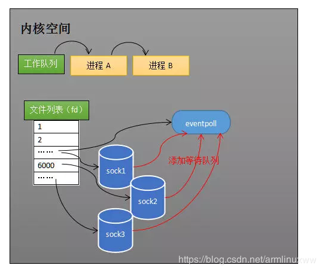

[TOC]

# 信息发送过程

1. “A”向"B" 发送一条消息，应用A把消息发送到 TCP发送缓冲区。
2.  TCP发送缓冲区再把消息发送出去，经过网络传递后，消息会发送到B服务器的TCP接收缓冲区。
3. B再从TCP接收缓冲区去读取属于自己的数据。

## 信息等待

- TCP缓冲区还没有接收到属于应用B该读取的消息时，那么此时应用B向TCP缓冲区发起读取申请，TCP接收缓冲区让应用B在这里等着，直到有数据再把数据交给应用B。

- 应用A在向TCP发送缓冲区发送数据时，如果TCP发送缓冲区已经满了等TCP发送缓冲区有空间了再把应用A的数据访拷贝到发送缓冲区。

# **工作队列**

操作系统为了支持多任务，实现了进程调度的功能，会把进程分为“运行”和“等待”等几种状态。

运行状态是进程获得 CPU 使用权，正在执行代码的状态；等待状态是阻塞状态，比如上述程序运行到 Recv 时，程序会从运行状态变为等待状态，接收到数据后又变回运行状态。

操作系统会分时执行各个运行状态的进程，由于速度很快，看上去就像是同时执行多个任务。

计算机中运行着 A、B 与 C 三个进程，这 3 个进程都被操作系统的工作队列所引用，处于运行状态，会分时执行。

# **等待队列**

-  Socket 对象包含了发送缓冲区、接收缓冲区与等待队列等成员。等待队列是个非常重要的结构，它指向所有需要等待该 Socket 事件的进程。
- 当程序执行到 Recv 时，操作系统会将进程 A 从工作队列移动到该 Socket 的等待队列中。
- 当 Socket 接收到数据后，操作系统将该 Socket 等待队列上的进程重新放回到工作队列，该进程变成运行状态，继续执行代码。

# 阻塞IO模型

**在读写数据过程中会发生阻塞现象。**

1. 用户线程发出 IO 请求。
2. 内核查看数据是否就绪。
   - 没有就绪，等待数据就绪，用户线程就会处于阻塞状态， 用户线程交出 CPU。
   - 就绪，内核会将数据拷贝到用户线程，并返回结果给用户线程，用户线程才解除 block 状态。

```java
//典型的阻塞IO模型的例子
//如果数据没有就绪，就会一直阻塞在 read 方法。
data = socket.read();
```

# 非阻塞IO模型

**用户线程需要不断地询问内核数据是否就绪，也就说非阻塞 IO不会交出 CPU，而会一直占用 CPU。**

1. 用户线程发起一个 read 操作，不需要等待，马上就得到了一个结果。
   - 结果是一个error ，说明数据还没有准备好，于是再次发送 read 操作。
   - 一旦内核中的数据准备好了，并且又再次收到了用户线程的请求，那么它马上就将数据拷贝到了用户线程，然后返回。

```java
//典型的非阻塞IO模型一般如下：
while(true){
  data = socket.read();
  if(data!= error){
    //处理数据
    break;
  }
}
```

**并发情况下服务器很可能一瞬间会收到几十上百万的请求**

1. 应用B需要创建几十上百万的线程去读取数据，这些线程必须不断的向内核发送recvfrom 请求来读取数据。

# **多路复用** **IO** **模型**

能不能提供一种方式，**可以由一个线程监控多个网络请求**（fd文件描述符，linux系统把所有网络请求以一个fd来标识），这样就可以只需要一个或几个线程就可以完成数据状态询问的操作，当有数据准备就绪之后再分配对应的线程去读取数据，这么做就可以节省出大量的线程资源出来，这个就是IO复用模型的思路。

**会有一个线程不断去轮询多个 socket 的状态，当 socket 真正有读写事件时，才真正调用实际的 IO 读写操作。**

系统提供了一种函数可以同时监控多个fd的操作，这个函数就是select、poll、epoll函数。

## select

唤起进程，就是将进程从所有的等待队列中移除，加入到工作队列里面，当进程 被唤醒后，它知道至少有一个 Socket 接收了数据。程序只需遍历一遍 Socket 列表，就可以得到就绪的 Socket：

1. 假如程序同时监视 Sock1、Sock2 和 Sock3 三个 Socket，那么在调用 Select 之后，操作系统把进程 A 分别加入这三个 Socket 的等待队列中。
2. read()操作将fd_set复制到内核空间。当任何一个 Socket 收到数据后或者达到超时时间，中断程序将唤起进程。
3. 进程被唤醒后，程序并不知道哪些 Socket 收到数据，需遍历一遍 Socket 列表，就可以得到就绪的 Socket。
4. 存在就绪的 Socket就fd_set复制到用户空间.

```java
ints= socket(AF_INET, SOCK_STREAM, 0);

bind( s, ...)

listen( s, ...)

intfds[] = 存放需要监听的 socket

while( 1){

intn = select(..., fds, ...)

for( inti= 0; i < fds.count; i++){

if(FD_ISSET(fds[i], ...)){

//fds[i]的数据处理

}

}

}
```


**缺点**：

1. **每次调用select都需要将进程加入到所有监视socket的等待队列**，每次唤醒都需要从每个队列中移除）。这里涉及了两次遍历，而且每次都要将整个 FDS 列表传递给内核，有一定的开销。 正是因为遍历操作开销大，出于效率的考量，才会规定 Select 的最大监视数量，默认只能监视 1024 个 Socket。
2. 进程被唤醒后，程序并不知道哪些 Socket 收到数据，还需要遍历一次。

## poll：

和select不同的地方：采用**链表**的方式替换原有fd_set数据结构,而使其**没有连接数的限制**。

## epoll：

- 每次调用 Select 都需要**添加队列，阻塞**这两步操作，然而大多数应用场景中，需要监视的 Socket 相对固定，并不需要每次都修改；

  Epoll 将这两个操作分开，先用 epoll_ctl 维护等待队列，再调用 epoll_wait 阻塞进程。

- select低效的另一个原因在于程序不知道哪些socket收到数据，只能一个个遍历。如果内核维护一个“就绪列表”，引用收到数据的socket，就能避免遍历。
- select和poll的fd_set集合，是在用户态进行定义，然后通过系统调用，将这个参数传入到内核态中，而select和poll的系统调用结束，发现有一些fd有事件来了，再将这个数据结构，从内核态传回用户态，然后用户再进行遍历。
- epoll改进在于通过epoll_create系统调用，直接在内核态创建fd数组，没有复制，epoll系统调用结束，发现有一些fd事件来了，将内核态传入用户态，这有一次复制；

1. 调用epoll_create方法，内核创建一个eventpoll对象（eventpoll对象也是文件系统中的一员，和socket一样，它也会有等待队列）

   

2. 用epoll_ctl添加或删除所要监听的socket。以添加socket为例，如果通过epoll_ctl添加sock1、sock2和sock3的监视，内核会**将eventpoll添加到这三个socket的等待队列中。**

3. 当 Socket 收到数据后，**中断程序**会给 eventpoll 的“就绪列表”添加 Socket 引用。如 Sock2 和 Sock3 收到数据后，中断程序让 Rdlist 引用这两个 Socket。

4. 然后程序执行到epoll_wait时，如果rdlist已经引用了socket，那么epoll_wait直接返回，如果rdlist为空，内核会将进程放入eventpoll的等待队列中，阻塞进程。

5. 当socket接收到数据，中断程序一方面**修改rdlist**，另一方面**唤醒eventpoll等待队列中的进程**，进程再次进入运行状态。

```java
ints= socket(AF_INET, SOCK_STREAM, 0);

bind( s, ...)

listen( s, ...)

intepfd = epoll_create(...);

epoll_ctl(epfd, ...); //将所有需要监听的 socket添加到epfd中

while( 1){

intn = epoll_wait(...)

for(接收到数据的 socket){

//处理

}

}
```

### 数据结构

#### **就绪列表的数据结构**

1. 程序可能随时调用epoll_ctl添加监视socket，也可能随时删除。当删除时，若该socket已经存放在就绪列表中，它也应该被移除。（事实上，每个epoll_item既是红黑树节点，也是链表节点，删除红黑树节点，自然删除了链表节点）。
2. 所以就绪列表应是一种能够快速插入和删除的数据结构。双向链表就是这样一种数据结构，epoll使用双向链表来实现就绪队列。

#### **索引结构**

1. epoll将“维护监视队列”和“进程阻塞”分离，要方便的添加和移除，还要便于搜索，以避免重复添加。红黑树是一种自平衡二叉查找树，搜索、插入和删除时间复杂度都是O(log(N))，效率较好。epoll使用了红黑树作为索引结构。
2. 因为操作系统要兼顾多种功能，以及有更多需要保存的数据，Rdlist 并非直接引用 Socket，而是通过 Epitem 间接引用，红黑树的节点也是 Epitem 对象。

### 工作模式

#### LT（水平触发模式）

当有事件发生并调用`epoll_wait`后，若未及时处理，下一次调用`epoll_wait`仍会继续通知：将从`rdlist`上取出的事件重新放回去，再次调用`epoll_wait`仍会继续通知，直到用户处理完成主动关闭fd。

#### ET(edge trigger)

ET模式，也叫边缘触发模式，其与水平模式的区别就是，调用`epoll_wait`通知过的事件，不论是否经过处理，再次调用`epoll_wait`不会再次通知了，ET模式在很大程度上降低了同一个epoll事件被重复触发的次数，因此ET模式效率比LT模式高：调用`epoll_wait`从`rdlist`取出事件后就不会再放回。

- 非阻塞模式：在ET模式下，因为事件只会被通知一次，为了保证数据成功被读取或写入，在非阻塞模式下，采用循环的方式进行读写，直到完成或出现异常时退出。
- 阻塞模式：在非阻塞模式下出现没有数据可读/可写可以返回相应的错误信息，但是阻塞模式就会进入阻塞状态，而处理的该fd永远也不可能再有可读数据了，所以就被永久阻塞了。

### Java NIO ：

1. 通过selector.select()去查询每个通道是否有到达事件。
   - 如果没有事件，则一直阻塞。

>  非阻塞 IO：不断地询问 socket 状态是通过用户线程去进行的
>
> 多路复用 IO：轮询每个 socket 状态是内核在进行的，这个效率要比用户线程要高的多。

**一旦事件响应体很大，那么就会导致后续的事件迟迟得不到处理，并且会影响新的事件轮询。**


# **信号驱动** **IO** **模型**

能不能不要用户线程去询问是否数据准备就绪？能不能发出请求后数据准备好了就通知用户线程呢？所以就衍生了信号驱动IO模型。

```java
//sigaction函数的功能是检查或修改与指定信号相关联的处理动作。
//signum参数指出要捕获的信号类型，act参数指定新的信号处理方式，oldact参数输出先前信号的处理方式（如果不为NULL的话）。
int sigaction(int signum,const struct sigaction *act, struct sigaction *oldact);
```

1. 设置信号 SIGIO 处理函数。
2. 设置fd的属性， F_SETOWN 设置要接收信号的进程。
3. 设置 fd 的异步标志，使用 F_SETFL， O_ASYNC | O_NONBLOCK。
4. 当数据准备就绪时，就生成对应进程的SIGIO信号，通过信号回调通知应用线程调用recvfrom来读取数据。

## 什么时候会产生信号（网络IO过程）？

### UDP

1. 套接字收到了一个完整的数据包。
2. 套接字发生了异步错误。

当我们在使用 UDP 套接字异步 I/O 的时候，我们使用 recvfrom() 函数来读取数据报数据或者异步IO 错误信息。

### TCP

1. 在一个监听某个端口的套接字上成功的建立了一个新连接。
2. 一个断线的请求被成功的初始化。
3. 一个断线的请求成功的结束。
4. 套接字的某一个通道（发送通道或是接收通道）被关闭。
5. 套接字接收到新数据。
6. 套接字将数据发送出去。
7. 发生了一个异步 I/O 的错误。

**异步 I/O 几乎对 TCP 套接字而言没有什么作用，因为对于一个 TCP 套接字来说， SIGIO 信号发生的几率太高了，所以 SIGIO 信号并不能告诉我们究竟发生了什么事情。**

## 产生的信号发给谁处理？

当然要发给关心 SIGIO 信号的进程啦，可以通过 fcntl 系统调用的 F_SETOWN 来设置。
F_SETOWN 的含义是：设置将要在文件描述符fd 上接收 SIGIO 或 SIGURG 事件信号的进程或进程组标识。一般产生该信号后由当前进程来处理，那么我们可以如下设置：

```cpp
fcntl(sockfd, F_SETOWN, getpid()); // getpid() to get current process id
```

## 收到信号如何处理？

收到信号后，我们注册的信号处理函数就会去处理。这里有 signal 和 sigaction 两种方式来处理，但是不推荐 signal方式。

> **必须保证在设置套接字所有者之前，向系统注册信号处理程序，否则就有可能在fcntl调用后，信号处理程序注册前内核向应用交付SIGIO信号，导致应用丢失此信号**

# **异步** **IO** **模型**

应用只需要向内核发送一个read 请求,告诉内核它要读取数据后即刻返回；内核收到请求后会建立一个信号联系，当数据准备就绪，内核会**主动把数据从内核复制到用户空间**，等所有操作都完成之后，内核会发起一个通知告诉应用。

在信号驱动模型中，当用户线程接收到信号表示数据已经就绪，然后**需要用户线程调用 IO 函数进行实际的读写操作**；而在异步 IO 模型中，**收到信号表示 IO 操作已经完成，不需要再在用户线程中调用 IO 函数进行实际的读写操作**。