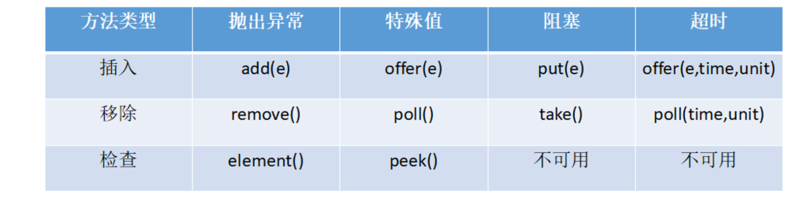

[TOC]

# JAVA阻塞队列原理

1. 当队列中没有数据的情况下，消费者端的所有线程都会被自动阻塞（挂起），直到有数据放入队列。
2. 当队列中填满数据的情况下，生产者端的所有线程都会被自动阻塞（挂起），直到队列中有空的位置，线程被自动唤醒。

# **阻塞队列的主要方法**



- 抛出异常：抛出一个异常。
-  特殊值：返回一个特殊值（null 或 false,视情况而定）。
- 阻塞：在成功操作之前，一直阻塞线程。
- 超时：放弃前只在最大的时间内阻塞。

## 插入操作

1. public abstract boolean add(E paramE)：将指定元素插入此队列中（如果立即可行且不会违反容量限制），成功时返回 true，如果当前没有可用的空间，则抛出 IllegalStateException。如果该元素是 NULL，则会抛出 NullPointerException 异常。

2. public abstract boolean offer(E paramE)：将指定元素插入此队列中（如果立即可行且不会违反容量限制），成功时返回 true，如果当前没有可用的空间，则返回 false。 

3. public abstract void put(E paramE) throws InterruptedException： 将指定元素插入此队列中，将等待可用的空间（如果有必要）

   ```java
   public void put(E paramE) throws InterruptedException {
     checkNotNull(paramE);
     ReentrantLock localReentrantLock = this.lock;
     localReentrantLock.lockInterruptibly();
     try {
       while (this.count == this.items.length)
         this.notFull.await();//如果队列满了，则线程阻塞等待
       enqueue(paramE);
       localReentrantLock.unlock();
     } finally {
       localReentrantLock.unlock();
     } 
   } 
   ```

4. offer(E o, long timeout, TimeUnit unit)：可以设定等待的时间，如果在指定的时间内，还不能往队列中加入 BlockingQueue，则返回失败。

## 获取数据操作

1. poll(time):取走 BlockingQueue 里排在首位的对象,若不能立即取出,则可以等 time 参数规定的时间,取不到时返回 null。
2. poll(long timeout, TimeUnit unit)：从 BlockingQueue 取出一个队首的对象，如果在指定时间内，队列一旦有数据可取，则立即返回队列中的数据。否则直到时间超时还没有数据可取，返回失败。
3. take():取走 BlockingQueue 里排在首位的对象,若 BlockingQueue 为空,阻断进入等待状态直到 BlockingQueue 有新的数据被加入。
4. drainTo():一次性从 BlockingQueue 获取所有可用的数据对象（还可以指定获取数据的个数），通过该方法，可以提升获取数据效率。不需要多次分批加锁或释放锁。

# Java 中的阻塞队列

1. ArrayBlockingQueue ：由数组结构组成的有界阻塞队列。
2. LinkedBlockingQueue ：由链表结构组成的有界阻塞队列。
3. PriorityBlockingQueue ：支持优先级排序的无界阻塞队列。
4. DelayQueue：使用优先级队列实现的无界阻塞队列。
5. SynchronousQueue：不存储元素的阻塞队列。
6. LinkedTransferQueue：由链表结构组成的无界阻塞队列。
7. LinkedBlockingDeque：由链表结构组成的双向阻塞队列。