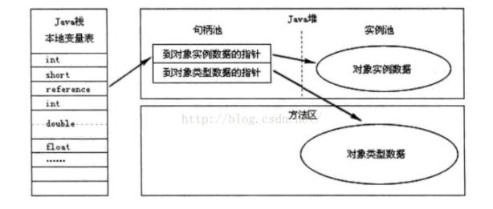

[TOC]

# 对象的创建

## new指令

1. 检查这个指令的参数能否**在常量池中定位到一个类的符号引用**，并**检查这个类是否已被加载，解析和初始化过**。

   - 如果没有必须先执行相应的类加载过程。

2. 为新生对象分配内存。

   - **指针碰撞**——假设Java堆中的内存是绝对规整的，所有使用过的内存在一边，空闲的内存在另一边，中间放着指针作为分界点的指示器，那所分配内存就仅仅是把那个指针向空闲方向挪动与对象大小相等的距离。
   - **空闲列表**——假设Java堆中的内存是不是规整的，虚拟机就必须维护一个列表，记录哪些内存是可用的，分配时在列表找到足够大的空间划分给对象并更新列表。

   选择哪种方式由Java堆是否规整决定，而这又由垃圾收集器是否带有空间压缩整理决定的。

   Serial，ParNew等带有压缩整理功能的使用的是指针碰撞方式。

   **CMS这种基于清除理论上只能使用空闲列表（实际上CMS通过空闲列表拿到一大块分配缓冲区之后，在它里面依然可以使用指针碰撞方式）。**

3. 内存分配完成后，虚拟机必须将分配的内存空间（但不包括对象头）都初始化为零值，如果使用了TLAB，这一项工作可以提前至TLAB分配时进行。

4. 对对象进行必要的设置：

   - 例如这个对象是哪个类的实例。
   - 如何才能找到类的元数据信息。
   - 对象的哈希码**（对象的哈希码贵延后到真正调用Object::hasgCode()时才计算）。**
   - 对象的GC分代年龄等信息。
   - 是否启用偏向锁等。

   这些信息在对象的对象头中。

5. 调用构造函数，即Class文件中的<init>()方法。

   - **一般来说<init>()方法是否执行由字节码流中new指令后面是否跟随着invokespecial指令。**
   - **Java编译器会在遇到new关键字的地方同时生成着两条字节码指令，但如果通过其他方式则不一定。**

## TLAB

并发时候不是线程安全的，如修改指针位置。

解决方法：

1. CAS配上失败重试的方式保证更新操作的原子性。
2. 把内存分配的动作按照线程划分在不同空间执行，即每个线程在Java堆中预先分配一小块内存，称为TLAB（Thread Local Allocation Buffer）。只有本地缓冲区用完了，分配新的的时候才需要锁定。

虚拟机是否使用TLAB可以通过  **-XX:+/-UseTLAB** 来设定。

# 对象的内存布局

HotSpot中，对象在堆存储布局可以分为三个部分：

1. 对象头。
2. 示例数据。
3. 对齐填充。

## 对象头

对象头包含两类信息：

1. 自身运行时数据，这部分在32位和64位的虚拟机分别是32位和64位（未开启指针压缩）。
2. 类型指针。

### 自身运行时数据

MarkWord有着动态定义的数据结构。

例如在32位HotSpot虚拟机中，对象未被同步锁锁定的状态下，25位存储哈希码，4位存储对象分代年龄，2位存储锁标志位，1位固定为0.

|               存储内容               | 标志位 |    状态    |
| :----------------------------------: | :----: | :--------: |
|       对象哈希码，对象分代年龄       |   01   |   未锁定   |
|           指向锁记录的指针           |   00   | 轻量级锁定 |
|          指向重量级锁的指针          |   10   | 重量级锁定 |
|                  空                  |   11   |   GC标记   |
| 偏向线程ID，偏向时间戳，对象分代年龄 |   01   |   可偏向   |

### 类型指针

即对象指向它的类型元数据的指针。

如果对象是一个Java数组，那在对象头中还要记录数组长度。

## 实例数据

对象真正存储的有效信息。

这部分的存储顺序会收到虚拟机**分配策略参数**（-XX:FieldsAllocationStlye）和**字段在源码中定义的顺序影响**。

HotSpot默认的分配顺序为：

1. Long/doubles
2. ints
3. Shorts/chars
4. Bytes/booleans
5. Oops

**除了指针，其他都是从大到小，且相同宽度的字段总是被分配在一起。**

**在满足的前提下，在父类中定义的变量会出现在子类之前。**

如果-XX:CompactsFields参数值为true（默认为true），那么字类中较窄的变量允许插入父类变量空隙中。

## 对齐填充

任何对象的大小都必须是8字节的整数倍。对象头部分已是1或者2倍了，如果对象实例部分没有对齐的话，就需要通过对齐填充来补全。

### 内存对齐原因

内存对齐的一个原因是让字段出现在同一CPU的缓存中。如果字段不对齐，那么就有可能出现跨缓存行的字段。也就是说，该字段的读取的读取可能需要跨两个缓存行，而改字段的存储也可能同时污染两个缓存行。这种情况对程序的执行效率是不利的。

### 指针压缩

对于32位机器，进程能使用的最大内存是4G。如果进程需要使用更多的内存，需要使用64位机器。

**64位JVM在支持更大堆的同时，由于对象引用变大却带来了性能问题：**

1. 增加了GC开销。

   **64位对象引用需要占用更多的堆空间，留给其他数据的空间将会减少，从而加快了GC的发生，更频繁的进行GC。**

2. 降低CPU缓存命中率。

   **64位对象引用增大了，CPU能缓存的oop将会更少，从而降低了CPU缓存的效率。**

#### CompressedOops原理

- 4个字节，32位，可以表示232 个地址，如果这个地址是真实内存地址的话，那么由于CPU寻址的最小单位是byte，也就是 232 byte = 4GB。

  如果内存地址是指向 bit的话，32位的最大寻址范围其实是 512MB，但是由于内存里，将8bit为一组划分，所以内存地址就其实是指向的8bit为一组的byte地址，所以32位可以表示的容量就扩充了8倍，就变成了4GB。

**4字节，8位最大表示4GB内存。那么Java是怎么做到 4个字节表示32GB呢？怎有扩大了8倍？？？4字节，8位最大表示4GB内存。那么Java是怎么做到 4个字节表示32GB呢？怎有扩大了8倍？**

- JVM就将堆内存进行了块划分，**以8字节为最小单位进行划分。将java堆内存进行8字节划分。**

  java对象的指针地址就可以不用存对象的真实的64位地址了，而是可以存一个映射地址编号。这样4字节就可以表示出2^32个地址，而每一个地址对应的又是8byte的内存块。所以，再乘以8以后，一换算，就可以表示出32GB的内存空间。

**这里很巧妙的运用了java对齐填充的特性，通过映射的方式达到了内存扩充的效果。运用的原理和操作系统32位表示4GB内存的原理一样。**解释了为什么当内存大于32GB时，开启指针压缩的参数会失效。

# 对象的访问定位

## 句柄

堆会划分出一块内存作为句柄池，reference中存储的就是对象的句柄地址。

句柄中包含了对象的实例数据与类型数据各自的类型信息。

## 直接指针

reference中存储的就是对象的地址。

**句柄的好处是：在对象被移动时（垃圾收集时）只需要修改实例数据的地址。**

**直接指针的好处：节省了一次指针定位的时间开销，由于对象访问十分频繁，这也是客观的成本。**

**HotSpot使用的是直接指针。**

