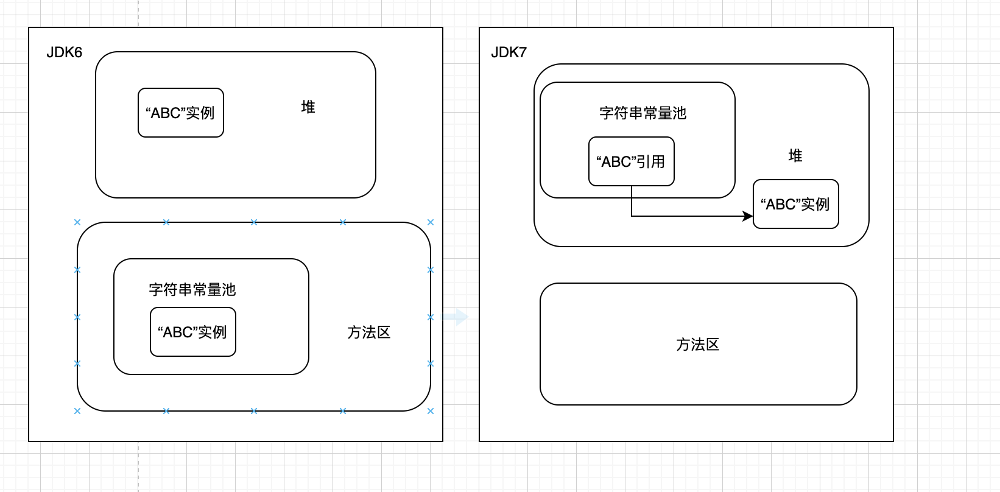

[TOC]

# Java堆溢出

-Xms20m

-Xmx20m

-XX:+HeapDumpOnOutOfMemoryError

可以让内存溢出时Dump出当前内存堆转储快照

# 虚拟机栈和本地方法栈溢出

**HotSpot不分虚拟机栈和本地方法栈，所以-Xoss无用。只能用-Xss。**

给每个线程分配的内存越多，越容易OOM。

# 方法区和运行时常量池溢出

**JDK6或之前字符串常量池分配在永久代，通过-XX:PermSize和-XX:MaxPermSize限制永久代大小。**

**JDK7字符串常量池被移至堆。**

## String::intern()

如果字符串常量池中已经包含一个等于此String的字符串，则返回池中这个引用。

JDK6，intern()会把首次遇到的字符串实例复制到永久代的字符串常量池。

JDK7，字符串常量池被移至堆，因此只需要在常量池记录下首次出现的实例引用。

- **-XX:MaxMetaSpaceSize：设置元空间最大值，默认为-1，不限制。**
- **-XX:MaxMetaSpaceSize：设置元空间初始空间大小，达到该值就进行垃圾收集进行类型卸载，同时收集期对该值做调整：**
  1. **如果释放了大量空间，就适当降低该值。**
  2. **否则在不超过-XX:MaxMetaSpaceSize的前提下适当提高该值。**
- **-XX:MinMetaSpaceFreeRatio：垃圾收集之后控制最小的元空间剩余容量的百分比，可减少因为元空间不足导致的垃圾收集的频率。**
- **-XX:MaxMetaSpaceFreeRatio：垃圾收集之后控制最大的元空间剩余容量的百分比。**

# 直接内存溢出

**直接内存可通过-XX:MaxDirectMemorySize指定，不指定默认与Java堆最大值一致。**

由直接内存导致的溢出，Heap Dump文件一般看不出异常，或者文件很小，而程序中又直接或者间接的使用了DirectMemory（典型的是NIO）。