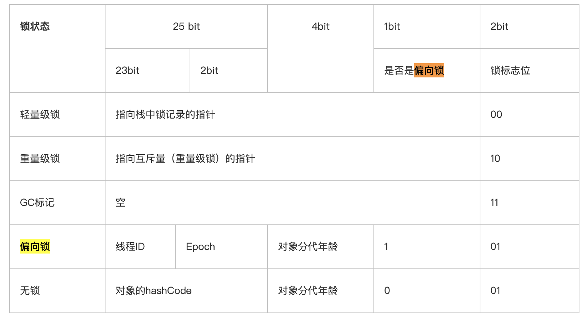
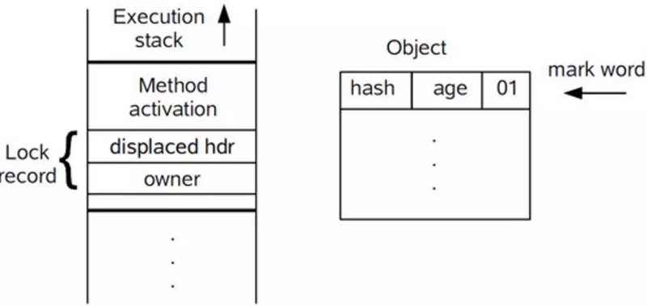
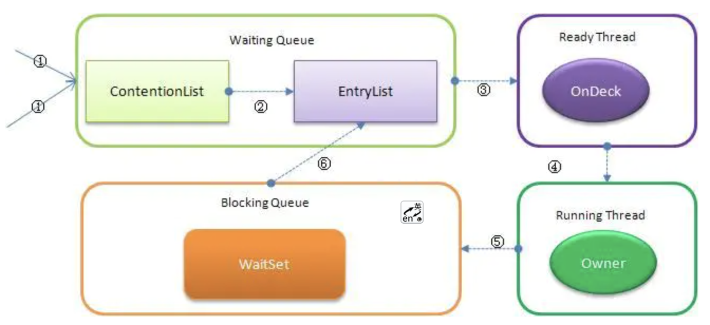

[TOC]

# 线程对立

无论调用端是否采取同步措施，都无法正确地在多线程环境下执行。Java典型的线程对立：Thread类中的suspend()和resume()方法：如果两个线程同时操控一个线程对象，一个尝试挂起，一个尝试恢复，将会存在死锁风险，**已经被弃用**。

常见的对立：`System.setIn()`，`System.setOut()`和`System.runFinalizersOnExit()`。

# 互斥同步

ReentrantLock比Synchronized多的操作：

- 等待可中断

  - 当持有锁的线程长期不释放锁的时候可以放弃等待。

- 公平锁

  按照时间顺序获得锁。

- 锁绑定多个条件

  - ReentrantLock可以同时绑定多个Condition对象。

# 锁优化



## 自旋锁

自旋次数默认十次。

可通过-XX:preBlockSpin设置。

在 JDK 1.6 中引入了自适应的自旋锁。自适应意味着自旋的次数不再固定了，而是由前一次在同一个锁上的自旋次数及锁的拥有者的状态来决定。

1. 同在同一个锁对象上，自旋等待刚刚成功获得过锁，并且持有锁的线程正在运行中，那么虚拟机就会认为这次自旋也很有可能再次成功，进而它将允许自旋等待持续相对更长的时间。
2. 另外，如果对于某个锁，自旋很少成功获得过，那在以后要获取这个锁时将可能省略掉自旋过程，以避免浪费处理器资源。#

## 锁消除

**锁削除是指虚拟机即时编译器在运行时，对一些代码上要求同步，但是被检测到不可能存在共享数据竞争的锁进行削除。**

锁削除的主要判定依据来源于逃逸分析的数据支持，如果判断到一段代码中，在堆上的所有数据都不会逃逸出去被其他线程访问到，那就可以把它们当作栈上数据对待，认为它们是线程私有的，同步加锁自然就无须进行。

```java
@Override
public synchronized StringBuffer append(String str) {
    toStringCache = null;
    super.append(str);
    return this;
}
```

从源码中可以看出，append方法用了synchronized关键词，它是线程安全的。

## 锁粗化

如果一系列的连续操作都对同一个对象反复加锁和解锁，甚至加锁操作是出现在循环体中的，那即使没有线程竞争，频繁地进行互斥同步操作也会导致不必要的性能损耗。

如果虚拟机探测到有这样一串零碎的操作都对同一个对象加锁，将会把加锁同步的范围扩展（粗化）到整个操作序列的外部（由多次加锁编程只加锁一次）。

## 轻量级锁

### 加锁



1. 如果对象没有被锁定(01)，虚拟机首先在当前栈帧建立一个名为锁记录的空间，用于存储当前Mark Word的拷贝。
2. 使用CAS将对象的Mark Word更新为指向锁空间的指针。
   - 成功就代表线程拥有了锁，并且Mark Word锁标志位变成00。
   - 失败就代表有竞争，首先会检查Mark Word是否指向当前线程的栈帧。
     - 是，直接进入同步块继续执行。
     - 否则膨胀为重量级锁，并且Mark Word锁标志位变成10，失败的线程阻塞。

### 解锁

1. 如果Mark Word是否指向当前线程的锁记录，使用CAS将对象的Mark Word和线程中复制的Displaced Mark Word换回来。
   - 替换失败，膨胀为重量级锁，并唤醒被挂起的线程。
   - 成功那同步过程就很顺利了。

## 偏向锁

这个锁会偏向第一个获取它的线程。

1. 锁第一次被这个线程获取的时候，虚拟机把标志设置为01，偏向模式设置为1。
2. 同时使用CAS操作把线程ID记录在Mark Word中。
   - 成功，这个线程进入这个锁相关的同步块时，虚拟机都可以不再进行任何操作（例如加锁，解锁和对Mark Word更新）。
3. 一旦出现另一个线程去尝试获取这个锁，偏向模式结束。
   - 线程不会主动释放偏向锁。偏向锁的撤销，**需要等待全局安全点，它会首先暂停拥有偏向锁的线程，判断锁对象是否处于被锁定状态。**
   - 根据对象是否处于被锁定来决定撤销偏向锁后恢复到无锁（标志位为“01”）或轻量级锁（标志位为“00”）的状态。

一执行哈希码（Object::hashcode()）通过在计算头中存储来保证第一次计算后以后都不会改变了。

- 当一个对象已经计算过一执行哈希码，它就再也无法进入偏向状态了。
- **当一个对象处于偏向状态，又收到需要计算哈希码的请求，它的偏向状态立即被撤销，并且锁会膨胀为重量级锁。**

使用-XX:UseBiasedLocking可以禁止偏向锁。

## 重量级锁

对象头指向重量级锁的位置，代表重量级锁的ObjectMonitor类里有字段可以记录非加锁状态下的（01）Mark Word。其中自然可以存储原来的哈希码。

### Objectmonitor中的关键词

- EntryList：Contention List 中那些有资格成为候选资源的线程被移动到 Entry List 中；
- WaitList：哪些调用 wait 方法被阻塞的线程被放置在这里。
- cxq(ContentionList)：竞争队列，所有请求锁的线程首先被放在这个竞争队列中。
- Owner：当前已经获取到所资源的线程被称为 Owner。
- OnDeck：任意时刻，最多只有一个线程正在竞争锁资源，该线程被成为 OnDeck。
- recursions：重入计数器

### 过程



1. JVM 每次从队列的尾部取出一个数据用于锁竞争候选者（OnDeck），但是并发情况下，ContentionList 会被大量的并发线程进行 CAS 访问，为了降低对尾部元素的竞争，JVM 会将一部分线程移动到 EntryList 中作为候选竞争线程。
2. Owner 线程会在 unlock 时，将 ContentionList 中的部分线程迁移到 EntryList 中，并指定EntryList 中的某个线程为 OnDeck 线程（**一般是最先进去的那个线程**）。
3. Owner 线程并不直接把锁传递给 OnDeck 线程，而是把锁竞争的权利交给 OnDeck，OnDeck 需要重新竞争锁。这样虽然牺牲了一些公平性，但是能极大的提升系统的吞吐量，在JVM 中，也把这种选择行为称之为“竞争切换”。
4. OnDeck 线程获取到锁资源后会变为 Owner 线程，而没有得到锁资源的仍然停留在 EntryList中。如果 Owner 线程被 wait 方法阻塞，则转移到 WaitSet 队列中，直到某个时刻通过 notify或者 notifyAll 唤醒，会重新进去 EntryList 中。
5.  处于 ContentionList、EntryList、WaitSet 中的线程都处于阻塞状态，该阻塞是由操作系统来完成的（Linux 内核下采用 pthread_mutex_lock 内核函数实现的）。
6. Synchronized 是非公平锁。 **Synchronized 在线程进入 ContentionList 时，等待的线程会先尝试自旋获取锁，如果获取不到就进入 ContentionList，这明显对于已经进入队列的线程是不公平的**，**还有一个不公平的事情就是自旋获取锁的线程还可能直接抢占 OnDeck 线程的锁资源。**
7. 每个对象都有个 monitor 对象，加锁就是在竞争 monitor 对象，代码块加锁是在前后分别加上 monitorenter 和 monitorexit 指令来实现的，方法加锁是通过一个标记位来判断的。
8. synchronized 是一个重量级操作，需要调用操作系统相关接口，性能是低效的，有可能给线程加锁消耗的时间比有用操作消耗的时间更多。

