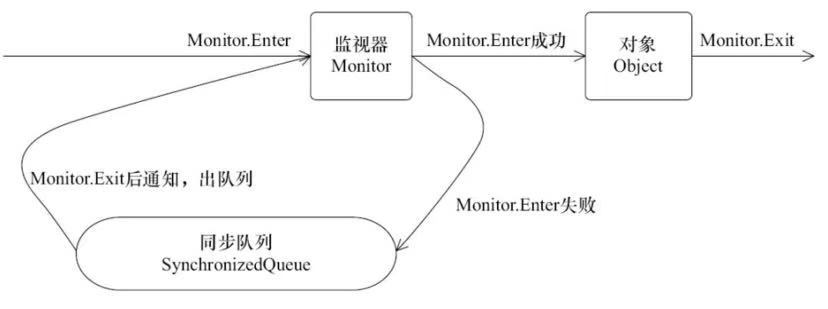
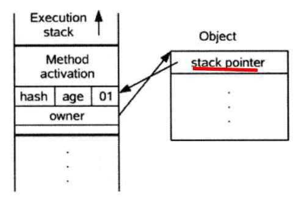

执行同步代码块后首先要先执行**monitorenter**指令，退出的时候**monitorexit**指令。通过分析之后可以看出，使用Synchronized进行同步，其关键就是必须要对对象的监视器monitor进行获取，当线程获取monitor后才能继续往下执行，否则就只能等待**。每个对象拥有一个计数器，当线程获取该对象锁后，计数器就会加一，释放锁后就会将计数器减一。**

线程执行monitorenter指令时尝试获取monitor的所有权，过程如下：
1. 如果monitor的进入数为0，则该线程进入monitor，然后将进入数设置为1，该线程即为monitor的所有者。
2. 如果线程已经占有该monitor，只是重新进入，则进入monitor的进入数加1.
3. 如果其他线程已经占用了monitor，则该线程进入阻塞状态，直到monitor的进入数为0，再重新尝试获取monitor的所有权。

监视器锁（Monitor）本质是依赖于底层的操作系统的Mutex Lock（互斥锁）来实现的。每个对象都对应于一个可称为" 互斥锁" 的标记，这个标记用来保证在任一时刻，只能有一个线程访问该对象。

在同步的时候是获取对象的monitor,即获取到对象的锁。那么对象的锁怎么理解？无非就是类似对对象的一个标志，那么这个标志就是存放在Java对象的对象头。
Java对象头里的Mark Word里默认的存放的对象的Hashcode,分代年龄和锁标记位。

由于Java的线程是映射到操作系统的原生线程之上的，如果要阻塞或唤醒一条线程，都需要操作系统来帮忙完成，这就需要从用户态转换到核心态中，因此状态转换需要耗费很多的处理器时间。

synchronized与java.util.concurrent包中的ReentrantLock相比，由于JDK1.6中加入了针对锁的优化措施，使得synchronized与ReentrantLock的性能基本持平ReentrantLock只是提供了synchronized更丰富的功能，而不一定有更优的性能，所以在synchronized能实现需求的情况下，优先考虑使用synchronized来进行同步。

**偏向锁的获取**

（1）访问Mark Word中偏向锁的标识是否设置成1，锁标志位是否为01——确认为可偏向状态。
（2）如果为可偏向状态，则测试线程ID是否指向当前线程，如果是，进入步骤（5），否则进入步骤（3）。
（3）如果线程ID并未指向当前线程，则通过CAS操作竞争锁。如果竞争成功，则将Mark Word中线程ID设置为当前线程ID，然后执行（5）；如果竞争失败，执行（4）。
（4）如果CAS获取偏向锁失败，则表示有竞争（CAS获取偏向锁失败说明至少有过其他线程曾经获得过偏向锁，因为线程不会主动去释放偏向锁）。当到达全局安全点（safepoint）时，会首先暂停拥有偏向锁的线程，然后检查持有偏向锁的线程是否活着（因为可能持有偏向锁的线程已经执行完毕，但是该线程并不会主动去释放偏向锁），如果线程不处于活动状态，则将对象头设置成无锁状态（标志位为“01”），然后重新偏向新的线程；如果线程仍然活着，撤销偏向锁后升级到轻量级锁状态（标志位为“00”），此时轻量级锁由原持有偏向锁的线程持有，继续执行其同步代码，而正在竞争的线程会进入自旋等待获得该轻量级锁。
（5）执行同步代码

**偏向锁的撤销**

偏向锁使用了一种**等到竞争出现才释放锁**的机制，所以当其他线程尝试竞争偏向锁时，持有偏向锁的线程才会释放锁。
偏向锁的撤销，需要等待**全局安全点**（在这个时间点上没有正在执行的字节码）。它会首先暂停拥有偏向锁的线程，然后检查持有偏向锁的线程是否活着，如果线程不处于活动状态，则将对象头设置成无锁状态；如果线程仍然活着，拥有偏向锁的栈会被执行，遍历偏向对象的锁记录，栈中的锁记录和对象头的Mark Word要么重新偏向于其他线程，要么恢复到无锁或者标记对象不适合作为偏向锁，最后唤醒暂停的线程。

如何关闭偏向锁
偏向锁在Java 6和Java 7里是默认启用的，但是它在应用程序启动几秒钟之后才激活，如有必要可以使用JVM参数来关闭延迟：**-XX:BiasedLockingStartupDelay=0**。如果你确定应用程序里所有的锁通常情况下处于竞争状态，可以通过JVM参数关闭偏向锁：**-XX:-UseBiasedLocking=false**，那么程序默认会进入轻量级锁状态

**轻量级锁**
**加锁**
（1）在代码进入同步块的时候，如果同步对象锁状态为无锁状态（锁标志位为“01”状态，是否为偏向锁为“0”），虚拟机首先将在当前线程的栈帧中建立一个名为锁记录（Lock Record）的空间，用于存储锁对象目前的Mark Word的拷贝，官方称之为 Displaced Mark Word。
（2）拷贝对象头中的Mark Word复制到锁记录中。
（3）拷贝成功后，虚拟机将使用CAS操作尝试将对象的Mark Word更新为指向Lock Record的指针，并将Lock record里的owner指针指向object mark word。如果更新成功，则执行步骤（4），否则执行步骤（5）。
（4）如果这个更新动作成功了，那么这个线程就拥有了该对象的锁，并且对象Mark Word的锁标志位设置为“00”，即表示此对象处于轻量级锁定状态。

（5）如果这个更新操作失败了，虚拟机首先会检查对象的Mark Word是否指向当前线程的栈帧，如果是就说明当前线程已经拥有了这个对象的锁，那就可以直接进入同步块继续执行。否则说明多个线程竞争锁，若当前只有一个等待线程，则可通过自旋稍微等待一下，可能另一个线程很快就会释放锁。 但是当自旋超过一定的次数，或者一个线程在持有锁，一个在自旋，又有第三个来访时，轻量级锁膨胀为重量级锁，重量级锁使除了拥有锁的线程以外的线程都阻塞，防止CPU空转，锁标志的状态值变为“10”，Mark Word中存储的就是指向重量级锁（互斥量）的指针，后面等待锁的线程也要进入阻塞状态。

**解锁**
（1）通过CAS操作尝试把线程中复制的Displaced Mark Word对象替换当前的Mark Word。
（2）如果替换成功，整个同步过程就完成了。
（3）如果替换失败，说明有其他线程尝试过获取该锁（此时锁已膨胀），那就要在释放锁的同时，唤醒被挂起的线程。

一个对象刚开始实例化的时候，没有任何线程来访问它的时候。它是可偏向的，意味着，它现在认为只可能有一个线程来访问它，所以当第一个线程来访问它的时候，它会偏向这个线程，此时，对象持有偏向锁。偏向第一个线程，这个线程在修改对象头成为偏向锁的时候使用CAS操作，并将对象头中的ThreadID改成自己的ID，之后再次访问这个对象时，只需要对比ID，不需要再使用CAS在进行操作。
一旦有第二个线程访问这个对象，因为偏向锁不会主动释放，所以第二个线程可以看到对象时偏向状态，这时表明在这个对象上已经存在竞争了。检查原来持有该对象锁的线程是否依然存活，如果挂了，则可以将对象变为无锁状态，然后重新偏向新的线程。如果原来的线程依然存活，则马上执行那个线程的操作栈，检查该对象的使用情况，如果仍然需要持有偏向锁，则偏向锁升级为轻量级锁，（偏向锁就是这个时候升级为轻量级锁的），此时轻量级锁由原持有偏向锁的线程持有，继续执行其同步代码，而正在竞争的线程会进入自旋等待获得该轻量级锁；如果不存在使用了，则可以将对象回复成无锁状态，然后重新偏向。
轻量级锁认为竞争存在，但是竞争的程度很轻，一般两个线程对于同一个锁的操作都会错开，或者说稍微等待一下（自旋），另一个线程就会释放锁。 但是当自旋超过一定的次数，或者一个线程在持有锁，一个在自旋，又有第三个来访时，轻量级锁膨胀为重量级锁，重量级锁使除了拥有锁的线程以外的线程都阻塞，防止CPU空转。

**锁消除**
锁消除即删除不必要的加锁操作。虚拟机即时编辑器在运行时，对一些“代码上要求同步，但是被检测到不可能存在共享数据竞争”的锁进行消除。
根据代码逃逸技术，如果判断到一段代码中，堆上的数据不会逃逸出当前线程，那么可以认为这段代码是线程安全的，不必要加锁。

**锁粗化**
如果一系列的连续操作都对同一个对象反复加锁和解锁，甚至加锁操作是出现在循环体中的，那即使没有出现线程竞争，频繁地进行互斥同步操作也会导致不必要的性能损耗。
如果虚拟机检测到有一串零碎的操作都是对同一对象的加锁，将会把加锁同步的范围扩展（粗化）到整个操作序列的外部。

**自旋锁与自适应自旋锁**
引入自旋锁的原因：互斥同步对性能最大的影响是阻塞的实现，因为挂起线程和恢复线程的操作都需要转入内核态中完成，这些操作给系统的并发性能带来很大的压力。同时虚拟机的开发团队也注意到在许多应用上面，共享数据的锁定状态只会持续很短一段时间，为了这一段很短的时间频繁地阻塞和唤醒线程是非常不值得的。
自旋锁：让该线程执行一段无意义的忙循环（自旋）等待一段时间，不会被立即挂起（自旋不放弃处理器额执行时间），看持有锁的线程是否会很快释放锁。自旋锁在JDK 1.4.2中引入，默认关闭，但是可以使用-XX:+UseSpinning开开启；在JDK1.6中默认开启。
自旋锁的缺点：自旋等待不能代替阻塞，虽然它可以避免线程切换带来的开销，但是它占用了处理器的时间。如果持有锁的线程很快就释放了锁，那么自旋的效率就非常好；反之，自旋的线程就会白白消耗掉处理器的资源，它不会做任何有意义的工作，这样反而会带来性能上的浪费。所以说，自旋等待的时间（自旋的次数）必须要有一个限度，例如让其循环10次，如果自旋超过了定义的时间仍然没有获取到锁，则应该被挂起（进入阻塞状态）。通过参数-XX:PreBlockSpin可以调整自旋次数，默认的自旋次数为10。
自适应的自旋锁：JDK1.6引入自适应的自旋锁，自适应就意味着自旋的次数不再是固定的，它是由前一次在同一个锁上的自旋时间及锁的拥有者的状态来决定：如果在同一个锁的对象上，自旋等待刚刚成功获得过锁，并且持有锁的线程正在运行中，那么虚拟机就会认为这次自旋也很有可能再次成功，进而它将允许自旋等待持续相对更长的时间。如果对于某个锁，自旋很少成功获得过，那在以后要获取这个锁时将可能省略掉自旋过程，以避免浪费处理器资源。简单来说，就是线程如果自旋成功了，则下次自旋的次数会更多，如果自旋失败了，则自旋的次数就会减少。
自旋锁使用场景：从轻量级锁获取的流程中我们知道，当线程在获取轻量级锁的过程中执行CAS操作失败时，是要通过自旋来获取重量级锁的。