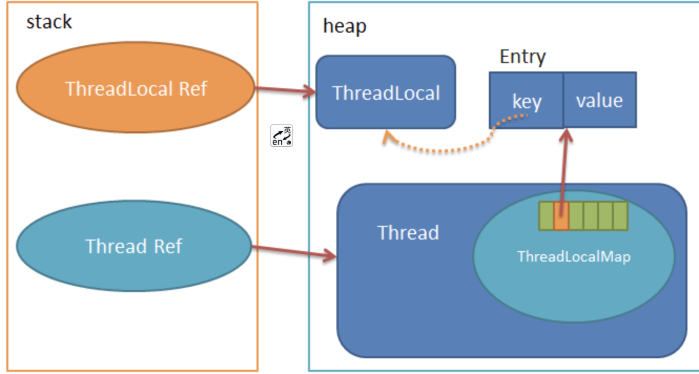

[TOC]

# ThreadLocal

ThreadLocal，很多地方叫做线程本地变量，也有些地方叫做线程本地存储，ThreadLocal 的作用是提供线程内的局部变量，这种变量在线程的生命周期内起作用，减少同一个线程内多个函数或者组件之间一些公共变量的传递的复杂度。

## 使用场景

最常见的 ThreadLocal 使用场景为 用来解决 数据库连接、Session 管理等：

```java
private static final ThreadLocal threadSession = new ThreadLocal(); 
public static Session getSession() throws InfrastructureException { 
  Session s = (Session) threadSession.get(); 
  try { 
    if (s == null) { 
      s = getSessionFactory().openSession(); 
      threadSession.set(s); 
    } 
  } catch (HibernateException ex) { 
    throw new InfrastructureException(ex); 
  } 
  return s; 
}
```

## 源码解析



可以看出每个Thread维护一个**ThreadLocalMap**，存储在ThreadLocalMap内的就是一个以Entry为元素的table数组，Entry就是一个key-value结构，key为ThreadLocal，value为存储的值。类比HashMap的实现，其实就是每个线程借助于一个哈希表，存储线程独立的值。我们可以看看Entry的定义：

```java
static class Entry extends WeakReference<ThreadLocal<?>> {
    /** The value associated with this ThreadLocal. */
    Object value;

    Entry(ThreadLocal<?> k, Object v) {
        super(k);
        value = v;
    }
}

```

这里ThreadLocal和key之间的线是虚线，因为Entry是继承了WeakReference实现的，当ThreadLocal Ref销毁时，指向堆中ThreadLocal实例的唯一一条强引用消失了，只有Entry有一条指向ThreadLocal实例的弱引用。

这时Entry里的key为null了，那么直到线程结束前，Entry中的value都是无法回收的，这里可能产生内存泄露。

### get方法

```java
public T get() {
        Thread t = Thread.currentThread();
        ThreadLocalMap map = getMap(t);
        if (map != null) {
            ThreadLocalMap.Entry e = map.getEntry(this);
            if (e != null) {
                @SuppressWarnings("unchecked")
                T result = (T)e.value;
                return result;
            }
        }
        return setInitialValue();
    }

```

1. 获取当前的Thread对象，通过getMap获取Thread内的ThreadLocalMap。
2. 如果map已经存在，以当前的ThreadLocal为键，获取Entry对象，并从从Entry中取出值。
3. 否则，调用setInitialValue进行初始化。

#### getMap

```java
ThreadLocal.ThreadLocalMap threadLocals = null; 

ThreadLocalMap getMap(Thread t) {
   return t.threadLocals;
}
```

### setInitialValue

```java
private T setInitialValue() {
    T value = initialValue();
    Thread t = Thread.currentThread();
    ThreadLocalMap map = getMap(t);
    if (map != null)
        map.set(this, value);
    else
        createMap(t, value);
    return value;
}
```

setInititialValue在Map不存在的时候调用

1. 首先是调用initialValue生成一个初始的value值，深入initialValue函数，我们可知**它就是返回一个null。**
2. 然后还是在get以下Map，如果map存在，则直接map.set。
3. 如果不存在则会调用createMap创建ThreadLocalMap。

### ThreadLocalMap

createMap方法的定义很简单：

```java
void createMap(Thread t, T firstValue) {
    t.threadLocals = new ThreadLocalMap(this, firstValue);
}
```

#### ThreadLocalMap的定义

```java
static class ThreadLocalMap {
    static class Entry extends WeakReference<ThreadLocal<?>> {
        /** The value associated with this ThreadLocal. */
      Object value;
      Entry(ThreadLocal<?> k, Object v) {
        super(k);
        value = v;
    }
}
  private static final int INITIAL_CAPACITY = 16;
  private Entry[] table;
  private int size = 0;
  private int threshold; // Default to 0
  private void setThreshold(int len) {
    threshold = len * 2 / 3;
}
  private static int nextIndex(int i, int len) {
    return ((i + 1 < len) ? i + 1 : 0);
  }
  private static int prevIndex(int i, int len) {
    return ((i - 1 >= 0) ? i - 1 : len - 1);
  }
}
```
1. 初始的容量为`INITIAL_CAPACITY = 16`。
2. 主要数据结构就是一个Entry的数组table。
3. size用于记录Map中实际存在的entry个数。
4. threshold是扩容上限，当size到达threashold时，需要resize整个Map，threshold的初始值为`len * 2 / 3`。
5. nextIndex和prevIndex则是为了安全的移动索引，后面的函数里经常用到。

而ThreadLocalMap的构造函数如下：

```java
ThreadLocalMap(ThreadLocal<?> firstKey, Object firstValue) {
    table = new Entry[INITIAL_CAPACITY];
    int i = firstKey.threadLocalHashCode & (INITIAL_CAPACITY - 1);
    table[i] = new Entry(firstKey, firstValue);
    size = 1;
    setThreshold(INITIAL_CAPACITY);
}
```

就是使用firstKey和firstValue创建一个Entry，计算好索引i，然后把创建好的Entry插入table中的i位置，再设置好size和threshold。

### map.getEntry

```java
private Entry getEntry(ThreadLocal<?> key) {
    int i = key.threadLocalHashCode & (table.length - 1);
    Entry e = table[i];
    if (e != null && e.get() == key)
        return e;
    else
        return getEntryAfterMiss(key, i, e);
}
```

1. 首先是计算索引位置i，通过计算key的hash%(table.length-1)得出；
2. 根据获取Entry，如果Entry存在且Entry的key恰巧等于ThreadLocal，那么直接返回Entry对象；
3. 否则，也就是在此位置上找不到对应的Entry，那么就调用getEntryAfterMiss。

#### getEntryAfterMiss

```java
private Entry getEntryAfterMiss(ThreadLocal<?> key, int i, Entry e) {
  Entry[] tab = table;
  int len = tab.length;
  while (e != null) { 
    ThreadLocal<?> k = e.get();
    if (k == key)
      return e;
    if (k == null)
        expungeStaleEntry(i);
    else
        i = nextIndex(i, len);
    e = tab[i];
}
  return null;
}
```
上一步是因为不满足`e != null && e.get() == key`才调用`getEntryAfterMiss`的。

- 所以首先e如果为null的话，那么`getEntryAfterMiss`还是直接返回null的。
- 如果是不满足`e.get() == key`，那么进入while循环，这里是不断循环，如果e一直不为空，那么就调用nextIndex，不断递增i，在此过程中一直会做两个判断：

1. 如果`k==key`,那么代表找到了这个所需要的Entry，直接返回；
2. 如果`k==null`，那么证明这个Entry中key已经为null,那么这个Entry就是一个过期对象，这里调用`expungeStaleEntry`清理该Entry。 这里解答了前面留下的一个坑，**即ThreadLocal Ref销毁时，ThreadLocal实例由于只有Entry中的一条弱引用指着，那么就会被GC掉，Entry的key没了，value可能会内存泄露的**，其实在每一个get，set操作时都会不断清理掉这种key为null的Entry的。

##### 为什么循环查找？

主要是因为处理哈希冲突的方法。

我们都知道HashMap采用拉链法处理哈希冲突，即在一个位置已经有元素了，就采用链表把冲突的元素链接在该元素后面。

**而ThreadLocal采用的是开放地址法**，即有冲突后，把要插入的元素放在要插入的位置后面为null的地方。所以上面的循环就是因为我们在第一次计算出来的i位置不一定存在key与我们想查找的key恰好相等的Entry，所以只能不断在后面循环，来查找是不是被插到后面了，直到找到为null的元素，因为若是插入也是到null为止的。

#### expungeStaleEntry

```java
private int expungeStaleEntry(int staleSlot) {
    Entry[] tab = table;
    int len = tab.length;

    // expunge entry at staleSlot
    tab[staleSlot].value = null;
    tab[staleSlot] = null;
    size--;

    // Rehash until we encounter null
    Entry e;
    int i;
    for (i = nextIndex(staleSlot, len);(e = tab[i]) != null; i = nextIndex(i, len)) {
        ThreadLocal<?> k = e.get();
        if (k == null) {
            e.value = null;
            tab[i] = null;
            size--;
        } else {
            int h = k.threadLocalHashCode & (len - 1);
            if (h != i) {
                tab[i] = null;

                // Unlike Knuth 6.4 Algorithm R, we must scan until
                // null because multiple entries could have been stale.
                while (tab[h] != null)
                    h = nextIndex(h, len);
                tab[h] = e;
            }
        }
    }
    return i;
}

```

主要有两部分：

1. **expunge entry at staleSlot**：这段主要是将i位置上的Entry的value设为null，Entry的引用也设为null，那么系统GC的时候自然会清理掉这块内存。
2. **Rehash until we encounter null**: **这段就是扫描位置staleSlot之后，null之前的Entry数组，清除每一个key为null的Entry，同时若是key不为空，做rehash，调整其位置。**

##### 为什么要做rehash呢？

因为我们在清理的过程中会把某个值设为null，那么这个值后面的区域如果之前是连着前面的，那么下次循环查找时，就会只查到null为止。

### set方法

**开放地址法:**

```java
public void set(T value) {
    Thread t = Thread.currentThread();
    ThreadLocalMap map = getMap(t);
    if (map != null)
        map.set(this, value);
    else
        createMap(t, value);
}
```

首先也是获取当前线程，根据线程获取到ThreadLocalMap，若是有ThreadLocalMap，则调用map.set(ThreadLocal<?> key, Object value),若是没有则调用createMap创建。

#### map.set

```java
private void set(ThreadLocal<?> key, Object value) {
    Entry[] tab = table;
    int len = tab.length;
    int i = key.threadLocalHashCode & (len-1);
    
    for (Entry e = tab[i]; e != null; e = tab[i = nextIndex(i, len)]) {
        ThreadLocal<?> k = e.get();
        if (k == key) {
            e.value = value;
            return;
        }
        if (k == null) {
            replaceStaleEntry(key, value, i);
            return;
        }
    }
    tab[i] = new Entry(key, value);
    int sz = ++size;
    if (!cleanSomeSlots(i, sz) && sz >= threshold)
        rehash();
}
```

1. 首先还是根据key计算出位置i，然后查找i位置上的Entry。
   - 若是Entry已经存在并且key等于传入的key，那么这时候直接给这个Entry赋新的value值。
   - 若是Entry存在，但是key为null，则调用replaceStaleEntry来更换这个key为空的Entry。
2. 不断循环检测，直到遇到为null的地方，这时候要是还没在循环过程中return，那么就在这个null的位置新建一个Entry，并且插入，同时size增加1。
3. 最后调用cleanSomeSlots，这个函数内部还是调用了上面提到的expungeStaleEntry函数清理key为null的Entry就行了，最后返回是否清理了Entry，接下来再判断`sz>thresgold`,这里就是判断是否达到了rehash的条件，达到的话就会调用rehash函数。

#### replaceStaleEntry

```java
private void replaceStaleEntry(ThreadLocal<?> key, Object value, int staleSlot) {
    Entry[] tab = table;
    int len = tab.length;
    Entry e;

    for (int i = prevIndex(staleSlot, len);(e = tab[i]) != null;i = prevIndex(i, len))
        if (e.get() == null)
            slotToExpunge = i;

    for (int i = nextIndex(staleSlot, len); (e = tab[i]) != null; i = nextIndex(i, len)) {
        ThreadLocal<?> k = e.get();
        if (k == key) {
            e.value = value;
            tab[i] = tab[staleSlot];
            tab[staleSlot] = e;
            // Start expunge at preceding stale entry if it exists
            if (slotToExpunge == staleSlot)
                slotToExpunge = i;
            cleanSomeSlots(expungeStaleEntry(slotToExpunge), len);
            return;
        }

        if (k == null && slotToExpunge == staleSlot)
            slotToExpunge = i;
    }

    // If key not found, put new entry in stale slot
    tab[staleSlot].value = null;
    tab[staleSlot] = new Entry(key, value);

    // If there are any other stale entries in run, expunge them
    if (slotToExpunge != staleSlot)
        cleanSomeSlots(expungeStaleEntry(slotToExpunge), len);
}

```

首先我们回想上一步是因为这个位置的Entry的key为null才调用replaceStaleEntry。

1. 第1个for循环：我们向前找到key为null的位置，记录为slotToExpunge,这里是为了后面的清理过程。
2. 第2个for循环：我们从staleSlot起到下一个null为止，若是找到key和传入key相等的Entry，就给这个Entry赋新的value值，并且把它和staleSlot位置的Entry交换，然后调用CleanSomeSlots清理key为null的Entry。
3. 若是一直没有key和传入key相等的Entry，那么就在staleSlot处新建一个Entry。函数最后再清理一遍空key的Entry。

### rehash

`sz > threshold`时调用*rehash*：

```java
private void rehash() {
    expungeStaleEntries();
    // Use lower threshold for doubling to avoid hysteresis
    if (size >= threshold - threshold / 4)
        resize();
}
```

#### resize

清理完空key的Entry后，如果size大于`3/4`的threshold，则调用**resize**函数：

```java
private void resize() {
    Entry[] oldTab = table;
    int oldLen = oldTab.length;
    int newLen = oldLen * 2;
    Entry[] newTab = new Entry[newLen];
    int count = 0;

    for (int j = 0; j < oldLen; ++j) {
        Entry e = oldTab[j];
        if (e != null) {
            ThreadLocal<?> k = e.get();
            if (k == null) {
                e.value = null; // Help the GC
            } else {
                int h = k.threadLocalHashCode & (newLen - 1);
                while (newTab[h] != null)
                    h = nextIndex(h, newLen);
                newTab[h] = e;
                count++;
            }
        }
    }

    setThreshold(newLen);
    size = count;
    table = newTab;
}
```

每次扩容大小扩展为原来的2倍，然后再一个for循环里，清除空key的Entry，同时重新计算key不为空。

### remove

最后一个需要探究的就是remove函数，它用于在map中移除一个不用的Entry。

也是先计算出hash值，若是第一次没有命中，就循环直到null，在此过程中也会调用expungeStaleEntry清除空key节点。代码如下：

```java
private void remove(ThreadLocal<?> key) {
    Entry[] tab = table;
    int len = tab.length;
    int i = key.threadLocalHashCode & (len-1);
    for (Entry e = tab[i];e != null;e = tab[i = nextIndex(i, len)]) {
         if (e.get() == key) {
            e.clear();
            expungeStaleEntry(i);
            return;
        }
    }
}

```

# 使用ThreadLocal的最佳实践

无论是set,get还是remove方法，过程中key为null的Entry都会被擦除，那么Entry内的value也就没有强引用链，GC时就会被回收。

那么怎么会存在内存泄露呢？但是以上的思路是假设你调用get或者set方法了，很多时候我们都没有调用过，所以最佳实践就是

1. 使用者需要手动调用remove函数，删除不再使用的ThreadLocal。