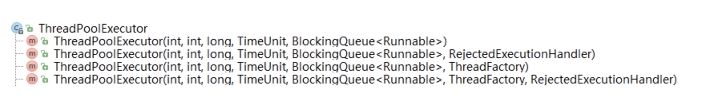

[TOC]

# ctl

ThreadPoolExecutor 类中有个非常重要的字段 ctl, ctl 其实可以理解为单词 control 的简写, 翻译过来就是 “控制”, 具体来说就是对线程池的运行状态和池子中有效线程的数量进行控制的一个字段. 我们看下该字段在源码中的定义:

```java
private final AtomicInteger ctl = new AtomicInteger(ctlOf(RUNNING, 0));
```

ctl 是一个 AtomicInteger 对象, 也就是一个特殊的 int 型变量, 特殊之处在于所有需要修改其数值的操作都是原子化的。

一个 ctl 变量可以包含两部分信息:

- 线程池的运行状态 (runState) 。
- 线程池内有效线程的数量 (workerCount).

 ctl 的高3位来表示线程池的运行状态, 用低29位来表示线程池内有效线程的数量。

由于 ctl 变量是由线程池的运行状态 (runState) 和线程池内有效线程的数量 (worerCount)这两个信息组合而成, 所以, 如果知道了这两部分信息各自的数值, 就可以调用下面的 ctlOf() 方法来计算出 ctl 的数值:

```java
// rs: 表示线程池的运行状态 (rs 是 runState中各单词首字母的简写组合)
// wc: 表示线程池内有效线程的数量 (wc 是 workerCount中各单词首字母的简写组合)
private static int ctlOf(int rs, int wc) { return rs | wc; }

private static int runStateOf(int c)     { return c & ~CAPACITY; }

private static int workerCountOf(int c)  { return c & CAPACITY; }

private static final int COUNT_BITS = Integer.SIZE - 3;     // 29
//也就是高3位是0, 低29位是1的一个int型的数,
private static final int CAPACITY = (1 << COUNT_BITS) - 1;  // COUNT_BITS == 29
```

# 线程池的运行状态

 线程池一共有五种状态, 分别是:

- RUNNING (运行状态)

  **能接受新提交的任务, 并且也能处理阻塞队列中的任务。**

- SHUTDOWN (关闭状态)
  
  - **不再接受新提交的任务, 但却可以继续处理阻塞队列中已保存的任务。**
  - 在线程池处于 RUNNING 状态时, 调用 shutdown()方法会使线程池进入到该状态。
  -  finalize() 方法在执行过程中或许也会隐式地进入该状态。
  
-  STOP
  
  - **不能接受新提交的任务, 也不能处理阻塞队列中已保存的任务, 并且会中断正在处理中的任务。**
  - 在线程池处于 RUNNING 或 SHUTDOWN 状态时, 调用 shutdownNow() 方法会使线程池进入到该状态.
  
- TIDYING (清理状态)
  
  - 所有的任务都已终止了, workerCount (有效线程数) 为0, 线程池进入该状态后会调用 terminated() 方法以让该线程池进入TERMINATED 状态。
  - 当线程池处于 SHUTDOWN 状态时, 如果此后**线程池内没有线程了并且阻塞队列内也没有待执行的任务了** ，线程池就会进入到该状态.。
  - 当线程池处于 STOP 状态时, 如果此后线程池内没有线程了, 线程池就会进入到该状态。
  
- TERMINATED 
  
   terminated() 方法执行完后就进入该状态。

这五种状态的具体数值如下:

```java
// runState is stored in the high-order bits
private static final int RUNNING    = -1 << COUNT_BITS;
private static final int SHUTDOWN   =  0 << COUNT_BITS;
private static final int STOP       =  1 << COUNT_BITS;
private static final int TIDYING    =  2 << COUNT_BITS;
private static final int TERMINATED =  3 << COUNT_BITS;
```

# 构造函数

前三个方法最终都会去调用第四个方法, 也就是参数数量最多的那个方法, 所以我们来看看这第四个方法的源码, 如下:

```java
public ThreadPoolExecutor(int corePoolSize,
                          int maximumPoolSize,
                          long keepAliveTime,
                          TimeUnit unit,
                          BlockingQueue<Runnable> workQueue,
                          ThreadFactory threadFactory,
                          RejectedExecutionHandler handler) {
    if (corePoolSize < 0 ||
        maximumPoolSize <= 0 ||
        maximumPoolSize < corePoolSize ||
        keepAliveTime < 0)
        throw new IllegalArgumentException();
    if (workQueue == null || threadFactory == null || handler == null)
        throw new NullPointerException();
    this.corePoolSize = corePoolSize;
    this.maximumPoolSize = maximumPoolSize;
    this.workQueue = workQueue;
    this.keepAliveTime = unit.toNanos(keepAliveTime);
    this.threadFactory = threadFactory;
    this.handler = handler;
}
```

## corePoolSize

```java
private volatile int corePoolSize;
```

corePoolSize 字段表示的是线程池中一直存活着的线程的最小数量, 这些一直存活着的线程又被称为核心线程。

默认情况下, 核心线程是按需创建并启动的, 也就是说, 只有当线程池接收到我们提交给他的任务后, 他才会去创建并启动一定数量的核心线程来执行这些任务。

如果有特殊需求的话, 我们也可以通过调用 prestartCoreThread() 或 prestartAllCoreThreads() 方法来改变这一机制, 使得在新任务还未提交到线程池的时候, 线程池就已经创建并启动了一个或所有核心线程, 并让这些核心线程在池子里等待着新任务的到来.

 ## maximumPoolSize

```java
private volatile int maximumPoolSize;
```

maximumPoolSize 表示线程池内能够容纳线程数量的最大值. 当然, 线程数量的最大值还不能超过常量 CAPACITY 的数值大小。

**如果我们提供的阻塞队列是一个无界的队列, 那么这里提供的 maximumPoolSize 的数值将毫无意义**。

1. 当我们通过方法 execute(Runnable) 提交一个任务到线程池时, 如果处于运行状态(RUNNING)的线程数量少于核心线程数(corePoolSize), 那么即使有一些非核心线程处于空闲等待状态, 系统也会倾向于创建一个新的线程来处理这个任务。
2.  如果此时处于运行状态(RUNNING)的线程数量大于核心线程数(corePoolSize), 但又小于最大线程数(maximumPoolSize), 那么系统将会去判断线程池内部的阻塞队列 workQueue 中是否还有空位子。
3. 如果发现有空位子, 系统就会将该任务先存入该阻塞队列。
4. 如果发现队列中已没有空位子(即: 队列已满), 系统就会新创建一个线程来执行该任务。

## keepAliveTime

```java
private volatile long keepAliveTime;
```

 keepAliveTime 表示空闲线程处于等待状态的超时时间(也即, 等待时间的上限值, 超过该时间后该线程会停止工作)。

1. 当总线程数大于 corePoolSize (核心线程数) 并且 allowCoreThreadTimeOut 为 false 时, 这些多出来的非核心线程一旦进入到空闲等待状态, 就开始计算各自的等待时间, 并用这里设定的 keepAliveTime 的数值作为他们的超时时间。
   - 一旦某个非核心线程的等待时间达到了超时时间, 该线程就会停止工作(terminated), 而核心线程在这种情况下却不会受超时机制的制约, 核心线程即使等待的时间超出了这里设定的 keepAliveTime, 也依然可以继续处于空闲等待状态而不会停止工作.。
2. 但是, 如果 allowCoreThreadTimeOut 被设置为 true 并且设置的 keepAliveTime > 0, 那么不论是非核心线程还是核心线程, 都将受超时机制的制约。

- 如果要执行的任务相对较多，并且每个任务执行的时间比较短，那么可以为该参数设置一个相对较大的数值，以提高线程的利用率。
- 如果执行的任务相对较少, 线程池使用率相对较低, 那么可以先将该参数设置为一个较小的数值, 通过超时停止的机制来降低系统线程资源的开销, 后续如果发现线程池的使用率逐渐增高以后, 线程池会根据当前提交的任务数自动创建新的线程。

## workQueue

workQueue 是一个内部元素为 Runnable的阻塞队列。

```java
private final BlockingQueue<Runnable> workQueue;
```

1. 如果线程池中正在运行的线程数少于核心线程数, 那么线程池总是倾向于创建一个新线程来执行该任务, 而不是将该任务提交到该队列 workQueue 中进行等待。
2. 如果线程池中正在运行的线程数不少于核心线程数, 那么线程池总是倾向于将该任务先提交到队列 workQueue 中先让其等待, 而不是创建一个新线程来执行该任务.
3.  如果线程池中正在运行的线程数不少于核心线程数, 并且线程池中的阻塞队列也满了使得该任务入队失败, 那么线程池会去判断当前池子中运行的线程数是否已经等于了该线程池允许运行的最大线程数 maximumPoolSize.。
   - 如果发现已经等于了, 说明池子已满, 无法再继续创建新的线程了, 那么就会拒绝执行该任务。
   - 如果发现运行的线程数小于池子允许的最大线程数, 那么就会创建一个线程来执行该任务。

队列对新提交的任务有三种常见的处理策略:

1. **直接切换 。**

   常用的队列是 SynchronousQueue (同步队列)。

   - 这种队列内部不会存储元素. 每一次插入操作都会先进入阻塞状态, 一直等到另一个线程执行了删除操作, 然后该插入操作才会执行。同样地, 每一次删除操作也都会先进入阻塞状态, 一直等到另一个线程执行了插入操作, 然后该删除操作才会执行。
   - 当提交一个任务到包含这种 SynchronousQueue 队列的线程池以后, 线程池会去检测是否有可用的空闲线程来执行该任务, 如果没有就直接新建一个线程来执行该任务而不是将该任务先暂存在队列中。
   - “直接切换”的意思就是, 处理方式由”将任务暂时存入队列”直接切换为”新建一个线程来处理该任务”。这种策略适合用来处理多个有相互依赖关系的任务, 因为该策略可以避免这些任务因一个没有及时处理而导致依赖于该任务的其他任务也不能及时处理而造成的锁定效果。
   -  因为这种策略的目的是要让几乎每一个新提交的任务都能得到立即处理, 所以这种策略通常要求最大线程数 maximumPoolSizes 是无界的(即: Integer.MAX_VALUE)。
   -  静态工厂方法 Executors.newCachedThreadPool() 使用了这个队列。

2. **使用无界队列**。 (也就是不预设队列的容量, 队列将使用 Integer.MAX_VALUE 作为其默认容量, 例如: 基于链表的阻塞队列 LinkedBlockingQueue)。

   - 使用无界队列将使得线程池中能够创建的最大线程数就等于核心线程数 corePoolSize, 这样线程池的 maximumPoolSize 的数值起不到任何作用。
   - 如果向这种线程池中提交一个新任务时发现所有核心线程都处于运行状态, 那么该任务将被放入无界队列中等待处理. 当要处理的多个任务之间没有任何相互依赖关系时, 就适合使用这种队列策略来处理这些任务。
   - 静态工厂方法 Executors.newFixedThreadPool() 使用了这个队列。

3. **使用有界队列。** (例如: 基于数组的阻塞队列 ArrayBlockingQueue)。

   - 当要求线程池的最大线程数 maximumPoolSizes 要限定在某个值以内时, 线程池使用有界队列能够降低资源的消耗, 但这也使得线程池对线程的调控变得更加困难。
   - 如果发现提交的任务经常频繁地发生阻塞的情况, 那么你就可以考虑增大线程池的容量, 可以通过调用 setMaximumPoolSize() 方法来重新设定线程池的容量。
   - 而设置较小的队列容量时, 通常需要将线程池的容量设置大一点, 这种情况下, CPU的使用率会相对较高, 当然如果线程池的容量设置过大的话, 可能会有非常非常多的线程来同时处理提交来的多个任务, 并发数过大时, 线程之间的调度将会是个非常严峻的问题, 这反而有可能降低任务处理的吞吐量, 出现过犹不及的局面.

## threadFactory

```java
private volatile ThreadFactory threadFactory;
```

hreadFactory 线程工厂, 用于创建线程. 如果我们在创建线程池的时候未指定该 threadFactory 参数, 线程池则会使用 Executors.defaultThreadFactory() 方法创建默认的线程工厂。

 如果我们想要为线程工厂创建的线程设置一些特殊的属性, 例如: 设置见名知意的名字, 设置特定的优先级等等, 那么我们就需要自己去实现 ThreadFactory 接口：

- 并在实现其抽象方法 newThread()的时候, 使用Thread类包含 threadName (线程名字)的那个构造方法就可以指定线程的名字(通常可以指定见名知意的名字),。
- 还可以用 setPriority() 方法为线程设置特定的优先级等。

然后在创建线程池的时候, 将我们自己实现的 ThreadFactory 接口的实现类对象作为 threadFactory 参数的值传递给线程池的构造方法即可.

## handler

```java
private volatile RejectedExecutionHandler handler;
```

以下两个条件满足其中任意一个的时候, 如果继续向该线程池中提交新的任务, 那么线程池将会调用他内部的 RejectedExecutionHandler 对象(也就是 handler)的 rejectedExecution()方法, 表示拒绝执行这些新提交的任务:

1. 当线程池处于 SHUTDOWN (关闭) 状态时 (不论线程池和阻塞队列是否都已满)。
2. 当线程池中的所有线程都处于运行状态并且线程池中的阻塞队列已满时。

默认情况下线程池是使用抛异常的方式来拒绝新提交的任务的, 这种抛异常的方式在线程池中被称为 AbortPolicy。

 当然, 除了这种 AbortPolicy 方式外, 线程池还为我们提供了 CallerRunsPolicy, DiscardPolicy和 DiscardOldestPolicy 的方式：

1. **AbortPolicy**

    如果在 ThreadPoolExecutor 的构造方法中未指定 RejectedExecutionHandler 参数, 那么线程池将使用他内部预定义的 defaultHandler 这个字段作为该参数的值, 而这个 defaultHandler 就是采用的 AbortPolicy 抛异常的方式 。

2. **CallerRunsPolicy**

   将新提交的任务放在 ThreadPoolExecutor.execute()方法所在的那个线程中执行。

3. **DiscardPolicy**

   直接不执行新提交的任务。

4. **DiscardOldestPolicy**

   ```java
   public static class DiscardOldestPolicy implements RejectedExecutionHandler {
    
       public DiscardOldestPolicy() { }
       public void rejectedExecution(Runnable r, ThreadPoolExecutor e) {
           if (!e.isShutdown()) {
               e.getQueue().poll();
               e.execute(r);
           }
       }
   }
   ```

   这种处理方式分为两种情况:

   1. 当线程池已经关闭 (SHUTDOWN) 时, 就不执行这个任务了, 这也是 DiscardPolicy 的处理方式。
   2. 当线程池未关闭时, **会将阻塞队列中处于队首 (head) 的那个任务从队列中移除, 然后再将这个新提交的任务加入到该阻塞队列的队尾 (tail) 等待执行。**

# 三种类型

## newFixedThreadPool

```java
public static ExecutorService newFixedThreadPool(int nThreads) {
        return new ThreadPoolExecutor(nThreads, nThreads,
                                      0L, TimeUnit.MILLISECONDS,
                                      new LinkedBlockingQueue<Runnable>());
    }

```

线程池的线程数量达corePoolSize后，即使线程池没有可执行任务时，也不会释放线程。

FixedThreadPool的工作队列为无界队列`LinkedBlockingQueue`(队列容量为`Integer.MAX_VALUE`), 这会导致以下问题:

- 线程池里的线程数量不超过`corePoolSize`,这导致了`maximumPoolSize`和`keepAliveTime`将会是个无用参数。
- 由于使用了无界队列, 所以FixedThreadPool永远不会拒绝, 即饱和策略失效 

## newSingleThreadExecutor

```java
public static ExecutorService newSingleThreadExecutor() {
        return new FinalizableDelegatedExecutorService
            (new ThreadPoolExecutor(1, 1,
                                    0L, TimeUnit.MILLISECONDS,
                                    new LinkedBlockingQueue<Runnable>()));
    }

```

- 初始化的线程池中只有一个线程，如果该线程异常结束，会重新创建一个新的线程继续执行任务，唯一的线程可以保证所提交任务的顺序执行。
- 由于使用了无界队列, 所以SingleThreadPool永远不会拒绝, 即饱和策略失效。

## newCachedThreadPool

```java
public static ExecutorService newCachedThreadPool() {
        return new ThreadPoolExecutor(0, Integer.MAX_VALUE,
                                      60L, TimeUnit.SECONDS,
                                      new SynchronousQueue<Runnable>());
    }
```

1. 线程池的线程数可达到Integer.MAX_VALUE，即2147483647，内部使用SynchronousQueue作为阻塞队列。
2. 和newFixedThreadPool创建的线程池不同，newCachedThreadPool在没有任务执行时，当线程的空闲时间超过keepAliveTime，会自动释放线程资源，当提交新任务时，如果没有空闲线程，则创建新线程执行任务，会导致一定的系统开销。

执行过程与前两种稍微不同:

1. 主线程调用SynchronousQueue的offer()方法放入task, 倘若此时线程池中有空闲的线程尝试读取 SynchronousQueue的task, 即调用了SynchronousQueue的poll(), 那么主线程将该task交给空闲线程。
2.  当线程池为空或者没有空闲的线程, 则创建新的线程执行任务。
3. 执行完任务的线程倘若在60s内仍空闲, 则会被终止. 因此长时间空闲的CachedThreadPool不会持有任何线程资源.

# 关闭线程池

## 原理

遍历线程池中的所有线程，然后逐个调用线程的`interrupt`方法来中断线程.

## 关闭方式

- shutdown
  将线程池里的线程状态设置成SHUTDOWN状态, 然后**中断所有没有正在执行任务的线程。**
- shutdownNow
  将线程池里的线程状态设置成STOP状态, 然后**停止所有正在执行或暂停任务的线程。**

只要调用这两个关闭方法中的任意一个, `isShutDown()` 返回true。
当所有任务都成功关闭了, `isTerminated()`返回true。

