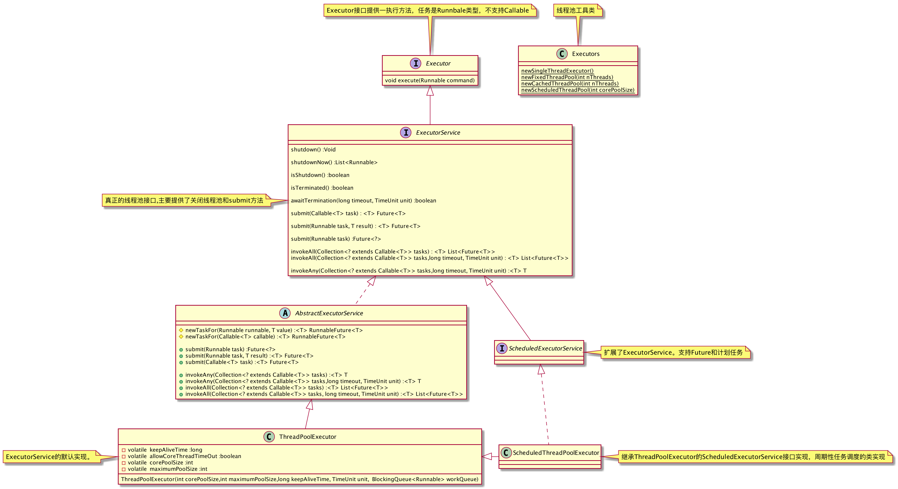

[TOC]

# 继承结构图



# 线程池

## newCachedThreadPool

对于执行很多短期异步任务的程序而言，这些线程池通常可提高程序性能。

- 创建一个可根据需要创建新线程的线程池，**但是在以前构造的线程可用时将重用它们。**
- 调用 execute 将重用以前构造的线程（如果线程可用）。**如果现有线程没有可用的，则创建一个新线程并添加到池中**。终止并从缓存中移除那些已有 60 秒钟未被使用的线程。因此，长时间保持空闲的线程池不会使用任何资源。

##  newFixedThreadPool

- 创建一个可重用固定线程数的线程池，以**共享的无界队列方式**来运行这些线程。
- 如果在所有线程处于活动状态时提交附加任务，则在有可用线程之前，附加任务将在队列中等待。
- 如果在关闭前的执行期间由于失败而导致任何线程终止，那么一个新线程将代替它执行后续的任务（如果需要）。
- 在某个线程被显式地关闭之前，池中的线程将一直存在。

## newScheduledThreadPool

创建一个线程池，它可安排在给定延迟后运行命令或者定期地执行。

```java
ScheduledExecutorService scheduledThreadPool= Executors.newScheduledThreadPool(3);
scheduledThreadPool.schedule(newRunnable(){ 
  @Override 
  public void run() {
    System.out.println("延迟三秒");
  }
}, 3, TimeUnit.SECONDS);
scheduledThreadPool.scheduleAtFixedRate(newRunnable(){ 
  @Override 
  public void run() {
    System.out.println("延迟 1 秒后每三秒执行一次"); }
},1,3,TimeUnit.SECONDS);
```

## newSingleThreadExecutor

Executors.newSingleThreadExecutor()返回一个线程池（这个线程池只有一个线程）,这个线程池可以在线程死后（或发生异常时）重新启动一个线程来替代原来的线程继续执行下去。

# 线程池的组成

一般的线程池主要分为以下 4 个组成部分：

1. 线程池管理器：用于创建并管理线程池。
2. 工作线程：线程池中的线程。
3. 任务接口：每个任务必须实现的接口，用于工作线程调度其运行。
4. 任务队列：用于存放待处理的任务，提供一种缓冲机制。

ThreadPoolExecutor 的构造方法如下：

```java
public ThreadPoolExecutor(int corePoolSize,int maximumPoolSize, long keepAliveTime,
                          TimeUnit unit, BlockingQueue<Runnable> workQueue) {
  this(corePoolSize, maximumPoolSize, keepAliveTime, unit, workQueue,
       Executors.defaultThreadFactory(), defaultHandler);
}
```

1. corePoolSize：指定了线程池中的线程数量。
2. maximumPoolSize：指定了线程池中的最大线程数量。
3. keepAliveTime：当前线程池数量超过 corePoolSize 时，多余的空闲线程的存活时间，即多次时间内会被销毁。
4. unit：keepAliveTime 的单位。
5. workQueue：任务队列，被提交但尚未被执行的任务。
6. threadFactory：线程工厂，用于创建线程，一般用默认的即可。
7. handler：拒绝策略，当任务太多来不及处理，如何拒绝任务。

## **拒绝策略**

线程池中的线程已经用完了，无法继续为新任务服务，同时，等待队列也已经排满了，再也塞不下新任务了。这时候我们就需要拒绝策略机制合理的处理这个问题。

-  AbortPolicy ： 直接抛出异常，阻止系统正常运行。
-  CallerRunsPolicy ： 只要线程池未关闭，该策略直接在调用者线程中，运行当前被丢弃的任务。显然这样做不会真的丢弃任务，但是，任务提交线程的性能极有可能会急剧下降。
-  DiscardOldestPolicy ： 丢弃最老的一个请求，也就是即将被执行的一个任务，并尝试再次提交当前任务。
-   DiscardPolicy ： 该策略默默地丢弃无法处理的任务，不予任何处理。如果允许任务丢失，这是最好的一种方案。

以上内置拒绝策略均实现了 RejectedExecutionHandler 接口，若以上策略仍无法满足实际需要，完全可以自己扩展 RejectedExecutionHandler 接口。

# **Java 线程池工作过程**

1. 线程池刚创建时，里面没有一个线程。任务队列是作为参数传进来的。不过，就算队列里面有任务，线程池也不会马上执行它们。
2. 当调用 execute() 方法添加一个任务时，线程池会做如下判断：
   - 如果正在运行的线程数量小于 corePoolSize，那么马上创建线程运行这个任务。
   - 如果正在运行的线程数量大于或等于 corePoolSize，那么将这个任务放入队列
   - 如果这时候队列满了，而且正在运行的线程数量小于 maximumPoolSize，那么还是要创建非核心线程立刻运行这个任务。
   - 如果队列满了，而且正在运行的线程数量大于或等于 maximumPoolSize，那么线程池会抛出异常 RejectExecutionException。
3. 当一个线程完成任务时，它会从队列中取下一个任务来执行。
4. 当一个线程无事可做，超过一定的时间（keepAliveTime）时，线程池会判断，如果当前运行的线程数大于 corePoolSize，那么这个线程就被停掉。所以线程池的所有任务完成后，它最终会收缩到 corePoolSize 的大小。

