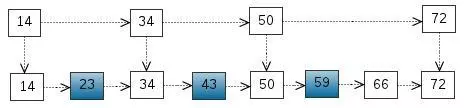
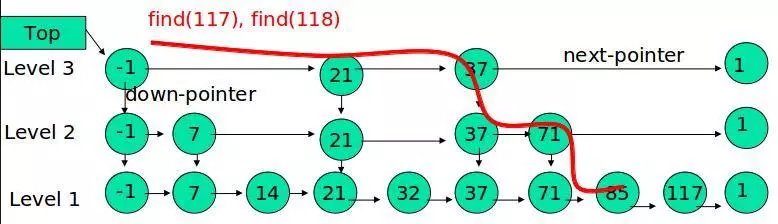
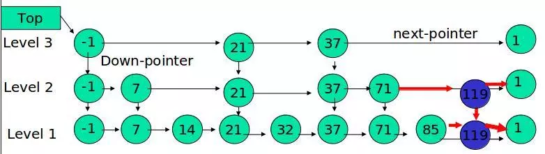
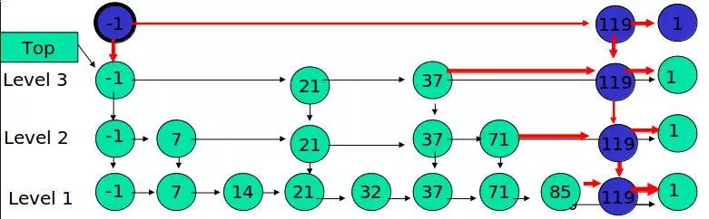

1. **Redis 单线程为什么还能这么快？**

   因为它所有的数据都在内存中，所有的运算都是内存级别的运算（纳秒），而且单线程避免了多线程的切换（上下文切换）性能损耗问题。正因为 Redis 是单线程，所以要小心使用 Redis 指令，对于那些耗时的指令(比如keys)，一定要谨慎使用，一不小心就可能会导致 Redis 卡顿。

2. #### **redis也可以进行发布订阅消息吗？**

   可以。每隔2秒哨兵节点会发布对某节点的判断和自身的信息到某频道，每个哨兵订阅该频道获取其他哨兵节点和主从节点的信息，以达到哨兵间互相监控和对主从节点的监控）和很多专业的消息队列系统（例如Kafka、RocketMQ）相比，Redis的发布订阅略显粗糙，例如无法实现消息堆积和回溯。但胜在足够简单。

3. #### **redis能否将数据持久化，如何实现？**

   能，将内存中的数据异步写入硬盘中，两种方式：RDB（默认）和AOF　

   **针对RDB方式的持久化，手动触发可以使用：**

   - save：会阻塞当前Redis服务器，直到持久化完成，线上应该禁止使用。
   - bgsave：该触发方式会fork一个子进程，由子进程负责持久化过程，因此阻塞只会发生在fork子进程的时候。

   AOF的整个流程大体来看可以分为两步，一步是命令的实时写入（如果是 `appendfsync everysec` 配置，会有1s损耗），第二步是对aof文件的重写。对于增量追加到文件这一步主要的流程是：命令写入=》追加到aof_buf =》同步到aof磁盘。如果实时写入磁盘会带来非常高的磁盘IO，影响整体性能。

   aof重写是为了减少aof文件的大小，可以手动或者自动触发。fork的操作也是发生在重写这一步，也是这里会对主进程产生阻塞。

   **手动触发：** `bgrewriteaof`

   1. 在重写期间，由于主进程依然在响应命令，为了保证最终备份的完整性；因此它依然会写入旧的AOF file中，如果重写失败，能够保证数据不丢失。
   2. 为了把重写期间响应的写入信息也写入到新的文件中，因此也会为子进程保留一个buf，防止新写的file丢失数据。
   3. 重写是直接把当前内存的数据生成对应命令，并不需要读取老的AOF文件进行分析、命令合并。
   4. AOF文件直接采用的文本协议，主要是兼容性好、追加方便、可读性高可认为修改修复。

4. #### **主从复制模式下，主挂了怎么办？redis提供了哨兵模式（高可用）**

   哨兵启动后会与要监控的主数据库建立两条连接

   和主数据库连接建立完成后，哨兵会使用连接2发送如下命令:

   1. 每10秒钟哨兵会向主数据库和从数据库发送INFO 命令

      首先,发送INFO命令会返回当前数据库的相关信息(运行id，从数据库信息等)从而实现新节点的自动发现，进而和这两个从数据库分别建立两个连接。在此之后哨兵会每个10秒钟向已知的主从数据库发送INFO命令来获取信息更新并进行相应的操作。

   2. 每2秒钟哨兵会向主数据库和从数据的_sentinel_:hello频道发送自己的消息。

      哨兵通过监听的_sentinel_:hello频道接收到其他哨兵发送的消息后会判断哨兵是不是新发现的哨兵，如果是则将其加入已发现的哨兵列表中并创建一个到其的连接(哨兵与哨兵只会创建用来发送PING命令的连接，不会创建订阅频道的连接)。

   3. 每1秒钟哨兵会向主数据、从数据库和其他哨兵节点发送PING命令。

      own-after-milliseconds的值小于1秒时，哨兵会每隔down-after-milliseconds指定的时间发送一次PING命令，当down-after-milliseconds的值大于1秒时，哨兵会每隔1秒发送一次PING命令。

   ### 主观下线

     当超过down-after-milliseconds指定时间后，如果被PING的数据库或节点仍然未回复，则哨兵认为其主观下线(subjectively down),

   ### 客观下线

     在**主观下线**后，如果该节点是主数据库，则哨兵会进一步判断是否需要对其进行故障恢复，哨兵发送SENTINEL is-master-down-by-addr 命令询问其他哨兵节点以了解他们是否也认为该主数据库主观下线，如果达到指定数量时，哨兵会认为其客观下线(objectively down),并选举领头的哨兵节点对主从系统发起故障恢复。指定数量就是配置的 quorum参数。

   ```javascript
   sentinel monitor mymaster 127.0.0.1 6380 2
   ```

   选举领头哨兵的过程使用了Raft算法.

   故障恢复步骤如下

   1. 首先领头哨兵将从停止服务的主数据库的从数据库中挑选一个来充当新的主数据库。

   | 序号 | 挑选依据                                                     |
   | :--- | :----------------------------------------------------------- |
   | 1    | 所有在线的从数据库中，选择优先级最高的从数据库。优先级通过replica-priority参数设置 |
   | 2    | 优先级相同，则复制的命令偏移量越大(复制越完整)越优先         |
   | 3    | 如果以上都一样，则选择运行ID较小的从数据库                   |

   2. 选出一个从数据库后，领头哨兵将向从数据库发送SLAVEOF NO ONE命令使其升格为主数据库，而后领头哨兵向其他从数据库发送 SLAVEOF命令来使其成为新主数据库的从数据库，最后一步则是更新内部的记录，将已经停止服务的旧的主数据库更新为新的主数据库的从数据库，使得当其恢复服务时自动以从数据库的身份继续服务

5. #### redis集群（**采用虚拟槽方式**，高可用）原理（和哨兵模式原理类似，3.0版本或以上才有）？**

   在Cluster推出之前，可用性要靠Sentinel保证。有了集群之后也自动具有了Sentinel的监控和自动Failover能力。

   redis cluster有固定的16384个hash slot，对每个key计算CRC16值，然后对16384取模，可以获取key对应的hash slot

   redis cluster中每个master都会持有部分slot，比如有3个master，那么可能每个master持有5000多个hash slot.hash slot让node的增加和移除很简单，增加一个master，就将其他master的hash slot移动部分过去，减少一个master，就将它的hash slot移动到其他master上去,移动hash slot的成本是非常低的,客户端的api，可以对指定的数据，让他们走同一个hash slot，通过hash tag来实现. 

   127.0.0.1:7000>CLUSTER ADDSLOTS 0 1 2 3 4 ... 5000  可以将槽0-5000指派给节点7000负责。

   每个节点都会记录哪些槽指派给了自己，哪些槽指派给了其他节点。客户端向节点发送键命令，节点要计算这个键属于哪个槽。如果是自己负责这个槽，那么直接执行命令，如果不是，向客户端返回一个MOVED错误，指引客户端转向正确的节点。

   redis cluster默认是不支持slave节点读或者写的，跟我们手动基于replication搭建的主从架构不一样的.jedis客户端，对redis cluster的读写分离支持不太好的,默认的话就是读和写都到master上去执行的.

   ```
   Gossip 过程是由种子节点发起，当一个种子节点有状态需要更新到网络中的其他节点时，它会随机的选择周围几个节点散播消息，收到消息的节点也会重复该过程，直至最终网络中所有的节点都收到了消息。
   （1）Gossip 是周期性的散播消息，把周期限定为 1 秒
   （2）被感染节点随机选择 k 个邻接节点（fan-out）散播消息，这里把 fan-out 设置为 3，每次最多往 3 个节点散播。
   （3）每次散播消息都选择尚未发送过的节点进行散播
   （4）收到消息的节点不再往发送节点散播，比如 A -> B，那么 B 进行散播的时候，不再发给 A。
   Gossip 的特点（优势）
   1）扩展性 2）容错 3）去中心化 4）一致性收敛 5）简单
   Gossip 的缺陷
   1）消息的延迟 
   由于 Gossip 协议中，节点只会随机向少数几个节点发送消息，消息最终是通过多个轮次的散播而到达全网的，因此使用 Gossip 协议会造成不可避免的消息延迟。不适合用在对实时性要求较高的场景下。
   2）消息冗余
   Gossip 有两种类型：
   Anti-Entropy（反熵）：以固定的概率传播所有的数据.一个节点会把所有的数据都跟其他节点共享，以便消除节点之间数据的任何不一致，它可以保证最终、完全的一致。这对一个系统来说是一个巨大的开销。
   Rumor-Mongering（谣言传播）：仅传播新到达的数据.一个 Rumor 消息在某个时间点之后会被标记为 removed，并且不再被传播，因此，SIR model 下，系统有一定的概率会不一致。
   在 Gossip 协议下，网络中两个节点之间有三种通信方式:
   Push: 节点 A 将数据 (key,value,version) 及对应的版本号推送给 B 节点，B 节点更新 A 中比自己新的数据
   Pull：A 仅将数据 key, version 推送给 B，B 将本地比 A 新的数据（Key, value, version）推送给 A，A 更新本地
   Push/Pull：与 Pull 类似，只是多了一步，A 再将本地比 B 新的数据推送给 B，B 则更新本地
   如果把两个节点数据同步一次定义为一个周期，则在一个周期内，Push 需通信 1 次，Pull 需 2 次，Push/Pull 则需 3 次。虽然消息数增加了，但从效果上来讲，Push/Pull 最好，理论上一个周期内可以使两个节点完全一致。直观上，Push/Pull 的收敛速度也是最快的。
   ```

   redis cluster节点间采取gossip协议进行通信,每个节点都有一个专门用于节点间通信的端口，就是自己提供服务的端口号+10000，比如7001，那么用于节点间通信的就是17001端口.节点每隔一段时间都会往另外几个节点发送ping消息，同时其他几点接收到ping之后返回pong.

   gossip协议包含多种消息，包括ping，pong，meet，fail，等等

   　　meet: 某个节点发送meet给新加入的节点，让新节点加入集群中，然后新节点就会开始与其他节点进行通信,发送了一个gossip meet消息，给新加入的节点，通知那个节点去加入集群

   　　ping: 每个节点都会频繁给其他节点发送ping，其中包含自己的状态还有自己维护的集群元数据，互相通过ping交换元数据,每个节点每秒都会频繁发送ping给其他的集群，ping，频繁的互相之间交换数据，互相进行元数据的更新

   　　pong: 返回ping和meet，包含自己的状态和其他信息，也可以用于信息广播和更新

   　　fail: 某个节点判断另一个节点fail之后，就发送fail给其他节点，通知其他节点，指定的节点宕机了.

   客户端可能会挑选任意一个redis实例去发送命令，每个redis实例接收到命令，都会计算key对应的hash slot.如果在本地就在本地处理，否则返回moved给客户端，让客户端进行重定向.cluster keyslot mykey，可以查看一个key对应的hash slot是什么.用redis-cli的时候，可以加入-c参数，支持自动的请求重定向，redis-cli接收到moved之后，会自动重定向到对应的节点执行命令.

   计算hash slot的算法，就是根据key计算CRC16值，然后对16384取模，拿到对应的hash slot.用hash tag可以手动指定key对应的slot，同一个hash tag下的key，都会在一个hash slot中，比如set mykey1:{100}和set mykey2:{100}.节点间通过gossip协议进行数据交换，就知道每个hash slot在哪个节点上.

   redis cluster的高可用的原理，几乎跟哨兵是类似的,如果一个节点认为另外一个节点宕机，那么就是pfail，主观宕机.如果多个节点都认为另外一个节点宕机了，那么就是fail，客观宕机，跟哨兵的原理几乎一样.在cluster-node-timeout内，某个节点一直没有返回pong，那么就被认为pfail。如果一个节点认为某个节点pfail了，那么会在gossip ping消息中，ping给其他节点，如果超过半数的节点都认为pfail了，那么就会变成fail。

   检查每个slave node与master node断开连接的时间，如果超过了cluster-node-timeout * cluster-slave-validity-factor，那么就没有资格切换成master。

   对所有从节点进行排序，slave priority，offset，run id。每个从节点，都根据自己对master复制数据的offset，来设置一个选举时间，offset越大（复制数据越多）的从节点，选举时间越靠前，优先进行选举。所有的master node开始slave选举投票，给要进行选举的slave进行投票，如果大部分master node（N/2 + 1）都投票给了某个从节点，那么选举通过，那个从节点可以切换成master。从节点执行主备切换，从节点切换为主节点.

   - 当slave发现自己的master变为FAIL状态时，便尝试进行Failover，以期成为新的master。由于挂掉的master可能会有多个slave，从而存在多个slave竞争成为master节点的过程， 其过程如下：
     1.slave发现自己的master变为FAIL
     2.将自己记录的集群currentEpoch加1，并广播FAILOVER_AUTH_REQUEST信息
     3.其他节点收到该信息，只有master响应，判断请求者的合法性，并发送FAILOVER_AUTH_ACK，对每一个epoch只发送一次ack
     4.尝试failover的slave收集FAILOVER_AUTH_ACK
     5.超过半数后变成新Master
     6.广播Pong通知其他集群节点。
     从节点并不是在主节点一进入 FAIL 状态就马上尝试发起选举，而是有一定延迟，一定的延迟确保我们等待FAIL状态在集群中传播，slave如果立即尝试选举，其它masters或许尚未意识到FAIL状态，可能会拒绝投票

6. #### **缓存更新策略（即如何让缓存和mysql保持一致性）？**

   惰性过期（类比懒加载，这是懒过期）：只有当访问一个key时，才会判断该key是否已过期，过期则清除。该策略可以最大化地节省CPU资源，却对内存非常不友好。极端情况可能出现大量的过期key没有再次被访问，从而不会被清除，占用大量内存。

   定期过期：每隔一定的时间，会扫描一定数量的数据库的expires字典中一定数量的key，并清除其中已过期的key。该策略是前两者的一个折中方案。通过调整定时扫描的时间间隔和每次扫描的限定耗时，可以在不同情况下使得CPU和内存资源达到最优的平衡效果。

   expires字典会保存所有设置了过期时间的key的过期时间数据，其中，key是指向键空间中的某个键的指针，value是该键的毫秒精度的UNIX时间戳表示的过期时间。键空间是指该Redis集群中保存的所有键。

   比如这么个场景，我设计了很多key，过期时间是5分钟，当前内存占用率是50%。但是5分钟到了，内存占用率还是很高，请问为什么？

   Redis中同时使用了惰性过期和定期过期两种过期策略，即使过期时间到了，但是有部分并没有真正删除，等待惰性删除。

   为什么有定期还要有惰性呢？其实很简单，比如10万个key就要过期了，Redis默认是100ms检查一波。如果他检查出10万个即将要清除，那他接下来的时间基本都是在干这些清空内存的事了，那肯定影响性能，所以他只会部分删除，剩下的等惰性

7. **Redis的内存淘汰策略**

   noeviction：当内存不足以容纳新写入数据时，新写入操作会报错。

   allkeys-lru：当内存不足以容纳新写入数据时，在键空间中，移除最近最少使用的key。

   allkeys-random：当内存不足以容纳新写入数据时，在键空间中，随机移除某个key。

   volatile-lru：当内存不足以容纳新写入数据时，在设置了过期时间的键空间中，移除最近最少使用的key。

   volatile-random：当内存不足以容纳新写入数据时，在设置了过期时间的键空间中，随机移除某个key。

   volatile-ttl：当内存不足以容纳新写入数据时，在设置了过期时间的键空间中，有更早过期时间的key优先移除。

8. #### **如何防止缓存穿透？**

   1. 缓存空对象，空值做了缓存，意味着缓存层中存了更多的键，需要更多的内存空间（如果是攻击，问题更严重），比较有效的方法是针对这类数据设置一个较短的过期时间，让其自动剔除。
   2. **布隆过滤器：**

9. #### Redis主从同步原理-SYNC

   Redis全量复制一般发生在Slave初始化阶段，这时Slave需要将Master上的所有数据都复制一份。具体步骤如下： 

   　　1）从服务器连接主服务器，发送SYNC命令； 

   　　2）主服务器接收到SYNC命名后，开始执行BGSAVE命令生成RDB文件并使用缓冲区记录此后执行的所有写命令； 

   　　3）主服务器BGSAVE执行完后，向所有从服务器发送快照文件，并在发送期间继续记录被执行的写命令； 

   　　4）从服务器收到快照文件后丢弃所有旧数据，载入收到的快照； 

   　　5）主服务器快照发送完毕后开始向从服务器发送缓冲区中的写命令； 

   　　6）从服务器完成对快照的载入，开始接收命令请求，并执行来自主服务器缓冲区的写命令； 

    2 增量同步

   　　Redis增量复制是指Slave初始化后开始正常工作时主服务器发生的写操作同步到从服务器的过程。 

   增量复制的过程主要是主服务器每执行一个写命令就会向从服务器发送相同的写命令，从服务器接收并执行收到的写命令。

   ### 主从节点各自复制偏移量：

   1. **参与复制的主从节点都会维护自身的复制偏移量。**      
   2. **主节点在处理完写入命令后，会把命令的字节长度做累加记录，统计信息在 info replication 中的 masterreploffset 指标中。**      
   3. **从节点每秒钟上报自身的的复制偏移量给主节点，因此主节点也会保存从节点的复制偏移量。**        
   4. **从节点在接收到主节点发送的命令后，也会累加自身的偏移量，统计信息在 info replication 中。**       
   5. **通过对比主从节点的复制偏移量，可以判断主从节点数据是否一致。**

   ### 主节点复制积压缓冲区：

   1. 复制积压缓冲区是一个保存在主节点的一个固定长度的先进先出的队列，默认大小 1MB。        
   2. 这个队列在 slave 连接是创建。这时主节点响应写命令时，不但会把命令发送给从节点，也会写入复制缓冲区。        
   3. 他的作用就是用于部分复制和复制命令丢失的数据补救。通过 info replication 可以看到相关信息。

   ### 主节点运行 ID：

   1. 每个 redis 启动的时候，都会生成一个 40 位的运行 ID。        
   2. 运行 ID 的主要作用是用来识别 Redis 节点。如果使用 ip+port 的方式，那么如果主节点重启修改了 RDB/AOF 数据，从节点再基于偏移量进行复制将是不安全的。所以，当运行 id 变化后，从节点将进行全量复制。也就是说，redis 重启后，默认从节点会进行全量复制。

   ### psync 命令的使用方式：

   　　命令格式为  `psync{runId}{offset}`

   　　runId：从节点所复制主节点的运行 id        

   　　offset：当前从节点已复制的数据偏移量

   主节点会根据 runid 和 offset 决定返回结果：

   1. 如果回复 +FULLRESYNC {runId} {offset} ，那么从节点将触发全量复制流程。      
   2. 如果回复 +CONTINUE，从节点将触发部分复制。        
   3. 如果回复 +ERR，说明主节点不支持 2.8 的 psync 命令，将使用 sync 执行全量复制。

   1. 发送 psync 命令（spync ？ -1）        
   2. 主节点根据命令返回 FULLRESYNC        
   3. 从节点记录主节点 ID 和 offset        
   4. **主节点 bgsave 并保存 RDB 到本地**
   5. **主节点发送 RBD 文件到从节点**
   6. **从节点收到 RDB 文件并加载到内存中**
   7. 主节点在从节点接受数据的期间，将新数据保存到“复制客户端缓冲区”，当从节点加载 RDB 完毕，再发送过去。（如果从节点花费时间过长，将导致缓冲区溢出，最后全量同步失败）   
   8. **从节点清空数据后加载 RDB 文件，如果 RDB 文件很大，这一步操作仍然耗时，如果此时客户端访问，将导致数据不一致，可以使用配置slave-server-stale-data 关闭.**        
   9. **从节点成功加载完 RBD 后，如果开启了 AOF，会立刻做 bgrewriteaof。**
   10. 如过 RDB 文件大于 6GB，并且是千兆网卡，Redis 的默认超时机制（60 秒），会导致全量复制失败。可以通过调大 repl-timeout 参数来解决此问题。        

   当从节点正在复制主节点时，如果出现网络闪断和其他异常，从节点会让主节点补发丢失的命令数据，主节点只需要将复制缓冲区的数据发送到从节点就能够保证数据的一致性，相比较全量复制，成本小很多。

   1. 当从节点出现网络中断，超过了 repl-timeout 时间，主节点就会中断复制连接。
   2. 主节点会将请求的数据写入到“复制积压缓冲区”，默认 1MB。
   3. 当从节点恢复，重新连接上主节点，从节点会将 offset 和主节点 id 发送到主节点。     
   4. 主节点校验后，如果偏移量的数后的数据在缓冲区中，就发送 cuntinue 响应 —— 表示可以进行部分复制。
   5. 主节点将缓冲区的数据发送到从节点，保证主从复制进行正常状态。

   

10. 主节点默认每隔 10 秒对从节点发送 ping 命令，可修改配置 repl-ping-slave-period 控制发送频率。

11. 从节点在主线程每隔一秒发送 replconf ack{offset} 命令，给主节点上报自身当前的复制偏移量。

12. 主节点收到 replconf 信息后，判断从节点超时时间，如果超过 repl-timeout 60 秒，则判断节点下线。

主节点不但负责数据读写，还负责把写命令同步给从节点，写命令的发送过程是异步完成，也就是说主节点处理完写命令后立即返回客户度，并不等待从节点复制完成。

1. 主节点接受处理命令。
2. 主节点处理完后返回响应结果 。
3. 对于修改命令，异步发送给从节点，从节点在主线程中执行复制的命令。

## 跳跃表

考虑一个有序表



从该有序表中搜索元素 < 23, 43, 59 > ，需要比较的次数分别为 < 2, 4, 6 >，总共比较的次数为 2 + 4 + 6 = 12 次。有没有优化的算法吗? 链表是有序的，但不能使用二分查找。类似二叉搜索树，我们把一些节点提取出来，作为索引。得到如下结构：


这里我们把 < 14, 34, 50, 72 > 提取出来作为一级索引，这样搜索的时候就可以减少比较次数了。我们还可以再从一级索引提取一些元素出来，作为二级索引，变成如下结构：


下面的结构是就是跳表：
其中 -1 表示 INT_MIN， 链表的最小值，1 表示 INT_MAX，链表的最大值。


跳表具有如下性质：
(1) 由很多层结构组成
(2) 每一层都是一个有序的链表
(3) 最底层(Level 1)的链表包含所有元素
(4) 如果一个元素出现在 Level i 的链表中，则它在 Level i 之下的链表也都会出现。
(5) 每个节点包含两个指针，一个指向同一链表中的下一个元素，一个指向下面一层的元素。

find:



例子：查找元素 117
(1) 比较 21， 比 21 大，往后面找
(2) 比较 37, 比 37大，比链表最大值小，从 37 的下面一层开始找
(3) 比较 71, 比 71 大，比链表最大值小，从 71 的下面一层开始找
(4) 比较 85， 比 85 大，从后面找
(5) 比较 117， 等于 117， 找到了节点。

insert:

先确定该元素要占据的层数 K（采用丢硬币的方式，这完全是随机的）
然后在 Level 1 ... Level K 各个层的链表都插入元素。
例子：插入 119， K = 2



如果 K 大于链表的层数，则要添加新的层。
例子：插入 119， K = 4



**Redis 中 zset 有序集合底层就使用了跳跃表来存储数据**

TODO:源码解析