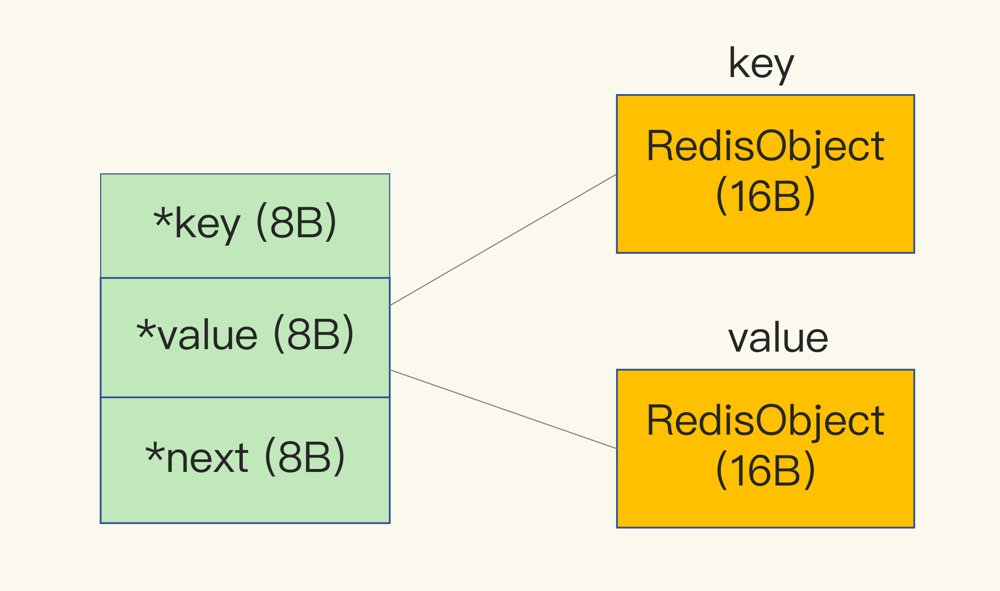

[TOC]

# 图片存储系统

开发一个图片存储系统，要求这个系统能快速地记录图片 ID 和图片在存储系统中保存时的 ID（可以直接叫作图片存储对象 ID）。同时，还要能够根据图片 ID 快速查找到图片存储对象 ID。

因为图片数量巨大，所以我们就用 10 位数来表示图片 ID 和图片存储对象 ID，例如，图片 ID 为 1101000051，它在存储系统中对应的 ID 号是 3301000051。

```java
photo_id: 1101000051
photo_obj_id: 3301000051
```

保存了 1 亿张图片的信息，用了约 6.4GB 的内存，一个图片 ID 和图片存储对象 ID 的记录平均用了 64 字节。

但问题是，一组图片 ID 及其存储对象 ID 的记录，实际只需要 16 字节就可以了。

# 为什么 String 类型内存开销大？

图片 ID 和图片存储对象 ID 都是 10 位数，我们可以用两个 8 字节的 Long 类型表示这两个 ID。

**除了记录实际数据，String 类型还需要额外的内存空间记录数据长度、空间使用等信息，这些信息也叫作元数据。**

## int 编码方式

当保存 64 位有符号整数时，String 类型会把它保存为一个 8 字节的 Long 类型整数，这种保存方式通常也叫作 int 编码方式。

## SDS

但是，当你保存的数据中**包含字符时，String 类型就会用简单动态字符串**（Simple Dynamic String，SDS）结构体来保存，如下图所示：


- buf：字节数组，保存实际数据。为了表示字节数组的结束，Redis 会自动在数组最后加一个“\0”，这就会额外占用 1 个字节的开销。
- len：占 4 个字节，表示 buf 的已用长度。
- alloc：也占个 4 字节，表示 buf 的实际分配长度，一般大于 len。

##  RedisObject 

除了 SDS 的额外开销，还有一个来自于 RedisObject 结构体的开销。

因为 Redis 的数据类型有很多，而且，不同数据类型都有些相同的元数据要记录（比如最后一次访问的时间、被引用的次数等），所以，Redis 会用一个 RedisObject 结构体来统一记录这些元数据，同时指向实际数据。

一个 RedisObject 包含了 **8 字节的元数据和一个 8 字节指针**，这个指针再进一步指向具体数据类型的实际数据所在，例如指向 String 类型的 SDS 结构所在的内存地址:


Redis 还对 Long 类型整数和 SDS 的内存布局做了专门的设计:

- **当保存的是 Long 类型整数时，RedisObject 中的指针就直接赋值为整数数据了，这样就不用额外的指针再指向整数了，节省了指针的空间开销。**
- 当保存的是字符串数据，并且字符串小于等于 44 字节时，RedisObject 中的元数据、指针和 SDS 是一块连续的内存区域，这样就可以避免内存碎片。这种布局方式也被称为 **embstr 编码方式。**
- 当保存的是字符串数据，当字符串大于 44 字节时，SDS 的数据量就开始变多了，Redis 就不再把 SDS 和 RedisObject 布局在一起了，而是会给 SDS 分配独立的空间，并用指针指向 SDS 结构。这种布局方式被称为 **raw 编码模式。**


因为 10 位数的图片 ID 和图片存储对象 ID 是 Long 类型整数，所以可以直接用 int 编码的 RedisObject 保存。每个 int 编码的 RedisObject 元数据部分占 8 字节，指针部分被直接赋值为 8 字节的整数了。此时，每个 ID 会使用 16 字节，加起来一共是 32 字节。但是，另外的 32 字节去哪儿了呢？

# dictEntry

dictEntry 结构中有三个 8 字节的指针，分别指向 key、value 以及下一个 dictEntry，三个指针共 24 字节，如下图所示：



**这三个指针只有 24 字节，为什么会占用了 32 字节呢？**

jemalloc 在分配内存时，**会根据我们申请的字节数 N，找一个比 N 大，但是最接近 N 的 2 的幂次数作为分配的空间，这样可以减少频繁分配的次数。**

明明有效信息只有 16 字节，使用 String 类型保存时，却需要 64 字节的内存空间，有 48 字节都没有用于保存实际的数据。

如果要保存的图片有 1 亿张，那么 1 亿条的图片 ID 记录就需要 6.4GB 内存空间，其中有 4.8GB 的内存空间都用来保存元数据了，额外的内存空间开销很大。那么，有没有更加节省内存的方法呢？

# 用什么数据结构可以节省内存？

Redis 有一种底层数据结构，叫压缩列表（ziplist），这是一种非常节省内存的结构。

压缩列表的构成。表头有三个字段 zlbytes、zltail 和 zllen，分别表示列表长度、列表尾的偏移量，以及列表中的 entry 个数。压缩列表尾还有一个 zlend，表示列表结束。


压缩列表之所以能节省内存，就在于它是用一系列连续的 entry 保存数据。每个 entry 的元数据包括下面几部分:

- prev_len，表示前一个 entry 的长度。**prev_len 有两种取值情况：1 字节或 5 字节**。
  - 取值 1 字节时，表示上一个 entry 的长度小于 254 字节。虽然 1 字节的值能表示的数值范围是 0 到 255，但是压缩列表中 zlend 的取值默认是 255，因此，就默认用 255 表示整个压缩列表的结束，其他表示长度的地方就不能再用 255 这个值了。
  - 所以，当上一个 entry 长度小于 254 字节时，prev_len 取值为 1 字节，否则，就取值为 5 字节。
- encoding：表示编码方式，1 字节；
- len：表示自身长度，4 字节。
- content：保存实际数据。

这些 entry 会挨个儿放置在内存中，不需要再用额外的指针进行连接，这样就可以节省指针所占用的空间。

以保存图片存储对象 ID 为例，来分析一下压缩列表是如何节省内存空间的：

每个 entry 保存一个图片存储对象 ID（8 字节），此时，每个 entry 的 prev_len 只需要 1 个字节就行，因为每个 entry 的前一个 entry 长度都只有 8 字节，小于 254 字节。这样一来，一个图片的存储对象 ID 所占用的内存大小是 14 字节（1+4+1+8=14），实际分配 16 字节。

Redis 基于压缩列表实现了 List、Hash 和 Sorted Set 这样的集合类型，**这样做的最大好处就是节省了 dictEntry 的开销。当你用 String 类型时，一个键值对就有一个 dictEntry，要用 32 字节空间。**

但采用集合类型时，一个 key 就对应一个集合的数据，能保存的数据多了很多，但也只用了一个 dictEntry，这样就节省了内存。

# 如何用集合类型保存单值的键值对？

保存单值的键值对时，可以采用基于 Hash 类型的二级编码方法。

这里说的二级编码，就是把一个单值的数据拆分成两部分，前一部分作为 Hash 集合的 key，后一部分作为 Hash 集合的 value，这样一来，我们就可以把单值数据保存到 Hash 集合中了。

以图片 ID 1101000060 和图片存储对象 ID 3302000080 为例，我们可以把图片 ID 的前 7 位（1101000）作为 Hash 类型的键，把图片 ID 的最后 3 位（060）和图片存储对象 ID 分别作为 Hash 类型值中的 key 和 value。

增加一条记录后，内存占用只增加了 16 字节，如下所示：

```java
127.0.0.1:6379> info memory
# Memory
used_memory:1039120
127.0.0.1:6379> hset 1101000 060 3302000080
(integer) 1
127.0.0.1:6379> info memory
# Memory
used_memory:1039136
```

**在使用 String 类型时，每个记录需要消耗 64 字节，这种方式却只用了 16 字节，所使用的内存空间是原来的 1/4，满足了我们节省内存空间的需求。**

# hash-max-ziplist-entries & hash-max-ziplist-value

Hash 类型底层结构什么时候使用压缩列表，什么时候使用哈希表呢？

**Hash 类型设置了用压缩列表保存数据时的两个阈值，一旦超过了阈值，Hash 类型就会用哈希表来保存数据了:**

- hash-max-ziplist-entries：表示用压缩列表保存时哈希集合中的最大元素个数。
- hash-max-ziplist-value：表示用压缩列表保存时哈希集合中单个元素的最大长度。

**如果我们往 Hash 集合中写入的元素个数超过了 hash-max-ziplist-entries，或者写入的单个元素大小超过了 hash-max-ziplist-value，Redis 就会自动把 Hash 类型的实现结构由压缩列表转为哈希表。**

**一旦从压缩列表转为了哈希表，Hash 类型就会一直用哈希表进行保存，而不会再转回压缩列表了。在节省内存空间方面，哈希表就没有压缩列表那么高效了。**

所以，在刚才的二级编码中，我们只用图片 ID 最后 3 位作为 Hash 集合的 key，也就保证了 Hash 集合的元素个数不超过 1000，

同时，我们把 hash-max-ziplist-entries 设置为 1000，这样一来，Hash 集合就可以一直使用压缩列表来节省内存空间了。

