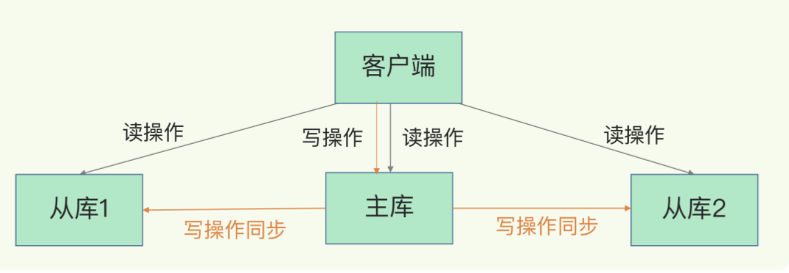

[TOC]

# 主从库模式

在实际使用时只运行了一个 Redis 实例，那么，如果这个实例宕机了，它在恢复期间，是无法服务新来的数据存取请求的。

Redis 提供了主从库模式，以保证数据副本的一致，主从库之间采用的是读写分离的方式。读操作：主库、从库都可以接收；写操作：首先到主库执行，然后，主库将写操作同步给从库。



## 主从库间如何进行第一次同步

启动多个 Redis 实例的时候，它们相互之间就可以通过 **replicaof（Redis 5.0 之前使用 slaveof）**命令**形成主库和从库的关系**，之后会按照三个阶段完成数据的第一次同步。

```java
replicaof  172.16.19.3  6379
```


1. 主从库间建立连接、协商同步的过程，主要是为全量复制做准备。在这一步，从库和主库建立起连接，并告诉主库即将进行同步，主库确认回复后，主从库间就可以开始同步了。psync 命令包含了主库的 runID 和复制进度 offset 两个参数。
   - runID，是每个 Redis 实例启动时都会自动生成的一个随机 ID，用来唯一标记这个实例。当从库和主库第一次复制时，因为不知道主库的 runID，所以将 runID 设为“？”。
   - offset，此时设为 -1，表示第一次复制。
2. 主库收到 psync 命令后，会用 **FULLRESYNC** 响应命令带上两个参数：主库 runID 和主库目前的复制进度 offset，返回给从库。从库收到响应后，会记录下这两个参数。
   - FULLRESYNC 响应表示第一次复制采用的全量复制。
3. 主库将所有数据同步给从库。从库收到数据后，在本地完成数据加载。这个过程依赖于内存快照生成的 RDB 文件。
   - 主库执行 bgsave 命令，生成 RDB 文件，接着将文件发给从库。
   - 从库接收到 RDB 文件后，会先清空当前数据库，然后加载 RDB 文件。
4. 主库会把新收到的写命令，再发送给从库。

## replication buffer

在主库将数据同步给从库的过程中，主库不会被阻塞，仍然可以正常接收请求。

**为了保证主从库的数据一致性，主库会在内存中用专门的 replication buffer，记录 RDB 文件生成后收到的所有写操作。**

# 主从级联模式

一次全量复制中，对于主库来说，需要完成两个耗时的操作：**生成 RDB 文件和传输 RDB 文件。**

如果从库数量很多，而且都要和主库进行全量复制的话，就会导致主库忙于 fork 子进程生成 RDB 文件，进行数据全量同步。**fork 这个操作会阻塞主线程处理正常请求，从而导致主库响应应用程序的请求速度变慢。**

**可以通过“主 - 从 - 从”模式将主库生成 RDB 和传输 RDB 的压力，以级联的方式分散到从库上。**。

```java
replicaof 所选从库的IP 6379
```

# 主从库间网络断了怎么办？

在 Redis 2.8 之前，如果主从库在命令传播时出现了网络闪断，那么，从库就会和主库重新进行一次全量复制，开销非常大。

从 Redis 2.8 开始，网络断了之后，主从库会采用增量复制的方式继续同步。

## 增量复制

库会把断连期间收到的写操作命令，写入 replication buffer，同时一直在写repl_backlog_buffer。

当从库断连又重连之后，通过psync命令告诉主库自己的slave_repl_offset，然后主库根据自己的master_repl_offset和slave_repl_offset来判断是需要全量同步还是把两者之间的命令增量同步给从库（同步的方式就是通过主库与每个从库建立连接之后的这个所谓的replication buffer）

## repl_backlog_buffer

**repl_backlog_buffer 是一个环形缓冲区，主库会记录自己写到的位置，从库则会记录自己已经读到的位置。**

- 刚开始的时候，主库和从库的写读位置在一起，这算是它们的起始位置。随着主库不断接收新的写操作，它在缓冲区中的写位置会逐步偏离起始位置，我们通常用偏移量来衡量这个偏移距离的大小，对主库来说，对应的偏移量就是 **master_repl_offset**。主库接收的新写操作越多，这个值就会越大。
- 从库在复制完写操作命令后，它在缓冲区中的读位置也开始逐步偏移刚才的起始位置，此时，从库已复制的偏移量 **slave_repl_offset** 也在不断增加。正常情况下，这两个偏移量基本相等。


1. 主从库的连接恢复之后，从库首先会给主库发送 psync 命令，并把自己当前的 slave_repl_offset 发给主库，主库会判断自己的 master_repl_offset 和 slave_repl_offset 之间的差距。
2. 主库可能会收到新的写操作命令，所以，一般来说，master_repl_offset 会大于 slave_repl_offset。此时，主库只用把 master_repl_offset 和 slave_repl_offset 之间的命令操作同步给从库就行。


### repl_backlog_buffer && replication buffer

主从断开了，replication buffer也会释放，此时只会写backlog_buffer。

1. 如果从库断开时间太久，**repl_backlog_buffer环形缓冲区被主库的写命令覆盖了，那么从库连上主库后只能进行一次全量同步**，所以repl_backlog_buffer配置尽量大一些，可以降低主从断开后全量同步的概率。而在repl_backlog_buffer中找主从差异的数据后，如何发给从库呢？这就用到了replication buffer。
2. Redis和客户端通信也好，和从库通信也好，Redis都需要给分配一个 内存buffer进行数据交互，客户端是一个client，从库也是一个client，我们每个client连上Redis后，Redis都会分配一个client buffer，所有数据交互都是通过这个buffer进行的：Redis先把数据写到这个buffer中，然后再把buffer中的数据发到client socket中再通过网络发送出去，这样就完成了数据交互。所以主从在增量同步时，从库作为一个client，也会分配一个buffer，只不过这个buffer专门用来传播用户的写命令到从库，保证主从数据一致，我们通常把它叫做replication buffer。

### client-output-buffer-limit

如果主从在传播命令时，因为某些原因从库处理得非常慢，那么主库上的这个buffer就会持续增长，消耗大量的内存资源，甚至OOM。所以Redis提供了client-output-buffer-limit参数限制这个buffer的大小，**如果超过限制，主库会强制断开这个client的连接**。

**此时主从复制会中断，中断后如果从库再次发起复制请求，那么此时可能会导致恶性循环，引发复制风暴，这种情况需要格外注意。**

### repl_backlog_size

因为 repl_backlog_buffer 是一个环形缓冲区，所以在缓冲区写满后，主库会继续写入，此时，就会覆盖掉之前写入的操作。

如果从库的读取速度比较慢，就有可能导致从库还未读取的操作被主库新写的操作覆盖了，这会导致主从库间的数据不一致。因为 repl_backlog_buffer 是一个环形缓冲区，所以在缓冲区写满后，主库会继续写入，此时，就会覆盖掉之前写入的操作。

就有可能导致从库还未读取的操作被主库新写的操作覆盖了，这会导致主从库间的数据不一致。

**这个参数和所需的缓冲空间大小有关。缓冲空间的计算公式是：**

**缓冲空间大小 = 主库写入命令速度 * 操作大小 - 主从库间网络传输命令速度 * 操作大小。**

**考虑到可能存在一些突发的请求压力，我们通常需要把这个缓冲空间扩大一倍，即 repl_backlog_size = 缓冲空间大小 * 2，这也就是 repl_backlog_size 的最终值。**

# 主从全量同步使用RDB而不使用AOF

1. RDB文件内容是经过压缩的二进制数据（不同数据类型数据做了针对性优化），文件很小。而AOF文件记录的是每一次写操作的命令，写操作越多文件会变得很大，其中还包括很多对同一个key的多次冗余操作。在主从全量数据同步时，传输RDB文件可以尽量降低对主库机器网络带宽的消耗，从库在加载RDB文件时，一是文件小，读取整个文件的速度会很快。二是因为RDB文件存储的都是二进制数据，从库直接按照RDB协议解析还原数据即可，速度会非常快，而AOF需要依次重放每个写命令，这个过程会经历冗长的处理逻辑，恢复速度相比RDB会慢得多，所以使用RDB进行主从全量同步的成本最低。
2. 假设要使用AOF做全量同步，意味着必须打开AOF功能，打开AOF就要选择文件刷盘的策略，选择不当会严重影响Redis性能。而RDB只有在需要定时备份和主从全量同步数据时才会触发生成一次快照。而在很多丢失数据不敏感的业务场景，其实是不需要开启AOF的。