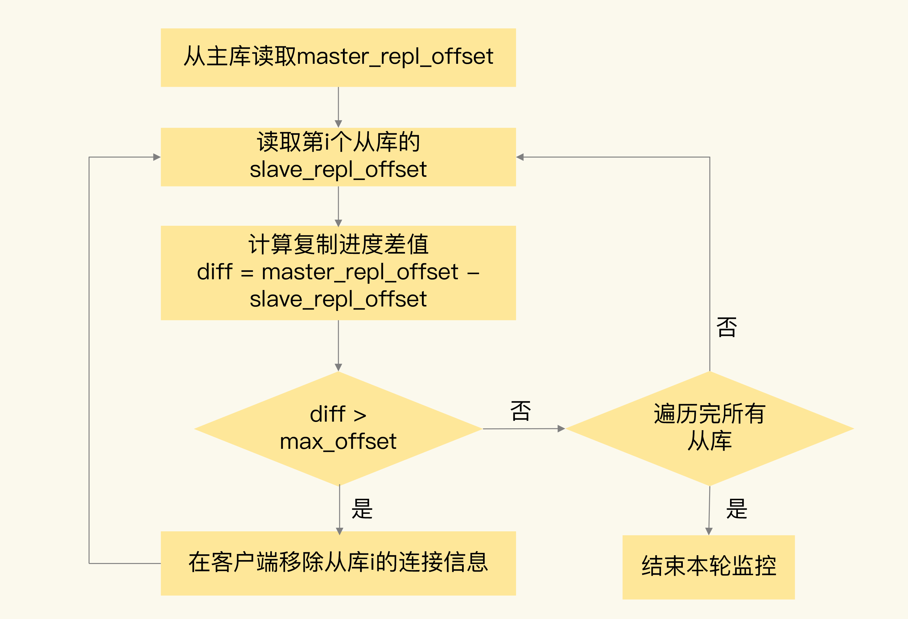
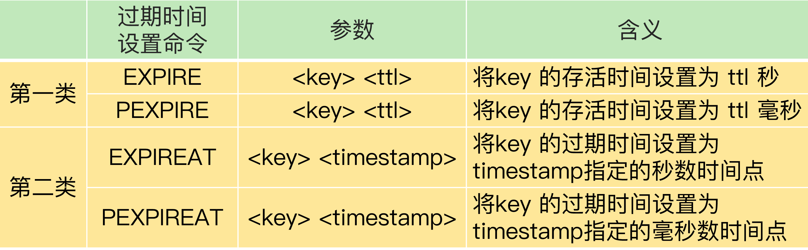

[TOC]

# 主从数据不一致

主从库间的命令复制是异步进行的。

那在什么情况下，从库会滞后执行同步命令呢？

- 主从库间的网络可能会有传输延迟，所以从库不能及时地收到主库发送的命令，从库上执行同步命令的时间就会被延后。
- 即使从库及时收到了主库的命令，但是，也可能会因为正在处理其它复杂度高的命令（例如集合操作命令）而阻塞。此时，从库需要处理完当前的命令，才能执行主库发送的命令操作，这就会造成主从数据不一致。而在主库命令被滞后处理的这段时间内，主库本身可能又执行了新的写操作。这样一来，主从库间的数据不一致程度就会进一步加剧。

**我们该怎么应对呢？**

- 在硬件环境配置方面，我们要尽量保证主从库间的网络连接状况良好。
- 可以开发一个外部程序来监控主从库间的复制进度。

因为 Redis 的 INFO replication 命令可以查看主库接收写命令的进度信息（master_repl_offset）和从库复制写命令的进度信息（slave_repl_offset）。

所以，可以开发一个监控程序，先用 INFO replication 命令查到主、从库的进度，然后，用 master_repl_offset 减去 slave_repl_offset，这样就能得到从库和主库间的复制进度差值了。

如果某个从库的进度差值大于我们预设的阈值，我们可以让客户端不再和这个从库连接进行数据读取，这样就可以减少读到不一致数据的情况。

不过，为了避免出现客户端和所有从库都不能连接的情况，我们需要把复制进度差值的阈值设置得大一些。



监控程序可以一直监控着从库的复制进度，当从库的复制进度又赶上主库时，我们就允许客户端再次跟这些从库连接。

# 读取过期数据

Redis 同时使用了两种策略来删除过期的数据，**分别是惰性删除策略和定期删除策略。**

## 惰性删除策略

当一个数据的过期时间到了以后，并不会立即删除数据，而是等到再有请求来读写这个数据时，对数据进行检查，如果发现数据已经过期了，再删除这个数据。

这个策略的好处是尽量减少删除操作对 CPU 资源的使用，对于用不到的数据，就不再浪费时间进行检查和删除了。

但是，这个策略会导致大量已经过期的数据留存在内存中，占用较多的内存资源。

**如果客户端从主库上读取留存的过期数据，主库会触发删除操作，此时，客户端并不会读到过期数据。**

如果客户端在从库中访问留存的过期数据，从库并不会触发数据删除。那么，从库会给客户端返回过期数据吗？

- 如果使用的是 Redis 3.2 之前的版本，那么，从库在服务读请求时，并不会判断数据是否过期，而是会返回过期数据。
- 在 3.2 版本后，Redis 做了改进，如果读取的数据已经过期了，从库虽然不会删除，但是会返回空值，这就避免了客户端读到过期数据。所以，在应用主从集群时，尽量使用 Redis 3.2 及以上版本。

只要使用了 Redis 3.2 后的版本，就不会读到过期数据了吗？

这跟 Redis 用于设置过期时间的命令有关系，有些命令给数据设置的过期时间在从库上可能会被延后，导致应该过期的数据又在从库上被读取到了。

设置数据过期时间的命令一共有 4 个，可以把它们分成两类：

- EXPIRE 和 PEXPIRE：它们给数据设置的是从命令执行时开始计算的存活时间；
- EXPIREAT 和 PEXPIREAT：它们会直接把数据的过期时间设置为具体的一个时间点。



```java
EXPIRE testkey 60
```

当主从库全量同步时，如果主库接收到了一条 EXPIRE 命令，那么，主库会直接执行这条命令。

这条命令会在全量同步完成后，发给从库执行。**而从库在执行时，就会在当前时间的基础上加上数据的存活时间**，这样一来，从库上数据的过期时间就会比主库上延后了。

**在业务应用中使用 EXPIREAT/PEXPIREAT 命令，把数据的过期时间设置为具体的时间点，避免读到过期数据。**

## 定期删除策略

Redis 每隔一段时间（默认 100ms），就会随机选出一定数量的数据，检查它们是否过期，并把其中过期的数据删除，这样就可以及时释放一些内存。

# 不合理配置项导致的服务挂掉

## protected-mode 

配置项这个配置项的作用是限定哨兵实例能否被其他服务器访问。

- 当这个配置项设置为 yes 时，哨兵实例只能在部署的服务器本地进行访问。
- 当设置为 no 时，其他服务器也可以访问这个哨兵实例。

如果 protected-mode 被设置为 yes，而其余哨兵实例部署在其它服务器，那么，这些哨兵实例间就无法通信。

当主库故障时，哨兵无法判断主库下线，也无法进行主从切换，最终 Redis 服务不可用。

## cluster-node-timeout 配置项

这个配置项设置了 Redis Cluster 中实例响应心跳消息的超时时间。

当我们在 Redis Cluster 集群中为每个实例配置了“一主一从”模式时，如果主实例发生故障，从实例会切换为主实例，受网络延迟和切换操作执行的影响，切换时间可能较长，就会导致实例的心跳超时（超出 cluster-node-timeout）。

实例超时后，就会被 Redis Cluster 判断为异常。而 Redis Cluster 正常运行的条件就是，有半数以上的实例都能正常运行。

所以，如果执行主从切换的实例超过半数，而主从切换时间又过长的话，就可能有半数以上的实例心跳超时，从而可能导致整个集群挂掉。

所以，建议将 cluster-node-timeout 调大些（例如 10 到 20 秒）。