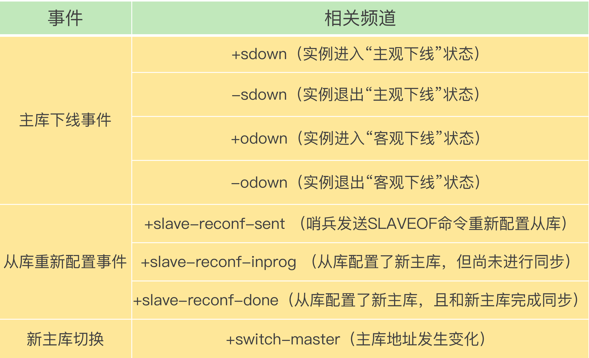

[TOC]

# 哨兵集群

一旦多个实例组成了哨兵集群，即使有哨兵实例出现故障挂掉了，其他哨兵还能继续协作完成主从库切换的工作，包括判定主库是不是处于下线状态，选择新主库，以及通知从库和客户端。

在配置哨兵的信息时，我们只需要用到下面的这个配置项，设置主库的 IP 和端口，并没有配置其他哨兵的连接信息:

```java
sentinel monitor <master-name> <ip> <redis-port> <quorum> 
```

**这些哨兵实例既然都不知道彼此的地址，又是怎么组成集群的呢？**

# pub/sub

哨兵实例之间可以相互发现，要归功于 Redis 提供的 pub/sub 机制，也就是发布 / 订阅机制。

- 哨兵只要和主库建立起了连接，就可以在主库上发布消息了，比如说发布它自己的连接信息（IP 和端口）。

- 同时，它也可以从主库上订阅消息，获得其他哨兵发布的连接信息。当多个哨兵实例都在主库上做了发布和订阅操作后，它们之间就能知道彼此的 IP 地址和端口。

**在主从集群中，主库上有一个名为“sentinel:hello”的频道，不同哨兵就是通过它来相互发现，实现互相通信的。**


哨兵除了彼此之间建立起连接形成集群外，还需要和从库建立连接。

- 这是因为，在哨兵的监控任务中，它需要对主从库都进行心跳判断.
- 而且在主从库切换完成后，它还需要通知从库，让它们和新主库进行同步。

## 哨兵是如何知道从库的 IP 地址和端口的呢？

**这是由哨兵向主库发送 INFO 命令来完成的。**主库接受到这个命令后，就会把从库列表返回给哨兵。


# 基于 pub/sub 机制的客户端事件通知

如何在客户端通过监控了解哨兵进行主从切换的过程呢？

客户端如何能够获取到哨兵集群在监控、选主、切换这个过程中发生的各种事件。

- 哨兵就是一个运行在特定模式下的 Redis 实例，只不过它并不服务请求操作，只是完成监控、选主和通知的任务。所以，每个哨兵实例也提供 pub/sub 机制，**客户端可以从哨兵订阅消息。哨兵提供的消息订阅频道有很多，不同频道包含了主从库切换过程中的不同关键事件。**



举个例子，你可以执行如下命令，来订阅“所有实例进入客观下线状态的事件”：

```java
SUBSCRIBE +odown
//订阅所有的事件：
SUBSCRIBE *
```

当哨兵把新主库选择出来后，客户端就会看到下面的 switch-master 事件。这个事件表示主库已经切换了，新主库的 IP 地址和端口信息已经有了。这个时候，客户端就可以用这里面的新主库地址和端口进行通信了。

```java
switch-master <master name> <oldip> <oldport> <newip> <newport>
```

# 由哪个哨兵执行主从切换？

确定由哪个哨兵执行主从切换的过程，和主库“客观下线”的判断过程类似，也是一个“投票仲裁”的过程。

## 客观下线

1. 任何一个实例只要自身判断主库“主观下线”后，就会给其他实例发送 is-master-down-by-addr 命令。
2. 其他实例会根据自己和主库的连接情况，做出 Y 或 N 的响应。
3. 一个哨兵获得了仲裁所需的赞成票数后，就可以标记主库为“客观下线”。**这个所需的赞成票数是通过哨兵配置文件中的 quorum 配置项设定的**。例如，现在有 5 个哨兵，quorum 配置的是 3，那么，一个哨兵需要 3 张赞成票，就可以标记主库为“客观下线”了。这 3 张赞成票包括哨兵自己的一张赞成票和另外两个哨兵的赞成票。
4. 此时，这个哨兵就可以再给其他哨兵发送命令，表明希望由自己来执行主从切换，并让所有其他哨兵进行投票。这个投票过程称为“Leader 选举”。因为最终执行主从切换的哨兵称为 Leader，投票过程就是确定 Leader。

**任何一个想成为 Leader 的哨兵，要满足两个条件：**

1.  **拿到半数以上的赞成票。**
2. **拿到的票数同时还需要大于等于哨兵配置文件中的 quorum 值。**


1. 在 T1 时刻，S1 判断主库为“客观下线”，它想成为 Leader，就先给自己投一张赞成票，然后分别向 S2 和 S3 发送命令，表示要成为 Leader。
2. 在 T2 时刻，S3 判断主库为“客观下线”，它也想成为 Leader，所以也先给自己投一张赞成票，再分别向 S1 和 S2 发送命令，表示要成为 Leader。
3. 在 T3 时刻，S1 收到了 S3 的 Leader 投票请求。因为 S1 已经给自己投了一票 Y，所以它不能再给其他哨兵投赞成票了，所以 S1 回复 N 表示不同意。同时，S2 收到了 T2 时 S3 发送的 Leader 投票请求。因为 S2 之前没有投过票，**它会给第一个向它发送投票请求的哨兵回复 Y，**给后续再发送投票请求的哨兵回复 N，所以，在 T3 时，S2 回复 S3，同意 S3 成为 Leader。
4. 在 T4 时刻，S2 才收到 T1 时 S1 发送的投票命令。因为 S2 已经在 T3 时同意了 S3 的投票请求，此时，S2 给 S1 回复 N，表示不同意 S1 成为 Leader。发生这种情况，是因为 S3 和 S2 之间的网络传输正常，而 S1 和 S2 之间的网络传输可能正好拥塞了，导致投票请求传输慢了。
5. 最后，在 T5 时刻，S1 得到的票数是来自它自己的一票 Y 和来自 S2 的一票 N。而 S3 除了自己的赞成票 Y 以外，还收到了来自 S2 的一票 Y。此时，S3 不仅获得了半数以上的 Leader 赞成票，也达到预设的 quorum 值（quorum 为 2），所以它最终成为了 Leader。接着，S3 会开始执行选主操作，而且在选定新主库后，会给其他从库和客户端通知新主库的信息。

如果 S3 没有拿到 2 票 Y，那么这轮投票就不会产生 Leader。**哨兵集群会等待一段时间（也就是哨兵故障转移超时时间的 2 倍），再重新选举。**这是因为，哨兵集群能够进行成功投票，很大程度上依赖于选举命令的正常网络传播。如果网络压力较大或有短时堵塞，就可能导致没有一个哨兵能拿到半数以上的赞成票。所以，等到网络拥塞好转之后，再进行投票选举，成功的概率就会增加。

