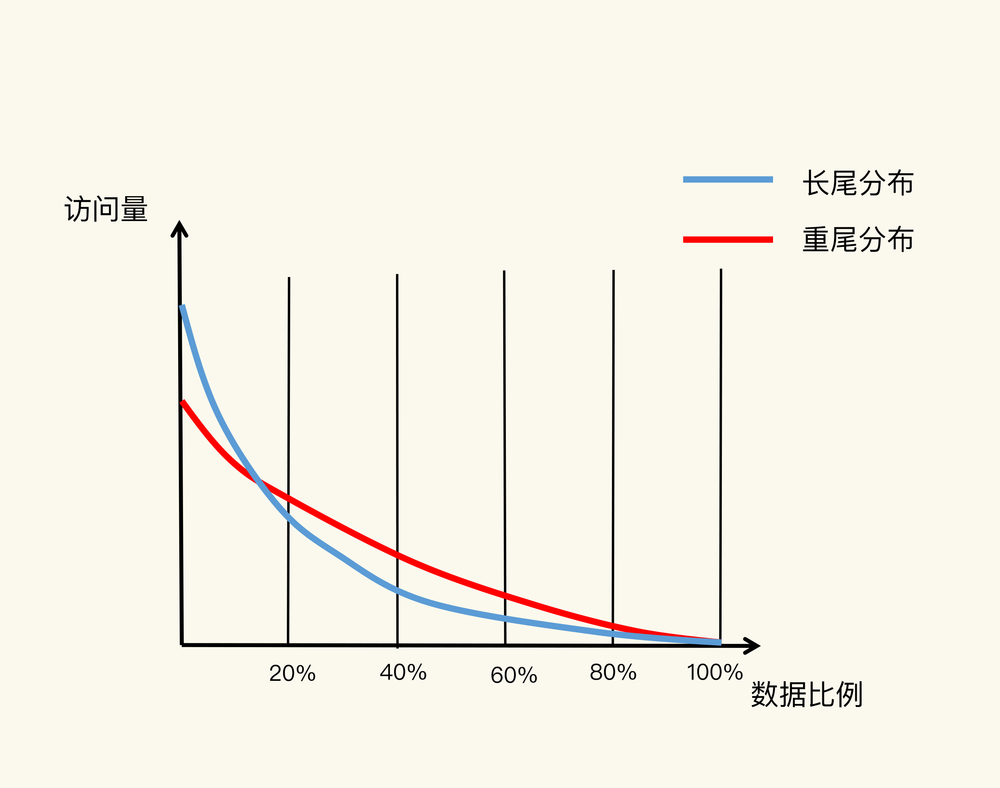
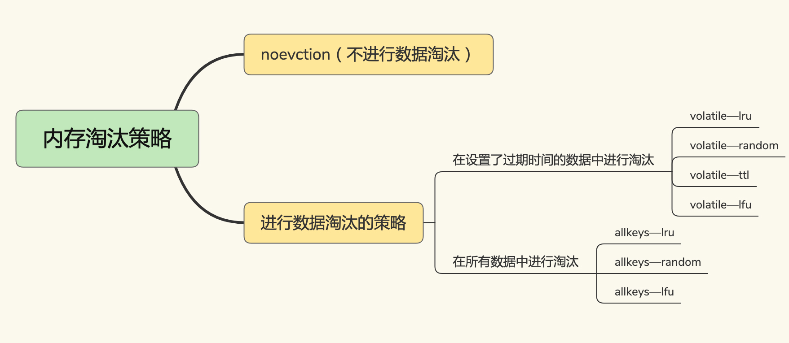

[TOC]

# 只读缓存

使用只读缓存时，是先把修改写到后端数据库中，再把缓存中的数据删除。

当下次访问这个数据时，会以后端数据库中的值为准，重新加载到缓存中。

- ·这样做的优点是，数据库和缓存可以保证完全一致，并且缓存中永远保留的是经常访问的热点数据。
- 缺点是每次修改操作都会把缓存中的数据删除，之后访问时都会先触发一次缓存缺失，然后从后端数据库加载数据到缓存中，这个过程访问延迟会变大。
- 如果修改数据库失败了，那么缓存中的数据也不会被删除，此时数据库和缓存中的数据依旧保持一致。 

# 读写缓存

使用读写缓存时，是同时修改数据库和缓存中的值。

- 这样做的优点是，被修改后的数据永远在缓存中存在，下次访问时，能够直接命中缓存，不用再从后端数据库中查询，这个过程拥有比较好的性能，比较适合先修改又立即访问的业务场景。
- 但缺点是在高并发场景下，如果存在多个操作同时修改同一个值的情况，可能会导致缓存和数据库的不一致。
- 如果是先修改缓存，后修改数据库，如果缓存修改成功，而数据库修改失败了，那么此时数据库和缓存数据就不一致了。
- 如果先修改数据库，再修改缓存，也会产生上面所说的并发场景下的不一致。

只读缓存是牺牲了一定的性能，优先保证数据库和缓存的一致性，它更适合对于一致性要求比较要高的业务场景。

**而如果对于数据库和缓存一致性要求不高，或者不存在并发修改同一个值的情况，那么使用读写缓存就比较合适，它可以保证更好的访问性能。**

# 设置多大的缓存容量合适？

蓝线代表了“八二原理”表示的数据局部性，而红线则表示在当前应用负载下，数据局部性的变化。



蓝线: 

它表示的就是“八二原理”，有 20% 的数据贡献了 80% 的访问了，而剩余的数据虽然体量很大，但只贡献了 20% 的访问量。这 80% 的数据在访问量上就形成了一条长长的尾巴，我们也称为“长尾效应”。

如果按照“八二原理”来设置缓存空间容量，也就是把缓存空间容量设置为总数据量的 20% 的话，就有可能拦截到 80% 的访问。

红线上:

80% 的数据贡献的访问量，超过了传统的长尾效应中 80% 数据能贡献的访问量。

原因在于，用户的个性化需求越来越多，在一个业务应用中，不同用户访问的内容可能差别很大，所以，用户请求的数据和它们贡献的访问量比例，不再具备长尾效应中的“八二原理”分布特征了。

也就是说，20% 的数据可能贡献不了 80% 的访问，而剩余的 80% 数据反而贡献了更多的访问量，我们称之为重尾效应。

正是因为 20% 的数据不一定能贡献 80% 的访问量，我们不能简单地按照“总数据量的 20%”来设置缓存最大空间容量。在实践过程中，我看到过的缓存容量占总数据量的比例，从 5% 到 40% 的都有。这个容量规划不能一概而论，是需要结合应用数据实际访问特征和成本开销来综合考虑的。

系统的设计选择是一个权衡的过程：大容量缓存是能带来性能加速的收益，但是成本也会更高，而小容量缓存不一定就起不到加速访问的效果。一般来说，**建议把缓存容量设置为总数据量的 15% 到 30%，兼顾访问性能和内存空间开销。**

```java
CONFIG SET maxmemory 4gb
```

# 替换策略

Redis 4.0 之前一共实现了 6 种内存淘汰策略，在 4.0 之后，又增加了 2 种策略。

可以按照是否会进行数据淘汰把它们分成两类：

- 不进行数据淘汰的策略，只有 noeviction 这一种。
- 会进行淘汰的 7 种其他策略。

会进行淘汰的 7 种策略，我们可以再进一步根据淘汰候选数据集的范围把它们分成两类：

- 在设置了过期时间的数据中进行淘汰，包括 **volatile-random、volatile-ttl、volatile-lru、volatile-lfu（Redis 4.0 后新增）**四种。
- 在所有数据范围内进行淘汰，包括 allkeys-lru、allkeys-random、allkeys-lfu（Redis 4.0 后新增）三种



## noeviction

 **默认情况下，Redis 在使用的内存空间超过 maxmemory 值时，并不会淘汰数据，也就是设定的 noeviction 策略。**

对应到 Redis 缓存，也就是指，一旦缓存被写满了，**再有写请求来时，Redis 不再提供服务，而是直接返回错误。**

Redis 用作缓存时，实际的数据集通常都是大于缓存容量的，总会有新的数据要写入缓存，这个策略本身不淘汰数据，也就不会腾出新的缓存空间，我们不把它用在 Redis 缓存中。

## volatile-random & volatile-ttl & volatile-lru & volatile-lfu

它们筛选的候选数据范围，被限制在已经设置了过期时间的键值对上。

也正因为此，**即使缓存没有写满，这些数据如果过期了，也会被删除。**

使用 EXPIRE 命令对一批键值对设置了过期时间后，无论是这些键值对的过期时间是快到了，还是 Redis 的内存使用量达到了 maxmemory 阈值，Redis 都会进一步按照 volatile-ttl、volatile-random、volatile-lru、volatile-lfu 这四种策略的具体筛选规则进行淘汰。

- volatile-ttl 在筛选时，会针对设置了过期时间的键值对，根据过期时间的先后进行删除，越早过期的越先被删除。
- volatile-random 就像它的名称一样，在设置了过期时间的键值对中，进行随机删除。
- volatile-lru 会使用 LRU 算法筛选设置了过期时间的键值对。
- volatile-lfu 会使用 LFU 算法选择设置了过期时间的键值对。

## allkeys-lru & allkeys-random & allkeys-lfu

allkeys-lru、allkeys-random、allkeys-lfu 这三种淘汰策略的备选淘汰数据范围，就扩大到了所有键值对，无论这些键值对是否设置了过期时间。它们筛选数据进行淘汰的规则是：

- allkeys-random 策略，从所有键值对中随机选择并删除数据。
- allkeys-lru 策略，使用 LRU 算法在所有数据中进行筛选。
- allkeys-lfu 策略，使用 LFU 算法在所有数据中进行筛选。

这也就是说**，如果一个键值对被删除策略选中了，即使它的过期时间还没到，也需要被删除。当然，如果它的过期时间到了但未被策略选中，同样也会被删除。**

# LRU 算法

LRU 算法的全称是 Least Recently Used，从名字上就可以看出，这是按照最近最少使用的原则来筛选数据，最不常用的数据会被筛选出来，而最近频繁使用的数据会留在缓存中。

LRU 会把所有的数据组织成一个链表，链表的头和尾分别表示 MRU 端和 LRU 端，分别代表最近最常使用的数据和最近最不常用的数据。


LRU 算法认为刚刚被访问的数据，肯定还会被再次访问，所以就把它放在 MRU 端。

长久不访问的数据，肯定就不会再被访问了，所以就让它逐渐后移到 LRU 端，在缓存满时，就优先删除它。

LRU 算法在实际实现时，需要用链表管理所有的缓存数据，**这会带来额外的空间开销。**而且，**当有数据被访问时，需要在链表上把该数据移动到 MRU 端，如果有大量数据被访问，就会带来很多链表移动操作，会很耗时，进而会降低 Redis 缓存性能。**

在 Redis 中，LRU 算法被做了简化，以减轻数据淘汰对缓存性能的影响。

## Redis的LRU

具体来说，**Redis 默认会记录每个数据的最近一次访问的时间戳（由键值对数据结构 RedisObject 中的 lru 字段记录）**。

1. Redis 在决定淘汰的数据时，第一次会随机选出 N 个数据，把它们作为一个候选集合。
2. 接下来，Redis 会比较这 N 个数据的 lru 字段，把 lru 字段值最小的数据从缓存中淘汰出去。

## maxmemory-samples

Redis 提供了一个配置参数 maxmemory-samples，这个参数就是 Redis 选出的数据个数 N。

例如，我们执行如下命令，可以让 Redis 选出 100 个数据作为候选数据集：

```java
CONFIG SET maxmemory-samples 100
```

1. **当需要再次淘汰数据时，Redis 需要挑选数据进入第一次淘汰时创建的候选集合。**这儿的挑选标准是：能进入候选集合的数据的 lru 字段值必须小于候选集合中最小的 lru 值。
2. **当有新数据进入候选数据集后，如果候选数据集中的数据个数达到了 maxmemory-samples，Redis 就把候选数据集中 lru 字段值最小的数据淘汰出去。**

**这样一来，Redis 缓存不用为所有的数据维护一个大链表，也不用在每次数据访问时都移动链表项，提升了缓存的性能。**

# 策略建议

- 优先使用 allkeys-lru 策略。**可以充分利用 LRU 这一经典缓存算法的优势，把最近最常访问的数据留在缓存中，提升应用的访问性能。**如果你的业务数据中有明显的冷热数据区分，建议你使用 allkeys-lru 策略。
- 如果业务应用中的数据访问频率相差不大，没有明显的冷热数据区分，建议使用 allkeys-random 策略，随机选择淘汰的数据就行。
- 如果业务中有置顶的需求，比如置顶新闻、置顶视频，那么，可以使用 volatile-lru 策略，同时不给这些置顶数据设置过期时间。这样一来，这些需要置顶的数据一直不会被删除，而其他数据会在过期时根据 LRU 规则进行筛选。


