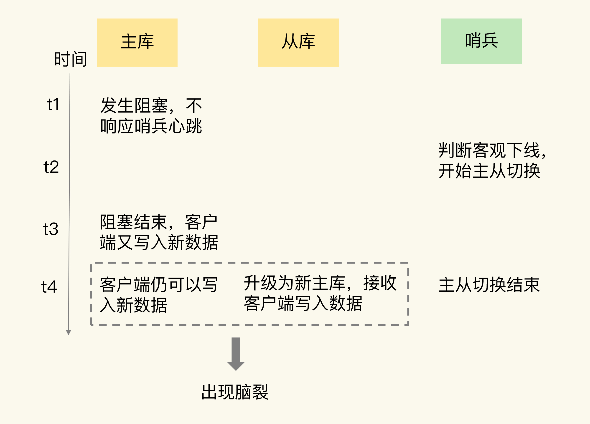

[TOC]

# 脑裂

所谓的脑裂，就是指在主从集群中，同时有两个主节点，它们都能接收写请求。而脑裂最直接的影响，就是客户端不知道应该往哪个主节点写入数据，结果就是不同的客户端会往不同的主节点上写入数据。而且，严重的话，脑裂会进一步导致数据丢失。

# 为什么会发生脑裂？

# 为什么脑裂会导致数据丢失？

主从切换后，从库一旦升级为新主库，哨兵就会让原主库执行 slave of 命令，和新主库重新进行全量同步。

而在全量同步执行的最后阶段，原主库需要清空本地的数据，加载新主库发送的 RDB 文件，这样一来，**原主库在主从切换期间保存的新写数据就丢失了。**

# 如何应对脑裂问题？

既然问题是出在原主库发生假故障后仍然能接收请求上，那么就开始在主从集群机制的配置项中查找是否有限制主库接收请求的设置。

Redis 已经提供了两个配置项来限制主库的请求处理，分别是 min-slaves-to-write 和 min-slaves-max-lag。

- min-slaves-to-write：这个配置项设置了主库能进行数据同步的最少从库数量。
- min-slaves-max-lag：这个配置项设置了主从库间进行数据复制时，从库给主库发送 ACK 消息的最大延迟（以秒为单位）。

## min-slaves-max-lag

即使原主库是假故障，它在假故障期间也无法响应哨兵心跳，也不能和从库进行同步，自然也就无法和从库进行 ACK 确认了。

这样一来，min-slaves-to-write 和 min-slaves-max-lag 的组合要求就无法得到满足，原主库就会被限制接收客户端请求，客户端也就不能在原主库中写入新数据了。

等到新主库上线时，就只有新主库能接收和处理客户端请求，此时，新写的数据会被直接写到新主库中。

而原主库会被哨兵降为从库，即使它的数据被清空了，也不会有新数据丢失。

## min-slaves-to-write

假设我们将 min-slaves-to-write 设置为 1，把 min-slaves-max-lag 设置为 12s，把哨兵的 down-after-milliseconds 设置为 10s，主库因为某些原因卡住了 15s，导致哨兵判断主库客观下线，开始进行主从切换。

同时，因为原主库卡住了 15s，没有一个从库能和原主库在 12s 内进行数据复制，原主库也无法接收客户端请求了。

这样一来，主从切换完成后，也只有新主库能接收请求，不会发生脑裂，也就不会发生数据丢失的问题了。