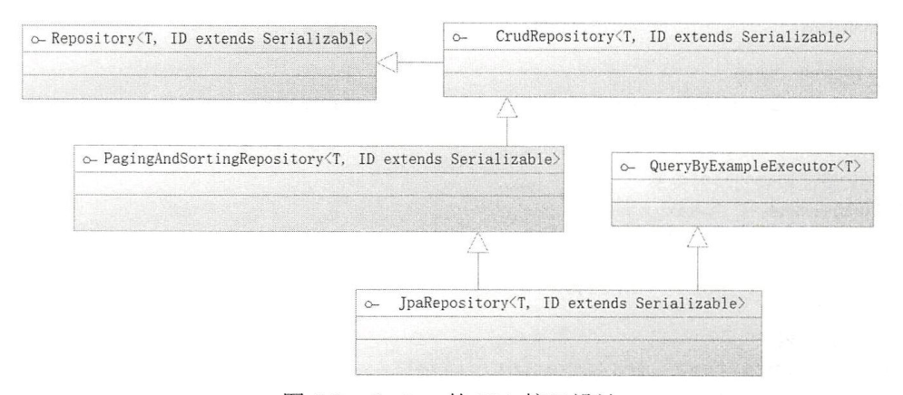
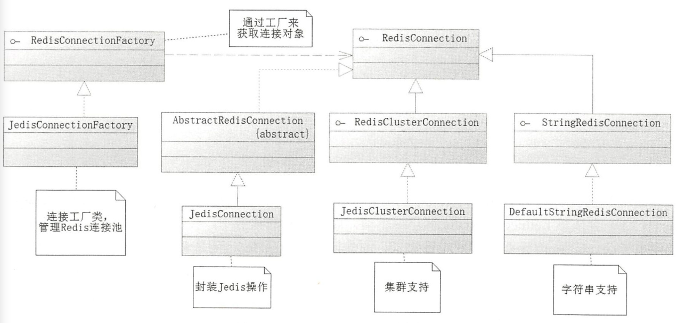
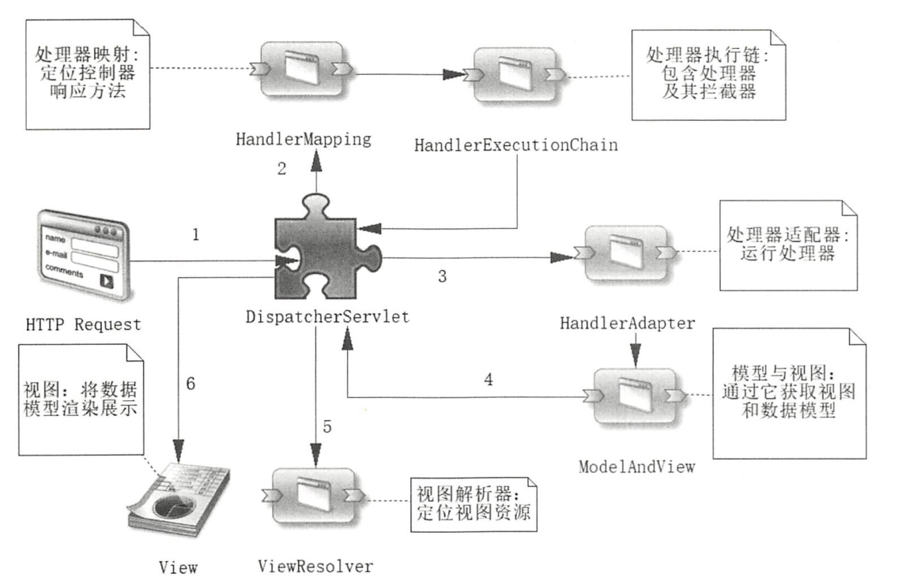
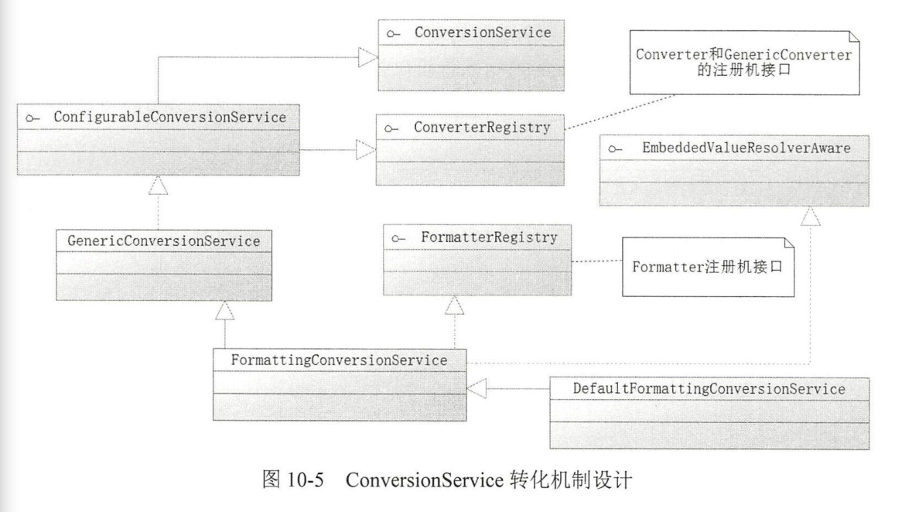

# 1.maven starter包

AOP 包：spring-boot-starter-aop

Web 开发包,将载入 Spring MVC 所需要的包,且内嵌 tomcat：spring-boot-starter-web

载测试依赖包:spring-boot-starter-test

# 2.IOC

所以IOC容器都实现了BeanFactory接口。

```java
public interface BeanFactory {
//前缀
String FACTORY BEAN PREFIX=" &” ;
//多个 getBean 方法
Object getBean(String name) throws BeansException;
<T> T getBean(String name,Class<T> requiredType) throwsBeansException;
<T> T getBean(Class<T> requiredType) throws BeansException;
Object getBean(String name, Object . . args) throws BeansException ;
<T> T getBean( Class<T> requiredType , Object ... args) throws BeansException;
//是否包含 Bean
boolean containsBean (String name);
// Bean 是否单例
boolean isSingleton(String name) throws NoSuchBeanDefinitionException ;
// Bean 是否原型
boolean isPrototype(String name) throws NoSuchBeanDefinitionException ;
//是否类型匹配
boolean isTypeMatch(String name , ResolvableType typeToMatch) throws NoSuchBeanDefinitionException;
boolean isTypeMatch(String name , Class<?> typeToMatch) throws NoSuchBeanDefinitionException;
//获取 Bean 的类型
Class<?> getType(String name) throws NoSuchBeanDefinitionException ;
//获取 Bean 的别名
String[] getAliases(String name);
}
```

ApplicationContext 接口通过继承HierarchicaBeanFactory接口,进而继承 BeanFactory 接口 ,还扩展了消息国际化接口( MessageSource )、环境可配置接口 ( EnvironmentCapable )、应用事件发布接口( ApplicationEventPublisher ) 和 资源模式解析接口( ResourcePatternResolver ).

@Component 是标明哪个类被扫描进入 Spring IoC 容器,而@ComponentScan是标明采用何种策略去扫描装配 Bean(只会扫描标注类所在的当前包和子包).

@ SpringBootApplication 也注入了@ComponentScan。

@Autowired 提供这样的规则, 首先它会根据类型找到对应的 Bean,如果对应类型的 Bean不是唯 一 的,那么它会根据其属性名称和 Bean 的名称进行匹配。如果匹配得上,就会使用该 Bean ；如果还无法匹配,就会抛出异常。@Quelifier与@Autow ired 组合在一起,通过类型和名称一起找到 Bean 。

```java
<T> T getBean(String name , Class<T> requiredType) throws BeansException；
```

在参数上前加@Autowired也能注入进来。

Bean 的生命周期：

1. Bean定义(默认Spring会继续实例化Bean和依赖注入,但lazyInit==true时只有取出来的时候才做初始化和依赖注入等操作)
   1. Spring 通过配置,如 @ComponentScan 定义的扫描路径去找到带有@Component 的类 ,这个过程就是一个资源定位的过程 。
   2. 开始解析,并且将定义的信息保存起来 （保存到BeanDefinition实例中）。
   3. 把 Bean 定义发布到 Spring IoC 容器中 。

2. Bean的初始化

   

3. Bean的生存期

4. Bean的销毁 

(@ConfigurationProperties ( ” database ” ))@ConfigurationProperties 中 配置的字符 串 database ,将与 POJO 的属性名称组成属性的全限定名去配置文件里查找 ,这样就 能将对应的属性读入到 POJO当中 。

使用@PropertySource 去定义对应的属性文件.

spring.profiles.active 和 spring .profiles.default 都没有 配置 的 情 况下 , 被 @Profile 标注 的 Bean 将不会被 Spring 装配到 IOC 容器 中 。

把选项-Dspring.profil es.active 配置的值记为{profile },则它 会用 application- {profile} . properties 文件去代替原来默认的 application.properties 文件,如JAVA_OPTS=''-Dspring . profiles.active=dev "。

装配 XML 定义的Bean：

```java
@ImportResource (value = {'’ classpath: spring-other . xml"})
```

@Value 中的${.. . .. . }代表占位符,它会读取上下文的属性值装配到属性中，#{..... }代表启用 Spring EL表达式 ,T( ..... )代表的是引入类。Java 默认加载 的包外需要写出全限定名才能引用类。

```
Value (”# { T (System) . currentTimeMillis () }”)
private Long initTime = null;
//赋值字符串
@Value ( ” 们 ’ 使用 Spring EL 赋值字符串 ’ } ” )
private String str = null;
//科学计数法赋值
@Value( " #(9 . 3E3 } ” )
private double d ;
//赋值浮点数
@Value ( ” # ( 3 .14 } ” )
private float pi ;
//还可以获取其他 Spring Bean 的 属性来给当 前的 Bean 属性赋值
@Value ( ” #( beanName . str } ” )
private String otherBeanProp=null ;
```

# 3. AOP

```java
public class Myinterceptor implements Interceptor {
    @Override
    public boolean before() {......}
    @Override
    public boolean useAround() {......}
    @Override
    public boolean after() {......}
    @Override
    public Object around(Invocation invocaiton) {
            ......
            Object obj = invocation.proceed();
            .......
            return obj;
    }
    @Override
    public boolean afterReturning() {......}
     @Override
    public boolean afterThrowing() {......}
}

HelloService helloService =new HelloServiceimpl();
HelloService proxy = (HelloService) ProxyBean.getProxyBean(helloServ1ce , new Myinterceptor()) ;

public class ProxyBean implements InvocationHandler {
    private Object target = null ;
    private Interceptor interceptor = null;
    public static Object getProxyBean(Object target , Interceptor interceptor){
        ProxyBean proxyBean =new ProxyBean() ;
        proxyBean.target = target ;
        proxyBean.interceptor =interceptor ;
        Object proxy = Proxy.newProxyinstance (target.getClass().getClassLoader(),target.getClass().getInterfaces(),proxyBean);
        return proxy ;
    }
    @Override
    public Object invoke(Object proxy , Method method , Object [] args){
        boolean exceptionFlag = false ;
        Invocation invocation = new Invocation(target , method , args) ;
        Object retObj = null ;
        try {
            if(this.interceptor. before () ) {
                retObj = this .interceptor.around(invocation);
            } else {
                retObj = method.invoke(target, args );
            } catch (Exception ex ) {
                exceptionFlag = true ;
                this . interceptor.after( );
                if (exceptionFlag ) {
                    this.interceptor . afterThrowing( ) ;
                } else {
                    this.interce pto r.afterReturning();
                    return retObj ;
                }
            }
        }
    }
}
```

Spring 是以@Aspect 作为切面声明的。@Pointcut 来定义切点。

```java
execution(*com.springboot.chapter4.aspect.service.impl.UserServceimpl .printUser ( . ) )
```

- execution 表示在执行的时候 ,拦截 里面的正 则匹配的方法.
  *表示任意返回类型的方法.
  com.spr ingboot.chapter4 .aspect.service. impl. U serServ icelmpl 指 定目标对象的全限定名称.
   printUser 指定目标对象的方法 .
   (.)表示任意参数进行匹配。

@DeclareParents , 它的作用是引入新的类来增强服务:

1. value :指向你要增强功能的目标对象 

2. defaultlmpl : 引入增强 功能 的 类

   ```java
   @Aspect
   public class MyAspect {
   @DeclareParents(
   value= "com.springboot.chapter4.aspect.service.impl.UserServiceImpl +”,
   defaultimpl=UserValidatorImpl.class)
   public UserValidator userValidator;
     ---------------------------------------------  
   UserValidator userValidator=(UserValidator)userService ;
   //验证用户是否为空
   if (userValidator.validate(user) ) {
   userService.printUser(user) ;
   }
   return user ;
   ```

   传递参数给通知:

   ```java
   @Before ( ” pointCut () && args(user)” )
   public roid beforeParam (JoinPoint point ,User user){
       Object[] args = point.getArgs ( ) ;
   }
   //将连接点(目标对象方法)名称为 user的参数传递进来对于非环绕通知而言, SpringAOP会自动把JoinPoint传递到通知中:对于环绕通知而言,可以使用 ProceedingJoinPoint(进行目标对象的回调)
   ```

   使用多个切面拦截时，切面的执行顺序是混乱的，可使用@Order或接口Ordered：

   ```java
   @Aspect
   @Order (1)
   public class MyAspectl {
       ......
   }
   
   @Aspect
   public class MyAspectl implements Ordered {
       @Override
       public int getOrder (){
           return 1 ;
       }
   }
   ```

   # 数据库

   ----------

   在配置数据源后, Spring Boot 通过其自动配置机制配置好了 JdbcTemplate

   ```java
   //获取映射关系
   private RowMapper<User> getUserMapper (){
       //使用 Lambda 表达式创建用户映射关系
       RowMapper<User> userRowMapper = (ResultSet rs, int rownum)->{
            User user= new User() ;
   		user.setid(rs.getLong( " id "));
            user.setUserName(rs.getString ("user name"));
   		int sexId = rs.getint ("sex") ;
            SexEnum sex= SexEnum.getEnumByid(sexid) ;
   		user.setSex(sex);
   		user.setNote(rs.getString ("note"));
   		return user;
       }
   	return userRowMapper;
   }
   
   public User getUser (Long id){
       String sql = "select id , user name , sex , note from t user where id = ?";
       Object[] params =new Object[] {id);
       User user= jdbcTemplate.queryForObject{sql , params , getUserMapper()) ;
       return user ;
       //List<User> userList =jdbcTemplate.query(sql, params , getUserMapper());return userList;   
   }
   
   //插入数据库
   public int insertUser (User user){
   	String sql = "insert into t_user (user_name , sex , note) values ( ? , ?, ?)";
   	return jdbcTemplate.update(sql, user.getUserName(),                              user.getSex(), user.getid(), user.getNote ());
       
       //更新数据库
       //String sql = "update t_user set user name = ? ,sex = ? , note = ?where id =? "
       //return jdbcTemplate.update(sql, user.getUserName(),                              user.getSex(), user.getid(), user.getNote (), user.getid ());
       
       //删除数据
       //String sql = ” delete from t_user where id = ?” J
       //return jdbcTemplate.update(sql , id);
   }
   ```

   JdbcTemplate是每调用一次便会生成一个数据库连接,有时候希望在一个连接里面执行多条 SQL , 对此可以使用 StatementCallback 或者 ConnectionCallback 接口实现回调 :

   ```java
   public User getUser2 (Long id){
       //通过 Lambda表达式使用 StatementCallback
       User result= this.jdbcTemplate.execute((Statement stmt) -> {
           String sql1 ="select count(*) total from t_user where id = "+ id ;
           ResultSet rsl = stmt.executeQuery(sql1) ;
           while (rsl.next()) {
               int total= rsl.getint ("total") ;
               System.out.println(total) ;
           }
           //执行的 SQL
           String sql2 = "select id, user name, sex, note from t_user where id = " + id;
           ResultSet rs2 = stmt.executeQuery ( sql2) ;
           User user = null ;
           while (rs2.next()) {
               int rowNum = rs2.getRow();
               user= getUserMapper().mapRow(rs2, rowNum) ;
           }
           return user;
       });
       return result ;
   }
   ```

   ------

   JPA(Hibernate )

   ```java
   //@Entity 标明这是一个实体类
   @ Entity(name="user"}
   //定义映射的表
   @ Table(name = "t_user")
    public class User {
        //标明主键
   	@Id
   	//主键策略,递增
   	@GeneratedValue (strategy= GenerationType.IDENTITY)
   	private Long id = null;
       @colume(name="user_name") 
       private String userName = null;
       private String note = null;
       @convert(converter = SexConverter . class)
       private SexEnum sex = null;
    }
            
    public class SexConverter implements AttributeConverter<SexEnum , Integer>{
        //将枚举转换为数据库列
        @Override
        public Integer convert ToDatabaseColumn (SexEnum sex){
            return sex. getId () ;
        }
        //将数据库列转换为枚举
   	@Override
        public SexEnum convertToEntityAttribute ( Integer id){
            return SexEnum.getEnumByid (id );
        }
    }
   ```

   

   JPA 最顶级的接口是 Repository ,而它没有定义任何方法,定义方法的是它的子接口 CrudRepository , 其定义实体最基本 的 增删改的操作,功能性还不足够强大 , 为此PagingAndSortingRepository 则 继承了它并且提供了分页和排序的功能 , 最后 JpaRepository 扩展了PagingAndSortingRepository ,而且扩展了 Query By ExampleExecutor 接 口, 这样就可 以 拥有按例子CExample )查询的功能。一般只需要定义 JPA 接口扩展 JpaRepository 便可以获得 JPA 提供的方法了 。

   ```java
   //不需要提供任何实现类,这些 Spring会根据 JPA 接口规范完成
   public interface JpaUserRepository extends JpaRepository<User , Long> {}
   //测试
   User user =jpaUserRepository.findByid(id)
   ```

   Spring 提供了两个注解用来扫描对应的 JPA接口和实体类,它们是@EnableJpaRepositories 和@EntityScan

   ```java
   //定义 Spring Boot 扫描包路径
   @SpringBootApplication(scanBasePackages={"com.springboot.chapter5"})
   //定义 JPA 接口扫描包路径
   @EnableJpaRepositories(basePackages="com.springboot.chapter5.dao"}
   //定义实体 Bean 扫描包路径
   @EntityScan(basePackages ="com.springboot.chapter5.pojo")
   public class ChapterSApplication {
       public static void main(String[] args) throws Exception {
           SpringApplication.run(ChapterSApplication.class, args) ;
       }
   }
   //即使没有使用注解@EnableJpaRepositories和@EntityScan,只要依赖了spring-boot-starter-data-jpa SpringBoot2.x也会对项目进行扫描,这样JPA的实体和接口都会被扫描,只是使用它们可以更进一步配置 JPA的相关信息而己。
                          
   //使用 JPA 查询语言(JPQL) 
   @Query("from user where user_name like concat('%’,?1,’%’) and note like concat('',?2,’%’)")
   //user 是实体类(@Entity注解的),所以才能这样定义一条 JPQL
   public List<User> findUsers(String userName, String note);
   ```

   按照一定规则命名的方法也可以在不写任何代码的情况下完成逻辑。

   ```java
   //在JpaUserRepository加入以下方法
   //以动词( get/find )开始的,而以 by 代表按照什么内容进行查询
   //like代表采用模糊查询
   List <User> findByUserNameLike(String userName);
   User getUserByid(Long id);
   //使用Or
   List <User> findByUserNameLikeOrNoteLike(String userName, String note);
   ```

   

   -----

   My Batis 是 一个基于 SqlSessionFactory (它的作用是生成 SqISession 接口对象)构建的框架 。

```java
<dependency>
   <groupId>org.mybatis.spring.boot</groupId>
   <artifactId>mybatis-spring-boot-starter</artifactId>
   <version>2.0.0</version>
</dependency>
```

MyBatis 可配置的内容 ：

1. properties (属性)
2. settings (设置):它的 配置将改变 MyBatis 的底层行为 ,可以配置 映射规则,如自动映射和驼峰映射、执行器( Executor )类型、缓存等内容.
3. typeAliases (类型别名):因为使用类全限定名会比较长,所以 MyBatis 会对常用的类提供默认的别名,此外还允许通过 typeAliases 配置自定义的别名 。
4. typeHandlers (类型处理器):在 MyBatis 写入和读取数据库的过程中对于不同类型的数据(对于 Java 是 JavaType ,对于数据库则是 JdbcType )进行自定义转换,在大部分的情况下不需要使用自定义的 typeHandler ,因为在 MyBatis 自 身就已经定义 了比较多 的 typeHandler, MyBatis 会 自 动 识别 javaTyp巳和 jdbcType ,从而 实现各种类型的转换。一般 typeHandler 的使用集中在枚举类型上 。
5. objectFactory (对象工厂):这是一个在 MyBatis 生成返回的 POJO 时会调用的 工 厂类 。一般使用 MyBatis 默认提供的对 象工厂类 ( DefaultObjectFactory ).
6. plugins ( 插件):有时候也称为拦截器 , 是 MyBatis 最 强大也是最危险的组件,它通过动态代理和 责 任链模式来完成,可以修改 MyBatis 底层 的 实现功能 。
7. mappers (映射器): 是 MyBatis 最核 心的组件,它提供 SQL 和 POJO 映射关系.

枚举是可以通过 typeHandler 进行转换.抽象类 BaseTyeHandler<T>实现了 TypeHandler<T>.

```java
@Alias(value = "user")// MyBatis 指定别名
public class User {
    ......
}

//声明jdbcType为整型
@MappedJdbcTypes (value=JdbcType.Integer )
//声明JavaType为SexEnum
@MappedTypes (value=SexEnum.class )
//BaseTypeHandler<T>实现了 TypeHandler<T>接 口,
public class SexTypeHandler extends BaseTypeHandler<SexEnum>{
    //通过列名读取性别
    ＠Override
    public SexEnum getNullableResult(ResultSet rs , String col)throws SQLException {
        int sex= rs.getint(col);
        if (sex != 1 && sex != 2) {
            return null ;
        }
        return SexEnum . getEnumByid(sex);
    }
    //通过存储过程读取性别
    @Override
    public SexEnum getNullableResult(CallableStatement cs, int idx)throws SQLException {
        int sex= cs.getint(idx);
        if (sex != 1 && sex != 2 ) {
            return null;
        }
        return SexEnum.getEnumByid(sex);
    }
    //设置非空性别参数
    @Override
    public void setNonNullParameter(PreparedStatement ps , int idx ,SexEnum sex, JdbcType jdbcType) throws SQLException {
        ps.setint(idx , sex.getid()) ;
    }
}
```

```java
<mapper namespace ="com.springboot.chapter5.dao.MyBatisUserDao">
    // user ,这是一个别名,也可以使用全限定名
	<select id = "getUser" parameterType = "long" resultType = "user">
		select id , user name as userName , sex , note from t_user where id= #{id}
	</select>
< /mapper>

@Repository
public interface MyBatisUserDao {
	public User getUser (Long id) ;
}

//MyBatis 映射文件通配
mybatis.mapper-locations=classpath:com/springboot/chapter5/mapper/*.xml
#MyBatis扫描别名包,和@Alias 联用
mybatis.type-aliases-package=com.springboot.chapter5.pojo
#配置typeHandler的扫描包
mybatis.type-handlers-package=com.springboot.chapter5.typehandler
```

```java
//便用 MapperFactoryBean 装配 MyBatis 接口
//SqlSessionFactory 是 Spring Boot 自动生成的
@Autowired
SqlSessionFactory sqlSessionFactory = null;
@Bean
public MapperFactoryBean<MyBatisUserDao> initMyBatisUserDao () {
    MapperFactoryBean<MyBatisUserDao> bean =new MapperFactoryBean<>();
    bean.setMapperinterface(MyBatisUserDao.class) ;
    bean.setSqlSessionFactory(sqlSessionFactory);
    return bean;
}
//使用
myBatisUserDao.getUser(id);

//使用MapperScannerConfigurer扫描装配 MyBatis接口
@Bean
public MapperScannerConfigurer mapperScannerConfig (){
    MapperScannerConfigurer mapperScannerConfigurer=new MapperScannerConfigurer();
    //加载 SqlSessionFactory , Spring Boot 会自动生产, SqlSessionFactory 实例
    mapperScannerConfigurer.setSqlSessionFactoryBeanName ( "sqlSessionFactory " );
    //定义扫描的包
    mapperScannerConfigurer.setBasePackage("com.springboot.chapter5.*") ;
    //限定被标注@Repository的接口才被扫描
    mapperScannerConfigurer.setAnnotationClass(Repository.class) ;
    //通过继承某个接口限制扫描 , 一般使用不多
    //mapperScannerConfigurer.setMarkerinterface( .. .... );
    return mapperScannerConfigurer;
}

//使用@ MapperScan 定义扫描
//定义 Spring Boot 扫描包路径
@SpringBootApplication(scanBasePackages = { "com.springboot.chapter5"})
//定义 JPA 接口扫描包路径
@EnableJpaRepositories(basePackages="com.springboot.chapter5.dao")
//定义实体 Bean 扫描包路径
@EntityScan(basePackages="com.springboot.chapter5. pojo")
//定义 MyBatis的扫描
@MapperScan(
//指定扫描包
basePackages = "com.springboot.chapter5.*",
//指定 SqlSessionFactoy,如果 sqlSessionTemplate 被指定 , 则作废
sqlSessionFactoryRef = "sqlSessionFactory",
//指定 sqlSessionTemplate ,将忽 略 sqlSessionFactoy的 配置
sqlSessionTemplateRef="sqlSesionTemplate",
//markerinterface =Class.class ,//限定扫 描接口,不常用
annotationClass= Repository.class
)
public class Chapter5Application {
    .......
}
//如果项目中不存在多个 SqlSessionFactory (或者 SqlSessionTemplate ) ,那么可以不配置sqlSessionFactoryRef (或者 sqlSessionTemplateRef) ,sqlSessionTemplateRef 的优先权是大于 sqlSessionFactoryRef的,MyBatis 也提供了一个对 Mapper 的 注解@Mapper ,和@Repository可以二选其一。
```

Mybatis 的一级缓存原理( sqlsession 级别 )：第一次发出一个查询 sql,sql 查询结果写入 sqlsession 的一级缓存中,缓存使用的数据结构是一个 map。

- key:MapperID+offset+limit+Sql+所有的入参
- value:用户信息。同一个 sqlsession 再次发出相同的 sql,就从缓存中取出数据。如果两次中间出现 commit 操作(修改、添加、删除),本 sqlsession 中的一级缓存区域全部清空,下次再去缓存中查询不到所以要从数据库查询,从数据库查询到再写入缓存。

二级缓存原理( mapper 基本 )：二级缓存的范围是 mapper 级别(mapper 同一个命名空间),mapper 以命名空间为单位创建缓存数据结构,结构是 map。mybatis 的二级缓存是通过 CacheExecutor 实现的。CacheExecutor其实是 Executor 的代理对象。所有的查询操作,在 CacheExecutor 中都会先匹配缓存中是否存在,不存在则查询数据库。
key:MapperID+offset+limit+Sql+所有的入参

具体使用需要配置:

1. Mybatis 全局配置中启用二级缓存配置
2. 在对应的 Mapper.xml 中配置 cache 节点
3. 在对应的 select 查询节点中添加 useCache=true

# redis

Spring 提供了一个RedisConnectionFactory 接口, 通过它可以生成一个RedisConnection 接口 对象 , RedisConnection 接口对象是对 Redis 底层接口的封装 。 例如 , 本章使用的 Jedis 驱动,那么 Spring就会提供 RedisConnection 接口的实现类  JedisConnection 去封装原有的 Jedis ( redis.clients.jedis.Jedis )对象 。

首先要创建工厂对象，在使用一条连接时, 要先 从 RedisConnectionFactory 工厂获取,然后在使用完成后还要自己关闭它。 Spring 为了进一步简化开发,提供了 RedisTemplate。它会自动从 RedisConnectionFactory 工厂中获取连接,然后执行对应的 Redis命令,在最后还会关闭 Redis 的连接。

Spring 提供了 RedisSerializer 接口,主要两个实现类StringRedisSerializer 和 JdkSerializationRedisSerializer,其中 JdkSerializationRedisSerializer 是 RedisTemplate 默认的序列化器 ,.png)

默认使用 JdkSerial izationRedisSerializer 对对象进行序列 化和反序列 化这也就是得到那些复杂字符串的原因 ,会给查询 Redis数据带来很大的困难 ，因此希望RedisTemplate 可以将 Redis 的键以普通字符串保存 。

```java
@Bean(name="redisTemplate”)
public RedisTemplate<Object , Object> initRedisTemplate() {
    RedisTemplate<Object , Object> redisTemplate =new RedisTemplate<> ( );
    //RedisTemplate 会自动初始化 StringRedisSerializer ,所以这里直接获取
	RedisSerializer stringRedisSerializer = redisTemplate.getStringSerializer ();
	//设置字符串序列化器,这样 Spring 就会把 Redis 的 key 当作字符串处理了
	redisTemplate.setKeySerializer (stringRedisSerializer);
    redisTemplate.setHashKeySerializer(stringRedisSerializer) ;
	redisTemplate.setHashValueSerializer(stringRedisSerializer) ;
	redisTemplate.setConnectionFactory( initConnectionFactory ());
    return redisTemplate;
}
```

Spring 针对每一种数据结构的操作都提供了对应的操作接口：

```java
//获取地理位置操作接口
redisTemplate.opsForGeo() ;
//获取散列操作接口
redisTemplate.opsForHash();
//获取基数操作接口
redisTemplate.opsForHyperLogLog() ;
//获取列表操作接口
redisTemplate.opsForList() ;
//获取集合操作接口
redisTemplate.opsForSet();
//获取字符串操作接口
redisTemplate.opsForValue() ;
//获取有序集合操作接口
redisTemplate.opsForZSet();
```

希望在同 一条连接中就执行两个命令 。可以使用 RedisCallback 和 Session Callback两个接口 。

```java
//需要处理底层的转换规则,如果不考虑改写底层,尽量不使用它
public void useRedisCallback(RedisTemplate redisTemplate ) {
    redisTemplate.execute (new RedisCallback () {
        @Override
        public Object doinRedis (RedisConn ection rc )throws DataAccessException {
            rc.set ("keyl".getBytes () , "valuel".getBytes()) ;
            rc.hSet ("hash".getBytes () ,"field".getBytes ( ),"hvalue".getBytes());
            return null ;
        }
    });
}
//高级接口,比较友好, 一般情况下优先使用它
public void useSessionCallback(RedisTemplate redisTemplate ) {
    redisTemplate.execute (new SessionCallback () {
        @Override
        public Object execute(RedisOperations ro) throws DataAccessException {
            ro.opsForValue().set("keyl","valuel") ;
            ro.opsForHash().put("hash", "field","hvalue") ;
            return null;
        }
    });
}
```

在 Spring Boot 中 集成 Redis 更为简单,只需要在配置文件 application.properties 中简单配置下即可，它会自动生成 RedisConnectionFactory 、RedisTemplate 、 StringRedisTemplate 等常用的Redis对象。

修改 RedisTemplate 的序列化器：

```java
@SpringBootApplication(scanBasePackages ="com.springboot.chapter7")
public class Chapter7Application {
    @Autowired
    private RedisTemplate redisTemplate=null ;
    //定义自定义后初始化方法
    @PostConstruct
    public void init (){
        initRedisTemplate();
    }
    //设置 RedisTemplate 的序列化器
    private void initRedisTemplate () {
        RedisSerializer stringSerializer=redisTemplate.getStringSerializer();
        redisTemplate.setKeySerializer ( stringSerializer);
        redisTemplate.setHashKeySerializer(stringSerializer);
    }
}

//操作
//这里使用了 JDK 的序列化器 , 所以 Redis 保存时不是整数 , 不能运算
redisTemplate . opsForValue() .set ("int_key ", " 1");
stringRedisTemplate.opsForValue().set (" int ", "l " ) ;
//使用运算
stringRedisTemplate . opsForValue () . increment ( " int", 1);
//获取底层 Jedis 连接
Jedis jedis=(Jedis)StringRedisTemplate.getConnectionFactory().getConnection().getNativeConnection();
//减 l 操作 ,这个命令 RedisTemplate 不支持,先获取底层的连接再操作
jedis. decr( " int ");
Map<String , String> hash= new HashMap <String , String>() ;
//存入一个散列数据类型
stringRedisTemplate. opsForHa sh() . putAll ( ” hash ”, hash) ;
//新增一个字段
stringRedisTemplate . opsForHash () . put ("hash " , "field3" , " value3 ");
//绑定散列操作的 key , 这样可 以连续对同 一个散列数据类型进行操作
BoundHashOperations hashOps =stringRedisTemplate.boundHashOps ( "hash " );
//删除两个字段
hashOps.delete ( ” fieldl ” , ” field2 ” ) ;
//新增一个字段
hashOps.put (” filed4 ” , ” values ” );
stringRedisTemplate . opsForList() . leftPushAll(” listl ”,"v2" ,” v4 ”,” v6 ”,” v8”,” v10” ) ;
// 从右边弹出 一 个成 员
Object resultl = listOps . rightPop ();
//从左边插入链表
listOps . leftPush( " v0" ) ,
//求链表长度
Long size= listOps . size() ;
//求链表下标区间成员,整个链表下标范围为 0 到 size - 1 ,这里 不取最后 一个元素
List elements= listOps.range(O ,size-2);//基于StringRedisTemplate 的,所以保存到Redis的都是字符串类型
stringRedisTemplate.opsForSet().add (” set2 ” , ”v2 ”,” v4 ”,” v6 ”,” v8” );
//绑定 setl 集合操作
BoundSetOperations setOps = stringRedisTemplate . boundSetOps (” set1 ”);
//增加两个元素
setOps.add ( ” v6 ” , ” v7 ” );
//删除两个元素
setOps.remove ( ” vl ” , ” v7 ” );
//返回所有元素
Set setl = setOps.members() ;
//求交集
Set inter= setOps.intersect ( ” set2 ”);
//求交集 ,并且用新集合 inter 保存
setOps .intersectAndStore ( ” set2 ”, ” inter ”) ;
//求差集
Set diff = setOps.diff ( ” set2 ”);
//求差集,并且用新集合 diff 保存
setOps . diffAndStore ( ” set2 ” , ” diff ” );
//求并集
Set union=setOps.union ( ” set2 ”);
//求并集,并且用新集合 union 保存
setOps . unionAndStore( " set2 ",” union ”);
//有序集合( zset )的有序性只是靠它在数据结构中增 加 一个属性--score (分数)得以支持。为了支持这个变化, Spring 提供了 TypedTupl e 接口,它定义了两个方法,并且 S pring 还提供了其默认的实现类DefaultTypedTuple 
Set<TypedTuple<String > typedTupleSet =new HashSet<>( ) ;
TypedTuple<String> typedTuple= new DefaultTypedTuple<String >( "value1" , 2.7) ;
typedTupleSet.add(typedTuple);
stringRedisTemplate.opsForZSet() .add (” zsetl ”, typedTupleSet );
//绑定 zsetl 有序集合操作
BoundZSetOperations<String, String> zsetOps=StringRedisTemplate.boundZSetOps ( "zsetl") ;
//增加一个元素
zsetOps . add (” value1 ”, 0.26 );
Set<String> setRange = zsetOps . range (1 ,6 );
//按分数排序获取有序 集合
Set<String> setScore = zsetOps .rangeByScore(0 . 2 , 0.6);
//按值排序,请注意这个排序是按字符串排序
Set<String> setLex =zsetOps . rangeByLex(range);
//在分数区间下,按分数排序,同时返回 value 和 score
Set<TypedTuple<String >scoreSet = zsetOps.rangeByScoreWithScores(l ,6);
//按从大到小排序
Set<String> reverseS et = zsetOps . reverseRange(2 ,8);
```

在 Redis 中使用 事务 ,通 常的命令组合是 watch ...multi .. . exec.watch 命令是可以监控 Redis 的 一 些键: multi 命令是开始事务,开始事务后 , 该客户端 的命 令不会马上被执行 ,而 是存放在一个队列里.exec命令的意义在于执行事务,只是它在队列命令执行前会判断被 watch 监控的 Redis 的 键的数据是否发生过变化 ( 即使赋予与之前相同的值也会被认为是变化过〉,如果它认为发生了变化,那 么 Redis 就会取消事务 , 否 则 就会执行事务, Redis 在执行事务时,要么全部执行 , 要么全部不执行 ,而且不会被其他客户端打断。

```java
List list= (List)redisTemplate.execute((RedisOperations operations) - > {
    //设置要监控 keyl
    operations.watch ( ” keyl ”);
    //开启事务,在 exec 命令执行前,全部都只是进入队列
    operations.multi();
    operations.opsForValue() . set ( ” key2 ” , ” value2 ” );
    //operations.opsForValue () .increment ( ” keyl ”, 1);
    //获取值将为 null , 因为只是把命令放入队列
    Object value2 = operations.opsForValue() . get ( ” key2 ” );
    System.out . println ( ” 命令在队列,所以 value 为 null <”+ value2 + ”>” );
    operations.opsForValue() .set ( ” key3 ”, " value3");
    Object value3 = operations.opsForValue() .get (” key3 ”);
} );
//执行 exec 命令,将先判别 keyl 是否在监控后被修改过,如果是则不执行事务,否则就执行事务
return operations.exec();
//并没有检测这个加一命令是否能够成功,只有在 exec 命令执行的时候,才能发现错误,对于出错的命令 Redis 只是报出错误,而错误后面的命令依旧被执行.
```

默认的情况下, Redis 客户端是一条条命令发送给 Redis 服务器的只有需要执行 SQL 时,才一次性地发送所有的 SQL 去执行,这样性能就提高了许多。使用 Red is 流水线:

```java
List list= (List)redisTemplate . executePipelined ( (RedisOperations operations ) > {
for (int i=l; i <=lO OOOO ; i++) {
operations . opsForValue() .set ( "pipeline " +i,” value ” + i);
String value = (String) operations. opsForValue () .get ( ” pipeline ”+ i) ;
i f (i == 100000 ) {
System.out . println ( ” 命令只是进入队列,所以值为空【 ” + value + ”>”) ;
} );
return null ;
```

-----

Redis 消息监昕器:

```java
@Component
public class RedisMessageListener implements MessageListener {
    @Override
    public void onMessage (Message message , byte [] pattern){
        //消息体
        String body= new String(message . getBody()) ;
        //渠道名称
        String topic= new String(pattern) ;
        System.out.println(body) ;
        System.out.println(topic) ;
    }
}

@Bean
public RedisMessageListenerContainer initRedisContainer (){
    RedisMessageListenerContainer container= new RedisMessageListenerContainer() ;
    //Redis 连接工厂
    container.setConnectionFactory(connectionFactory);
    //设置运行任务池
	container.setTaskExecutor(initTaskScheduler()) ;
	//定义监听渠道,名称为 topic1
	Topic topic= new ChannelTopic( "topic1");
    //使用监听器监听 Redis 的消息
    container.addMessageListener(redisMsgListener topic) ;
    return container ;
}

//启用 Spring Boot 项目后 , 在 Redis 的 客户端输入命令 :
publish topicl msg
//在 Spring 中可以 使用 RedisTemplate 来发送消息 ,例如:
redisTemplate . convertAndSend (channel , message );
```

Spring 可以 支持多种缓存 的使用,因此它存在多种缓存处理器 , 并提供了缓存处理器的接口 CacheManager 和 与之相关的类 .Redis 主要就是使用 类 RedisCacheManager 。配置 Red is 缓存管理器:

```java
spring.cache.type =REDIS//缓存类型 , 在默认的情况下, Spring 会自动根据上下文探测,SpringBoot 会自动生成 RedisCacheManager对象
spring.cache.cache-names=redisCache//配置缓存名称,多个名称可以使用逗号分隔,以便于缓存注解的引用 。
spring.cache.redis.cache-null-values=true //是否允许 Redis 缓存空值
spring.cache.redis.key-prefix= //Redis 的键前缀
spring.cache.redis.time-to-live=0ms //缓存超 时时间 戳,配置为 0 则不设置超时时间
spring.cache.redis.use-key-prefix=true //是否启用 Redis 的键前缀
    
@SpringBootApplication(scanBasePackages= "com .springboot . chapter7")
@MapperScan(basePackages = " com . springboot . chapter7 ", annotationClass =Repository . class )
//加入驱动缓存的注解@EnableCaching
    @EnableCaching
public class Chapter7Application {
    ......
}

//mapper
//将通过数据库生成主键,而将 keyPrope即 设置为 POJO 的 id 属性
<insert id = "insert User" useGeneratedKeys = "true" parameterType =  "uses">
	insert into t_user(user_name, note) values(#{userName} , #{note})
</insert>

//插入用户 , 最后 MyBatis 会回填 id ,取结果工d 缓存用户
@Transactional
@CachePut(value="redisCache", key ="'redis_user_' +#result. id")
public User insertUser (User user) {
    userDao.insertUser(user);
	return user ;
}
//获取 id ,取参数工 d 缓存用户
@Transactional
@Cacheable(value="redisCache", key="'redis_user _'+# id ")
public User getUser (Long id ) {
    return userDao.getUser(id);
}
//键配置项是一个Spring EL.还可以这样引用参数,如#a[O]或#p[O]代表第一个参数,#a[1]或#p[1]代表第二个参数
@CacheEvict(value="redisCache", key ="'redis_user_'+#id",beforeInvocation= false)
public int deleteUser (Long id) {
    return userDao.deleteUser(id);
}
@Transactional
@CachePut(value="redisCache",condition ="#result!='null;", key ="'redis_user'+# id")
public User updateUserName (Long id, String userName){
    //此处调用 getUser 方法,该方法缓存注解失效 
    //所以这里还会执行 SQL ,将查询到数据库最新数据
    //Spring的缓存制也是基于Spring AOP原理 ,调用 getUser方法是类内部的自调用, 并不存在代理对象的调用 , 这样便不会出现 AOP ,要克服这个 问题,可以用两个服务类相互调用,或者直接从 Spring IoC 容器中获取代理对象来操作.
    User user =this. getUser (id) ;
    if (user == null) {
        return null;
    }
    user.setUserName(userName);
    userDao.updateUser(user);
    return user;
}
//Redis缓存机制会使用#{cacheName}:#{key}的形式作为键保存数据,可以通过spring.cache.redis.use-key-prefix=false 的 配置,消除了前缀的配置。
```

- @CachePut 表示将方法结果返回存放到 缓存中。
-  @Cacheable 表示先从缓存中通过定义的键查询,如果可以查询到数据,则返回,否则执行该方法,返回数据,并且将返回结果保存到缓存中。
- @CacheEvict 通过定义的键移除缓存,它有 一个 Boolean 类型的配置项 beforelnvocation ,表示在方法之前或者之后移除缓存。因为其默认值为也lse ,所以默认为方法之后将缓存移除 。

# mongoDB

引入依赖：

```java
<dependency>
	<groupid>org . springfrarnework . boot</groupid>
	<artifactid>spring-boot-starter data - rnongodb</artifactid>
</dependency>
<dependency>
	<groupid>corn . alibaba</groupid>
	<artifactid>fastjson</artifactid>
	<version>l.2.39</version>
</dependency>

spring.data.mongodb.host=127.0.0.1
spring.data.mongodb.usernarne=spring
spring.data.mongodb.password=123456
spring.data.mongodb.port=27017
spring.data.mongodb.database=springboot
```

Spring Data MongoDB 主要是通过 MongoTemplate 进行操作数据 的 。Spring Boot 会根据配置自动生成这个对象.

```java
@Document//说明它将作为 MangoDB 的文档存在
public class User implements Serializable {
	private static final long serialVersionUID=-7895435231819517614L;
	//MongoDB 文档编号,主键
	@Id
	private Long id;
	//在 MongoDB 中使用 user name 保存属性
	@Field ("user name")
	private String userName=null ;
    private String note;
    //角色列表
    private List<Role> roles = null ;
}
//@Document 标明可以把角色 POJO 当作一个 MongoDB的文档单独使用。如果只是在User中使用角色,没有别的场景使用了 ,那么可以不使用@Document标明,而@Field 依旧做字段之间命名规则的转换。
@Document
public class Role implements Serializable {
    private static final long serialVersionUID = - 6843667995895038741L;
    private Long id ;
    @Field {"role_name")
    private String roleName = null ;
    private String note = null ;
}
    
//使用
public User getUser (Long id) {
    return mongoTmpl.findByid(id , User.class) ;
    //如果只需要获取第一个 ,也可以采用如下查询方法
　　// Criteria criteriaid =Criteria.where ("id").is(id);
   //Query queryid = Query.query(criteriaid);
   //return mongoTmpl.findOne(queryid, User.class) ;
}
    
public List<User> findUser(String userName, String note , int skip , int limit){
	//将用户名称和备注设置为模糊查询准则
	Criteria criteria= Criteria.where ("userName") .regex(userName).and{"note") .regex(note);
    //构建查询条件,并设置分页跳过前 skip 个, 至多返回 limit 个
	Query query= Query.query(criteria).limit(limit).skip(skip);
	//执行
	List<User> userList = mongoTmpl.find(query, User . class);
	return userList;
}
//使用名称为 user 文档保存用户信息
//如果 MongoDB 存在 id 相同的 对象,那么就更新其属性
mongoTmpl.save(user , "user");
//如果文档采用类名首字符小写则可以这样保存
//mongoTmpl.save(user) ;
    
Criteria criteriaid=Criteria.where( "id").is(id);
//查询对象
Query queryid = Query.query(criteriaid) ;
//删除用户,result中的deletedCount 代表删除文档 的条数。
DeleteResult result=mongoTmpl.remove(queryid,User.class);

//更新
//确定要更新的对象
Criteria criteriaid= Criteria.where ("id").is(id) ;
Query query= Query.query (criteriaid )
Update update= Update.update ("userName", userName);
update.set ("note", note );
//更新第一个文档
UpdateResult result= mongoTmpl.updateFirst(query,update, User.class);
//更新多个对象
//UpdateResult result = mongoTmpl.updateMulti (query, update , User.class) ;
//UpdateResult对象有3个属性,分别是 matchedCount 、modifiedCount和upsertedId , 其中 matchedCount代表与 Query 对象 匹配的文档数, modifiedCount 代表被更新的文档数, upsertedld 表示如果存在因为更新而插入文挡的情况会返回插入文档的信息 。
```

----

使用 JPA操作mongoDB,与关系数据库不一样的是提供的接口不是 JpaRepository<T, ID>, 而是 MongoRepository<T, ID>:

```java
@Repository
//它 指 定了 两个类型, 一个是实体类型 , 这个实体类型要求标注@Document,另 一个 是其主键 的 类型, 这个类型要求标注@Id 
public interface UserRepository extends MongoRepository<User, Long> {
    //符合JPA命名方式
	List<User> findByUserNameLike(String userName);
}

@SpringBootApplication(scanBasePackages ="com.springboot.chapter8")
// 指 定 扫描的 包 , 用 于扫描继承了 MongoRepository 的接口
@ EnableMongoRepositories(basePackages="com.springboot.chapterB.repository")
public class Chapter8Application {
    public static void main (String [] args ) {
        SprngApplication.run(Chapter8Application.class , args) ;
    }
}
```

使用@ Query 自定义查询:

```java
//?O 代表方法的第一个参数 id , ?l代表方法 的 第 二个参数 userName ,
@Query("{'id':?0,'userName':?1}")
User find (Long id , String userName) ;
//UserRepository 接口 扩展了 MongoRepository ,如果实现这个接口就要实现其定义的诸多方法 ,在 Spring 中 只要定义 一个 “ 接口名 称+Impl ” 的 类并且提供与 接 口 定义相同的方法, Spring 就会自动 找到这个类对 应 的 方法作 为 JPA 接 口 定 义的 实 现 。
@Repository
//注意这里类名称 ,默 认要求是接口名称( UserRepository)+ ” impl"
//这里 Spring JPA 会自动找到这个类作为接口方法实现
public class UserRepositoryimpl {
    @Autowired //注入 MongoTemplate
    private MongoTemplate mongoTmpl=null ;
    //注 意方法名称与接口定义也需要保持一致
    public User findUserByIdOrUserName(Long id, String userName){
        Criteria criteriaid=Criteria.where (” id ”) . is (id);
        //构造用户名查询准则
        Criteria  criteriaUserName = Criteria.where (” userName ”) . i s (userName);
        Criteria criteria = new Criteria ();
        //使用or操作符关联两个条件,形成或关系
        criteria.orOperator(criteriaid, criteriaUserName);
        Query query = Query.query(criteria );
        //执行查询返回结果
        return mongoTmpl.findOne(query,User.class) ;
    }
}

@SpringBootApplication ( scanBasePackages = ” com.springboot .chaptr8 ”)
@EnableMongoRepositories(//扫描包
    basePackages = ” com . springboot . chapter8.repository ”,
	//使用自定义后缀 ,其默 认值为工mpl
	//此时需要修改类名 2 UserRepositoryimpl 一>UserRepositoryStuff
	repositoryImplementationPostfix="Stuff"
    public class Chapter8Application {
        public static void main (String [] args){
            SpringApplication.run (Chapter8Applicati on.class ,args);
        }
    }
```


# 事务

@Transactional可以标注在类或者方法上，标注在类上时,代表这个类所有公共( pub lic )非静态的方法都将启用事务功能。

Spring IoC 容器在加载时会配置信息解析出来,然后把这些信息存到事务定义器( TransactionDefinition 接口的实现类〉
里 , 并且记录哪些类或者方法需要启动事务功能,采取什么策 略去执行事务。

```java
@Target({ElernentType . METHOD , ElernentType . TYPE})
@Retention(RetentionPolicy . RUNTIME)
@Inherited
@Documented
public @interface Transactional {
//通过 bean name 指定事务管理器
@AliasFor (” transactionManager ” )
String value() default  "";
//同 value 属性
@AliasFor ( ” value ” )
String transactionManager () default "";
//指定传播行为
Propagation propagation() default Propagation.REQUIRED ;
//指定隔离级别
Isolation isolation () default Isolation.DEFAULT;
//指定超时时间(单位秒)
int timeout() default TransactionDefinition.TIMEOUT_DEFAULT ;
//是否只读事务
boolean readOnly() default false ;
//方法在发生指定异常时回  ,默认是所有异常都回滚
Class< ? extends Throwable > [] roll back For( ) default {);
//方法在发生指定异常名称时回滚 , 默认是所有异常都回滚
String[] rollbackForClassNarne() default {) ;
//方法在发生指定异常时不回滚 , 默认是所有异常都回滚
Class< ? extends Throwable> [] noRollbackFor () default {} ;
//方法在发生指定异常名称时不回滚,默认是所有异常都回滚
String[] noRollbackForClassNarne() default {} ;
}
```

事务管理器 的顶层接口为 PlatformTransactionManager,(MyBatis 用到的事务管理器是 DataSourceTransactionManager)

```java
public interface PlatforrnTransactionManager {
    //获取事务 , 它还会设置数据属性
    TransactionStatus getTransaction(TransactionDefinition definition)throws TransactionException ;
    //提交事务
    void commit(TransactionStatus status) throws TransactionException ;
    //回滚事务
    void rollback(TransactionStatus status) throws TransactionException; 
}
```

ACID:Atomic (原子性);Consistency (一致性);Isolation (隔离性);Durability (持久性)

第一类丢失更新:一个事务回滚另一个事务提交而引发的数据不一致的情况.

第二类丢失更新:多个事务都提交引发的丢失更新.

1. 未提交读：允许一个事务读取另外一个事务没有提交的数据

2. 读写提交：一个事务只能读取另外 一 个事务已经提交的数据 ,

3. 可重复读：克服读写提交中出现的不可重复读的现象，直至事务 1 提交,事务 2 才能读取库存的值。

   幻读不是针对 一条数据库记录而言,而是多条记录，可重复读是针对 数据库 的单 一 条记录

4. 串行化：所有的 SQL 都会按照顺序执行

Oracle 默认的隔离级别为读写提交, MySQL 则 是 可重复读。

当前方法调用子方法的时候,让每一 个子方法 不在当前事务中执行,而是创建一个新的事务去执行子方法,我们就说 当前方法调用子方法的传播行为为新建事务。

```java
public enum Propagation {
//需要事务,它是默认传播行为,如果当前存在事务,就沿用当前事务,否则新建一个事务运行子方法
    REQUIRED(TransactionDefinition.PROPAGATION_REQUIRED),
//支持事务,如果当前存在事务,就沿用当前事务 ,如果不存在 ,则继续采用无事务的方式运行子方法
    SUPPORTS(TransactIonDefinition.PROPAGATION_SUPPORTS) ,
//必须使用事务,如果当前没有事务,则会抛出异常,如果存在当前事务 , 就沿用当前事务
    MANDATORY ( TransactionDefinition.PROPAGATION_MANDATORY) ,
//无论当前事务是否存在,都会创建新事务运行方法 ,这样新事务就可以拥有新的锁和隔离级别等特性,与当前事务相互独立
    REQUIRES_NEW(TransactionDefinition.PROPAGATION_REQUIRES_NEW),
//不支持事务,当前存在事务时,将挂起事务,运行方法
    NOT_SUPPORTED(TransactionDefinition.PROPAGATION_NOT_SUPPORTED ),
//不支持事务,如果当前方法存在事务,则抛出异常,否则继续使用无事务机制运行
    NEVER(TransactionDefinition.PROPAGATION_NEVER),
//在当前方法调用子方法时,如果子方法发生异常,只回滚子方法执行过的 SQL ,而不回滚当前方法的事务
    NESTED(TransactionDefinition.PROPAGATION_NESTED);
private final int value ;
Propagation (int value){
    this value = value ;
}
public int value(){
    return this.value ;
}
)
```

在自调用的过程中 , 是类自身的调用 ,而 不是代理对象去调 用, 那么就不会产生 AOP , 这样事务就失效了。

# Spring MVC

这些组件会在 SpringMVC 得到初始化：

```
#国际化解析器
org.springframework.web.servlet.LocaleResolver=org.springframework.web.servlet.il８n.A
cceptHeaderLocaleResolver
#主题解析器
org.springframework.web.servlet.ThemeResolver=org.springframework.web.servlet.theme.FixedThemeResolver
# HandlerMapping 实例
org.springframework.web.servlet.HandlerMapping=org.springframework.web.servlet.handler.
BeanNameUrlHandlerMapping,\
org.springframework.web.servlet.mvc.method.annotation.RequestMappingHandlerMapping
# 处理器适配器
org.springframework.web.servlet.HandlerAdapter=org.springframework.web.servlet.mvc.
HttpRequestHandlerAdapter , \
org.springframework.web.servlet.mvc.SimpleControllerHandlerAdapter , \
org.springframework.web.servlet.mvc.method.annotation.RequestMappingHandlerAdapter
#处理器异常解析器
org.springframework.web.servlet.HandlerExceptionResolver=org.springframework.web.servlet .mvc.method.annotation.Exception HandlerExceptionResolver ,/org . springframework . web . servlet . mvc . annotation.ResponseStatusExceptionResolver , \
org.springframework . web.servlet . mvc . support.DefaultHandlerExceptionResolver
#策略视图名称转换器,当你没有返回视图逻辑名称的时候,通过它可以生成默认的视图名称
org . springframework.web . servlet.RequestToViewNameTranslator=org . springframework . web .
servlet.view . DefaultRequestToViewNameTranslator
#视图解析器
org.springframework.web.servlet.ViewResolver=org . springframework.web . servlet.view.
Internal Resource飞liewResol ver
# FlashMap 管理器。不常用,不再讨论
org.springframework . web . servlet . FlashMapManager=org . springframework web . servlet
support.SessionFlashMapManager
```


1. 客户端请求提交到 DispatcherServlet。
2. 由 DispatcherServlet 控制器查询一个或多个 HandlerMapping,找到处理请求的Controller。
3. DispatcherServlet 将请求提交到 Controller。
4. Controller 调用业务逻辑处理后,返回 ModelAndView。
5. DispatcherServlet 查询一个或多个 ViewResoler 视图解析器,找到 ModelAndView 指定的视图。
6. 视图负责将结果显示到客户端。



@RequestMapping 代表请求路径和控制器(或其方法)的映射关系,它会在 Web 服务器启动 Spring MVC 时,就被扫描到 HandlerMapping 的机制中存储,HandlerMapping 返回的 是一个HandlerExecutionChain 对 象.

```java
package org.springframework.web.servlet ;
public class HandlerExecutionChain {
    //日志
    private static final Log logger= LogFactory.getLog(HandlerExecutionChain.class );
	//处理器,处理器是对控制器( controller )的包装
	private final Object handler;
	//拦截器数组
	private Handlerinterceptor[] interceptors;
	//拦截器列表
	private List<Handlerinterceptor> interceptorList;
	//拦截器当前下标
	private int interceptorindex= - 1;
}
```

需要 一个适配器去运行 HandlerExecutionChain 对象包含的处理器,这就是 HandlerAdapter 接口定义的实现类 。Spring MVC中最常用的 HandlerAdapter 的实现类,这便是 HttpRequestHandlerAdapter .通过请求的类型,DispatcherServlet 就会找到它来执行 处理器( handler )了。然后视图解析器( ViewResolver )解析视图逻辑名称。视图解析器定位到视图后,视图的作用是将数据模型( Model )渲染出来。

可以看到视图解析器( ViewResolver )的自动初始化 。为了定制Interna!Resource View Resolver 初始化,可以在配置文件 application.properties 中进行配置:

```
spring.mvc.view.prefix=/WEB-INF/jsp/
spring.mvc.view.suffix =.jsp
```

定制SpringMVC 的初始化

在 Sｅrvlet 3.0 规范中, web.xml 再也不是一个必需的配置文件 。为了支持对于 SpringMVC 的配置 , Spring提供了接口WebMvcConfigurer ,这是 一个基于 Java 8 的接口,所以其大部分方法都是 default 类型的.在 Spring Boot 中,自 定义是通过配置类 WebMvcAutoConfiguration 定义的 ,它有一个静态的内部类 WebMvcAutoConfigurationAdapter ,通过它 Spring Boot 就自动配置了 SpringMVC 的初始化.在 WebMvcAuto C onfigurationAdapter 类中 , 它会读入 Spring 配置 S pring MVC 的 属性来初始化对应组件 。

@RequestParam 的 默认规则 是参数不 能为空。为了克服这个问题,代码将其属性 required 设置为 false 即可。

@RequestMapping 所配置的 内 容保存到 处理器映射( HandlerMapping ) 机制 中 去 , 然后等待请求的到来 ,通过拦截请求信息与 HandlerMapping 进行匹 配,找到对应 的 处理器(它包含控制器 的 逻辑) , 并将处理器及其拦截器保存到 Handler ExecutionChain对象中 ,返回给 DispatcherServlet ,这样DispatcherServlet 就可以 运行它 们 了。

```java
@Target({ElementType.METHOD ,ElementType . TYPE})
@Retention (RetentionPolicy . RUNTIME)
@Documented
@Mapping
public @interface RequestMapping {
	//配置请求映射名称
	String name( ) default "";
	//通过路径 映射
	@AliasFor ("path")
	String [] value () default {} ;
    // 通过路径映射回 path 配置项
	@AliasFor ("value")
	String[] path() default {} ;
	//限定只响应 HTTP 请求类型,如 GET, POST 、 HEAD 、 OPTIONS 、 PUT 、TRACE等
	//默认的情况下 , 可以响应所有的请求类型
    RequestMethod[] method (} default {} ;
    //当存在对应的 HTTP 参数时才响应请求
	String[] params(} default {} ;
	// 限定请求头存在对应的 参数 时才响应
	String[] headers() default {} ;
	// 限定 HTTP请求体提交类型 , 如 ” application /json” 、 "text/html ”
	String [] consumes() default {} ;
	//限定返回的内容类型,仅当 HTTP请求头中的( Accept )类型中包含该指定类型时才返回
	String [] produces() default {} ;
}
```

在处理器运行的过程 中 会调度控制器 的 方法,只是它在进入控制器方法之前会对 HTTP 的 参数和上下文进行解析,将它们转换为控制器所 需 的 参数。在无注解下获取参数,要求参数名称和 HTTP 请求参数名称一致.

支持用逗 号分 隔的数组参数,例如,输入http://localhost:8080/my/requestArray?intArr=l,2,3&1ongArr=4,5,6&strArr=str1,str2,str3 :

```java
@GetMapping ( "/requestArray " )
@ResponseBody
public Map <String , Object> requestArray(int [] intArr , Long []longArr , String[] strArr) {
	Map<String , Object> paramsMap = new HashMap<>();
	......
return paramsMap ;
}

//{ . .. } 代表占位符 ,还可以配置参数名称
@GetMapping (”/( id }”)
//响应为 JSON 数据集
@ResponseBody
@PathVariable 通过名称获取参数
public User get (@PathVariable ("id") {
	return userService.getUser (id) ;
}
```

@DateTimeFormat 是针对日期进行格式化的,@NumberFormat 则是针对数字进行格式化的 :

```java
//获取提交参数
@PostMapping( " /format/commit ”)
@Response Body
public Map<String , Object> format(@DateTimeFormat(iso=ISO.DATE) Date date ,@NumberFormat(pattern ="#,###.##") Double number ) {
	Map<String , Object> dataMap ~new HashMap<>() ;
	dataMap .put ("date", date) ;
	dataMap . put ("number ", number) ;
	return dataMap;
}
//日期参数的格式化也可以在配置文件中配置即可spring.mvc.date-format=yyyy-MM-dd
```

当一个请求来到时,在处理器执行的过程中,它首先会从 HTTP 请求和 上下文环境来得到参数.如果是简易的参数它会以简单的转换器进行转换,而这些简单的转换器是 SpringMVC 自身己经提供了的。但是如果是转换 HTTP 请求体( Body ), 它就会调用 HttpMessageConverter 接口的方法对请求体的信息进行转换,

```java
public interface HttpMessageConverter<T> {
//是否可读 , 其中 clazz 为 Java 类型 , media Type 为 HTTP 请求类型
boolean canRead ( Class <?> clazz , MediaType mediaTyp e );
//判断 clazz 类型是否能够转换为 mediaType 媒体类型
//其中 clazz 为 java 类型, media Type 为 HTTP 响应类型
boolean canWrite(Class <?> clazz , MediaType mediaType);
//可支持的媒体类型列表
List<MediaType> getSupportedMediaTypes( );
//当 canRead 验证通过后,读入 HTTP 请求信息
T read(Class<? extends T> clazz , HttpinputMessage inputMessage)throws IOException , HttpMessageNotReadableException ;
//当 canWrite 方法验证通过后 , 写入响 应
void write(T t , MediaType contentType, HttpOutputMessage outputMessage)throws IOException , HttpMessageNotWritableException;
}
```

前端的请求体为 JSON 类型,所以首先它会调用 canRead 方法来确定请求体是否可读 。 如果判定可读后,接着就是使用 read 方法,将前端提交的用户 JSON 类型的请求体转换为控制器的用户( User ) 类参数,这样控制器就能够得到参数了。在 Spring MVC 中, 是通过 WebDataBinder 机制 来获取参数的 ,它的主要作用 是解析 HTTP 请求的上下文, 然后在控制器的
调用之前转换参数并且提供验证的功能,为调用控制器方法做准备 。处理器会从 HTTP 请求中读取数据,然后 通过 三 种接口来进行各类参数转换,这 三 种接口是 Converter 、Formatter 和GenericConverter 。Converter 是一个普通的转换器,例如,有一个 Integer 类型的控制器参数,而从 HTTP 对应的为字符串,对应的 Converter 就会将字符串转换为 Integer 类型:Formatter 则是一个格式化转换器,类似那些日期字符串就是通过它按照约定的格式转换为日期的 ; GenericConverter 转换 器 则将HTTP 参数转换为数组。

.png)

对于数据类型转换, SpringMVC 提供了 →个服务机制去管理,它就是 ConversionService 接口 。在默认的情况下,会使用这个接口的子类 DefaultFormattingConversionService对象来管理这些转换类,



这是普通 Spring MVC 的参数转换规则,而在 Spring Boot 中还提供了特殊的机制 来管理这些转换器。 Spring Boot 的 自动配置类 WebMvcAutoConfiguration 还定义了 一个内部类 WebMvcAutoConfigurationAdapter ,它的源码 ：

```java
@Override
//注册各类转换器 , registry 实际为 DefaultFormattingConversionService 对象
public void addFormatters(FormatterRegistry registry ) {
    //遍历 IoC 容器 ,找到 Converter 类型的 Bean 注册到服务类中
	for (Converter<? , ? > converter : getBeansOfType (Converter.class)){
        registry.addConverter(converter );
    }
    //遍历 IoC 容器 , 找到 GenericConverter 类型的 Bean 注册到服务类中
	for( GenericConverter converter : getBeansOfType (GenericConverter.class)) {
    	registry.addConverter(converter) ;
    	//遍历 IoC 容器,找到 Formatter 类型的 Bean 注册到服务类中
    }
    for(Formatter <?> formatter: getBeansOfType(Formatter . class) ) {
        registry.addFormatter(formatter);
    }
}
//在 Spring Boot 的初始化中,会将对应用户自定义的Converter 、Formatter 和 GenericConverter 的实现类所创 建 的 Spring Bean自动地注册到 DefaultFormatingConversionService对象中。
```

```java
package.org.springframework.core.convert;
public interface Converter<S , T> {
	//转换方法, s 代表原类型, T 代表目标类型	
	T convert(S source );
}
//Spring Boot会在初始化时把这个类自动地注册到转换机制中
@Component
public class StringToUserConverter implements Converter<String,User> {
	@Override
	public User convert (String userStr) {
		User user= new User() ;
        String []strArr = userStr . split ( "-" );
        Long id= Long.parseLong(strArr[0]) ;
        String userNarne = strArr[l] ;
        String note= strArr[2] ;
        user.setid (id);
        user.setUserNarne(userNarne) ;
        user.setNote(note);
		return user ;
    }
}
```

假设需要 同时新增 多 个用户,这样便需要传递一个用户列表 (List<User>)给控制器。此时 SpringMVC 会使用 StringToCollectionConverter 转换它,这个类实现了 GenericConverter 接口。它首先会把字符串用逗号分隔为一个个的子宇符串,然后根据原类型泛型为 String 、目标类型泛型为 User类 ,找到对应的 Converter 进行转换。

转换参数出来之后,紧跟着 的往往需要验证参数的合法性 ，一方面,它可以支持 JSR-30 3 注解验证 , 在默认的情况下 Spring Boot 会引入关于Hibernate Validator 机制来支持 JSR-303 验证规范;另外 一方面 ,也可自定义验证规则 。

JSR- 303 验证主要是通过注解的方式进行的 ：

@Valid @RequestBody ValidatorPojo vp, Errors　errors )
@Valid 注解则表示启动验证机制 , 这样 Spring 就会启用 JSR-303 验证机制进行验证 。它会自动地将最后的验证结果放入 Errors 对象中。在 WebDataBinder 中除了可以注册转换器外,还允许注册验证器( Validator ) 。在 Spring 控制器中,它还允许使用注解@InitBinder , 这个注解的作用是允许在进入控制器方法前修改 WebDataBinder 机制 。

```java
public interface Validator {
    boolean supports(Class<?> clazz );
    void validate(Object target , Errors errors) ;
}

package com.springboot.chapterlO.Validator ;
public class UserValidator implements Validator {
    //该验证器只支持 User 类验证
    @Override
    public boolean supports(Class <?> clazz ) {
        return clazz.equals(User.class) ;
    }
    @Override
    public void validate (Object target , Errors errors ) {
        if (target == null) {
            errors.rejectValue ( "", null ,"用户不能为空");
            return ;
        }
        User user=(User) target ;
        if(StringUtils.isEmpty(user getUserName())) {
            errors rejectValue ("us erName", nu ll ,"用户名不能为空");
        }
    }
}
                           
```

@InitBinder ,它的作用是在执行控制器方法前,处理器会先执行@lnitBinder标注的方法 。这时可以将 WebDataBinder对象作为参数传递到方法中, WebDataBinder 对象有一个 setValidator方法 , 它可以绑定自定义的验证器 ,这样就可以在获取参数之后 ,通过自定义的验证器去验证参数 ,  除了可以绑定验证器外,还可以进行参数的自定义,例如,不使用@DateTirneFormat获取日期参数。假设还继续使用StringToUserConverter转换器 .

```java
@InitBinder
public void initBinder (WebDataBinder binder) {
    binder.setValidator(new UserValidator()) ;
    //定义日期参数格式,参数不再街注解@DateTimeFormat , boolean 参数表示是否允许为空
    binder.registerCustomEditor(Date.class,new CustomDateEditor(new SimpleDateFormat("yyyy-MM-dd"),
                                                                false ));
}
```

在使用注解@Valid 标注 User 参数后, Spring MVC 就会去遍历对应的验证器,当遍历到User Validator 时,会去执行它的 supports 方法。因为该方法会返回 true ,所 以 Spring MVC 会用这个验证器去验证 User 类的数据 。 对于日期类型也指定了对应的格式,这样控制器的 Date 类型的参数也不需要再使用注解的协作。

如果存在错误,则遍历错误,然后将错误信息放入 Map 中返回,因为方法标注了@ResponseBody ,所以最后会转化为 JSON 响应请求 。

ModelAndView中存在一个 ModelMap类型的属性, ModelMap 继承了LinkedHashMap类 ,如果在控制器方法的参数中使用 ModelAndView 、 Model 或者 ModelMap作为参数类型, SpringMVC会自动创建数据模型对象.

.png)

```java
@GetMapping ("/model")
public String useModel(Long id , Model model ) {
    User user = userService.getUser (id) ;
    model . addAttribute("user", user);
    //这里返回字符串,在Spring MVC 中 , 会自动创建 ModelAndView 且绑定名称
    return "data/user";
}
@GetMapping ("/modelMap")
public ModelAndView useModelMap (Long id , ModelMap modelMap ) {
	User user = userService.getUser(id) ;
	ModelAndView mv =new ModelAndView ();
	//设置视图名称
	mv.setViewName ("data/user");
    //设置数据模型 ,此处 modelMap 并没有与mv绑定,这步系统会自动处理
    modelMap. put ("user", user) ;
    return mv ;
}
```

视图具有多样性 ,但是它 们都会实现 Spring MVC 定义 的 视图接口View :

```java
public interface View {
    //响应状态属性
	String RESPONSE_STATUS_ATTRIBUTE = View.class.getName( ) + ".responseStatus";
	//路径变量
	String PATH_VARIABLES = View.class.getName( ) + ".pathVariables";
	//选择内容类型
	String SELECTED_CONTENT_TYPE = View.class.getName() + ".selectedContentType";
	//获取 HTTP 响应类型的,返回的类型是文本、JSON数据集或者文件等
    String　getContentType();
    //渲染方法,将数据模型渲染到视图的
    void render(Map<String , ?> model , HttpServletRequest request ,HttpServletResponse response) throws Exception ;
```

MappingJackson2JsonView 视图,因为它不是逻辑视图,所以并不需要使用视图解析器( ViewReso lver )去定位视图,它会将数据模型渲染为 JSON 数据集展示给用户查看 ；而常用的视图 JstlView ,则是一个逻辑视图,于是可以在控制器返回 一个字符串,使用视图解析器去定位对应的 JSP 文件, 就能够找到对应 的 J SP 文件,将数据模型传递进入, Jst!View 就会将
数据模型渲染,展示数据给用户。;对于 PDF 和 Excel 视图等类型的视图,它 们 只需要接收数据模型,然后通过自定义的渲染即可。

.png)

AbstractPdfVi ew 属于非逻辑视图,因此它并不 需要任何的视图解析器( ViewResol ver )去定位。

```java
protected abstract void buildPdfDocument(Map<String,Object> model,Document document, PdfWriter writer, HttpServletRequest request ,HttpServletResponse response) throws Exception ;
//为了能够使 用 PDF ,需要在 Maven 的配置文件中加入相关 的依赖

//而各个控制器都会有不同的导出逻辑。 为了适应不同控制器的自定义导出,这里先定义导出的接口
public interface PdfExportService {
    public void make ( Map<String, Object> model , Document document ,PdfWriter writer , HttpServletRequest request ,HttpServletResponse response );
}

public class PdfView extends AbstractPdfView {
    private PdfExportService pdfExportService = null ;
    //创建对象时载入导出服务接口
    public PdfView(PdfExportService pdfExportService ){
        this.pdfExportService = pdfExportService ;
    }
    @Override
	protected void buildPdfDocument(Map<String , Object> model , Document document ,
PdfWriter writer ,HttpServletRequest request ,HttpServletResponse respon s e ) throws Exception {
	//调用导出服务接口类
	pdfExportService.make (model ,document , writer , re qu est , response) ;
    }
}
```

Spring MVC 对文件上传的支持:
首先 , DispatcherServlet 会使用适配器模式,将 HttpServletRequest 接口对象转换为 MultipartHttpServletRequest对象:

.png)

使用 SpringMVC 上传文件 时,还 需要配置 MultipartHttpServletRequest ,这个任务是通过Multi partResolver 接口实现的。对于 Multi partResoIver 接口,它又存在两个实现类,这两个实现类分别是 StandardServletMultipartReso l ver 和 CommonsMultipartResolver ,可以使用它们中的任 意一个来实现文件上传。在默认的情况下 Spring 推荐使用的是 S tandardServletMultipartResolver ,因为它只 需要依赖于 Servlet API 提供的包 ,而对于 CommonsMultipartReso lver , 需要依赖于 Apache 提供的第三方包来实 现(渐渐被废弃).

```java
#是否启用 Spring MVC 多分部上传功能
spring.servlet.multipart.enabled=true
#将文件写入磁盘的阀值 。 值可以使用后缀“ MB ”或“ KB ” 来表示兆字节或字节大小
spring.servlet.multipart.file-size-threshold=O
#指定默认上传的文件夹
spring.servlet.multipart.location=
#限制单个文件最大大小
spring.servlet.multipart.max-file-size=lMB
#限制所有文件最大大 小
spring.servlet.multipart.max-request-size=lOMB
#是否延迟多部件文件请求的参数和文件的解析
spring.servlet.multipart.resolve-lazily=false
//根据这些配置, Spring Boot 会自动生成 StandardServletMultipartResoler对象.对于文件的上传可以使用S ervlet API 提供的 Part 接口或者 Spring MVC 提供的MultipartFile 接 口作为参数,推荐使用Part,因为Mul tipartFile 是 SpringMVC 提供的第 三 方包才能进行支持的,后续版本变 化的 概率略大一些。
```

所有 的 拦截器都需要实现 HandlerInterceptor 接口:

```java
interface Handlerlnterceptor {
	//处理器执行前方法
	default boolean preHandle(HttpServletRequest request , HttpServletResponse response ,
                              Object handler) throws Exception {
        return true ;
    }
	//处理器处理后方法
	default void postHandle(HttpServletRequest request,HttpServletResponse response , Object
                            handler ,@Nullable ModelAndView modelAndView) throws Exception {}
	//处理器完成后方法
    default void afterCornpletion(HttpServletRequest request, HttpServletResponse response ,
                                  Object handler , @Nullable Exception ex) throws Exception {}
}

public class ChapterlOApplication implements WebMvcConfigurer {
    public static void main (String [) args ) {
        SpringApplication.run( ChapterlOApplication.class, args );
        @Override
        public void addinterceptors (InterceptorRegistry registry){
           InterceptorRegistration ir=registry.addinterceptor(new Interceptorl() );
		//指定拦截匹配模式,限制拦截器拦截请求
		ir.addPathPatterns ( "/interceptor/");
        }
    }
 }
```

- 执行 preHandle 方法,该方法会返回一个布尔值。如果为 fal se ,则 结束所有流程:如果为 true ,则执行下 一步。
- 执行处理器逻辑,它包含控制器的功能 。
- 执行 postHandle 方法。
- 执行视图解析和视图 渲染 。
- 执行 afterCompletion 方法。

```
# 设置国 际化消息是否 总 是采用格 式化, 默认为 false
spring.messages.always-use-message-format=false
#设置国际化属性名称 , 如果多个可以使用逗号分隔,默认为 messages
spring.messages.basename=messages
# 设置国际化消息缓存超时秒数,默认为永远不过期 , 如果。表示每次都重新加载
spring.messages.cache-duration=
#国际化消息编码
spring.messages.encoding=UTF-8
#如果没有找到特定区域设置的文件 , 则设置是否返 回 到系统区域设置
spring.messages-fallback-to-system-locale=true
#是否使用消息编码作为默认的响应消息,而非抛出 NoSuchMessageException 异常 , 只建议在开发阶段使用
spring.messages.use-code-as-defaultmessage=false
```

要求有 3 个文件,且文件名分别为 messages.properties , messages_ zh _CN.properti es 和 messages_us_US.properties 。 messages .propertiess 是默认 的 国际化文件,如果没有这个文件,则 SpringMVC 将不再启用国际化的消息机制; messages zh CN.properties 则表示简体中文 的国际化消息 ,对于 messages_ us_ US.properties 则是美国 的 国际化消息 。注意 ,这里配置文件 的名称都是以messages 开头 ,那是 因 为在默认 的情况下国际化的默认选项 spring.messages. basename 的值也为 messages,这样就可以不配置它 。 如果配置文件不是 以 messages 开头,那么就需要按照自己的 需要对它进行配置。

对于国 际化,还 需要确定用户是使用哪个国际区域。\SpringMVC 也 提供了Local eResoIver来确定用户的国际化区域：

1. AcceptHeaderLocaleResol ver : 使用浏览器头请求的信息去实现国际化区域。是Spring MVC 和 SpringBoot的默认的国际化解析器。

2. FixedLocaleResolver : 固定的国际化区域。只能选择 一种 , 不能变化, 所以用处不大 。

3. CookieLocaleResolver : 将国际化区域信息设置 在浏览器 Cooki e 中,但是对于用户可以禁止浏览器使用 Cookie ,这样就会读取 Cookie 失败后会使用默认的国际化区 域。

4. SessionLocaleResolver :类似于 CookieLocaleResolver ,只是将国 际化信息设置在 Session 中,这样就能读取 Session 中的 信息去确定用户 的国 际化 区域。这 也 是最常用 的 让用户选择国际化的 手段 。

   ```
   #指定国际化区域,可以覆盖 ” Accept-anguage ” 头信息
   spring.mvc.locale=
   #国际化解析器 , 可以选择 fixed 或 accept-header
   #fixed 代表固定的国际化, accept-header 代表读取浏览器的 ” Accept-Laｎguage ” 头信息
   spring.mvc.locale-resolver=accept-eader
   ```

   .png)

LocaleChangelnterceptor 拦截器可以通过请求参数来确定国际化,同时把请求参数保存到 Session 中 ,这样后续就可以从 Session 中 读取国际化的 消息。

在进入控制器方法前 , 当遇到标注的@ResponseBody 后,处理器就会记录这个方法的响应类型为 JSON 数据集。当 执
行完控制器返回后,处理器会启用结果解析器( ResultResolver )去解析这个结果,它会去轮询注册给 Spring MVC 的 HttpMessageConverter 接口的实现类 。 因为 MappingJ ackson2H ttpMessageConverter这个实现类己经被 S pring MVC 所注册 ,加上 Spring MVC 将控制器的结果类 型标明为 JSON ,所以就匹配上了 , 于是通过它就在处理器内部把结果转换为了 JSON 。么后续的模型和视图( Mode!AndView )就返回 null ,这样视图解析器和视图 渲染将不再被执行。

RedirectAttributes ,这是一个扩展了 ModelMap 的接口,它有 一个 addFlashAttribute 方法,这个方法可以保存需要传递给重定位的数据,

```java
@RequestMapping ( ” /showUser ” )
//被 addFlashAttribute 方法保存的参数 ,在控制器执行完成后,会被保存到 Session 对象中 。当执行重定向时 , 在进入重定向前首先把 Session 中的参数取出用以填充重定向方法的参数和数据模型,之后删除 Session中的数据,然后就可以调用重定向方法,并将对象传递给重定向的方法。
public String showUser (User user , Model model){
	System.out.println(user.getid()) ;
	return " data/user " ;
}
@RequestMapping ( "/redirectl ")
public String redirectl (String userName , String note , RedirectAttributes ra ) {
	User user= new User() ;
	user . setNote(note);
	user.setUserName(userName);
	userService . insertUser(user);
	//保存需要传递 给重 定向的对象
	ra . addFlashAttribute (” user ” , user);
	return " redirect : /user/showUser " ;
}
```

@SessionAttribute 应用于参数,它的作用是将 HttpSession 中的属性读出,赋予控制器的参数:@SessionAttributes 则 只能用于类的注解,它会将相关数据模型的属性保存到 Session 中 ,当 S pring MVC 中数据模型 的 属性满足名称 **或者**类 型时,它 就会将属性保存到Sess i on 中 ,注意的是它们是 “ 或者” 的关系。

Spring MVC 也可以给控制器增加通知：

1. @ControllerAdvice : 定义一个控制器的通知类,允许定义一些关于增强控制器的各类通知和限定增强哪些控制器功能等
2. @InitBinder : 定义控制器参数绑定规则 ,如转换规则、格式化等,它会在参数转换之前执行。
3.  @ExceptionHandler :定义控制器发生异常后的操作。
4. @ModelAttribute :可以 在控制器方法执行之前,对数据模型进行操作。

```java
@ControllerAdvice(
    //@ControllerAdvice标明这是一个控制器通知类,这个注解也标注了@Controller ,所以它会在Spring IoC启动中自动扫描装配。
    //指定拦截的包
    basePackages={"com.springboot.chapterlOcontroller.advice.test.*"},
    //限定被标注为自 Controller 的类才被拦
    annotations = Controller.class)
public class MyControllerAdvice {
    //绑定格式化、参数转换规则和增加验证器等
	@InitBinder
	public void initDataBinder(WebDataBinder binder){
		//自定义日期编辑器,限定格式为yyyy-MM-dd,且参数不允许为空
		CustornDateEditor dateEditor= new CustornDateEditor(new SirnpleDateForrnat ("yyyy-MM-dd"),
                                                            false );
		//注册自定义日期编辑器
		binder.registerCustornEditor(Date.class ,dateEditor );
        ｝
//在执行控制器之前先执行,可以初始化数据模型
	@ModelAttribute
    public void projectModel (Model model ) {
		model.addAttribute ("project_Name ", "chapter10");
        }
        //异常处理,使得被拦截的控制器方法发生异常时,都能用 相同的视 图 l响应
	@ExceptionHandler(value = Exception . class)
	public String exception (Model model , Exception ex){
        //给数据模型增加异常消息
        model.addAttribute ("exception message",ex . getMessage ());
		//返回异常视图
		return "exception" ;
    }
｝
```

可以通过注解@RequestHeader 进行获取请求头的数据 :public User headerUser(@RequestHeader( " id ” ) Long id)

@RestController ,通过它可 以将控制器返回的对象转化为JSON 数据集.IoC 容器启动 时注册了两个tψMessageConverter 接口的实现类,它们分别为 StringHttpMessageConverter 和 MappingJ ackson2HttpMessageConverter 。 HttpMessageConverter 接口中定义了一个 canWrite 方法 :

```java
boolean canWrite (Class<?> clazz ,MediaType mediaType)
//则 默认会使用 JSON 数据集作为 结果 ,那么它就会默认方法标注为“ applicatior/json;charset=UTF-8 ”。 这样在控制器 getUser 方法结束后 , Spring 就会遍历 注册好HttpMessageConverter 接 口的 实现类 ,而其中 已经注册好 的 MappingJackson2HttpMessageConverter 的canWrit巳方法就会返回true,那么它就会启用MappingJackson2HttpMessageConverter 将其转换为 JSON数据集。
```

在 Spring 对 REST风格 的支持 中,还会提供协商视图解析器一一°ContentNegotiatingViewResolver 。在控制器返 回结果找不到 HttpMessageConverter 解析时午 ,就会流转到 它那里 ,这样它就会对返回的 结果进行解析 .例如 ,返 回的是 ModelAndView ,则 它会去处理这个 ModelAndView ,首先是解析这个 View 的 类型 , 然后根据其返 回 ,找到 最好 的视 图解析器去 处理,如找到 IntemalResourceView Resolver 进行处理,进而找到对应 的 JSP 进行渲染 。 实际上 SpringMVC 己 经 内置好了以下视图解析器。

1. BeanNameViewResolver :根据请求 Url名 称找到对应 的视图 。
2. ViewResolverComposite : 视图解析器组合。
3. IntemalResourceViewResolver :逻辑视图解析器 ,也是最常用的解析器 。

ResponseEntity可以有效封装错误消息和状态码,通过@ResponseStatus 可以配置指定的响应码给客户端。

```java
UserVo userVo = restTmpl.getForObject("http://localhost : 8080/user/{id}", UserVo.class, id);
//第一个参数Url标明请求服务器什么资源,而{ id }则代表参数 。第二个参数声明为UserVo.class ,表示请求将返回 UserVo类的结果, 而实际上服务器只会返回JSON类型的数据给我们,只是 RestTemplate内部会将其转变为Java对象,第三个参数是一个可变长参数,如果Url有多个参数,只要按顺序写就可以了。也可以将参数用一个Map对象封装起来。

HttpHeaders headers = new HttpHeaders () ;
//设置请求内容为 JSON 类型
headers.setContentType(MediaType.APPLICATION_JSON_UTFB) ;
//创建请求实体对象
HttpEntity<UserVo> request = new HttpEntity<>(newUserVo, headers);
RestTemplate restTmpl = new RestTemplate () ;
User user =restTmpl.postForObject ("http ://localhost:BOBO/user",request,User.class)
    
restTmpl.delete( "http :/ /localhost:8080/user/{id}", id) ;

ResponseEntity<User> userEntity=restTmpl.exchange(url, HttpMethod.POST, request, User.class);
```

使用 Servi et 过滤器( Filter )对请求进行拦截,Spring Security 提供了过滤器 DelegatingFilterProxy 类给予开发者配置,加入
@EnableWebSecurity 就可以驱动Spring Sercurity了。一旦启用了 Spring Security, Spring IoC容器会创建一个名称为 springSecurityFilterChain 的 Spring Bean ,它的类型为 FilterChainProxy。它会提供 Servlet 过滤器 DelegatingFilterProxy , 这个过滤器会通过 Spring Web IoC 容器去 获取 Spring Security所自动创建的 FilterChainProxy对象,这个对象上存在 一个拦截器列表( List )。

在 Web 工程中可以使用@EnableWebSecurity 来驱动 Spring Security 的启动,如果属于非Web 工程,可以使用@EnableGlobalAuthentication ,而 事实上@EnableWebSecurity 上已 经标注了@EnableGlobalAuthentication 并且依据自己的需要加入了许多 Web 的特性 。

#　异步

S pri ng 中存在 一 个 AsyncCo nfi gurer 接口,它是一个可以配置异步线程池的接口：

```java
public interface AsyncConfigurer {
    //返回的是一个自定义线程池,这样在开启异步时,线程池就会提供空闲线程来执行异步任务 。
    @Nullable
    default Executor getAsyncExecutor (){
        return null;
    }
    //异步异常处理器
    @Nullable
    default AsyncUncaughtExceptionHandler getAsyncUncaughtExceptionHandler (){
        return null;
    }
}

@Configuration
//@EnableAsync 代表开启 Spring 异步
@EnableAsync
public class AsyncConfig implements AsyncConfigurer{
    //定义线程池
    @Override
    public Executor getAsyncExecutor (){
        //定义线程池
        ThreadPoolTaskExecutor taskExecutor =new ThreadPoolTaskExecutor();
        //核心线程数
        taskExecutor.setCorePoolSize (10);
        //线程池最大线程数
        taskExecutor.setMaxPoolSize(30) ;
        //线程队列最大线程数
        taskExecutor.setQueueCapacity(2000) ;
        //初始化
        taskExecutor.initialize();
        return taskExecutor;
    }
}

public interface AsyncService {
    //模拟报表生成的异步方法
    public void generateReport();
}

@Service
public class AsyncServiceimpl implements AsyncService {
    @Override
    @Async //声明使用异步调用
	public void generateReport (){
        //打印异步线程名称
        System.out.println ( "报表线程名称: "+ "["+ Thread.currentThread().getName() +"]");
    }
}

public String asyncPage (){
    System.out.println ( "请求线程名称 :"+ "[" + Thread.currentThread().getName() +"]");
    //调用异步服务
    asyncService.generateReport();
    ......
}
```

在配置文件中加入@EnableS cheduling ,就能够使用注解驱动定时任务的机制, 然后可 以通过注解@ Scheduled 去配置 如何定 时 。

//每隔一秒执行一次
@Scheduled(fixedRate = 1000)

//Spring IoC 容器初始化后,第一 次延迟 3 秒 , 每隔 1 秒执行一 次
@Scheduled(initia lDelay = 3000, fixedRate = 1000)

//11 : 00 到 11 : 59 点每分钟执行一 次
@Scheduled(cron = ”。* 11 * * ?”)