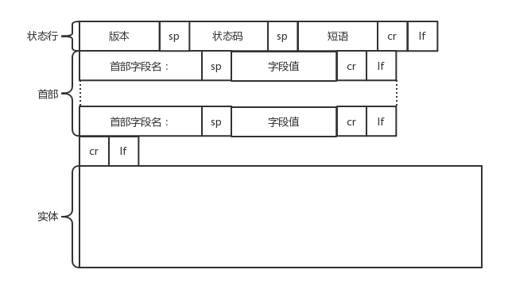

[TOC]

# HTTP 请求的准备

1. 浏览器会将 www.163.com 这个域名发送给 DNS 服务器，让它解析为 IP 地址。
2. HTTP 是基于 TCP 协议的，当然是要先建立 TCP 连接了。
3. 目前使用的 HTTP 协议大部分都是 1.1。
   - **在 1.1 的协议里面，默认是开启了 Keep-Alive 的，这样建立的 TCP 连接，就可以在多次请求中复用。**

# HTTP 请求的构建

建立了连接以后，浏览器就要发送 HTTP 的请求。请求的格式就像这样。

HTTP 的报文大概分为三大部分。**第一部分是请求行，第二部分是请求的首部，第三部分才是请求的正文实体。**

## 请求行

在请求行中，URL 就是 http://www.163.com ，版本为 HTTP 1.1。

- 对于访问网页来讲，最常用的类型就是 GET。

  顾名思义，GET 就是去服务器获取一些资源。

- 另外一种类型叫做 POST。

  它需要主动告诉服务端一些信息，而非获取。要告诉服务端什么呢？

- 还有一种类型叫 PUT，就是向指定资源位置上传最新内容。

  - 但是，HTTP 的服务器往往是不允许上传文件的，所以 PUT 和 POST 就都变成了要传给服务器东西的方法。
  - 在实际使用过程中，这两者还会有稍许的区别。POST 往往是用来创建一个资源的，而 PUT 往往是用来修改一个资源的。例如，云主机已经创建好了，我想对这个云主机打一个标签，说明这个云主机是生产环境的，另外一个云主机是测试环境的。那怎么修改这个标签呢？往往就是用 PUT 方法。

- 再有一种常见的就是 DELETE。这个顾名思义就是用来删除资源的。例如，我们要删除一个云主机，就会调用 DELETE 方法。

## 首部字段

请求行下面就是我们的首部字段。首部是 key value，通过冒号分隔。这里面，往往保存了一些非常重要的字段。

- 例如，Accept-Charset，表示客户端可以接受的字符集。防止传过来的是另外的字符集，从而导致出现乱码。
- 再如，Content-Type 是指正文的格式。例如，我们进行 POST 的请求，如果正文是 JSON，那么我们就应该将这个值设置为 JSON。

**这里需要重点说一下的就是缓存。为啥要使用缓存呢？那是因为一个非常大的页面有很多东西。**

浏览一个商品的详情，里面有这个商品的价格、库存、展示图片、使用手册等等。

商品的展示图片会保持较长时间不变，而库存会根据用户购买的情况经常改变。

如果图片非常大，而库存数非常小，如果我们每次要更新数据的时候都要刷新整个页面，对于服务器的压力就会很大。

**对于这种高并发场景下的系统，在真正的业务逻辑之前，都需要有个接入层，将这些静态资源的请求拦在最外面。这个架构的图就像这样。**

Nginx 这一层，它如何处理 HTTP 协议呢？

对于静态资源，有 Vanish 缓存层。当缓存过期的时候，才会访问真正的 Tomcat 应用集群。

**在 HTTP 头里面，Cache-control 是用来控制缓存的。**

- 当客户端发送的请求中包含 max-age 指令时，如果判定缓存层中，资源的缓存时间数值比指定时间的数值小，那么客户端可以接受缓存的资源。

- 当指定 max-age 值为 0，那么缓存层通常需要将请求转发给应用集群。

**另外，If-Modified-Since 也是一个关于缓存的。**

也就是说，如果服务器的资源在某个时间之后更新了，那么客户端就应该下载最新的资源。如果没有更新，服务端会返回“304 Not Modified”的响应，那客户端就不用下载了，也会节省带宽。

# HTTP 请求的发送

HTTP 协议是基于 TCP 协议的，所以它使用面向连接的方式发送请求，通过 stream 二进制流的方式传给对方。

当然，到了 TCP 层，它会把二进制流变成一个个报文段发送给服务器。

1. 在发送给每个报文段的时候，都需要对方有一个回应 ACK，来保证报文可靠地到达了对方。如果没有回应，那么 TCP 这一层会进行重新传输，直到可以到达。
2. TCP 层发送每一个报文的时候，都需要加上自己的地址（即源地址）和它想要去的地方（即目标地址），将这两个信息放到 IP 头里面，交给 IP 层进行传输。
3. IP 层需要查看目标地址和自己是否是在同一个局域网。
   - 如果是，就发送 ARP 协议来请求这个目标地址对应的 MAC 地址，然后将源 MAC 和目标 MAC 放入 MAC 头，发送出去即可。
   - 如果不在同一个局域网，就需要发送到网关，还要需要发送 ARP 协议，来获取网关的 MAC 地址，然后将源 MAC 和网关 MAC 放入 MAC 头，发送出去。
4. 网关收到包发现 MAC 符合，取出目标 IP 地址，根据路由协议找到下一跳的路由器，获取下一跳路由器的 MAC 地址，将包发给下一跳路由器。
5. 这样路由器一跳一跳终于到达目标的局域网。这个时候，最后一跳的路由器能够发现，目标地址就在自己的某一个出口的局域网上。于是，在这个局域网上发送 ARP，获得这个目标地址的 MAC 地址，将包发出去。
6. 目标的机器发现 MAC 地址符合，就将包收起来。发现 IP 地址符合，根据 IP 头中协议项，知道自己上一层是 TCP 协议，于是解析 TCP 的头，里面有序列号，需要看一看这个序列包是不是我要的，如果是就放入缓存中然后返回一个 ACK，如果不是就丢弃。
7. TCP 头里面还有端口号，HTTP 的服务器正在监听这个端口号。于是，目标机器自然知道是 HTTP 服务器这个进程想要这个包，于是将包发给 HTTP 服务器。
8. HTTP 服务器的进程看到，原来这个请求是要访问一个网页，于是就把这个网页发给客户端。

# HTTP 返回的构建

HTTP 的返回报文也是有一定格式的。这也是基于 HTTP 1.1 的。

状态码会反映 HTTP 请求的结果。

- “200”意味着大吉大利。
- “404”，也就是“服务端无法响应这个请求”。

短语会大概说一下原因。

接下来是返回首部的 key value。

这里面，Retry-After 表示，告诉客户端应该在多长时间以后再次尝试一下。

“503 错误”是说“服务暂时不再和这个值配合使用”。

在返回的头部里面也会有 Content-Type，表示返回的是 HTML，还是 JSON。

构造好了返回的 HTTP 报文，接下来就是把这个报文发送出去。

1. 还是交给 Socket 去发送，还是交给 TCP 层，让 TCP 层将返回的 HTML，也分成一个个小的段，并且保证每个段都可靠到达。
2. 这些段加上 TCP 头后会交给 IP 层，然后把刚才的发送过程反向走一遍。
3. 虽然两次不一定走相同的路径，但是逻辑过程是一样的，一直到达客户端。
4. 客户端发现 MAC 地址符合、IP 地址符合，于是就会交给 TCP 层。根据序列号看是不是自己要的报文段，如果是，则会根据 TCP 头中的端口号，发给相应的进程。
5. 这个进程就是浏览器，浏览器作为客户端也在监听某个端口。当浏览器拿到了 HTTP 的报文。发现返回“200”，一切正常，于是就从正文中将 HTML 拿出来。
6. HTML 是一个标准的网页格式。浏览器只要根据这个格式，展示出一个绚丽多彩的网页。这就是一个正常的 HTTP 请求和返回的完整过程。

# HTTP 2.0

HTTP 1.1 在应用层以纯文本的形式进行通信。

每次通信都要带完整的 HTTP 的头，而且不考虑 pipeline 模式的话，**每次的过程总是像上面描述的那样一去一回。这样在实时性、并发性上都存在问题。**

- 为了解决这些问题，**HTTP 2.0 会对 HTTP 的头进行一定的压缩**，**将原来每次都要携带的大量 key value 在两端建立一个索引表，对相同的头只发送索引表中的索引。**
- 另外，HTTP 2.0 协议将一个 TCP 的连接中，**切分成多个流，每个流都有自己的 ID，而且流可以是客户端发往服务端，也可以是服务端发往客户端。它其实只是一个虚拟的通道。流是有优先级的。**

HTTP 2.0 还将所有的传输信息分割为更小的消息和帧，并对它们采用二进制格式编码。

- 常见的帧有 Header 帧，用于传输 Header 内容，并且会开启一个新的流。
- 再就是 Data 帧，用来传输正文实体。多个 Data 帧属于同一个流。

通过这两种机制，HTTP 2.0 的客户端可以将多个请求分到不同的流中，然后将请求内容拆成帧，进行二进制传输。

这些帧可以打散乱序发送， 然后根据每个帧首部的流标识符重新组装，并且可以根据优先级，决定优先处理哪个流的数据。

假设我们的一个页面要发送三个独立的请求，一个获取 css，一个获取 js，一个获取图片 jpg。

如果使用 HTTP 1.1 就是串行的，但是如果使用 HTTP 2.0，就可以在一个连接里，客户端和服务端都可以同时发送多个请求或回应，而且不用按照顺序一对一对应。

HTTP 2.0 其实是将三个请求变成三个流，将数据分成帧，乱序发送到一个 TCP 连接中。

HTTP 2.0 成功解决了 HTTP 1.1 的队首阻塞问题。

同时，也不需要通过 HTTP 1.x 的 pipeline 机制用多条 TCP 连接来实现并行请求与响应；减少了 TCP 连接数对服务器性能的影响，同时将页面的多个数据 css、js、 jpg 等通过一个数据链接进行传输，能够加快页面组件的传输速度。

# QUIC

HTTP 2.0 虽然大大增加了并发性，但还是有问题的。

因为 HTTP 2.0 也是基于 TCP 协议的，TCP 协议在处理包时是有严格顺序的。

当其中一个数据包遇到问题，TCP 连接需要等待这个包完成重传之后才能继续进行。

虽然 HTTP 2.0 通过多个 stream，使得逻辑上一个 TCP 连接上的并行内容，进行多路数据的传输，然而这中间并没有关联的数据。

一前一后，前面 stream 2 的帧没有收到，后面 stream 1 的帧也会因此阻塞。

于是，就又到了从 TCP 切换到 UDP，进行“城会玩”的时候了。这就是 Google 的 QUIC 协议，接下来我们来看它是如何“城会玩”的。

## 自定义连接机制

我们都知道，一条 TCP 连接是由四元组标识的，分别是源 IP、源端口、目的 IP、目的端口。

一旦一个元素发生变化时，就需要断开重连，重新连接。

在移动互联情况下，当手机信号不稳定或者在 WIFI 和 移动网络切换时，都会导致重连，从而进行再次的三次握手，导致一定的时延。

这在 TCP 是没有办法的，**但是基于 UDP，就可以在 QUIC 自己的逻辑里面维护连接的机制，不再以四元组标识，而是以一个 64 位的随机数作为 ID 来标识，而且 UDP 是无连接的，所以当 IP 或者端口变化的时候，只要 ID 不变，就不需要重新建立连接。**

## 自定义重传机制

TCP 为了保证可靠性，通过使用序号和应答机制，来解决顺序问题和丢包问题。

任何一个序号的包发过去，都要在一定的时间内得到应答，否则一旦超时，就会重发这个序号的包。

**那怎么样才算超时呢？还记得我们提过的自适应重传算法吗？这个超时是通过采样往返时间 RTT 不断调整的。**

其实，在 TCP 里面超时的采样存在不准确的问题。

例如，发送一个包，序号为 100，发现没有返回，于是再发送一个 100，过一阵返回一个 ACK101。这个时候客户端知道这个包肯定收到了，但是往返时间是多少呢？是 ACK 到达的时间减去后一个 100 发送的时间，还是减去前一个 100 发送的时间呢？

事实是，第一种算法把时间算短了，第二种算法把时间算长了。

**QUIC 也有个序列号，是递增的。**

**任何一个序列号的包只发送一次，下次就要加一了。例如，发送一个包，序号是 100，发现没有返回。**

**再次发送的时候，序号就是 101 了；如果返回的 ACK 100，就是对第一个包的响应。如果返回 ACK 101 就是对第二个包的响应，RTT 计算相对准确。**

但是这里有一个问题，就是怎么知道包 100 和包 101 发送的是同样的内容呢？

QUIC 定义了一个 offset 概念。QUIC 既然是面向连接的，也就像 TCP 一样，是一个数据流。

- 发送的数据在这个数据流里面有个偏移量 offset，可以通过 offset 查看数据发送到了哪里，这样只要这个 offset 的包没有来，就要重发。
- 如果来了，按照 offset 拼接，还是能够拼成一个流。

## 无阻塞的多路复用

有了自定义的连接和重传机制，我们就可以解决上面 HTTP 2.0 的多路复用问题。

同 HTTP 2.0 一样，同一条 QUIC 连接上可以创建多个 stream，来发送多个 HTTP 请求。

但是，QUIC 是基于 UDP 的，一个连接上的多个 stream 之间没有依赖。

这样，假如 stream2 丢了一个 UDP 包，后面跟着 stream3 的一个 UDP 包，虽然 stream2 的那个包需要重传，但是 stream3 的包无需等待，就可以发给用户。

## 自定义流量控制

TCP 的流量控制是通过滑动窗口协议。

QUIC 的流量控制也是通过 window_update，来告诉对端它可以接受的字节数。**但是 QUIC 的窗口是适应自己的多路复用机制的，不但在一个连接上控制窗口，还在一个连接中的每个 stream 控制窗口。**

在 TCP 协议中，接收端的窗口的起始点是下一个要接收并且 ACK 的包，即便后来的包都到了，放在缓存里面，窗口也不能右移。

**因为 TCP 的 ACK 机制是基于序列号的累计应答，一旦 ACK 了一个序列号，就说明前面的都到了，所以只要前面的没到，后面的到了也不能 ACK，就会导致后面的到了，也有可能超时重传，浪费带宽。**

QUIC 的 ACK 是基于 offset 的，每个 offset 的包来了，进了缓存，就可以应答，应答后就不会重发。

中间的空档会等待到来或者重发即可，而窗口的起始位置为当前收到的最大 offset，从这个 offset 到当前的 stream 所能容纳的最大缓存，是真正的窗口大小。显然，这样更加准确。

