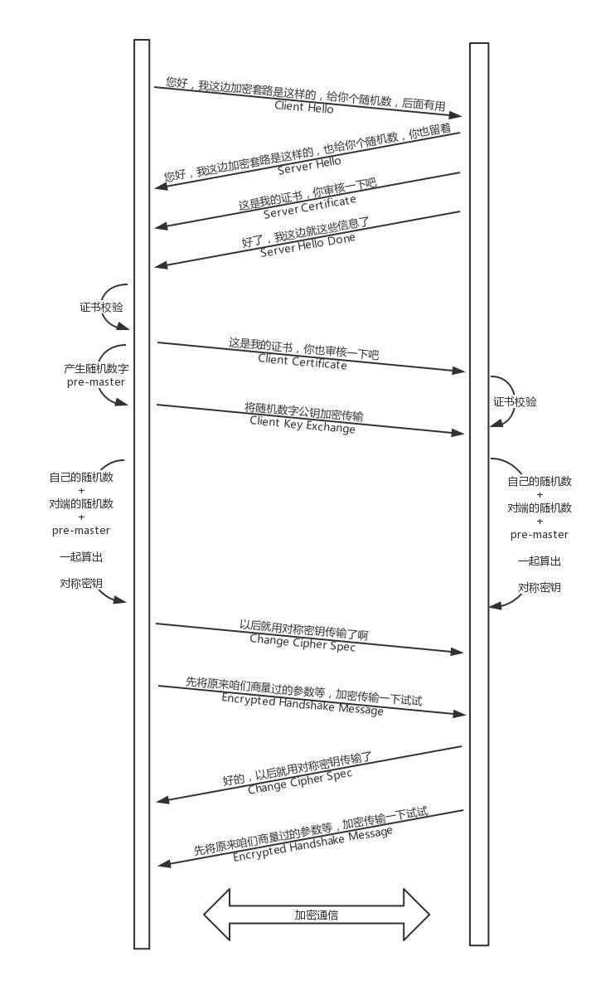

[TOC]

# 对称加密

假设你和外卖网站约定了一个密钥，你发送请求的时候用这个密钥进行加密，外卖网站用同样的密钥进行解密。这样就算中间的黑客截获了你的请求，但是它没有密钥，还是破解不了。

但是中间有个问题，你们两个怎么来约定这个密钥呢？

如果这个密钥在互联网上传输，也是很有可能让黑客截获的。黑客一旦截获这个秘钥，它可以佯作不知，静静地等着你们两个交互。这时候你们之间互通的任何消息，它都能截获并且查看，就等你把银行卡账号和密码发出来。

# 非对称加密

非对称加密的私钥放在外卖网站这里，不会在互联网上传输，这样就能保证这个密钥的私密性。

但是，对应私钥的公钥，是可以在互联网上随意传播的，只要外卖网站把这个公钥给你，你们就可以愉快地互通了。

外卖网站拿私钥加密的，互联网上人人都可以把它打开，当然包括黑客。那外卖网站可以拿公钥加密吗？当然不能，因为它自己的私钥只有它自己知道，谁也解不开。

另外，这个过程还有一个问题，黑客也可以模拟发送“我要定外卖”这个过程的，因为它也有外卖网站的公钥。

为了解决这个问题，看来一对公钥私钥是不够的。

- 客户端也需要有自己的公钥和私钥，并且客户端要把自己的公钥，给外卖网站。
  - 这样，客户端给外卖网站发送的时候，用外卖网站的公钥加密。
  - 而外卖网站给客户端发送消息的时候，使用客户端的公钥。

这样就算有黑客企图模拟客户端获取一些信息，或者半路截获回复信息，但是由于它没有私钥，这些信息它还是打不开。

# 数字证书

不对称加密也会有同样的问题，如何将不对称加密的公钥给对方呢？

- 一种是放在一个公网的地址上，让对方下载。
- 另一种就是在建立连接的时候，传给对方。

这两种方法有相同的问题，那就是，作为一个普通网民，你怎么鉴别别人给你的公钥是对的。会不会有人冒充外卖网站，发给你一个它的公钥。接下来，你和它所有的互通，看起来都是没有任何问题的。毕竟每个人都可以创建自己的公钥和私钥。

这个时候就需要权威部门的介入了，就像每个人都可以打印自己的简历，说自己是谁，但是有公安局盖章的，就只有户口本，这个才能证明你是你。这个由权威部门颁发的称为证书（Certificate）。

**证书里面有什么呢？**

当然应该有公钥，这是最重要的。还有证书的所有者，就像户口本上有你的姓名和身份证号，说明这个户口本是你的。

另外还有证书的发布机构和证书的有效期，这个有点像身份证上的机构是哪个区公安局，有效期到多少年。

**这个证书是怎么生成的呢？**

会不会有人假冒权威机构颁发证书呢？就像有假身份证、假户口本一样。生成证书需要发起一个证书请求，然后将这个请求发给一个权威机构去认证，这个权威机构我们称为 CA（ Certificate Authority）。

将这个请求发给权威机构，权威机构会给这个证书卡一个章，我们称为**签名算法**。

**问题又来了，那怎么签名才能保证是真的权威机构签名的呢？**

当然只有用只掌握在权威机构手里的东西签名了才行，这就是 CA 的私钥。

签名算法大概是这样工作的：

1. 一般是对信息做一个 Hash 计算，得到一个 Hash 值，这个过程是不可逆的，也就是说无法通过 Hash 值得出原来的信息内容。在把信息发送出去时，把这个 Hash 值加密后，作为一个签名和信息一起发出去。
2. CA 用自己的私钥给外卖网站的公钥签名，就相当于给外卖网站背书，形成了外卖网站的证书。

这下好了，你不会从外卖网站上得到一个公钥，而是会得到一个证书，这个证书有个发布机构 CA，**你只要得到这个发布机构 CA 的公钥，去解密外卖网站证书的签名，如果解密成功了，Hash 也对的上，就说明这个外卖网站的公钥没有啥问题。**

**你怎么确定 CA 的公钥就是对的呢？**

所以，CA 的公钥也需要更牛的 CA 给它签名，然后形成 CA 的证书。

要想知道某个 CA 的证书是否可靠，要看 CA 的上级证书的公钥，能不能解开这个 CA 的签名。就像你不相信区公安局，可以打电话问市公安局，让市公安局确认区公安局的合法性。

**这样层层上去，直到全球皆知的几个著名大 CA，称为 root CA，做最后的背书。通过这种层层授信背书的方式，从而保证了非对称加密模式的正常运转。**

# HTTPS 的工作模式

我们可以知道，非对称加密在性能上不如对称加密，那是否能将两者结合起来呢？

例如，**公钥私钥主要用于传输对称加密的秘钥，而真正的双方大数据量的通信都是通过对称加密进行的。当然是可以的。**

这就是 HTTPS 协议的总体思路。

当你登录一个外卖网站的时候，由于是 HTTPS：

1. 客户端会发送 Client Hello 消息到服务器，以明文传输 TLS 版本信息、加密套件候选列表、压缩算法候选列表等信息。另外，还会有一个随机数，在协商对称密钥的时候使用。

   > 这就类似在说：“您好，我想定外卖，但你要保密我吃的是什么。这是我的加密套路，再给你个随机数，你留着。”

2. 然后，外卖网站返回 Server Hello 消息, 告诉客户端，服务器选择使用的协议版本、加密套件、压缩算法等，还有一个随机数，用于后续的密钥协商。

   > 这就类似在说：“您好，保密没问题，你的加密套路还挺多，咱们就按套路 2 来吧，我这里也有个随机数，你也留着。”

3. 外卖网站会给你一个服务器端的证书，然后说：“Server Hello Done，我这里就这些信息了。”

4. 你当然不相信这个证书，于是你从自己信任的 CA 仓库中，拿 CA 的证书里面的公钥去解密外卖网站的证书。

   - 如果能够成功，则说明外卖网站是可信的。
   - 这个过程中，你可能会不断往上追溯 CA、CA 的 CA、CA 的 CA 的 CA，反正直到一个授信的 CA，就可以了。

5. 证书验证完毕之后，觉得这个外卖网站可信，于是客户端计算产生随机数字 Pre-master，发送 Client Key Exchange，用证书中的公钥加密，再发送给服务器，服务器可以通过私钥解密出来。

6. 到目前为止，无论是客户端还是服务器，都有了三个随机数，分别是：自己的、对端的，以及刚生成的 Pre-Master 随机数。通过这三个随机数，可以在客户端和服务器产生相同的对称密钥。

7. 有了对称密钥，客户端就可以说：“Change Cipher Spec，咱们以后都采用协商的通信密钥和加密算法进行加密通信了。

8. ”然后发送一个 Encrypted Handshake Message，将已经商定好的参数等，采用协商密钥进行加密，发送给服务器用于数据与握手验证。

9. 同样，服务器也可以发送 Change Cipher Spec，说：“没问题，咱们以后都采用协商的通信密钥和加密算法进行加密通信了”，并且也发送 Encrypted Handshake Message 的消息试试。

10. 当双方握手结束之后，就可以通过对称密钥进行加密传输了。

# 重放与篡改

没错，有了加密和解密，黑客截获了包也打不开了，但是它可以发送 N 次。这个往往通过 Timestamp 和 Nonce 随机数联合起来，然后做一个不可逆的签名来保证。

Nonce 随机数保证唯一，或者 Timestamp 和 Nonce 合起来保证唯一，同样的，请求只接受一次，于是服务器多次收到相同的 Timestamp 和 Nonce，则视为无效即可。

如果有人想篡改 Timestamp 和 Nonce，还有签名保证不可篡改性，如果改了用签名算法解出来，就对不上了，可以丢弃了。