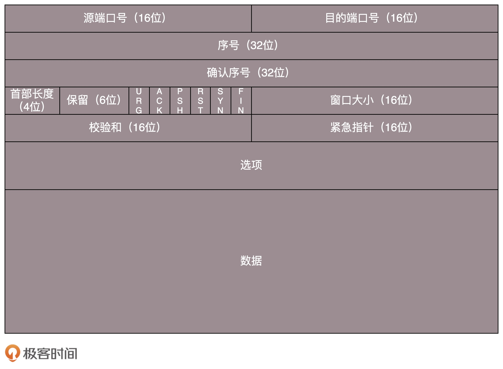

[TOC]

# TCP 包头格式

- 源端口号和目标端口号是不可少的，这一点和 UDP 是一样的。如果没有这两个端口号。数据就不知道应该发给哪个应用。
- 包的序号是为了解决乱序的问题。不编好号怎么确认哪个应该先来，哪个应该后到呢。
- 还应该有的就是确认序号。发出去的包应该有确认，要不然我怎么知道对方有没有收到呢？如果没有收到就应该重新发送，直到送达。这个可以解决不丢包的问题。
- 接下来有一些状态位。例如 SYN 是发起一个连接，ACK 是回复，RST 是重新连接，FIN 是结束连接等。TCP 是面向连接的，因而双方要维护连接的状态，这些带状态位的包的发送，会引起双方的状态变更。
- 还有一个重要的就是窗口大小。TCP 要做流量控制，通信双方各声明一个窗口，标识自己当前能够的处理能力。

# TCP 的三次握手

## 原理

**为什么要三次，而不是两次？为了可靠，为什么不是四次？**

假设这个通路是非常不可靠的，A 要发起一个连接，当发了第一个请求杳无音信的时候，会有很多的可能性：

- 比如第一个请求包丢了。
- 再如没有丢，但是绕了弯路，超时了。
- 还有 B 没有响应，不想和我连接。

A 不能确认结果，于是再发，再发。终于，有一个请求包到了 B，但是请求包到了 B 的这个事情，目前 A 还是不知道的，A 还有可能再发。

B 收到了请求包，就知道了 A 的存在，并且知道 A 要和它建立连接。

- 如果 B 不乐意建立连接，则 A 会重试一阵后放弃，连接建立失败，没有问题。
- 如果 B 是乐意建立连接的，则会发送应答包给 A。

当然对于 B 来说，这个应答包也是一入网络深似海，不知道能不能到达 A。这个时候 B 自然不能认为连接是建立好了。因为应答包仍然会丢，会绕弯路，或者 A 已经挂了都有可能。

B 发送的应答可能会发送多次，但是只要一次到达 A，A 就认为连接已经建立了，因为对于 A 来讲，他的消息有去有回。

A 会给 B 发送应答之应答，而 B 也在等这个消息，才能确认连接的建立，只有等到了这个消息，对于 B 来讲，才算它的消息有去有回。

当然 A 发给 B 的应答之应答也会丢，也会绕路，甚至 B 挂了。

- 按理来说，还应该有个应答之应答之应答，这样下去就没底了。
- 所以四次握手是可以的，四十次都可以，关键四百次也不能保证就真的可靠了。只要双方的消息都有去有回，就基本可以了。

好在大部分情况下，A 和 B 建立了连接之后，A 会马上发送数据的，一旦 A 发送数据，则很多问题都得到了解决。

- **例如 A 发给 B 的应答丢了，当 A 后续发送的数据到达的时候，B 可以认为这个连接已经建立。**
- **或者 B 压根就挂了，A 发送的数据，会报错，说 B 不可达，A 就知道 B 出事情了。**

A 就是不发数据，建立连接后空着。**我们在程序设计的时候，可以要求开启 keepalive 机制，即使没有真实的数据包，也有探活包。**

作为服务端 B 的程序设计者，对于 A 这种长时间不发包的客户端，可以主动关闭，从而空出资源来给其他客户端使用。

## TCP 包的序号的问题

A 要告诉 B，我这面发起的包的序号起始是从哪个号开始的，B 同样也要告诉 A，B 发起的包的序号起始是从哪个号开始的。为什么序号不能都从 1 开始呢？因为这样往往会出现冲突。

例如，A 连上 B 之后，发送了 1、2、3 三个包，但是发送 3 的时候，中间丢了，或者绕路了，于是重新发送，后来 A 掉线了，重新连上 B 后，序号又从 1 开始，然后发送 2，但是压根没想发送 3，但是上次绕路的那个 3 又回来了，发给了 B，B 自然认为，这就是下一个包，于是发生了错误。

因而，每个连接都要有不同的序号。**这个序号的起始序号是随着时间变化的，可以看成一个 32 位的计数器，每 4 微秒加一，如果计算一下，如果到重复，需要 4 个多小时，那个绕路的包早就死翘翘了，因为我们都知道 IP 包头里面有个 TTL，也即生存时间。**

双方终于建立了信任，建立了连接。前面也说过，为了维护这个连接，双方都要维护一个状态机，在连接建立的过程中，双方的状态变化时序图就像这样：

1. 一开始，客户端和服务端都处于 CLOSED 状态。先是服务端主动监听某个端口，处于 LISTEN 状态。
2. 然后客户端主动发起连接 SYN，之后处于 SYN-SENT 状态。
3. 服务端收到发起的连接，返回 SYN，并且 ACK 客户端的 SYN，之后处于 SYN-RCVD 状态。
4. 客户端收到服务端发送的 SYN 和 ACK 之后，发送 ACK 的 ACK，之后处于 ESTABLISHED 状态，因为它一发一收成功了。服务端收到 ACK 的 ACK 之后，处于 ESTABLISHED 状态，因为它也一发一收了。

# TCP 四次挥手

好了，说完了连接，接下来说一说“拜拜”，好说好散。这常被称为四次挥手。

A：B 啊，我不想玩了。

B：哦，你不想玩了啊，我知道了。

这个时候，还只是 A 不想玩了，也即 A 不会再发送数据，但是 B 能不能在 ACK 的时候，直接关闭呢？

当然不可以了，很有可能 A 是发完了最后的数据就准备不玩了，但是 **B 还没做完自己的事情，还是可以发送数据的，所以称为半关闭的状态。**

这个时候 A 可以选择不再接收数据了，也可以选择最后再接收一段数据，等待 B 也主动关闭。

B：A 啊，好吧，我也不玩了，拜拜。

A：好的，拜拜。

这样整个连接就关闭了。但是这个过程有没有异常情况呢？

- 一种情况是，A 说完“不玩了”之后，直接跑路，是会有问题的，因为 B 还没有发起结束，而如果 A 跑路，B 就算发起结束，也得不到回答，B 就不知道该怎么办了。
- 另一种情况是，A 说完“不玩了”，B 直接跑路，也是有问题的，因为 A 不知道 B 是还有事情要处理，还是过一会儿会发送结束。

1. 当 A 说“不玩了”，就进入 FIN_WAIT_1 的状态。
2. B 收到“A 不玩”的消息后，发送知道了，就进入 CLOSE_WAIT 的状态。
3. A 收到“B 说知道了”，就进入 FIN_WAIT_2 的状态。
   - 如果这个时候 B 直接跑路，则 A 将永远在这个状态。
   - TCP 协议里面并没有对这个状态的处理，但是 Linux 有，可以调整 tcp_fin_timeout 这个参数，设置一个超时时间。
4. 如果 B 没有跑路，发送了“B 也不玩了”的请求到达 A 时，A 发送“知道 B 也不玩了”的 ACK 后，从 FIN_WAIT_2 状态结束。
   - 按说 A 可以跑路了，但是最后的这个 ACK 万一 B 收不到呢？则 B 会重新发一个“B 不玩了”，这个时候 A 已经跑路了的话，B 就再也收不到 ACK 了。
   - 因而 TCP 协议要求 A 最后等待一段时间 TIME_WAIT，这个时间要足够长，**长到如果 B 没收到 ACK 的话，“B 说不玩了”会重发的，A 会重新发一个 ACK 并且足够时间到达 B。**
   - A 直接跑路还有一个问题是，A 的端口就直接空出来了，但是 B 不知道，B 原来发过的很多包很可能还在路上，如果 A 的端口被一个新的应用占用了，这个新的应用会收到上个连接中 B 发过来的包，虽然序列号是重新生成的，但是这里要上一个双保险，防止产生混乱，因而也需要等足够长的时间，等到原来 B 发送的所有的包都死翘翘，再空出端口来。
5. **等待的时间设为 2MSL**，MSL 是 Maximum Segment Lifetime，**报文最大生存时间**，它是任何报文在网络上存在的最长时间，**超过这个时间报文将被丢弃。**因为 TCP 报文基于是 IP 协议的，**而 IP 头中有一个 TTL 域，是 IP 数据报可以经过的最大路由数，每经过一个处理他的路由器此值就减 1，当此值为 0 则数据报将被丢弃，同时发送 ICMP 报文通知源主机。协议规定 MSL 为 2 分钟，实际应用中常用的是 30 秒，1 分钟和 2 分钟等。**
6. B 超过了 2MSL 的时间，依然没有收到它发的 FIN 的 ACK，怎么办呢？按照 TCP 的原理，B 当然还会重发 FIN，这个时候 A 再收到这个包之后，A 就表示，我已经在这里等了这么长时间了，已经仁至义尽了，之后的我就都不认了，于是就**直接发送 RST，B 就知道 A 早就跑了。**

# 如何实现一个靠谱的协议？

累计确认或者累计应答（cumulative acknowledgment）。为了记录所有发送的包和接收的包，TCP 也需要发送端和接收端分别都有缓存来保存这些记录。发送端的缓存里是按照包的 ID 一个个排列，根据处理的情况分成四个部分。

1. 第一部分：发送了并且已经确认的。
2. 第二部分：发送了并且尚未确认的。
3. 第三部分：没有发送，但是已经等待发送的。
4. 第四部分：没有发送，并且暂时还不会发送的。

**接收端会给发送端报一个窗口的大小，叫 Advertised window。**

这个窗口的大小应该等于上面的第二部分加上第三部分，就是已经交代了没做完的加上马上要交代的。

**超过这个窗口的，接收端做不过来，就不能发送了。**

对于接收端来讲，它的缓存里记录的内容要简单一些。

1. 第一部分：接受并且确认过的。
2. 第二部分：还没接收，但是马上就能接收的。
3. 第三部分：还没接收，也没法接收的。

# 顺序问题与丢包问题

在发送端来看：

- 1、2、3 已经发送并确认。
- 4、5、6、7、8、9 都是发送了还没确认。
- 10、11、12 是还没发出的。
- 13、14、15 是接收方没有空间，不准备发的。

在接收端来看：

- 1、2、3、4、5 是已经完成 ACK，但是没读取的。
- 6、7 是等待接收的；8、9 是已经接收，但是没有 ACK 的。

发送端和接收端当前的状态如下：

- 1、2、3 没有问题，双方达成了一致。

- 4、5 接收方说 ACK 了，但是发送方还没收到，有可能丢了，有可能在路上。

- 6、7、8、9 肯定都发了，但是 8、9 已经到了，但是 6、7 没到，出现了乱序，缓存着但是没办法 ACK。

根据这个例子，我们可以知道，顺序问题和丢包问题都有可能发生，所以我们先来看确认与重发的机制。

假设 4 的确认到了，不幸的是，5 的 ACK 丢了，6、7 的数据包丢了，这该怎么办呢？

## 超时重试

一种方法就是超时重试，也即**对每一个发送了，但是没有 ACK 的包，都有设一个定时器，超过了一定的时间，就重新尝试。**但是这个超时的时间如何评估呢？这个时间不宜过短，时间必须大于往返时间 RTT，否则会引起不必要的重传。也不宜过长，这样超时时间变长，访问就变慢了。

估计往返时间，需要 TCP 通过采样 RTT 的时间，然后进行加权平均，算出一个值，而且这个值还是要不断变化的，因为网络状况不断地变化。除了采样 RTT，还要采样 RTT 的波动范围，计算出一个估计的超时时间。由于重传时间是不断变化的，我们称为自适应重传算法（Adaptive Retransmission Algorithm）。

如果过一段时间，5、6、7 都超时了，就会重新发送。

接收方发现 5 原来接收过，于是丢弃 5。

6 收到了，发送 ACK，要求下一个是 7，7 不幸又丢了。

当 7 再次超时的时候，**有需要重传的时候，TCP 的策略是超时间隔加倍。**

**每当遇到一次超时重传的时候，都会将下一次超时时间间隔设为先前值的两倍。两次超时，就说明网络环境差，不宜频繁反复发送。**

超时触发重传存在的问题是，超时周期可能相对较长。那是不是可以有更快的方式呢？

有一个可以快速重传的机制，**当接收方收到一个序号大于下一个所期望的报文段时，就会检测到数据流中的一个间隔，于是它就会发送冗余的 ACK，仍然 ACK 的是期望接收的报文段。**

**而当客户端收到三个冗余的 ACK 后，就会在定时器过期之前，重传丢失的报文段。**

> 例如，接收方发现 6 收到了，8 也收到了，但是 7 还没来，那肯定是丢了，于是发送 6 的 ACK，要求下一个是 7。接下来，收到后续的包，仍然发送 6 的 ACK，要求下一个是 7。当客户端收到 3 个重复 ACK，就会发现 7 的确丢了，不等超时，马上重发。

## SACK

还有一种方式称为 Selective Acknowledgment （SACK）。

这种方式需要在 TCP 头里加一个 SACK 的东西，可以将缓存的地图发送给发送方。例如可以发送 ACK6、SACK8、SACK9，有了地图，发送方一下子就能看出来是 7 丢了。

# 流量控制问题

我们再来看流量控制机制，在对于包的确认中，同时会携带一个窗口的大小。

**如果接收方实在处理的太慢，导致缓存中没有空间了，可以通过确认信息修改窗口的大小，甚至可以设置为 0，则发送方将暂时停止发送。**

发送端的窗口也调整为 0，停止发送。

如果这样的话，**发送方会定时发送窗口探测数据包，看是否有机会调整窗口的大小**。

当接收方比较慢的时候，要防止低能窗口综合征，别空出一个字节来就赶快告诉发送方，然后马上又填满了，可以当窗口太小的时候，不更新窗口，直到达到一定大小，或者缓冲区一半为空，才更新窗口。

# 拥塞控制问题

拥塞控制的问题，也是通过窗口的大小来控制的，前面的滑动窗口 rwnd 是怕发送方把接收方缓存塞满，而拥塞窗口 cwnd，是怕把网络塞满。

**那发送方怎么判断网络是不是慢呢**？

理想状态下，水管里面水的量 = 水管粗细 x 水管长度。对于到网络上，通道的容量 = 带宽 × 往返延迟。

如果我们设置发送窗口，使得发送但未确认的包为为通道的容量，就能够撑满整个管道。

如图所示，假设往返时间为 8s，去 4s，回 4s，每秒发送一个包，每个包 1024byte。已经过去了 8s，则 8 个包都发出去了，其中前 4 个包已经到达接收端，但是 ACK 还没有返回，不能算发送成功。5-8 后四个包还在路上，还没被接收。

这个时候，整个管道正好撑满，在发送端，已发送未确认的为 8 个包，正好等于带宽，也即每秒发送 1 个包，乘以来回时间 8s。

**如果我们在这个基础上再调大窗口，使得单位时间内更多的包可以发送，会出现什么现象呢？**

原来发送一个包，从一端到达另一端，假设一共经过四个设备，每个设备处理一个包时间耗费 1s，所以到达另一端需要耗费 4s，如果发送的更加快速，则单位时间内，会有更多的包到达这些中间设备，这些设备还是只能每秒处理一个包的话，多出来的包就会被丢弃，这是我们不想看到的。

- 这个时候，我们可以想其他的办法，例如这个四个设备本来每秒处理一个包，但是我们在这些设备上加缓存，处理不过来的在队列里面排着，这样包就不会丢失。
- 但是缺点是会增加时延，这个缓存的包，4s 肯定到达不了接收端了，如果时延达到一定程度，就会超时重传，也是我们不想看到的。

**于是 TCP 的拥塞控制主要来避免两种现象，包丢失和超时重传。**一旦出现了这些现象就说明，发送速度太快了，要慢一点。但是一开始我怎么知道速度多快呢，我怎么知道应该把窗口调整到多大呢？

1. 一条 TCP 连接开始，cwnd 设置为一个报文段，一次只能发送一个。
2. 当收到这一个确认的时候，cwnd 加一，于是一次能够发送两个。
3. 当这两个的确认到来的时候，每个确认 cwnd 加一，两个确认 cwnd 加二，于是一次能够发送四个。
4. 当这四个的确认到来的时候，每个确认 cwnd 加一，四个确认 cwnd 加四，于是一次能够发送八个。

可以看出这是指数性的增长。

涨到什么时候是个头呢？

**有一个值 ssthresh 为 65535 个字节，当超过这个值的时候，就要小心一点了，不能倒这么快了，可能快满了，再慢下来。**

1. 每收到一个确认后，cwnd 增加 1/cwnd，我们接着上面的过程来，一次发送八个。
2. 当八个确认到来的时候，每个确认增加 1/8，八个确认一共 cwnd 增加 1，于是一次能够发送九个，变成了线性增长。

**拥塞的一种表现形式是丢包，需要超时重传：**

	1. 这个时候，将 sshresh 设为 cwnd/2，将 cwnd 设为 1，重新开始慢启动。
 	2. 这真是一旦超时重传，马上回到解放前。但是这种方式太激进了，将一个高速的传输速度一下子停了下来，会造成网络卡顿。

前面我们讲过快速重传算法：

1. 当接收端发现丢了一个中间包的时候，发送三次前一个包的 ACK，于是发送端就会快速地重传，不必等待超时再重传。
2. TCP 认为这种情况不严重，因为大部分没丢，只丢了一小部分，**cwnd 减半为 cwnd/2，然后 sshthresh = cwnd**。
3. 当三个包返回的时候，cwnd = sshthresh + 3，也就是没有一夜回到解放前，而是还在比较高的值，呈线性增长。

TCP 的拥塞控制主要来避免的两个现象都是有问题的：

1. 第一个问题是丢包并不代表着通道满了，也可能是管子本来就漏水。例如公网上带宽不满也会丢包，这个时候就认为拥塞了，退缩了，其实是不对的。
2. 第二个问题是 TCP 的拥塞控制要等到将中间设备都填充满了，才发生丢包，从而降低速度，这时候已经晚了。其实 TCP 只要填满管道就可以了，不应该接着填，直到连缓存也填满。

为了优化这两个问题，后来有了 TCP BBR 拥塞算法。

它企图找到一个平衡点，就是通过不断地加快发送速度，将管道填满，但是不要填满中间设备的缓存，因为这样时延会增加，在这个平衡点可以很好的达到高带宽和低时延的平衡。