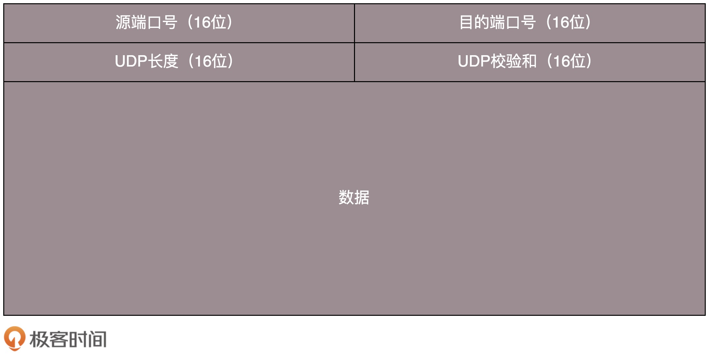

[TOC]

# TCP 和 UDP 有哪些区别？

1. TCP 是面向连接的，UDP 是面向无连接的。

   - 什么叫面向连接，什么叫无连接呢?

     在互通之前，面向连接的协议会先建立连接。例如，TCP 会三次握手，而 UDP 不会。

   - 为什么要建立连接呢？

     TCP 三次握手，UDP 也可以发三个包玩玩，有什么区别吗？

     **所谓的建立连接，是为了在客户端和服务端维护连接，而建立一定的数据结构来维护双方交互的状态，用这样的数据结构来保证所谓的面向连接的特性。**

2. TCP 提供可靠交付。

   - 通过 TCP 连接传输的数据，无差错、不丢失、不重复、并且按序到达。
   - 而 UDP 继承了 IP 包的特性，不保证不丢失，不保证按顺序到达。

3. TCP 是面向字节流的。UDP 继承了 IP 的特性，基于数据报的，一个一个地发，一个一个地收。

4. TCP 是可以有拥塞控制的。UDP 就不会。

**因而 TCP 其实是一个有状态服务，而 UDP 则是无状态服务。**

# UDP 包头

无论应用程序写的使用 TCP 传数据，还是 UDP 传数据，都要监听一个端口。

**正是这个端口，用来区分应用程序**。

# UDP 的三大特点

1. 沟通简单。相信网络通路默认就是很容易送达的，不容易被丢弃的。
2. 轻信他人。虽然有端口号，但是监听在这个地方，谁都可以传给他数据，他也可以传给任何人数据，甚至可以同时传给多个人数据。
3. 做事不懂权变。它不会根据网络的情况进行发包的拥塞控制，无论网络丢包丢成啥样了，它该怎么发还怎么发。

# UDP 的三大使用场景

1. 需要资源少，在网络情况比较好的内网，或者对于丢包不敏感的应用。

2. 不需要一对一沟通，建立连接，而是可以广播的应用。

   UDP 的不面向连接的功能，可以使得可以承载广播或者多播的协议。DHCP 就是一种广播的形式，就是基于 UDP 协议的。

3. 需要处理速度快，时延低，可以容忍少数丢包，但是要求即便网络拥塞，也毫不退缩，一往无前的时候。

# 基于 UDP 的五个例子

1. 网页或者 APP 的访问。

   QUIC 在应用层上，会自己实现快速连接建立、减少重传时延，自适应拥塞控制，是应用层“城会玩”的代表。

2. 流媒体的协议。

   很多直播应用，都基于 UDP 实现了自己的视频传输协议。

3. 实时游戏。

4. IoT 物联网。

   - 一方面，物联网领域终端资源少，很可能只是个内存非常小的嵌入式系统，而维护 TCP 协议代价太大。
   - 另一方面，物联网对实时性要求也很高，而 TCP 还是因为上面的那些原因导致时延大。Google 旗下的 Nest 建立 Thread Group，推出了物联网通信协议 Thread，就是基于 UDP 协议的。

5. 移动通信领域。

   在 4G 网络里，移动流量上网的数据面对的协议 GTP-U 是基于 UDP 的。

   因为移动网络协议比较复杂，而 GTP 协议本身就包含复杂的手机上线下线的通信协议。如果基于 TCP，TCP 的机制就显得非常多余。